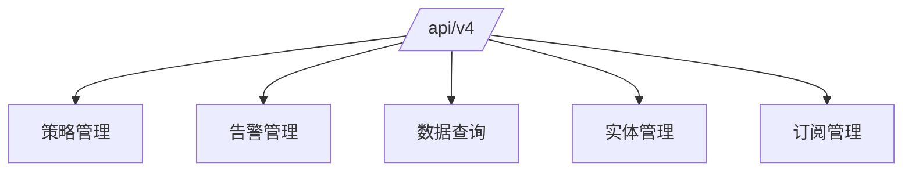
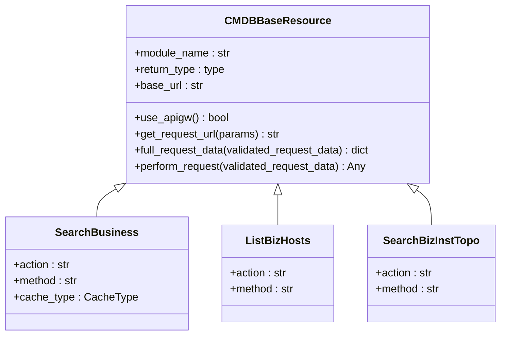
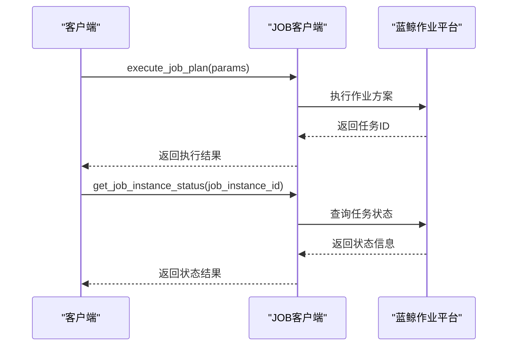
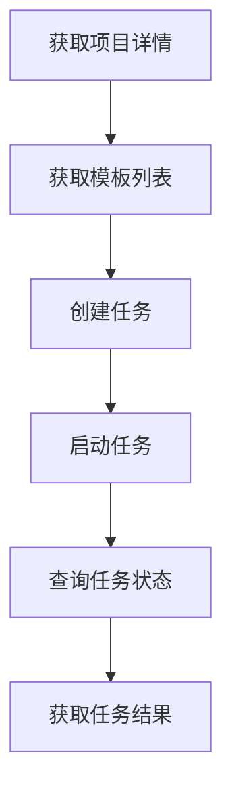

# API参考

<cite>
**本文档中引用的文件**  
- [strategy.py](file://bkmonitor/kernel_api/views/v4/strategy.py)
- [alert.py](file://bkmonitor/kernel_api/views/v4/alert.py)
- [metrics.py](file://bkmonitor/kernel_api/views/v4/metrics.py)
- [client.py](file://bkmonitor/api/cmdb/client.py)
- [default.py](file://bkmonitor/api/job/default.py)
- [default.py](file://bkmonitor/api/sops/default.py)
- [query.py](file://bkmonitor/kernel_api/resource/query.py)
- [TimeSeriesGroupListResource.py](file://bkmonitor/kernel_api/resource/metrics.py)
- [ExecuteRangeQueryResource.py](file://bkmonitor/kernel_api/resource/metrics.py)
- [urls.py](file://bkmonitor/kernel_api/urls.py)
</cite>

## 目录
1. [简介](#简介)
2. [API版本与路由](#api版本与路由)
3. 策略管理API
   1. [保存告警策略](#保存告警策略)
   2. [搜索告警策略](#搜索告警策略)
   3. [开关告警策略](#开关告警策略)
   4. [删除告警策略](#删除告警策略)
4. 告警管理API
   1. [查询告警列表](#查询告警列表)
   2. [关闭告警](#关闭告警)
   3. [获取告警标签](#获取告警标签)
   4. [获取告警详情](#获取告警详情)
5. 数据查询API
   1. [执行范围查询](#执行范围查询)
   2. [查询Elasticsearch数据](#查询elasticsearch数据)
   3. [获取时序分组列表](#获取时序分组列表)
6. 蓝鲸平台客户端接口
   1. [配置管理数据库(CMDB)](#配置管理数据库cmdb)
   2. [作业平台(JOB)](#作业平台job)
   3. [标准运维(SOPS)](#标准运维sops)
7. 认证与错误处理
   1. [API认证](#api认证)
   2. [常见错误码](#常见错误码)
8. 使用示例
   1. [Python代码示例](#python代码示例)
   2. [curl命令示例](#curl命令示例)

## 简介
本文档提供了蓝鲸监控平台v4版本RESTful API的全面参考。重点覆盖策略、告警和数据查询等核心功能，详细说明了API端点的HTTP方法、URL路径、请求头、请求体和响应体。同时，文档还解释了封装的蓝鲸各平台（如CMDB、JOB、SOPS）的客户端接口，为开发者提供完整的API使用指南。

## API版本与路由
蓝鲸监控平台的v4版本API通过`/api/v4/`路径提供服务。根据`kernel_api/urls.py`文件中的路由配置，所有v4版本的API请求都被路由到`kernel_api.views.v4`模块进行处理。



**Diagram sources**
- [urls.py](file://bkmonitor/kernel_api/urls.py#L80-L86)

**Section sources**
- [urls.py](file://bkmonitor/kernel_api/urls.py#L80-L86)

## 策略管理API
v4版本的策略管理API提供了对告警策略的完整生命周期管理功能，包括创建、查询、更新和删除操作。

### 保存告警策略
该API用于创建或更新告警策略。

- **HTTP方法**: POST
- **URL路径**: `/api/v4/strategy/save/`
- **请求头**: 
  - `Content-Type: application/json`
  - `X-API-Token`: API令牌（用于认证）
- **请求体**:
```json
{
  "bk_biz_id": 123,
  "name": "CPU使用率过高",
  "scenario": "host",
  "items": [...],
  "detects": [...],
  "action_list": [...]
}
```
- **响应体** (成功):
```json
{
  "id": 456,
  "name": "CPU使用率过高",
  "is_enabled": true
}
```
- **响应体** (错误):
```json
{
  "code": 400,
  "message": "参数验证失败"
}
```

**Section sources**
- [strategy.py](file://bkmonitor/kernel_api/views/v4/strategy.py#L25-L79)

### 搜索告警策略
该API用于根据各种条件搜索告警策略。

- **HTTP方法**: POST
- **URL路径**: `/api/v4/strategy/search/`
- **请求头**: 
  - `Content-Type: application/json`
  - `X-API-Token`: API令牌
- **请求体**:
```json
{
  "bk_biz_id": 123,
  "search": "CPU",
  "scenario": "host",
  "page": 1,
  "page_size": 10
}
```
- **响应体** (成功):
```json
{
  "list": [
    {
      "id": 456,
      "name": "CPU使用率过高",
      "scenario": "host",
      "update_time": "2023-01-01T00:00:00Z"
    }
  ],
  "total": 1
}
```

**Section sources**
- [strategy.py](file://bkmonitor/kernel_api/views/v4/strategy.py#L81-L131)

### 开关告警策略
该API用于启用或禁用指定的告警策略。

- **HTTP方法**: POST
- **URL路径**: `/api/v4/strategy/switch/`
- **请求头**: 
  - `Content-Type: application/json`
  - `X-API-Token`: API令牌
- **请求体**:
```json
{
  "ids": [456, 789],
  "is_enabled": false
}
```
- **响应体** (成功):
```json
{
  "ids": [456, 789]
}
```

**Section sources**
- [strategy.py](file://bkmonitor/kernel_api/views/v4/strategy.py#L133-L152)

### 删除告警策略
该API用于删除指定的告警策略。

- **HTTP方法**: POST
- **URL路径**: `/api/v4/strategy/delete/`
- **请求头**: 
  - `Content-Type: application/json`
  - `X-API-Token`: API令牌
- **请求体**:
```json
{
  "ids": [456, 789]
}
```
- **响应体** (成功):
```json
{
  "deleted_count": 2
}
```

**Section sources**
- [strategy.py](file://bkmonitor/kernel_api/views/v4/strategy.py#L162)

## 告警管理API
v4版本的告警管理API提供了对告警事件的查询、处理和管理功能。

### 查询告警列表
该API用于查询告警列表。

- **HTTP方法**: POST
- **URL路径**: `/api/v4/alert/search_alert/`
- **请求头**: 
  - `Content-Type: application/json`
  - `X-API-Token`: API令牌
- **请求体**:
```json
{
  "bk_biz_id": 123,
  "status": ["ABNORMAL"],
  "begin_time": "2023-01-01T00:00:00Z",
  "end_time": "2023-01-02T00:00:00Z"
}
```
- **响应体** (成功):
```json
{
  "alerts": [
    {
      "id": "alert_001",
      "status": "ABNORMAL",
      "severity": 1,
      "event": {
        "name": "CPU使用率过高"
      }
    }
  ]
}
```

**Section sources**
- [alert.py](file://bkmonitor/kernel_api/views/v4/alert.py#L49)

### 关闭告警
该API用于关闭指定的告警。

- **HTTP方法**: POST
- **URL路径**: `/api/v4/alert/alert/close/`
- **请求头**: 
  - `Content-Type: application/json`
  - `X-API-Token`: API令牌
- **请求体**:
```json
{
  "bk_biz_id": 123,
  "ids": ["alert_001", "alert_002"],
  "message": "已处理"
}
```
- **响应体** (成功):
```json
{
  "alerts_close_success": ["alert_001"],
  "alerts_already_end": [],
  "alerts_lock_failed": []
}
```

**Section sources**
- [alert.py](file://bkmonitor/kernel_api/views/v4/alert.py#L55-L167)

### 获取告警标签
该API用于获取告警相关的标签信息。

- **HTTP方法**: POST
- **URL路径**: `/api/v4/alert/alert/tags/`
- **请求头**: 
  - `Content-Type: application/json`
  - `X-API-Token`: API令牌
- **请求体**:
```json
{
  "bk_biz_id": 123
}
```
- **响应体** (成功):
```json
{
  "tags": [
    {
      "name": "主机",
      "value": "host"
    }
  ]
}
```

**Section sources**
- [alert.py](file://bkmonitor/kernel_api/views/v4/alert.py#L181)

### 获取告警详情
该API用于获取单个告警的详细信息。

- **HTTP方法**: GET
- **URL路径**: `/api/v4/alert/alert/detail/`
- **请求头**: 
  - `X-API-Token`: API令牌
- **查询参数**:
  - `alert_id`: 告警ID
  - `bk_biz_id`: 业务ID
- **响应体** (成功):
```json
{
  "id": "alert_001",
  "status": "ABNORMAL",
  "severity": 1,
  "event": {
    "name": "CPU使用率过高",
    "ip": "192.168.1.1"
  },
  "strategy": {
    "id": 456,
    "name": "CPU使用率过高策略"
  }
}
```

**Section sources**
- [alert.py](file://bkmonitor/kernel_api/views/v4/alert.py#L182)

## 数据查询API
v4版本的数据查询API提供了对监控数据的查询和分析功能。

### 执行范围查询
该API用于执行PromQL范围查询。

- **HTTP方法**: POST
- **URL路径**: `/api/v4/metrics/execute_range_query/`
- **请求头**: 
  - `Content-Type: application/json`
  - `X-API-Token`: API令牌
- **请求体**:
```json
{
  "query": "avg by (bk_biz_id) (system_cpu_util)",
  "start": 1609459200,
  "end": 1609545600,
  "step": 60
}
```
- **响应体** (成功):
```json
{
  "status": "success",
  "data": {
    "resultType": "matrix",
    "result": [
      {
        "metric": {
          "bk_biz_id": "123"
        },
        "values": [
          [1609459200, "0.15"],
          [1609459260, "0.18"]
        ]
      }
    ]
  }
}
```

**Section sources**
- [metrics.py](file://bkmonitor/kernel_api/views/v4/metrics.py#L24)
- [ExecuteRangeQueryResource.py](file://bkmonitor/kernel_api/resource/metrics.py#L98-L105)

### 查询Elasticsearch数据
该API用于直接查询Elasticsearch中的监控数据。

- **HTTP方法**: POST
- **URL路径**: `/api/v4/query/es/`
- **请求头**: 
  - `Content-Type: application/json`
  - `X-API-Token`: API令牌
- **请求体**:
```json
{
  "bk_tenant_id": "tenant_001",
  "table_id": "log_123",
  "query_body": {
    "query": {
      "match_all": {}
    },
    "size": 10
  }
}
```
- **响应体** (成功):
```json
{
  "hits": {
    "total": 100,
    "hits": [
      {
        "_index": "log_123_20230101_0",
        "_type": "_doc",
        "_id": "1",
        "_source": {
          "message": "系统启动",
          "timestamp": "2023-01-01T00:00:00Z"
        }
      }
    ]
  }
}
```

**Section sources**
- [query.py](file://bkmonitor/kernel_api/resource/query.py#L26-L85)

### 获取时序分组列表
该API用于获取时序数据分组列表。

- **HTTP方法**: POST
- **URL路径**: `/api/v4/metrics/list_time_series_groups/`
- **请求头**: 
  - `Content-Type: application/json`
  - `X-API-Token`: API令牌
- **请求体**:
```json
{
  "bk_biz_id": 123,
  "search_key": "cpu",
  "page": 1,
  "page_size": 10
}
```
- **响应体** (成功):
```json
{
  "list": [
    {
      "time_series_group_id": 1,
      "bk_data_id": 1001,
      "table_id": "cpu_usage",
      "time_series_group_name": "CPU使用率",
      "is_enable": true
    }
  ],
  "total": 1
}
```

**Section sources**
- [metrics.py](file://bkmonitor/kernel_api/views/v4/metrics.py#L23)
- [TimeSeriesGroupListResource.py](file://bkmonitor/kernel_api/resource/metrics.py#L22-L95)

## 蓝鲸平台客户端接口
系统封装了对蓝鲸各平台的客户端接口，简化了跨平台调用。

### 配置管理数据库(CMDB)
CMDB客户端提供了对配置管理数据库的访问接口。



**Diagram sources**
- [client.py](file://bkmonitor/api/cmdb/client.py#L38-L457)

**Section sources**
- [client.py](file://bkmonitor/api/cmdb/client.py#L38-L457)

### 作业平台(JOB)
JOB客户端提供了对作业平台的访问接口，支持作业执行和状态查询。



**Diagram sources**
- [default.py](file://bkmonitor/api/job/default.py#L26-L203)

**Section sources**
- [default.py](file://bkmonitor/api/job/default.py#L26-L203)

### 标准运维(SOPS)
SOPS客户端提供了对标准运维平台的访问接口，支持流程模板管理和任务执行。



**Diagram sources**
- [default.py](file://bkmonitor/api/sops/default.py#L27-L272)

**Section sources**
- [default.py](file://bkmonitor/api/sops/default.py#L27-L272)

## 认证与错误处理

### API认证
所有API请求都需要通过API令牌进行认证。认证信息应包含在请求头中：

```
X-API-Token: your_api_token_here
```

对于实体管理API，需要在浏览器中获取API令牌：

```
GET /rest/v2/commons/token_manager/get_api_token/?type=entity&bk_biz_id={your_biz_id}
```

**Section sources**
- [entity.py](file://bkmonitor/kernel_api/views/v4/entity.py#L26-L37)

### 常见错误码
| 错误码 | 描述 | 解决方案 |
|-------|------|---------|
| 400 | 请求参数错误 | 检查请求体中的参数是否符合要求 |
| 401 | 认证失败 | 检查API令牌是否正确 |
| 403 | 权限不足 | 检查用户是否有访问该资源的权限 |
| 404 | 资源不存在 | 检查URL路径和资源ID是否正确 |
| 500 | 服务器内部错误 | 联系系统管理员 |

## 使用示例

### Python代码示例
```python
import requests

# 设置API令牌
headers = {
    'X-API-Token': 'your_api_token',
    'Content-Type': 'application/json'
}

# 查询告警列表
url = 'http://your-bk-monitor/api/v4/alert/search_alert/'
data = {
    'bk_biz_id': 123,
    'status': ['ABNORMAL']
}

response = requests.post(url, json=data, headers=headers)
print(response.json())
```

**Section sources**
- [alert.py](file://bkmonitor/kernel_api/views/v4/alert.py#L49)

### curl命令示例
```bash
# 保存告警策略
curl -X POST \
  http://your-bk-monitor/api/v4/strategy/save/ \
  -H 'X-API-Token: your_api_token' \
  -H 'Content-Type: application/json' \
  -d '{
    "bk_biz_id": 123,
    "name": "CPU使用率过高",
    "scenario": "host"
  }'
```

**Section sources**
- [strategy.py](file://bkmonitor/kernel_api/views/v4/strategy.py#L25-L79)