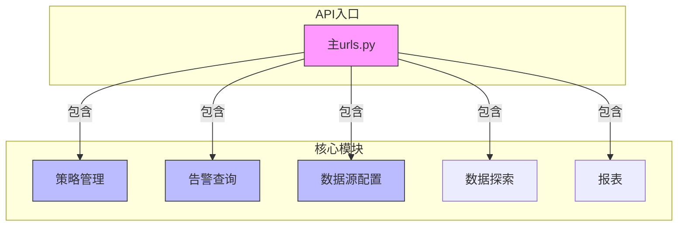
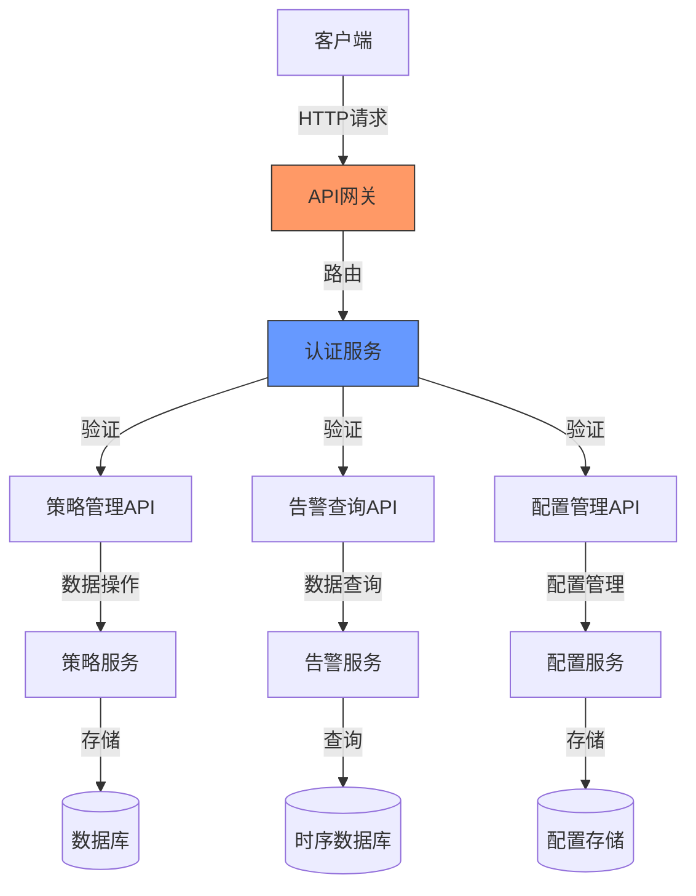
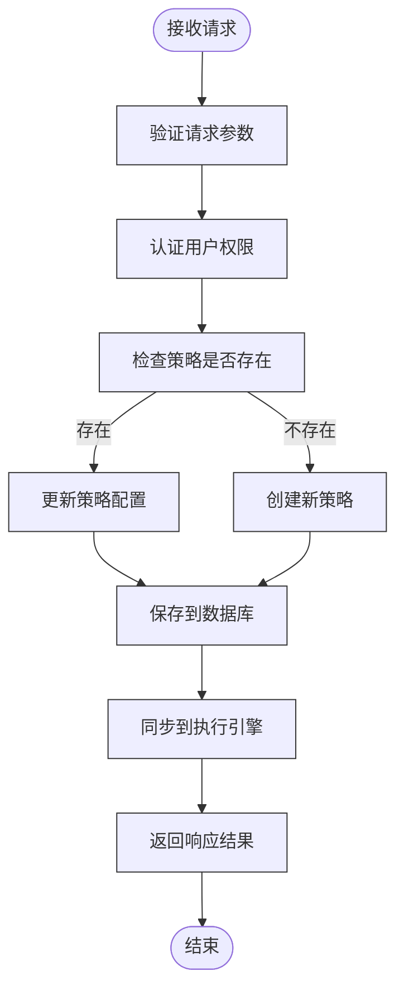
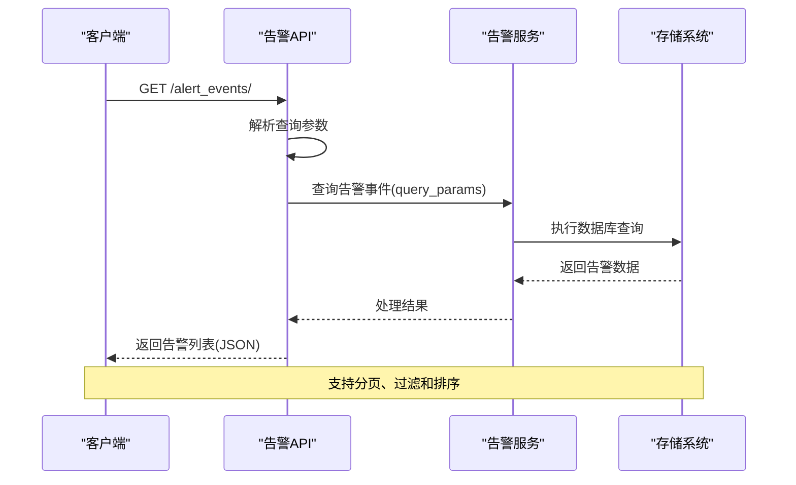
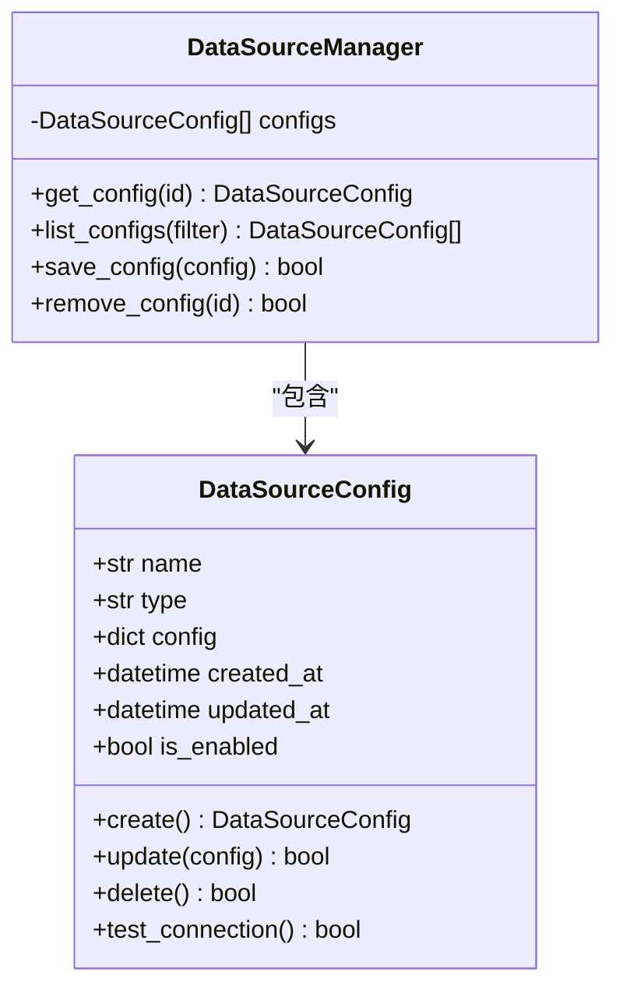
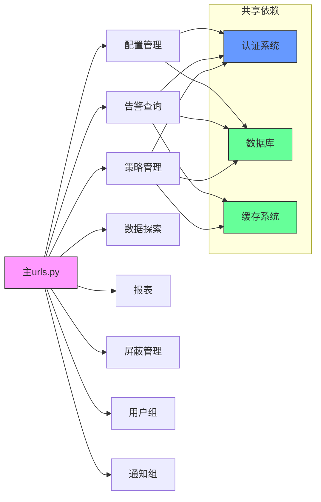

# API参考

<cite>
**本文档中引用的文件**  
- [bkmonitor/urls.py](file://bkmonitor/urls.py#L0-L96)
- [packages/monitor_web/urls.py](file://bkmonitor/packages/monitor_web/urls.py#L0-L45)
- [packages/monitor_web/strategies/urls.py](file://bkmonitor/packages/monitor_web/strategies/urls.py)
- [packages/monitor_web/alert_events/urls.py](file://bkmonitor/packages/monitor_web/alert_events/urls.py)
- [packages/monitor_web/config/urls.py](file://bkmonitor/packages/monitor_web/config/urls.py)
</cite>

## 目录
1. [简介](#简介)
2. [项目结构](#项目结构)
3. [核心组件](#核心组件)
4. [架构概览](#架构概览)
5. [详细组件分析](#详细组件分析)
6. [依赖分析](#依赖分析)
7. [性能考虑](#性能考虑)
8. [故障排除指南](#故障排除指南)
9. [结论](#结论)

## 简介
本文档旨在为bk-monitor平台提供全面的RESTful API参考文档。文档详细记录了平台的核心API接口，包括策略管理、告警查询和数据源配置等功能。通过分析URL路由结构和模块组织，本文档为开发者提供了清晰的API调用指南和使用示例。

## 项目结构
bk-monitor平台采用模块化设计，主要功能按功能域划分在不同的包中。核心API通过Django的URL路由系统进行组织，采用版本化路径（如`/rest/v2/`）进行管理。主要模块包括策略管理、告警事件、数据探索、报表生成等，每个模块都有独立的URL配置。

**图示来源**  
- [bkmonitor/urls.py](file://bkmonitor/urls.py#L61-L85)
- [packages/monitor_web/urls.py](file://bkmonitor/packages/monitor_web/urls.py#L0-L45)

**本节来源**  
- [bkmonitor/urls.py](file://bkmonitor/urls.py#L0-L96)
- [packages/monitor_web/urls.py](file://bkmonitor/packages/monitor_web/urls.py#L0-L45)

## 核心组件
bk-monitor平台的核心组件围绕监控数据的采集、处理、告警和可视化展开。API系统作为这些功能的对外接口，提供了对平台各项能力的程序化访问。主要核心组件包括策略管理引擎、告警处理系统、数据查询服务和配置管理系统。

**本节来源**  
- [bkmonitor/urls.py](file://bkmonitor/urls.py#L61-L85)
- [packages/monitor_web/urls.py](file://bkmonitor/packages/monitor_web/urls.py#L10-L45)

## 架构概览
bk-monitor的API架构采用分层设计，前端通过RESTful接口与后端服务交互。整体架构分为接入层、业务逻辑层和数据层。接入层负责请求路由和认证，业务逻辑层实现具体功能，数据层管理监控数据的存储和查询。

**图示来源**  
- [bkmonitor/urls.py](file://bkmonitor/urls.py#L61-L85)
- [packages/monitor_web/urls.py](file://bkmonitor/packages/monitor_web/urls.py#L10-L45)

## 详细组件分析

### 策略管理分析
策略管理模块负责监控策略的创建、修改、删除和查询。该模块提供完整的CRUD操作接口，支持复杂条件的告警策略配置。

**图示来源**  
- [packages/monitor_web/strategies/urls.py](file://bkmonitor/packages/monitor_web/strategies/urls.py)

**本节来源**  
- [packages/monitor_web/strategies/urls.py](file://bkmonitor/packages/monitor_web/strategies/urls.py)

### 告警查询分析
告警查询模块提供对历史告警事件的检索功能，支持多种过滤条件和分页查询。

**图示来源**  
- [packages/monitor_web/alert_events/urls.py](file://bkmonitor/packages/monitor_web/alert_events/urls.py)

**本节来源**  
- [packages/monitor_web/alert_events/urls.py](file://bkmonitor/packages/monitor_web/alert_events/urls.py)

### 数据源配置分析
数据源配置模块管理监控系统的数据接入配置，包括数据源的添加、测试和删除。

**图示来源**  
- [packages/monitor_web/config/urls.py](file://bkmonitor/packages/monitor_web/config/urls.py)

**本节来源**  
- [packages/monitor_web/config/urls.py](file://bkmonitor/packages/monitor_web/config/urls.py)

## 依赖分析
bk-monitor平台的API组件之间存在明确的依赖关系。主URL配置文件包含各个功能模块的URL配置，形成树状依赖结构。各模块相对独立，通过统一的认证和路由机制进行集成。

**图示来源**  
- [bkmonitor/urls.py](file://bkmonitor/urls.py#L61-L85)
- [packages/monitor_web/urls.py](file://bkmonitor/packages/monitor_web/urls.py#L10-L45)

**本节来源**  
- [bkmonitor/urls.py](file://bkmonitor/urls.py#L0-L96)
- [packages/monitor_web/urls.py](file://bkmonitor/packages/monitor_web/urls.py#L0-L45)

## 性能考虑
API系统的性能主要受数据库查询效率、缓存机制和并发处理能力的影响。建议在生产环境中：
- 合理使用分页参数避免大数据量查询
- 利用缓存减少重复计算
- 批量操作替代单个操作
- 监控API响应时间并设置合理的超时

## 故障排除指南
常见问题及解决方案：
- **401未授权**：检查蓝鲸Token是否正确
- **404找不到**：确认API路径和版本号
- **500服务器错误**：查看服务日志定位问题
- **响应慢**：检查数据库性能和网络状况
- **数据不一致**：确认缓存是否需要刷新

**本节来源**  
- [bkmonitor/urls.py](file://bkmonitor/urls.py#L0-L96)
- [packages/monitor_web/urls.py](file://bkmonitor/packages/monitor_web/urls.py#L0-L45)

## 结论
bk-monitor平台提供了完善的RESTful API接口，通过模块化的URL设计实现了功能的清晰划分。开发者可以基于本文档快速了解和使用平台的核心API功能，实现监控系统的自动化管理和集成。