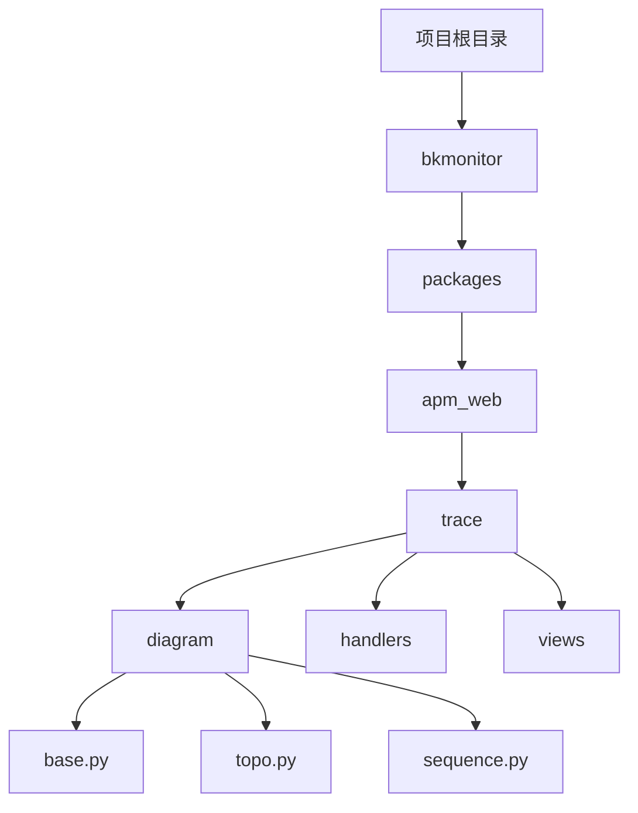
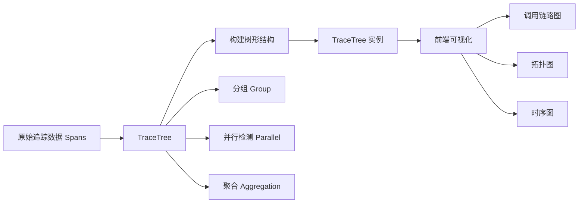
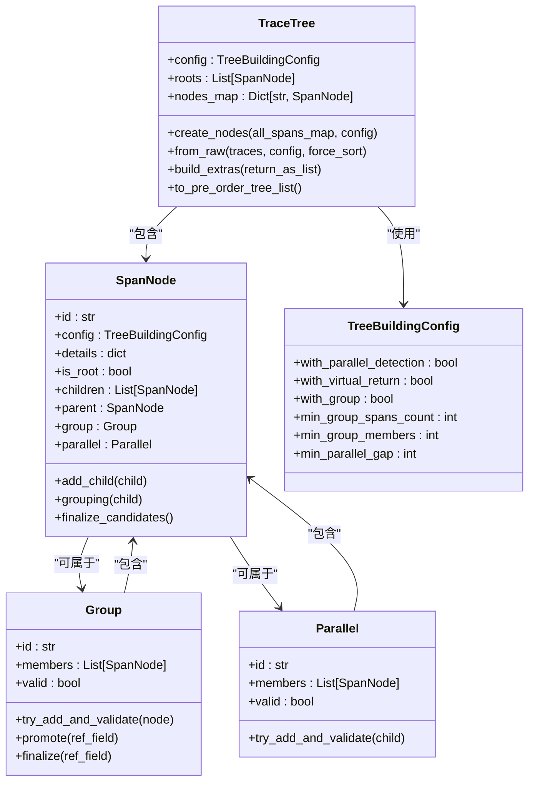
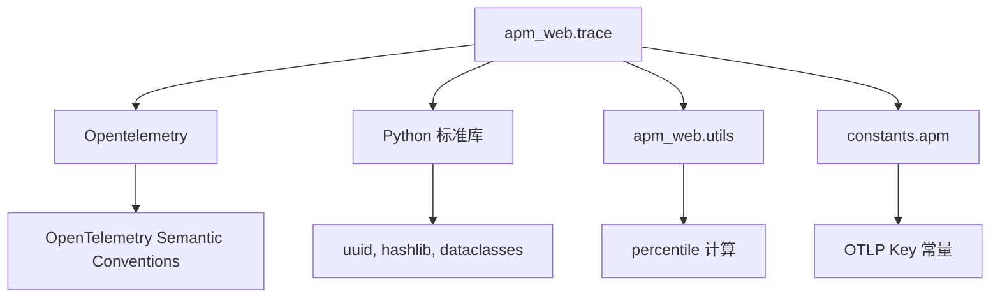

# 追踪原理

<cite>
**本文档中引用的文件**   
- [base.py](file://bkmonitor/packages/apm_web/trace/diagram/base.py)
- [utils.py](file://bkmonitor/packages/apm_web/tests/trace/utils.py)
- [topo.py](file://bkmonitor/packages/apm_web/trace/diagram/topo.py)
- [conftest.py](file://bkmonitor/packages/apm_web/tests/trace/conftest.py)
- [test_base.py](file://bkmonitor/packages/apm_web/tests/trace/test_base.py)
- [test_group.py](file://bkmonitor/packages/apm_web/tests/trace/test_group.py)
- [test_parallel.py](file://bkmonitor/packages/apm_web/tests/trace/test_parallel.py)
- [test_topo.py](file://bkmonitor/packages/apm_web/tests/trace/test_topo.py)
- [sequence.py](file://bkmonitor/packages/apm_web/trace/diagram/sequence.py)
- [apm.py](file://bkmonitor/constants/apm.py)
- [tail_sampling_flink.java](file://bkmonitor/apm/core/handlers/bk_data/tail_sampling_flink.java)
</cite>

## 目录
1. [引言](#引言)
2. [项目结构](#项目结构)
3. [核心组件](#核心组件)
4. [架构概述](#架构概述)
5. [详细组件分析](#详细组件分析)
6. [依赖分析](#依赖分析)
7. [性能考虑](#性能考虑)
8. [故障排除指南](#故障排除指南)
9. [结论](#结论)

## 引言
本文档旨在深入解析分布式追踪系统的实现原理，重点阐述调用链路的生成与传播机制。通过分析 `apm_web` 模块中的追踪功能，详细说明了 `TraceID` 和 `SpanID` 的生成、上下文传播、异步调用处理以及追踪数据的可视化。文档结合代码实例和架构图，为开发者提供对追踪系统底层工作原理的全面理解。

## 项目结构
该项目是一个复杂的监控系统，其核心追踪功能主要位于 `bkmonitor/packages/apm_web` 目录下。`apm_web` 包专门负责应用性能监控（APM）的Web端功能，其中 `trace` 模块是实现分布式追踪的核心。



**图示来源**
- [base.py](file://bkmonitor/packages/apm_web/trace/diagram/base.py)
- [topo.py](file://bkmonitor/packages/apm_web/trace/diagram/topo.py)
- [sequence.py](file://bkmonitor/packages/apm_web/trace/diagram/sequence.py)

## 核心组件
分布式追踪的核心在于构建和表示调用链路。`apm_web` 模块通过 `TraceTree` 类来实现这一功能，它将一系列离散的 `Span` 组织成一个树形结构，清晰地展示服务间的调用关系。

**组件来源**
- [base.py](file://bkmonitor/packages/apm_web/trace/diagram/base.py)

## 架构概述
整个追踪系统的架构可以分为数据采集、数据处理和数据展示三个层次。本项目主要关注数据处理和展示层。`TraceTree` 类作为核心，接收原始的追踪数据（Spans），根据 `parent_span_id` 和 `trace_id` 等信息构建出完整的调用树，并提供聚合、分组、并行检测等高级功能，最终为前端可视化提供数据支持。



**图示来源**
- [base.py](file://bkmonitor/packages/apm_web/trace/diagram/base.py)
- [topo.py](file://bkmonitor/packages/apm_web/trace/diagram/topo.py)

## 详细组件分析
### TraceTree 类分析
`TraceTree` 类是调用链路的核心数据结构，它将一组 `Span` 组织成一个或多个根节点的树。

#### 类图


**图示来源**
- [base.py](file://bkmonitor/packages/apm_web/trace/diagram/base.py)

### 调用链路的生成与传播机制
调用链路的生成始于一个根 `Span`（`is_root=True`），该 `Span` 的 `parent_span_id` 为空。后续的 `Span` 通过其 `parent_span_id` 与父 `Span` 的 `span_id` 关联，从而形成父子关系。`TraceTree` 的 `create_nodes` 方法负责建立这种关系。

```python
def create_nodes(self, all_spans_map: Dict[str, dict], config: TreeBuildingConfig):
    needing_parents = defaultdict(list)
    for span in all_spans_map.values():
        parent_id = span[OtlpKey.PARENT_SPAN_ID]
        # 如果没有父节点或父节点是自己，则为根节点
        if parent_id not in all_spans_map or parent_id == span["span_id"]:
            root = SpanNode.make_root(span, config)
            self.add_root(root, config)
            # 处理那些等待此节点作为父节点的子节点
            for child in needing_parents[root.id]:
                root.add_child(child)
            continue
        # 创建当前节点
        node = SpanNode.from_raw(span, config)
        self.add_node(node)
        if parent_id not in self.nodes_map:
            # 父节点尚未创建，暂存
            needing_parents[parent_id].append(node)
        else:
            # 父节点已创建，直接建立父子关系
            self.nodes_map[parent_id].add_child(node)
        # 处理那些等待此节点作为父节点的子节点
        for child in needing_parents[node.id]:
            if child.id != node.id:
                node.add_child(child)
```

**组件来源**
- [base.py](file://bkmonitor/packages/apm_web/trace/diagram/base.py)

### TraceID 和 SpanID 的生成与唯一性保证
根据代码分析，`TraceID` 和 `SpanID` 的生成并非在 `apm_web` 模块中完成。该模块主要负责消费和处理这些ID。从测试代码中可以看出，`TraceID` 和 `SpanID` 是由上游的追踪代理（如OpenTelemetry SDK）生成的。

在 `utils.py` 的测试数据中，`TraceID` 和 `SpanID` 被硬编码为 `"fake_trace_id"` 和 `"span0"`，这表明实际的生成逻辑在数据采集端。`SpanID` 通常是一个64位的随机数，而 `TraceID` 是一个128位的随机数，它们的唯一性由高熵的随机数生成算法保证，确保在分布式系统中极低的碰撞概率。

```python
# 示例：测试数据中的TraceID和SpanID
{
    "elapsed_time": 100,
    "parent_span_id": "",
    "trace_id": "fake_trace_id",  # 由上游SDK生成
    "span_id": "span0",           # 由上游SDK生成
    "kind": 1,
    "span_name": "rootSpan",
    ...
}
```

**组件来源**
- [utils.py](file://bkmonitor/packages/apm_web/tests/trace/utils.py)

### 跨进程调用的上下文传播
跨进程调用的上下文传播是分布式追踪的关键。`apm_web` 模块本身不负责传播，而是接收和解析已传播的上下文。上下文传播通常通过HTTP头部、消息队列的Message Header等载体进行。

在 `apm.py` 常量文件中，定义了与 `trpc` 框架相关的属性，如 `TRPC_CALLER_SERVICE` 和 `TRPC_CALLEE_SERVICE`。这表明在BCS（蓝鲸容器服务）环境中，追踪上下文是通过 `trpc` 框架的特定头部进行传播的。当服务A调用服务B时，A的追踪代理会将当前的 `TraceID`、`SpanID` 以及 `trpc` 相关的元数据注入到HTTP请求头中，服务B的追踪代理则从请求头中提取这些信息，创建新的 `Span` 并建立正确的父子关系。

```python
# constants/apm.py 中定义的trpc相关属性
class SpanAttributes:
    TRPC_CALLER_SERVICE = "trpc.caller_service"
    TRPC_CALLER_METHOD = "trpc.caller_method"
    TRPC_CALLEE_SERVICE = "trpc.callee_service"
    TRPC_CALLEE_METHOD = "trpc.callee_method"
    TRPC_NAMESPACE = "trpc.namespace"
    TRPC_ENV_NAME = "trpc.env_name"
    TRPC_STATUS_CODE = "trpc.status_code"
```

**组件来源**
- [apm.py](file://bkmonitor/constants/apm.py)

### 异步调用和并发执行的追踪处理
`TraceTree` 提供了对并行执行 `Span` 的检测功能。通过 `TreeBuildingConfig` 中的 `with_parallel_detection` 配置项来启用。`SpanNode` 在添加子节点时，会使用 `_children_parallel_candidate` 来尝试将子节点分组到 `Parallel` 对象中。

判断两个 `Span` 是否并行的逻辑在 `Parallel` 类的 `should_add_to_parallel` 方法中：
1.  **时间重叠**：如果前一个 `Span` 的结束时间晚于后一个 `Span` 的开始时间，则认为它们是并行的。
2.  **时间间隔**：如果两个 `Span` 没有时间重叠，但它们的开始时间间隔小于 `min_parallel_gap`（默认500毫秒），也会被标记为并行。

```python
def should_add_to_parallel(self, child: "SpanNode") -> bool:
    if not self.candidates:
        return True
    last_candidate = self.candidates[-1]
    # 必须是同一个父节点的子节点
    if not child.parent.id == last_candidate.parent.id:
        return False
    # 时间重叠
    last_start_time, last_end_time = last_candidate.start_and_end
    adding_start_time, _ = child.start_and_end
    if last_end_time > adding_start_time:
        return True
    # 时间间隔小于阈值
    return abs(last_start_time - adding_start_time) < self.config.min_parallel_gap
```

**组件来源**
- [base.py](file://bkmonitor/packages/apm_web/trace/diagram/base.py)

### 上下文切换和恢复
`TraceTree` 通过 `virtual_return` 机制来处理上下文的“返回”。当 `TreeBuildingConfig.with_virtual_return=True` 时，系统会为每个 `Span` 创建一个虚拟的“返回”节点。这个虚拟节点的 `index_refer` 被设置为原 `Span` 的 `end_time`。在构建树时，这个虚拟节点会被插入到兄弟节点中，其位置由 `end_time` 决定。

这使得在按时间顺序遍历调用树时，可以清晰地看到一个 `Span` 何时开始、何时结束，从而实现了上下文的“恢复”可视化。例如，一个 `Span` 开始后，其子 `Span` 依次执行，当该 `Span` 结束时，虚拟返回节点出现，表示控制权“返回”到了该 `Span` 的父节点。

```python
def to_virtual_return(self) -> "SpanNode":
    return SpanNode(
        id=self.id,
        config=self.config,
        details=self.details,
        is_root=self.is_root,
        children=self.children,
        parent=self.parent,
        index_refer=self.details[OtlpKey.END_TIME],  # 使用结束时间作为排序依据
        parallel=self.parallel,
        virtual_return=True,
    )
```

**组件来源**
- [base.py](file://bkmonitor/packages/apm_web/trace/diagram/base.py)

### 追踪数据采集的性能影响评估和优化建议
*   **性能影响**：在数据处理层（`apm_web`），`TraceTree` 的构建和分析是计算密集型操作，尤其是在处理包含数千个 `Span` 的大型追踪时。`create_nodes` 方法的时间复杂度接近 O(n)，而 `build_extras` 方法（如分组和并行检测）可能更高。
*   **优化建议**：
    1.  **采样**：在数据采集端实施采样策略，避免将所有追踪数据都上报，只保留有代表性的或错误的追踪。
    2.  **分页与懒加载**：前端展示时，对大型追踪进行分页或懒加载，避免一次性加载所有数据。
    3.  **配置调优**：合理配置 `TreeBuildingConfig`，例如，在不需要时关闭 `with_parallel_detection` 和 `with_group`，以减少计算开销。
    4.  **缓存**：对已构建和分析过的 `TraceTree` 进行缓存，避免重复计算。

## 依赖分析
`apm_web` 的追踪功能依赖于多个外部库和内部模块。



**图示来源**
- [base.py](file://bkmonitor/packages/apm_web/trace/diagram/base.py)
- [sequence.py](file://bkmonitor/packages/apm_web/trace/diagram/sequence.py)
- [apm.py](file://bkmonitor/constants/apm.py)

## 性能考虑
如上文所述，大型追踪的处理是主要的性能瓶颈。系统通过 `force_sort` 参数和高效的字典映射（`nodes_map`, `roots_map`）来优化构建过程。然而，最有效的优化仍需在数据源头（采集端）进行，通过采样和过滤来减少进入处理管道的数据量。

## 故障排除指南
*   **调用链路断裂**：检查上游服务是否正确地将 `trace_id` 和 `parent_span_id` 注入到下游请求中。确认 `trpc` 或其他RPC框架的追踪插件已正确配置。
*   **`TraceTree` 构建失败**：检查输入的 `Spans` 数据是否完整，特别是 `span_id` 和 `parent_span_id` 字段。确保 `trace_id` 在整个追踪中保持一致。
*   **并行检测不准确**：调整 `TreeBuildingConfig.min_parallel_gap` 的值，根据实际应用的并发模式进行优化。

**组件来源**
- [base.py](file://bkmonitor/packages/apm_web/trace/diagram/base.py)
- [apm.py](file://bkmonitor/constants/apm.py)

## 结论
本文档详细解析了 `bk-monitor` 系统中分布式追踪功能的实现原理。`TraceTree` 类作为核心，通过高效的算法将原始的 `Span` 数据构建成可分析的树形结构，并提供了分组、并行检测和虚拟返回等高级功能，极大地增强了调用链路的可读性。虽然 `TraceID` 和 `SpanID` 的生成及跨进程传播由上游代理完成，但 `apm_web` 模块在数据处理和可视化方面扮演了至关重要的角色。开发者应关注数据采样和配置优化，以确保追踪系统在生产环境中的高性能和低开销。