# 追踪展示

<cite>
**本文档引用的文件**  
- [base.py](file://bkmonitor/apm/core/deepflow/base.py#L0-L519)
- [base.py](file://bkmonitor/packages/apm_web/handlers/trace_handler/base.py#L25-L73)
- [base.py](file://bkmonitor/packages/apm_web/handlers/trace_handler/base.py#L490-L535)
- [config.py](file://bkmonitor/packages/apm_web/trace/diagram/config.py#L0-L37)
- [test_flamegraph.py](file://bkmonitor/packages/apm_web/tests/trace/test_flamegraph.py#L0-L33)
- [test_statistics.py](file://bkmonitor/packages/apm_web/tests/trace/test_statistics.py#L0-L17)
- [conftest.py](file://bkmonitor/packages/apm_web/tests/trace/conftest.py#L0-L24)
- [apm.py](file://bkmonitor/packages/monitor_web/scene_view/builtin/apm.py#L294-L318)
- [v4/apm.py](file://bkmonitor/kernel_api/views/v4/apm.py#L0-L13)
</cite>

## 目录
1. [引言](#引言)
2. [核心数据结构与类分析](#核心数据结构与类分析)
3. [调用链路可视化实现原理](#调用链路可视化实现原理)
4. [时间轴视图与火焰图](#时间轴视图与火焰图)
5. [服务依赖关系图生成](#服务依赖关系图生成)
6. [性能分析与统计视图](#性能分析与统计视图)
7. [配置与控制机制](#配置与控制机制)
8. [前后端交互与API接口](#前后端交互与api接口)
9. [测试与验证机制](#测试与验证机制)
10. [总结](#总结)

## 引言
本文档旨在全面介绍蓝鲸监控平台中分布式追踪可视化功能的实现机制。文档详细阐述了调用链路的展示方式、服务依赖关系图的生成算法、时间轴视图的实现原理以及性能热点定位等核心功能。通过分析关键代码组件，揭示了从原始追踪数据到可视化图表的完整处理流程，为用户深入理解系统行为和诊断性能问题提供技术支撑。

## 核心数据结构与类分析
本节分析实现追踪可视化功能的核心数据结构和类，包括Span、TraceTree等关键组件。

### Span类结构分析
`Span` 类是分布式追踪系统中最基本的数据单元，用于表示一次操作的执行过程。该类定义了追踪数据的核心属性和行为。

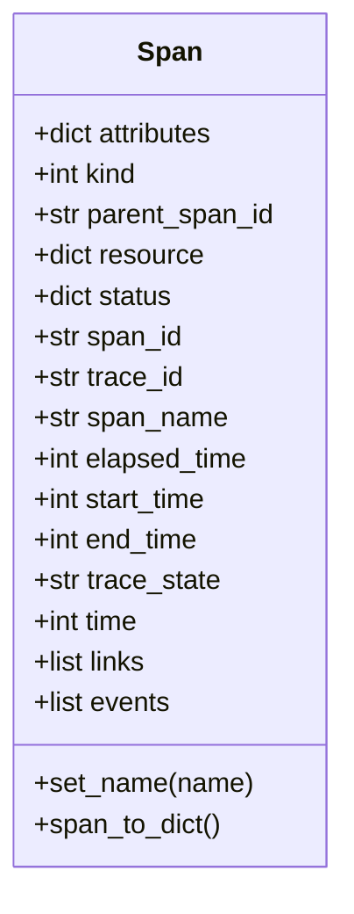

**图示来源**  
- [base.py](file://bkmonitor/apm/core/deepflow/base.py#L0-L519)

**本节来源**  
- [base.py](file://bkmonitor/apm/core/deepflow/base.py#L0-L519)

### TraceTree类与调用链构建
`TraceTree` 类负责将原始的Span数据构建成具有层级结构的调用树，是实现调用链路可视化的基础。

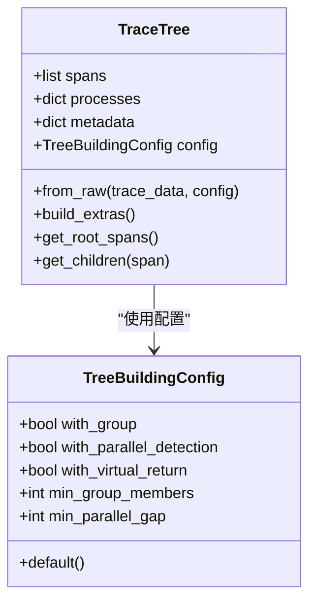

**图示来源**  
- [base.py](file://bkmonitor/packages/apm_web/handlers/trace_handler/base.py#L490-L535)
- [config.py](file://bkmonitor/packages/apm_web/trace/diagram/config.py#L0-L37)

**本节来源**  
- [base.py](file://bkmonitor/packages/apm_web/handlers/trace_handler/base.py#L490-L535)
- [config.py](file://bkmonitor/packages/apm_web/trace/diagram/config.py#L0-L37)

## 调用链路可视化实现原理
本节详细说明调用链路可视化功能的实现逻辑，包括数据处理流程和视图构建机制。

### 调用链数据处理流程
系统通过 `_get_trace_tree` 方法将原始追踪数据转换为前端可渲染的树形结构。该流程首先提取服务资源信息，然后构建完整的调用树并填充Span数据。

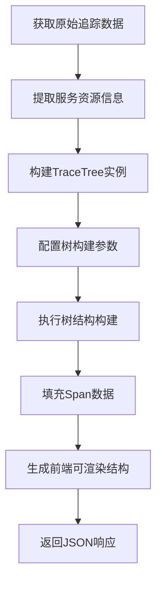

**图示来源**  
- [base.py](file://bkmonitor/packages/apm_web/handlers/trace_handler/base.py#L490-L535)

**本节来源**  
- [base.py](file://bkmonitor/packages/apm_web/handlers/trace_handler/base.py#L490-L535)

### 属性过滤器机制
系统实现了基于属性的过滤机制，允许根据特定条件筛选Span数据。这些过滤器用于识别错误、解析JSON数据等场景。

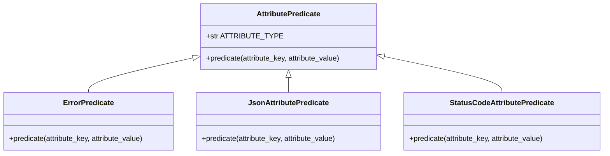

**图示来源**  
- [base.py](file://bkmonitor/packages/apm_web/handlers/trace_handler/base.py#L25-L73)

**本节来源**  
- [base.py](file://bkmonitor/packages/apm_web/handlers/trace_handler/base.py#L25-L73)

## 时间轴视图与火焰图
本节介绍时间轴视图和火焰图的实现原理，包括耗时分布分析和瓶颈识别功能。

### 火焰图生成流程
火焰图（Flame Graph）是一种直观展示调用栈耗时分布的可视化方式。系统通过 `trace_to_flamegraph` 函数将追踪数据转换为火焰图数据结构。

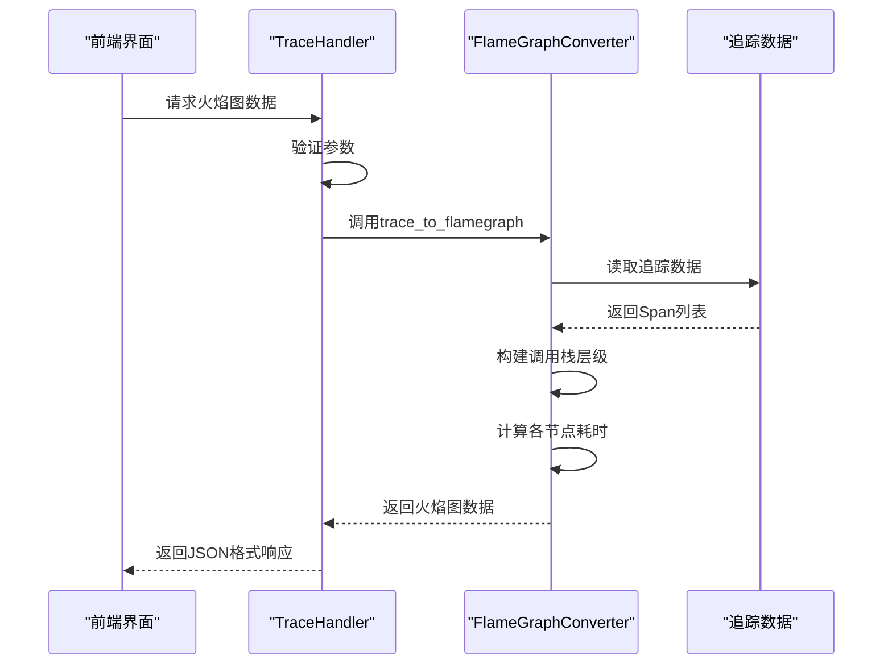

**图示来源**  
- [test_flamegraph.py](file://bkmonitor/packages/apm_web/tests/trace/test_flamegraph.py#L0-L33)

**本节来源**  
- [test_flamegraph.py](file://bkmonitor/packages/apm_web/tests/trace/test_flamegraph.py#L0-L33)

### 时间轴视图实现
时间轴视图通过将Span按时间顺序排列，直观展示各操作的执行时序和并发情况。系统利用 `TreeBuildingConfig` 中的并行检测功能来识别并行执行的Span。

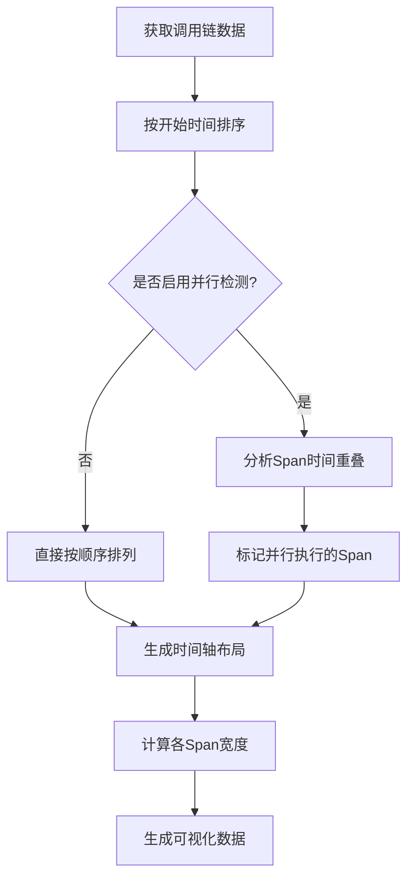

**本节来源**  
- [config.py](file://bkmonitor/packages/apm_web/trace/diagram/config.py#L0-L37)
- [test_flamegraph.py](file://bkmonitor/packages/apm_web/tests/trace/test_flamegraph.py#L0-L33)

## 服务依赖关系图生成
本节阐述服务依赖关系图的生成算法和交互特性。

### 拓扑图生成机制
服务依赖关系图通过分析Span之间的调用关系自动生成。系统在 `DiagramConfigController` 中配置了拓扑图的生成参数。

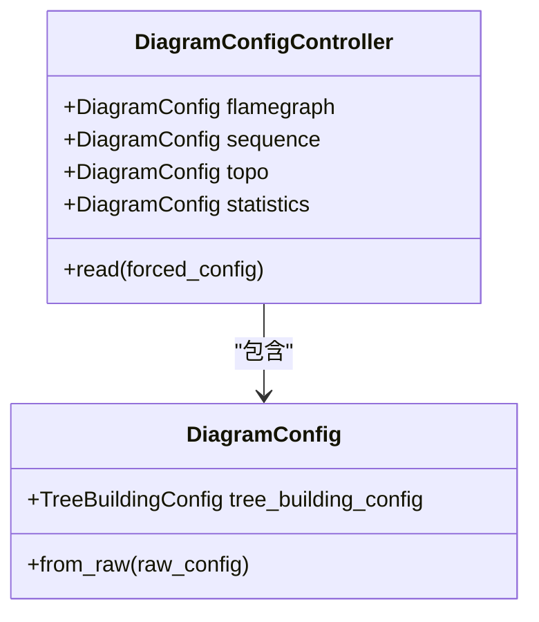

**图示来源**  
- [config.py](file://bkmonitor/packages/apm_web/trace/diagram/config.py#L0-L37)

**本节来源**  
- [config.py](file://bkmonitor/packages/apm_web/trace/diagram/config.py#L0-L37)

### 依赖关系分析流程
系统通过分析Span的资源属性和服务名称，构建服务间的调用关系网络。

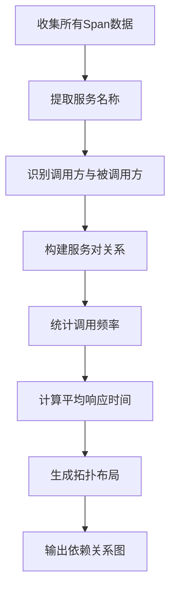

**本节来源**  
- [base.py](file://bkmonitor/packages/apm_web/handlers/trace_handler/base.py#L490-L535)

## 性能分析与统计视图
本节介绍异常检测和性能热点定位的可视化方法。

### 性能差异分析
系统提供了调用链对比功能，通过 `trace_diff_to_statistics` 函数计算不同调用链之间的性能差异。

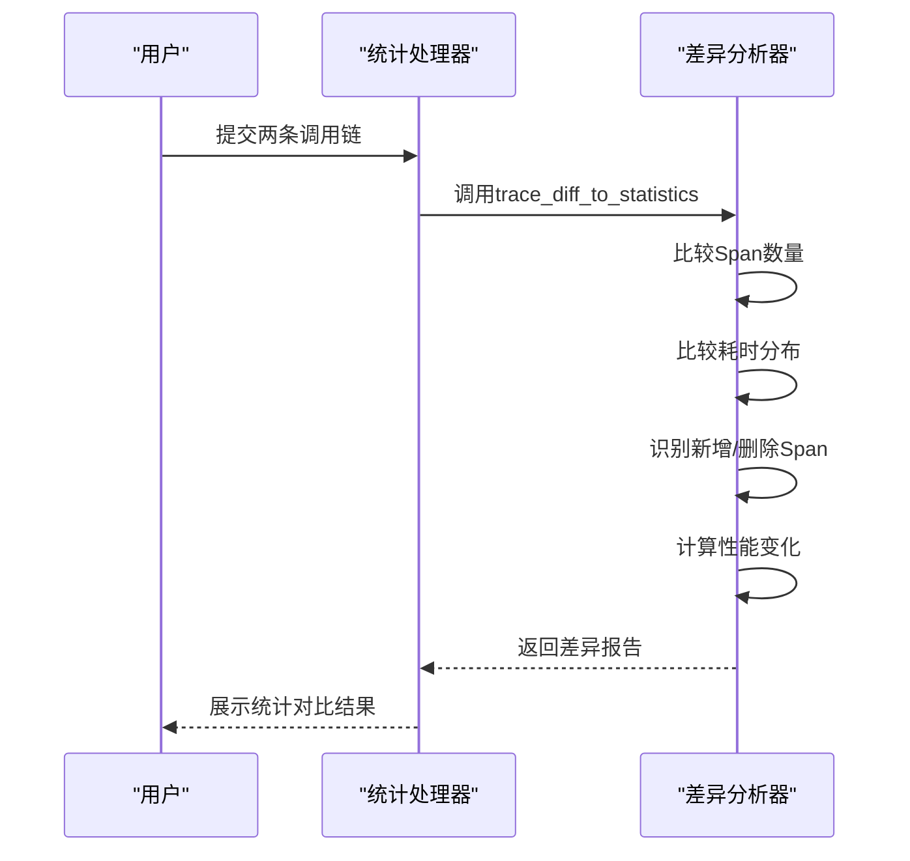

**图示来源**  
- [test_statistics.py](file://bkmonitor/packages/apm_web/tests/trace/test_statistics.py#L0-L17)

**本节来源**  
- [test_statistics.py](file://bkmonitor/packages/apm_web/tests/trace/test_statistics.py#L0-L17)

### 热点定位机制
系统通过分析Span的耗时百分位数来识别性能瓶颈，帮助用户快速定位热点服务。

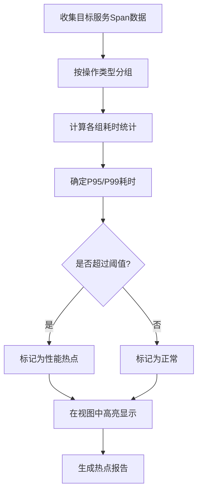

**本节来源**  
- [base.py](file://bkmonitor/packages/apm_web/handlers/trace_handler/base.py#L25-L73)

## 配置与控制机制
本节介绍可视化功能的配置管理方式。

### 可视化配置控制器
`DiagramConfigController` 类统一管理各类可视化图表的配置，支持从系统设置中读取配置或使用强制配置。

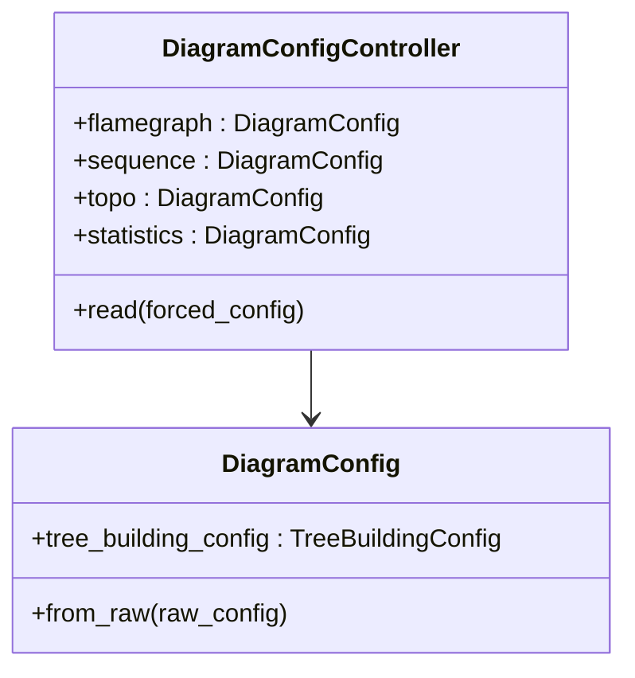

**图示来源**  
- [config.py](file://bkmonitor/packages/apm_web/trace/diagram/config.py#L0-L37)

**本节来源**  
- [config.py](file://bkmonitor/packages/apm_web/trace/diagram/config.py#L0-L37)

## 前后端交互与API接口
本节说明前后端交互机制和关键API接口。

### API接口设计
系统通过 `TraceQueryWebViewSet` 提供追踪查询相关的REST API接口，支持前端获取追踪数据。

```mermaid
classDiagram
class TraceQueryWebViewSet {
+query_trace_list()
+get_trace_detail()
+search_traces()
}
class ApplicationWebViewSet {
+get_applications()
+get_service_map()
}
note right of TraceQueryWebViewSet
提供追踪数据查询接口
支持按服务、时间范围检索
end
```

**图示来源**  
- [v4/apm.py](file://bkmonitor/kernel_api/views/v4/apm.py#L0-L13)

**本节来源**  
- [v4/apm.py](file://bkmonitor/kernel_api/views/v4/apm.py#L0-L13)

### 视图配置处理
系统通过 `builtin/apm.py` 处理内置视图的配置，支持变量替换和布局调整。

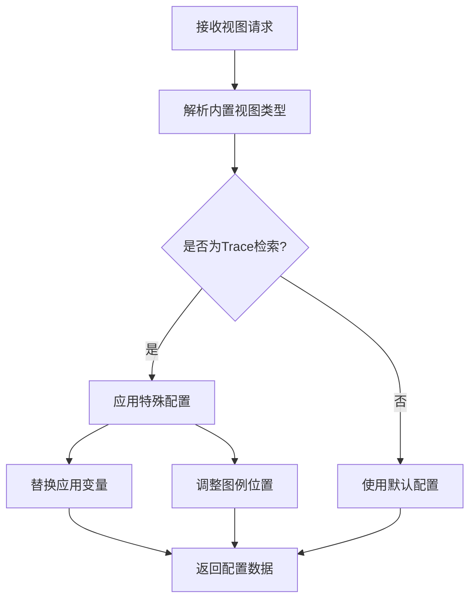

**本节来源**  
- [apm.py](file://bkmonitor/packages/monitor_web/scene_view/builtin/apm.py#L294-L318)

## 测试与验证机制
本节介绍系统的测试策略和验证方法。

### 单元测试框架
系统提供了完善的单元测试，验证各类可视化功能的正确性。

```mermaid
classDiagram
class TestFlamegraph {
+test_raw_simple()
+test_parallel()
}
class TestStatistics {
+test_diff()
}
class TestFixtures {
+default_trace_tree_config
+forced_group_trace_tree_config
+group_and_parallel_trace_tree_config
}
note right of TestFlamegraph
验证火焰图生成逻辑
测试简单和并行场景
end
note right of TestStatistics
验证差异分析功能
测试变更检测准确性
end
```

**图示来源**  
- [test_flamegraph.py](file://bkmonitor/packages/apm_web/tests/trace/test_flamegraph.py#L0-L33)
- [test_statistics.py](file://bkmonitor/packages/apm_web/tests/trace/test_statistics.py#L0-L17)
- [conftest.py](file://bkmonitor/packages/apm_web/tests/trace/conftest.py#L0-L24)

**本节来源**  
- [test_flamegraph.py](file://bkmonitor/packages/apm_web/tests/trace/test_flamegraph.py#L0-L33)
- [test_statistics.py](file://bkmonitor/packages/apm_web/tests/trace/test_statistics.py#L0-L17)
- [conftest.py](file://bkmonitor/packages/apm_web/tests/trace/conftest.py#L0-L24)

## 总结
本文档全面分析了蓝鲸监控平台中分布式追踪可视化功能的实现机制。系统通过 `Span` 和 `TraceTree` 等核心数据结构，实现了调用链路的完整表示和层级构建。时间轴视图和火焰图提供了直观的耗时分布分析能力，帮助用户识别性能瓶颈。服务依赖关系图通过自动分析Span间的调用关系生成，展现了系统的整体架构。性能统计和差异分析功能支持对调用链进行深入比较，辅助异常检测和热点定位。整个系统采用模块化设计，通过清晰的配置机制和API接口，实现了前后端的高效协作。完善的测试套件确保了各功能模块的正确性和稳定性，为用户提供可靠、高效的追踪分析工具。