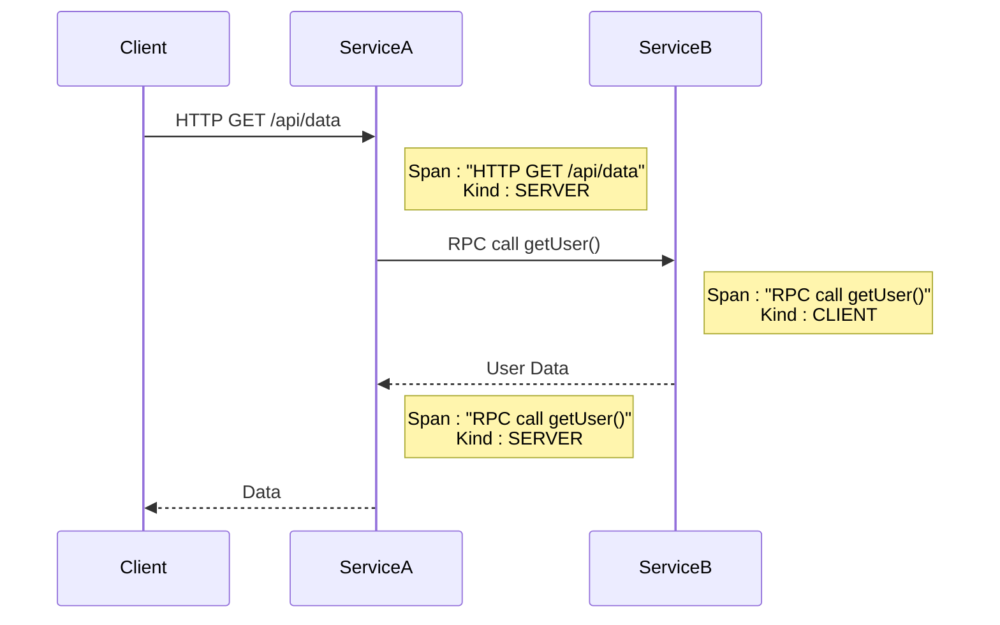
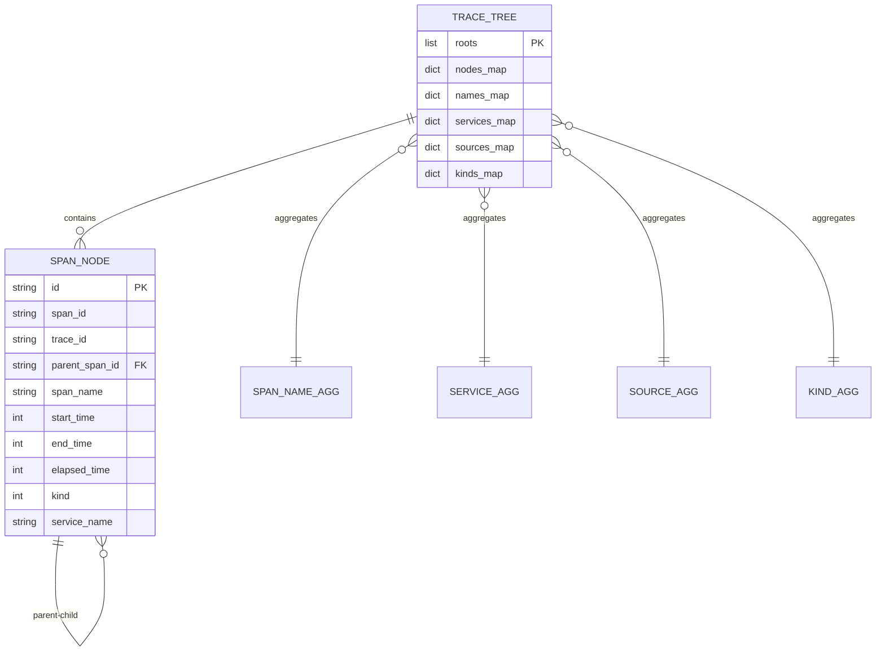

# 追踪模型

<cite>
**本文档引用的文件**   
- [base.py](file://bkmonitor/packages/apm_web/trace/diagram/base.py)
- [apm.py](file://bkmonitor/constants/apm.py)
- [test_base.py](file://bkmonitor/packages/apm_web/tests/trace/test_base.py)
- [test_group.py](file://bkmonitor/packages/apm_web/tests/trace/test_group.py)
- [test_parallel.py](file://bkmonitor/packages/apm_web/tests/trace/test_parallel.py)
- [conftest.py](file://bkmonitor/packages/apm_web/tests/trace/conftest.py)
- [topo.py](file://bkmonitor/packages/apm_web/trace/diagram/topo.py)
- [application.py](file://bkmonitor/packages/apm_web/models/application.py)
- [list_flatten_traces.md](file://bkmonitor/support-files/apigw/docs/zh/list_flatten_traces.md)
</cite>

## 目录
1. [简介](#简介)
2. [核心数据结构](#核心数据结构)
3. [实体属性与数据类型](#实体属性与数据类型)
4. [层级关系与时间约束](#层级关系与时间约束)
5. [元数据组织](#元数据组织)
6. [数据模型扩展与兼容性](#数据模型扩展与兼容性)
7. [示例数据与调用链路](#示例数据与调用链路)
8. [数据模型图](#数据模型图)

## 简介
本文档旨在全面介绍分布式追踪系统中的数据模型。该模型基于OpenTelemetry (OTLP)标准，用于表示和处理服务调用链路的详细信息。核心概念包括`Trace`（追踪）、`Span`（跨度）以及相关的元数据。`Trace`代表一个完整的请求在分布式系统中的执行路径，由一个或多个`Span`组成。`Span`是追踪的基本单元，代表系统中一个独立的工作单元，如一次函数调用或数据库查询。`Span`之间通过父子关系形成树状结构，清晰地描绘了请求的调用流程和时间序列。本文档将详细阐述这些核心实体的属性、它们之间的关系、元数据的组织方式，并提供示例和图示来帮助理解。

**Section sources**
- [base.py](file://bkmonitor/packages/apm_web/trace/diagram/base.py#L0-L50)
- [apm.py](file://bkmonitor/constants/apm.py#L171-L255)

## 核心数据结构
追踪数据模型的核心由`TraceTree`和`SpanNode`两个主要类构成，它们共同构建了一个内存中的树状结构来表示一次或多次追踪。

*   **`TraceTree`**: 代表一个或多个追踪的集合。它是一个包含多个根节点（`roots`）的树结构，每个根节点对应一个独立的`Span`。`TraceTree`负责管理所有`SpanNode`的创建、关系建立和聚合信息。
*   **`SpanNode`**: 代表追踪中的一个具体工作单元，即`Span`。它是树中的一个节点，可以有父节点和多个子节点，从而形成调用的层级结构。`SpanNode`封装了`Span`的所有属性和行为。

**Section sources**
- [base.py](file://bkmonitor/packages/apm_web/trace/diagram/base.py#L687-L969)
- [base.py](file://bkmonitor/packages/apm_web/trace/diagram/base.py#L200-L500)

## 实体属性与数据类型
本节详细描述`Span`（在代码中为`SpanNode`）的核心属性及其数据类型。

### SpanNode 属性
`SpanNode`类通过其`details`字典字段存储了`Span`的所有原始属性。这些属性的键名由`OtlpKey`枚举定义。

| 属性键 (OtlpKey) | 数据类型 | 描述 |
| :--- | :--- | :--- |
| `SPAN_ID` | 字符串 | 当前`Span`的唯一标识符。 |
| `TRACE_ID` | 字符串 | 所属`Trace`的唯一标识符，用于将分散的`Span`关联到同一次请求。 |
| `PARENT_SPAN_ID` | 字符串 | 父`Span`的ID。如果为空，则此`Span`为根`Span`。 |
| `SPAN_NAME` | 字符串 | `Span`的名称，通常表示操作或方法名，如"HTTP GET /api/users"。 |
| `START_TIME` | 整数 | `Span`开始执行的时间戳（纳秒）。 |
| `END_TIME` | 整数 | `Span`结束执行的时间戳（纳秒）。 |
| `ELAPSED_TIME` | 整数 | `Span`的持续时间，即`END_TIME - START_TIME`。 |
| `KIND` | 整数 | `Span`的类型，定义了其在调用链中的角色。 |
| `STATUS` | 字典 | `Span`的执行状态，包含`STATUS_CODE`和`STATUS_MESSAGE`。 |
| `RESOURCE` | 字典 | 与`Span`关联的资源信息，如服务名、实例ID等。 |

### SpanKind 类型
`KIND`属性的值来自`SpanKind`枚举，它定义了`Span`的语义类型。

| 值 | 标签 | 描述 |
| :--- | :--- | :--- |
| `SPAN_KIND_UNSPECIFIED` (0) | 未指定(unspecified) | 未指定类型。 |
| `SPAN_KIND_INTERNAL` (1) | 内部(internal) | 表示应用程序内部的执行，不涉及网络调用。 |
| `SPAN_KIND_SERVER` (2) | 被调 | 表示一个服务器端的处理，接收来自客户端的请求。 |
| `SPAN_KIND_CLIENT` (3) | 主调 | 表示一个客户端发起的请求，调用远程服务。 |
| `SPAN_KIND_PRODUCER` (4) | 异步主调 | 表示一个消息生产者，发送消息到消息队列。 |
| `SPAN_KIND_CONSUMER` (5) | 异步被调 | 表示一个消息消费者，从消息队列接收并处理消息。 |

**Section sources**
- [base.py](file://bkmonitor/packages/apm_web/trace/diagram/base.py#L200-L500)
- [apm.py](file://bkmonitor/constants/apm.py#L171-L214)
- [apm.py](file://bkmonitor/constants/apm.py#L217-L255)

## 层级关系与时间约束
`Span`之间的关系构成了追踪的调用链路，主要通过父子关系和时间序列来体现。

### 父子关系
`Span`通过`PARENT_SPAN_ID`和`SPAN_ID`建立父子关系。在`TraceTree`中，这种关系被构建为一棵或多棵树。
*   **父节点**: 一个`SpanNode`的`parent`字段指向其父`SpanNode`。
*   **子节点**: 一个`SpanNode`的`children`列表包含其所有直接子`SpanNode`。
*   **根节点**: 没有父节点的`SpanNode`，其`is_root`属性为`True`。

### 时间序列约束
`Span`的开始和结束时间必须满足严格的时序约束：
1.  **包含性**: 子`Span`的开始和结束时间必须完全包含在父`Span`的时间范围内。
2.  **顺序性**: 同一父节点下的多个子`Span`，其开始时间（`START_TIME`）决定了它们在调用树中的顺序。`TraceTree`在构建时会根据`index_refer`（通常为`START_TIME`）对子节点进行排序。



**Diagram sources**
- [base.py](file://bkmonitor/packages/apm_web/trace/diagram/base.py#L500-L800)
- [base.py](file://bkmonitor/packages/apm_web/trace/diagram/base.py#L200-L500)

## 元数据组织
除了核心的`Span`属性外，系统还通过聚合（Aggregation）的方式组织和管理元数据，以便于查询和分析。

### 聚合类型
`TraceTree`维护了多个映射（`names_map`, `services_map`, `sources_map`, `kinds_map`），用于按不同维度聚合`Span`。

| 聚合类型 | 对应类 | 描述 |
| :--- | :--- | :--- |
| 名称聚合 | `SpanNameAgg` | 将所有具有相同`SPAN_NAME`的`Span`聚合在一起。 |
| 服务聚合 | `ServiceAgg` | 将所有属于同一服务（通过`RESOURCE`中的`SERVICE_NAME`识别）的`Span`聚合在一起。 |
| 来源聚合 | `SourceAgg` | 将所有来自同一数据来源（如特定的SDK或采集器）的`Span`聚合在一起。 |
| 类型聚合 | `KindAgg` | 将所有具有相同`KIND`的`Span`聚合在一起。 |

每个聚合对象（如`ServiceAgg`）都包含其成员`SpanNode`的统计信息，例如最大、最小、平均持续时间等。

**Section sources**
- [base.py](file://bkmonitor/packages/apm_web/trace/diagram/base.py#L200-L500)
- [base.py](file://bkmonitor/packages/apm_web/trace/diagram/base.py#L687-L969)

## 数据模型扩展与兼容性
该数据模型设计上具有良好的扩展性和兼容性。

*   **扩展性**: 通过`details`字典，`SpanNode`可以存储任何符合OTLP标准的属性，而无需修改核心数据结构。新的属性可以通过`OtlpKey`枚举进行定义。
*   **配置驱动**: `TreeBuildingConfig`类允许通过配置来控制`TraceTree`的构建行为，例如是否检测并行执行（`with_parallel_detection`）、是否进行分组（`with_group`）等，这使得模型可以根据不同的分析需求进行调整。
*   **兼容性**: 模型直接基于OTLP标准，确保了与主流追踪系统（如Jaeger, Zipkin）的数据兼容性。`OtlpKey`枚举确保了字段名称的标准化。

**Section sources**
- [base.py](file://bkmonitor/packages/apm_web/trace/diagram/base.py#L0-L199)
- [base.py](file://bkmonitor/packages/apm_web/trace/diagram/base.py#L687-L969)

## 示例数据与调用链路
以下是一个典型的调用链路示例，展示了`Trace`和`Span`的存储格式。

### 示例调用链路
```
用户请求 -> 服务A (HTTP GET /api/data) -> 服务B (RPC getUser) -> 数据库 (SELECT * FROM users)
```

### 示例数据
```json
[
  {
    "trace_id": "trace-001",
    "span_id": "span-001",
    "parent_span_id": "",
    "span_name": "HTTP GET /api/data",
    "start_time": 1000,
    "end_time": 5000,
    "elapsed_time": 4000,
    "kind": 2,
    "resource": {
      "service.name": "service-a"
    }
  },
  {
    "trace_id": "trace-001",
    "span_id": "span-002",
    "parent_span_id": "span-001",
    "span_name": "RPC getUser",
    "start_time": 1500,
    "end_time": 4500,
    "elapsed_time": 3000,
    "kind": 3,
    "resource": {
      "service.name": "service-a"
    }
  },
  {
    "trace_id": "trace-001",
    "span_id": "span-003",
    "parent_span_id": "span-002",
    "span_name": "RPC getUser",
    "start_time": 1600,
    "end_time": 4400,
    "elapsed_time": 2800,
    "kind": 2,
    "resource": {
      "service.name": "service-b"
    }
  },
  {
    "trace_id": "trace-001",
    "span_id": "span-004",
    "parent_span_id": "span-003",
    "span_name": "SELECT * FROM users",
    "start_time": 1700,
    "end_time": 4300,
    "elapsed_time": 2600,
    "kind": 1,
    "resource": {
      "service.name": "service-b"
    }
  }
]
```

**Section sources**
- [test_base.py](file://bkmonitor/packages/apm_web/tests/trace/test_base.py#L131-L173)
- [test_base.py](file://bkmonitor/packages/apm_web/tests/trace/test_base.py#L170-L208)

## 数据模型图
下图展示了追踪数据模型的核心结构及其关系。



**Diagram sources**
- [base.py](file://bkmonitor/packages/apm_web/trace/diagram/base.py#L687-L969)
- [base.py](file://bkmonitor/packages/apm_web/trace/diagram/base.py#L200-L500)