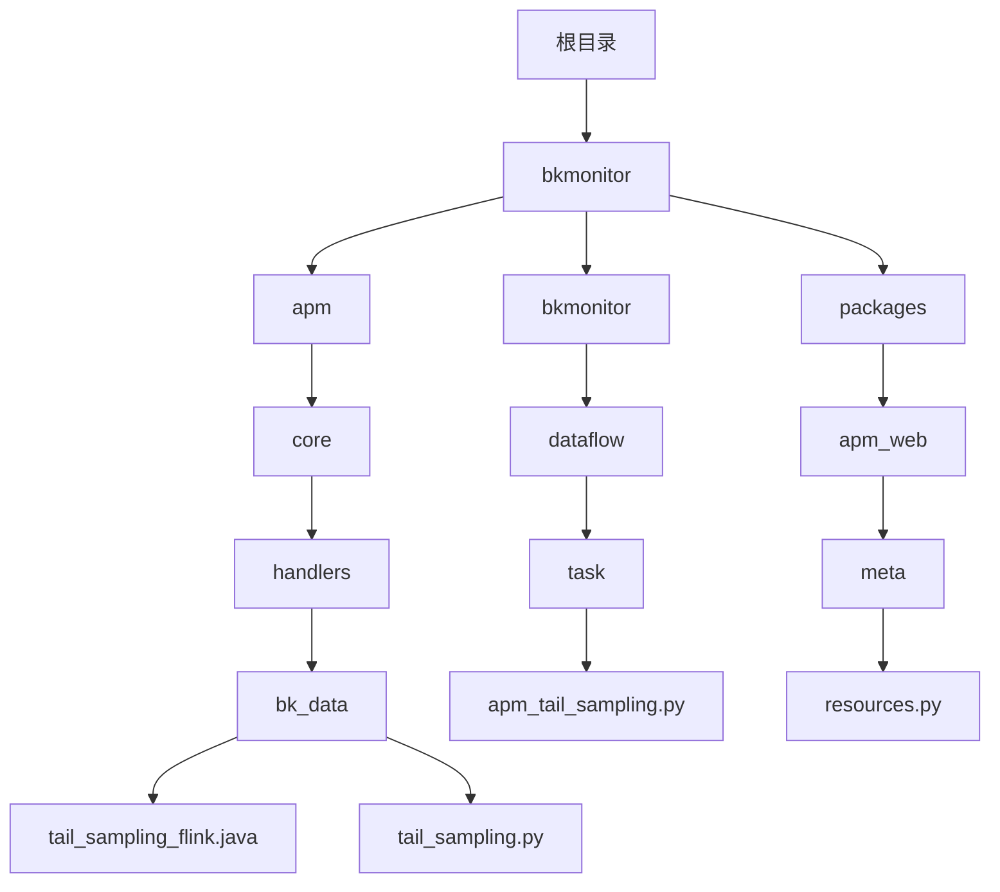
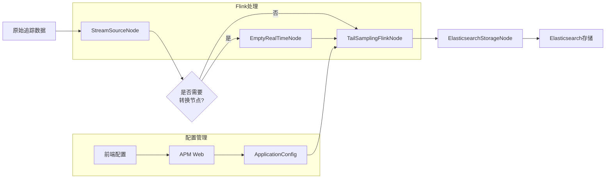
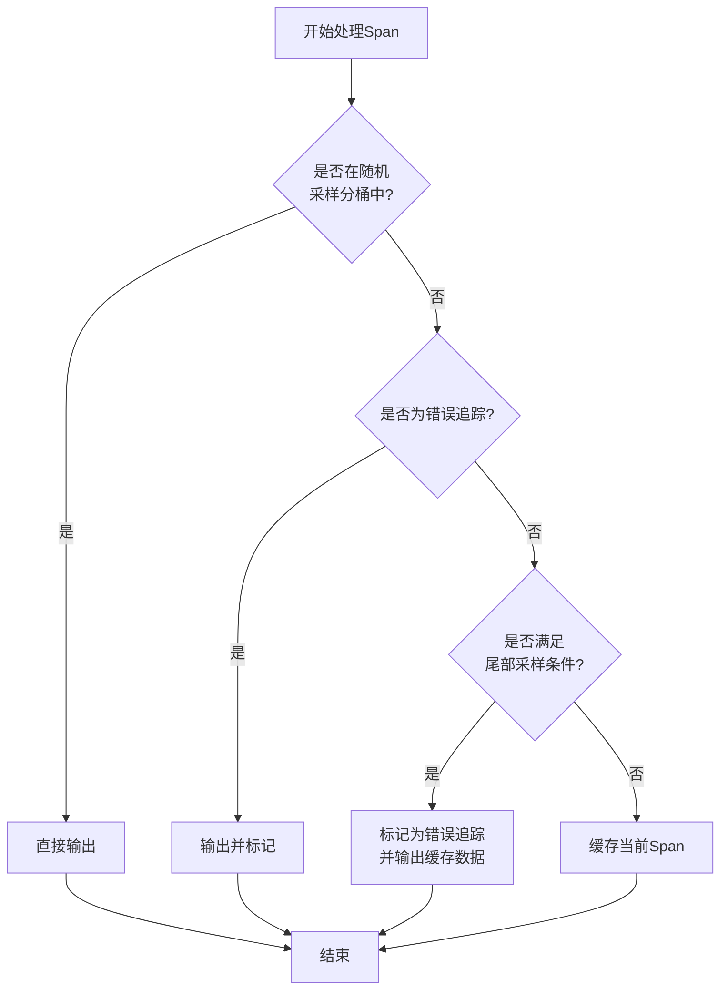
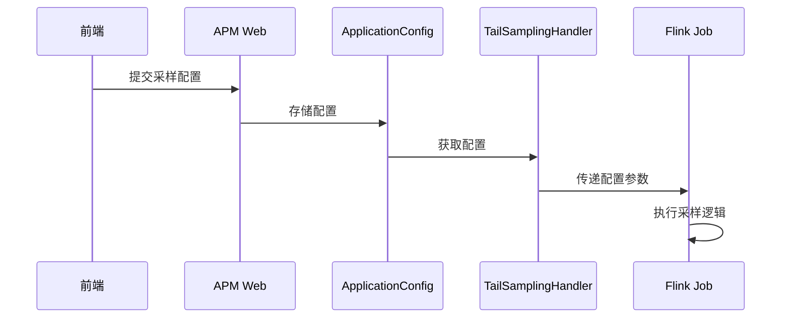
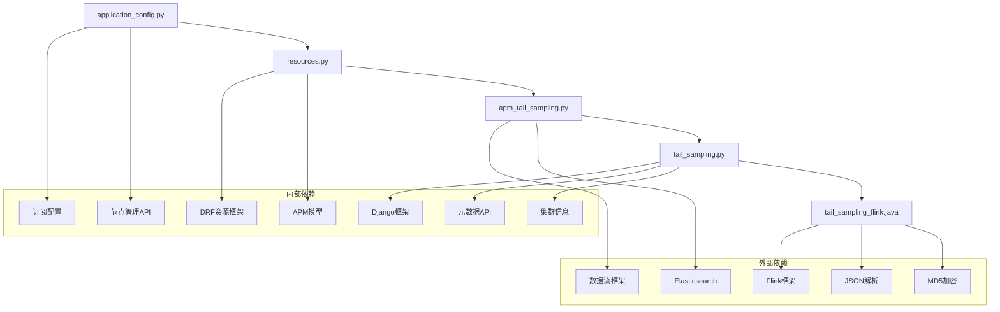

# 追踪采样

<cite>
**本文档引用的文件**   
- [tail_sampling_flink.java](file://bkmonitor/apm/core/handlers/bk_data/tail_sampling_flink.java)
- [tail_sampling.py](file://bkmonitor/apm/core/handlers/bk_data/tail_sampling.py)
- [apm_tail_sampling.py](file://bkmonitor/bkmonitor/dataflow/task/apm_tail_sampling.py)
- [application_config.py](file://bkmonitor/apm/core/application_config.py)
- [resources.py](file://bkmonitor/packages/apm_web/meta/resources.py)
- [apm.py](file://bkmonitor/constants/apm.py)
- [constants.py](file://bkmonitor/packages/apm_web/constants.py)
</cite>

## 目录
1. [引言](#引言)
2. [项目结构](#项目结构)
3. [核心组件](#核心组件)
4. [架构概述](#架构概述)
5. [详细组件分析](#详细组件分析)
6. [依赖分析](#依赖分析)
7. [性能考虑](#性能考虑)
8. [故障排除指南](#故障排除指南)
9. [结论](#结论)

## 引言
本文档全面介绍了蓝鲸监控平台中分布式追踪采样策略的实现。文档详细阐述了固定比率采样、尾部采样等不同策略的实现原理和适用场景，分析了采样决策的执行时机和上下文考虑因素，并解释了采样率的动态调整机制。通过分析核心代码文件，本文档为用户提供了在不同环境和业务场景下设置合适采样策略的配置示例，并探讨了不同采样方案对数据完整性和系统性能的影响。

## 项目结构
蓝鲸监控平台的项目结构清晰地组织了各个功能模块。追踪采样功能主要分布在`apm`（应用性能管理）模块中，特别是`apm/core/handlers/bk_data`目录下的Java和Python文件，这些文件实现了核心的采样逻辑。配置接口则位于`packages/apm_web`包中，负责前端与后端的交互。



**图示来源**
- [tail_sampling_flink.java](file://bkmonitor/apm/core/handlers/bk_data/tail_sampling_flink.java)
- [tail_sampling.py](file://bkmonitor/apm/core/handlers/bk_data/tail_sampling.py)
- [apm_tail_sampling.py](file://bkmonitor/bkmonitor/dataflow/task/apm_tail_sampling.py)
- [resources.py](file://bkmonitor/packages/apm_web/meta/resources.py)

**本节来源**
- [tail_sampling_flink.java](file://bkmonitor/apm/core/handlers/bk_data/tail_sampling_flink.java)
- [tail_sampling.py](file://bkmonitor/apm/core/handlers/bk_data/tail_sampling.py)
- [apm_tail_sampling.py](file://bkmonitor/bkmonitor/dataflow/task/apm_tail_sampling.py)
- [resources.py](file://bkmonitor/packages/apm_web/meta/resources.py)

## 核心组件
追踪采样功能的核心组件包括：
1. **tail_sampling_flink.java**：使用Flink流处理框架实现的尾部采样逻辑，负责根据配置条件对追踪数据进行过滤和采样。
2. **tail_sampling.py**：Python封装类，负责创建和管理Flink采样任务，将Java代码与平台其他部分集成。
3. **apm_tail_sampling.py**：定义了采样任务的数据流节点，包括源节点、Flink处理节点和Elasticsearch存储节点。
4. **resources.py**：提供了前端配置接口，允许用户通过API设置采样策略和参数。

这些组件协同工作，实现了从配置接收、任务创建到数据处理的完整采样流程。

**本节来源**
- [tail_sampling_flink.java](file://bkmonitor/apm/core/handlers/bk_data/tail_sampling_flink.java)
- [tail_sampling.py](file://bkmonitor/apm/core/handlers/bk_data/tail_sampling.py)
- [apm_tail_sampling.py](file://bkmonitor/bkmonitor/dataflow/task/apm_tail_sampling.py)
- [resources.py](file://bkmonitor/packages/apm_web/meta/resources.py)

## 架构概述
追踪采样系统的架构基于Flink流处理框架，采用分布式处理模式。系统接收原始追踪数据，通过Flink作业进行实时处理，根据预设的采样策略过滤数据，最后将采样后的数据存储到Elasticsearch中。



**图示来源**
- [apm_tail_sampling.py](file://bkmonitor/bkmonitor/dataflow/task/apm_tail_sampling.py)
- [tail_sampling.py](file://bkmonitor/apm/core/handlers/bk_data/tail_sampling.py)
- [application_config.py](file://bkmonitor/apm/core/application_config.py)

## 详细组件分析

### 尾部采样Flink处理器分析
`tail_sampling_flink.java`文件实现了核心的尾部采样逻辑，使用Flink的KeyedProcessFunction对按trace_id分组的数据流进行处理。

#### 采样策略实现


**图示来源**
- [tail_sampling_flink.java](file://bkmonitor/apm/core/handlers/bk_data/tail_sampling_flink.java#L482-L535)

**本节来源**
- [tail_sampling_flink.java](file://bkmonitor/apm/core/handlers/bk_data/tail_sampling_flink.java)

#### 随机采样算法
随机采样通过计算trace_id的MD5值并取模来实现，确保采样具有随机性和可重复性。

```java
private boolean isBucket(String traceID, int randomSamplingRatio) {
    try {
        MessageDigest md5 = MessageDigest.getInstance("MD5");
        byte[] digest = md5.digest(traceID.getBytes(StandardCharsets.UTF_8));
        BigInteger bigInteger = new BigInteger(1, digest);
        BigInteger bucket = new BigInteger("100");
        return Integer.parseInt(String.valueOf(bigInteger.mod(bucket))) < randomSamplingRatio;
    } catch (Exception e) {
        throw new RuntimeException("sample trace failed.", e);
    }
}
```

该算法将trace_id的MD5值映射到0-99的范围内，然后与配置的采样比率进行比较，从而决定是否采样。这种方法保证了即使在分布式环境中，相同的trace_id也会得到一致的采样结果。

**本节来源**
- [tail_sampling_flink.java](file://bkmonitor/apm/core/handlers/bk_data/tail_sampling_flink.java#L482-L510)

### 采样配置管理分析
采样配置通过Python类进行管理和传递，实现了前后端的解耦。

#### 配置传递流程


**图示来源**
- [resources.py](file://bkmonitor/packages/apm_web/meta/resources.py)
- [application_config.py](file://bkmonitor/apm/core/application_config.py)
- [tail_sampling.py](file://bkmonitor/apm/core/handlers/bk_data/tail_sampling.py)

**本节来源**
- [resources.py](file://bkmonitor/packages/apm_web/meta/resources.py)
- [application_config.py](file://bkmonitor/apm/core/application_config.py)
- [tail_sampling.py](file://bkmonitor/apm/core/handlers/bk_data/tail_sampling.py)

### 采样策略类型分析
系统支持多种采样策略，通过枚举类进行定义和管理。

#### 采样类型枚举
```python
class SamplerTypeChoices:
    """采样类型枚举"""
    RANDOM = "random"
    TAIL = "tail"
    EMPTY = "empty"

    @classmethod
    def choices(cls):
        return [
            (cls.RANDOM, "随机采样"),
            (cls.TAIL, "尾部采样"),
            (cls.EMPTY, "不采样"),
        ]
```

#### 尾部采样条件操作符
```python
class TailSamplingSupportMethod(TextChoices):
    """尾部采样中采样规则支持的操作符"""
    GT = "gt", "gt"
    GTE = "gte", "gte"
    LT = "lt", "lt"
    LTE = "lte", "lte"
    EQ = "eq", "eq"
    NEQ = "neq", "neq"
    REG = "reg", "reg"
    NREG = "nreg", "nreg"
```

这些枚举类定义了系统支持的采样策略和条件操作符，为配置的灵活性和可扩展性提供了基础。

**本节来源**
- [constants.py](file://bkmonitor/packages/apm_web/constants.py)
- [apm.py](file://bkmonitor/constants/apm.py)

## 依赖分析
追踪采样系统依赖于多个外部组件和内部模块，形成了复杂的依赖关系网络。



**图示来源**
- [tail_sampling_flink.java](file://bkmonitor/apm/core/handlers/bk_data/tail_sampling_flink.java)
- [tail_sampling.py](file://bkmonitor/apm/core/handlers/bk_data/tail_sampling.py)
- [apm_tail_sampling.py](file://bkmonitor/bkmonitor/dataflow/task/apm_tail_sampling.py)
- [resources.py](file://bkmonitor/packages/apm_web/meta/resources.py)
- [application_config.py](file://bkmonitor/apm/core/application_config.py)

**本节来源**
- [tail_sampling_flink.java](file://bkmonitor/apm/core/handlers/bk_data/tail_sampling_flink.java)
- [tail_sampling.py](file://bkmonitor/apm/core/handlers/bk_data/tail_sampling.py)
- [apm_tail_sampling.py](file://bkmonitor/bkmonitor/dataflow/task/apm_tail_sampling.py)
- [resources.py](file://bkmonitor/packages/apm_web/meta/resources.py)
- [application_config.py](file://bkmonitor/apm/core/application_config.py)

## 性能考虑
追踪采样系统在设计时充分考虑了性能因素，采用了多种优化策略：

1. **状态管理**：使用Flink的ValueState和MapState来管理追踪状态，避免了频繁的外部存储访问。
2. **TTL配置**：为状态设置了合理的生存时间（TTL），防止状态无限增长。
3. **批量处理**：在满足条件时批量输出缓存的Span数据，减少I/O操作次数。
4. **高效算法**：使用MD5哈希和模运算实现随机采样，计算效率高。

这些优化措施确保了系统在高吞吐量场景下的稳定性和性能。

## 故障排除指南
当追踪采样系统出现问题时，可以按照以下步骤进行排查：

1. **检查配置**：确认采样配置是否正确，特别是采样比率和条件设置。
2. **查看日志**：检查Flink作业日志，寻找异常信息或错误堆栈。
3. **验证状态**：确认Flink状态后端是否正常工作，状态数据是否正确更新。
4. **监控指标**：观察系统监控指标，如处理延迟、吞吐量等，判断是否存在性能瓶颈。
5. **测试数据**：使用测试数据验证采样逻辑是否按预期工作。

**本节来源**
- [tail_sampling_flink.java](file://bkmonitor/apm/core/handlers/bk_data/tail_sampling_flink.java)
- [tail_sampling.py](file://bkmonitor/apm/core/handlers/bk_data/tail_sampling.py)
- [apm_tail_sampling.py](file://bkmonitor/bkmonitor/dataflow/task/apm_tail_sampling.py)

## 结论
蓝鲸监控平台的追踪采样系统通过结合Flink流处理框架和灵活的配置管理，实现了高效、可靠的分布式追踪数据采样。系统支持随机采样和尾部采样等多种策略，能够满足不同业务场景的需求。通过合理的架构设计和性能优化，系统能够在保证数据质量的同时，有效控制存储和计算成本。未来可以考虑增加更多采样策略，如自适应采样，以进一步提升系统的智能化水平。