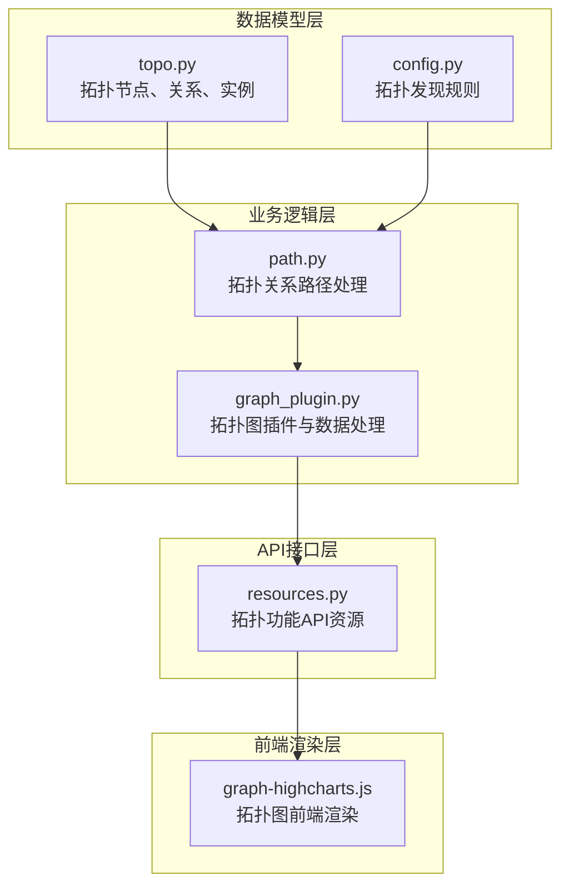
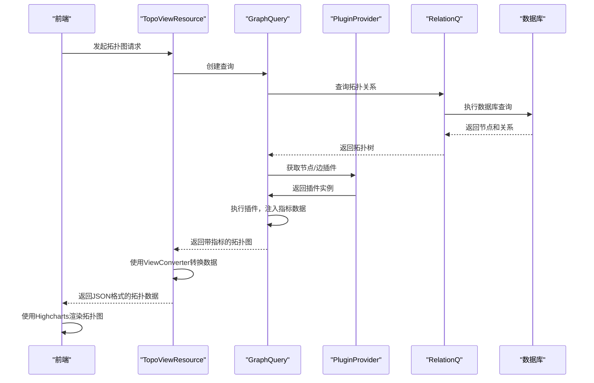
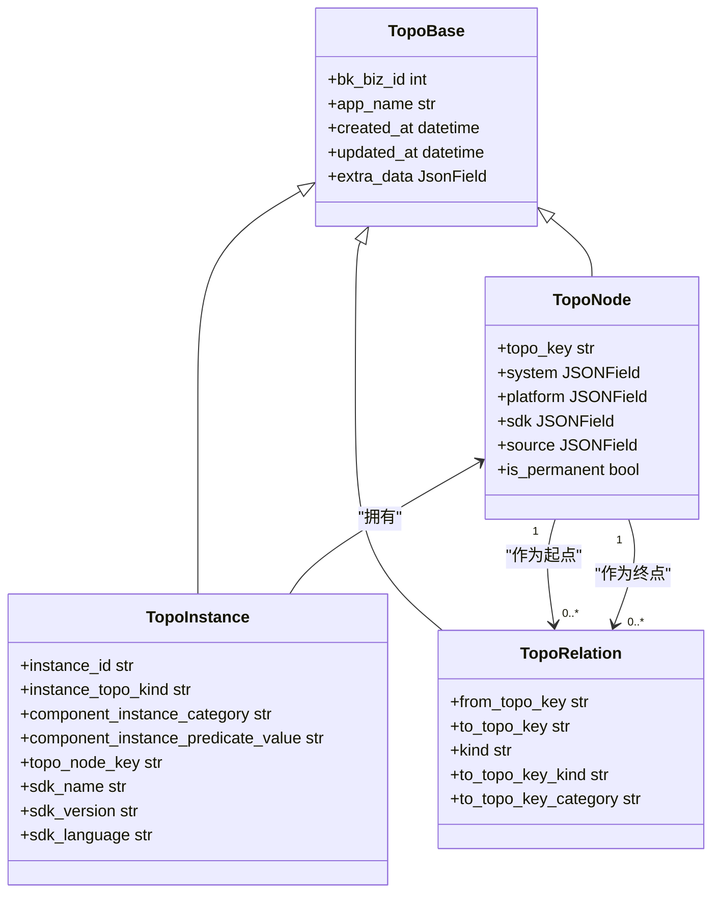
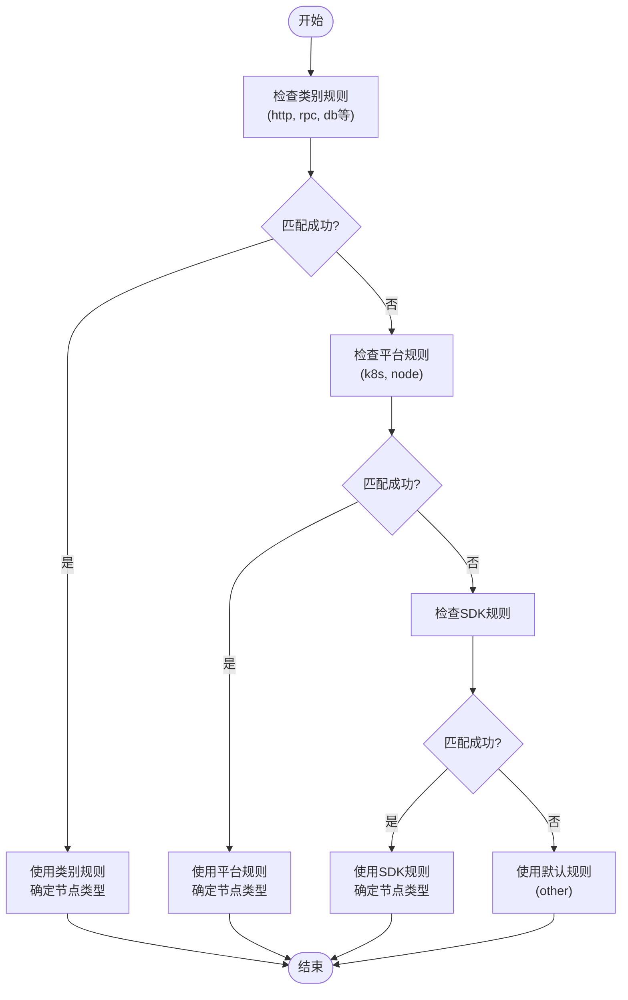
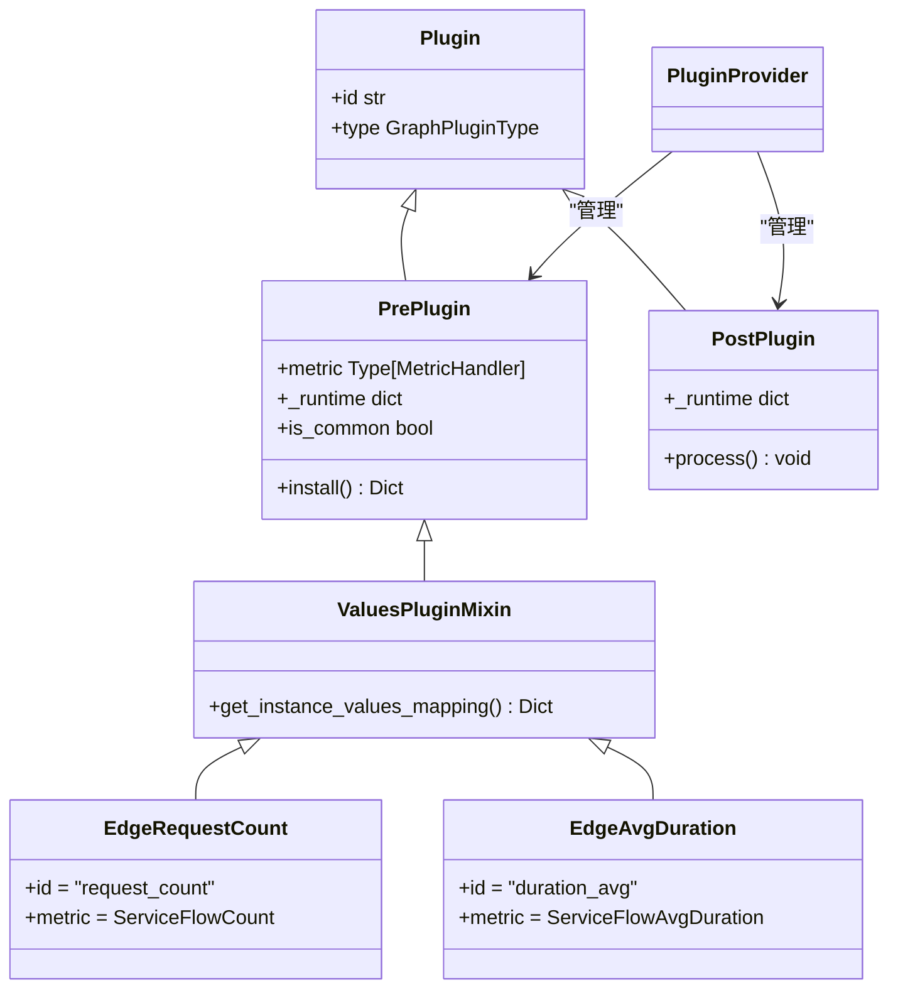
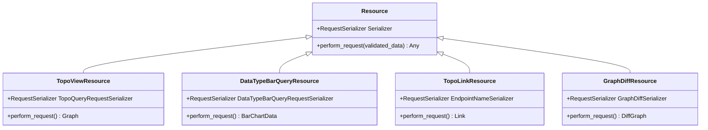
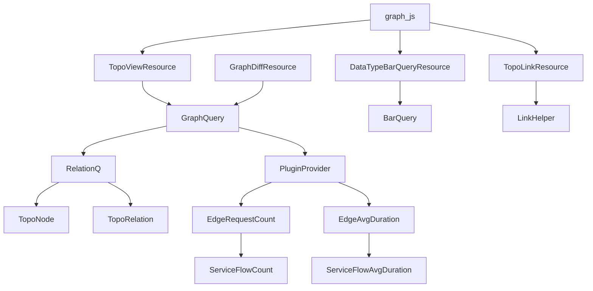

# 应用拓扑

<cite>
**本文档引用的文件**   
- [graph_plugin.py](file://bkmonitor\packages\apm_web\topo\handle\graph_plugin.py)
- [path.py](file://bkmonitor\packages\apm_web\topo\handle\relation\path.py)
- [constants.py](file://bkmonitor\packages\apm_web\topo\constants.py)
- [graph-highcharts.js](file://bkmonitor\alarm_backends\templates\image_exporter\static\js\graph-highcharts.js)
- [topo.py](file://bkmonitor\apm\models\topo.py)
- [resources.py](file://bkmonitor\packages\apm_web\topo\resources.py)
- [config.py](file://bkmonitor\apm\models\config.py)
</cite>

## 目录
1. [简介](#简介)
2. [项目结构](#项目结构)
3. [核心组件](#核心组件)
4. [架构概述](#架构概述)
5. [详细组件分析](#详细组件分析)
6. [依赖分析](#依赖分析)
7. [性能考虑](#性能考虑)
8. [故障排除指南](#故障排除指南)
9. [结论](#结论)

## 简介
本文档全面介绍了蓝鲸监控平台中的应用拓扑功能。应用拓扑是系统架构分析和故障定位的核心工具，它通过自动发现和可视化应用节点及其相互关系，帮助用户理解复杂的分布式系统。该功能基于服务注册、API调用分析和配置文件解析等多种机制，构建出精确的拓扑图。拓扑图不仅展示了服务、实例、主机等节点，还通过边（连接线）表示它们之间的调用关系，并叠加了如请求量、耗时、错误率等丰富的性能指标。本文档将深入解析拓扑发现的实现原理、数据模型、渲染机制和更新策略，为用户提供一份详尽的使用和开发指南。

## 项目结构
应用拓扑功能主要分布在 `bkmonitor` 仓库的 `apm` 和 `packages\apm_web` 相关模块中。其代码组织遵循清晰的分层架构，将数据模型、业务逻辑、API接口和前端处理分离。

**Diagram sources**
- [topo.py](file://bkmonitor\apm\models\topo.py)
- [config.py](file://bkmonitor\apm\models\config.py)
- [path.py](file://bkmonitor\packages\apm_web\topo\handle\relation\path.py)
- [graph_plugin.py](file://bkmonitor\packages\apm_web\topo\handle\graph_plugin.py)
- [resources.py](file://bkmonitor\packages\apm_web\topo\resources.py)
- [graph-highcharts.js](file://bkmonitor\alarm_backends\templates\image_exporter\static\js\graph-highcharts.js)

**Section sources**
- [topo.py](file://bkmonitor\apm\models\topo.py)
- [config.py](file://bkmonitor\apm\models\config.py)
- [path.py](file://bkmonitor\packages\apm_web\topo\handle\relation\path.py)
- [graph_plugin.py](file://bkmonitor\packages\apm_web\topo\handle\graph_plugin.py)
- [resources.py](file://bkmonitor\packages\apm_web\topo\resources.py)
- [graph-highcharts.js](file://bkmonitor\alarm_backends\templates\image_exporter\static\js\graph-highcharts.js)

## 核心组件
应用拓扑功能的核心组件包括拓扑数据模型、拓扑发现规则、拓扑关系路径处理器、拓扑图插件系统和API资源层。这些组件协同工作，从底层数据中提取信息，构建并渲染出最终的拓扑视图。
**Section sources**
- [topo.py](file://bkmonitor\apm\models\topo.py)
- [config.py](file://bkmonitor\apm\models\config.py)
- [path.py](file://bkmonitor\packages\apm_web\topo\handle\relation\path.py)
- [graph_plugin.py](file://bkmonitor\packages\apm_web\topo\handle\graph_plugin.py)
- [resources.py](file://bkmonitor\packages\apm_web\topo\resources.py)

## 架构概述
应用拓扑的整体架构是一个典型的分层处理流水线。数据从底层的 `TopoNode` 和 `TopoRelation` 模型开始，经过 `RelationQ` 查询和 `Layer` 处理器的层层解析，形成完整的拓扑树。随后，`GraphQuery` 负责执行查询，`PluginProvider` 通过一系列插件（`PrePlugin` 和 `PostPlugin`）为节点和边注入性能指标数据。最后，`GraphQuery` 的结果通过 `ViewConverter` 转换为前端可消费的格式，并通过 `TopoViewResource` API 暴露给前端。前端使用 `Highcharts` 库将这些数据渲染成交互式的拓扑图。

**Diagram sources**
- [resources.py](file://bkmonitor\packages\apm_web\topo\resources.py#L50-L100)
- [graph_plugin.py](file://bkmonitor\packages\apm_web\topo\handle\graph_plugin.py#L100-L200)
- [path.py](file://bkmonitor\packages\apm_web\topo\handle\relation\path.py#L50-L150)
- [graph-highcharts.js](file://bkmonitor\alarm_backends\templates\image_exporter\static\js\graph-highcharts.js#L1-L50)

## 详细组件分析

### 拓扑数据模型分析
拓扑数据模型定义了系统中所有实体的结构。核心是 `TopoBase` 抽象基类，它为所有拓扑实体提供了 `bk_biz_id`（业务ID）、`app_name`（应用名称）和 `extra_data`（额外数据）等公共字段。

#### 拓扑节点与关系

**Diagram sources**
- [topo.py](file://bkmonitor\apm\models\topo.py#L1-L137)

**Section sources**
- [topo.py](file://bkmonitor\apm\models\topo.py#L1-L137)

### 拓扑发现规则分析
拓扑发现规则决定了如何从原始的遥测数据（如OpenTelemetry Span）中识别出拓扑节点。`ApmTopoDiscoverRule` 模型定义了这些规则。

#### 规则类型与匹配逻辑

**Diagram sources**
- [config.py](file://bkmonitor\apm\models\config.py#L50-L200)

**Section sources**
- [config.py](file://bkmonitor\apm\models\config.py#L50-L200)

### 拓扑图插件系统分析
插件系统是拓扑图数据注入的核心。它分为前置插件（`PrePlugin`）和后置插件（`PostPlugin`），分别用于获取指标数据和处理UI逻辑。

#### 插件类型与数据流

**Diagram sources**
- [graph_plugin.py](file://bkmonitor\packages\apm_web\topo\handle\graph_plugin.py#L50-L200)

**Section sources**
- [graph_plugin.py](file://bkmonitor\packages\apm_web\topo\handle\graph_plugin.py#L50-L200)

### 拓扑API接口分析
API接口层通过 `Resource` 框架暴露功能，是前后端交互的桥梁。

#### 主要API资源

**Diagram sources**
- [resources.py](file://bkmonitor\packages\apm_web\topo\resources.py#L1-L256)

**Section sources**
- [resources.py](file://bkmonitor\packages\apm_web\topo\resources.py#L1-L256)

## 依赖分析
应用拓扑功能的组件间依赖关系清晰。`TopoViewResource` 依赖 `GraphQuery` 来获取数据，`GraphQuery` 又依赖 `RelationQ` 和 `PluginProvider`。`RelationQ` 的查询逻辑依赖于 `ApmTopoDiscoverRule` 定义的规则来理解 `TopoNode` 和 `TopoRelation` 模型中的数据。前端 `graph-highcharts.js` 则依赖 `TopoViewResource` 提供的JSON数据。

**Diagram sources**
- [resources.py](file://bkmonitor\packages\apm_web\topo\resources.py)
- [graph_plugin.py](file://bkmonitor\packages\apm_web\topo\handle\graph_plugin.py)
- [path.py](file://bkmonitor\packages\apm_web\topo\handle\relation\path.py)
- [topo.py](file://bkmonitor\apm\models\topo.py)
- [graph-highcharts.js](file://bkmonitor\alarm_backends\templates\image_exporter\static\js\graph-highcharts.js)

**Section sources**
- [resources.py](file://bkmonitor\packages\apm_web\topo\resources.py)
- [graph_plugin.py](file://bkmonitor\packages\apm_web\topo\handle\graph_plugin.py)
- [path.py](file://bkmonitor\packages\apm_web\topo\handle\relation\path.py)
- [topo.py](file://bkmonitor\apm\models\topo.py)
- [graph-highcharts.js](file://bkmonitor\alarm_backends\templates\image_exporter\static\js\graph-highcharts.js)

## 性能考虑
拓扑功能的性能主要受数据量和查询复杂度影响。为优化性能，系统采用了多种策略：
1.  **缓存机制**：`TopoNode.get_empty_extra_data` 方法使用了 `@using_cache` 装饰器，对全局配置进行缓存，避免了重复的数据库查询。
2.  **批量操作**：在 `ApmTopoDiscoverRule.init_builtin_config` 中，使用 `bulk_create` 和 `bulk_update` 进行批量数据操作，显著提升了初始化效率。
3.  **数据聚合**：前端 `graph-highcharts.js` 中的 `cropThreshold` 配置限制了单个序列的数据点数量，防止图表因数据过多而卡顿。
4.  **按需加载**：API设计支持按服务、按时间范围查询，避免了一次性加载全量数据。

## 故障排除指南
当拓扑图显示不正确或数据缺失时，可以按照以下步骤进行排查：

**Section sources**
- [topo.py](file://bkmonitor\apm\models\topo.py)
- [config.py](file://bkmonitor\apm\models\config.py)
- [path.py](file://bkmonitor\packages\apm_web\topo\handle\relation\path.py)
- [graph_plugin.py](file://bkmonitor\packages\apm_web\topo\handle\graph_plugin.py)
- [resources.py](file://bkmonitor\packages\apm_web\topo\resources.py)

### 常见问题及解决方案
1.  **问题：拓扑图中缺少某些服务节点。**
    *   **原因**：服务发现规则未匹配到该服务的Span数据。
    *   **排查**：检查 `ApmTopoDiscoverRule` 表中是否存在针对该服务类型（如http, rpc）的规则。确认应用的 `bk_biz_id` 和 `app_name` 是否正确。
    *   **解决**：根据服务的 `attributes` 或 `resource` 字段，创建或修改相应的发现规则。

2.  **问题：节点间的连接线（边）没有显示性能指标（如请求量、耗时）。**
    *   **原因**：对应的指标插件（如 `EdgeRequestCount`, `EdgeAvgDuration`）执行失败或返回空数据。
    *   **排查**：检查 `ServiceFlowCount` 和 `ServiceFlowAvgDuration` 等 `MetricHandler` 的实现，确认其查询的指标是否存在，时间范围是否正确。
    *   **解决**：验证底层监控数据源（如ES）中是否存在相关指标，并确保 `metric_params` 中的参数正确。

3.  **问题：前端拓扑图渲染缓慢或卡顿。**
    *   **原因**：拓扑图包含的节点和边过多，导致前端渲染压力大。
    *   **排查**：检查返回给前端的JSON数据大小。
    *   **解决**：尝试缩小查询的时间范围，或使用筛选功能只查看特定服务的拓扑。

## 结论
应用拓扑功能通过一套精巧的架构，实现了对复杂分布式系统的可视化。其核心在于利用 `ApmTopoDiscoverRule` 进行智能发现，通过 `RelationQ` 构建拓扑关系，并借助灵活的插件系统注入丰富的性能指标。整个流程从数据模型到API再到前端渲染，层次分明，职责清晰。理解这一架构不仅有助于用户更好地利用拓扑功能进行系统分析，也为二次开发和定制化提供了坚实的基础。通过遵循本文档中的最佳实践和故障排除指南，用户可以有效利用应用拓扑进行高效的系统架构分析和故障定位。