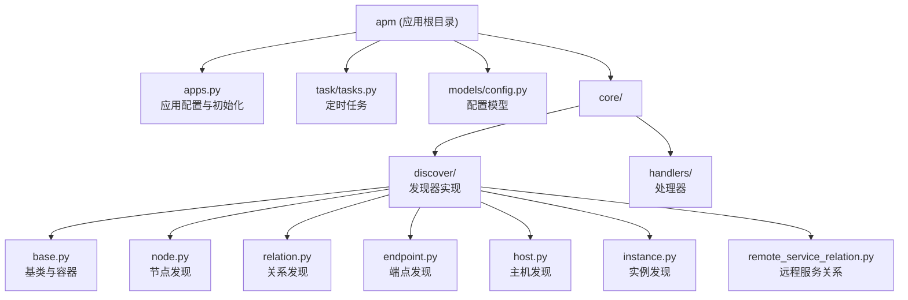
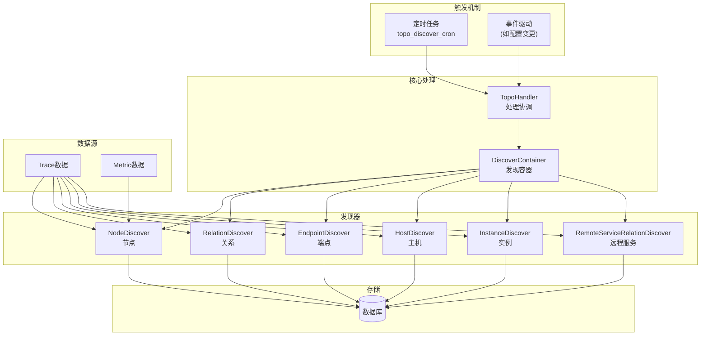
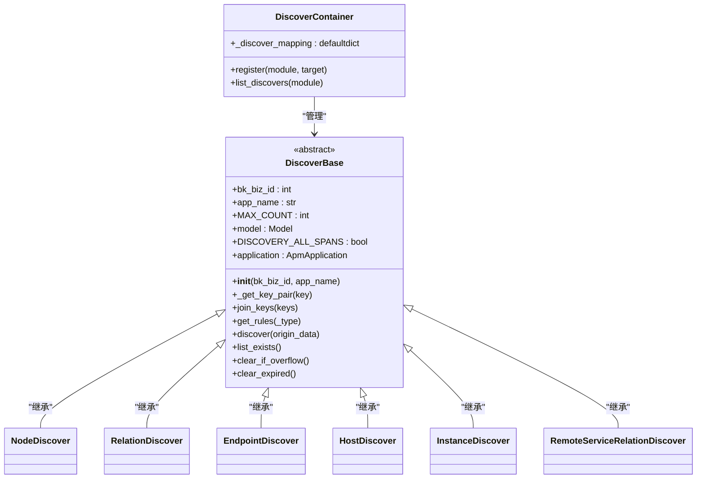
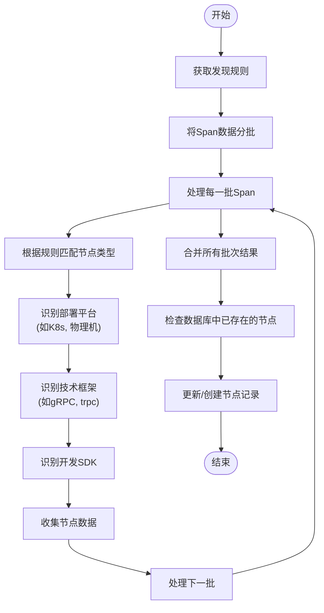
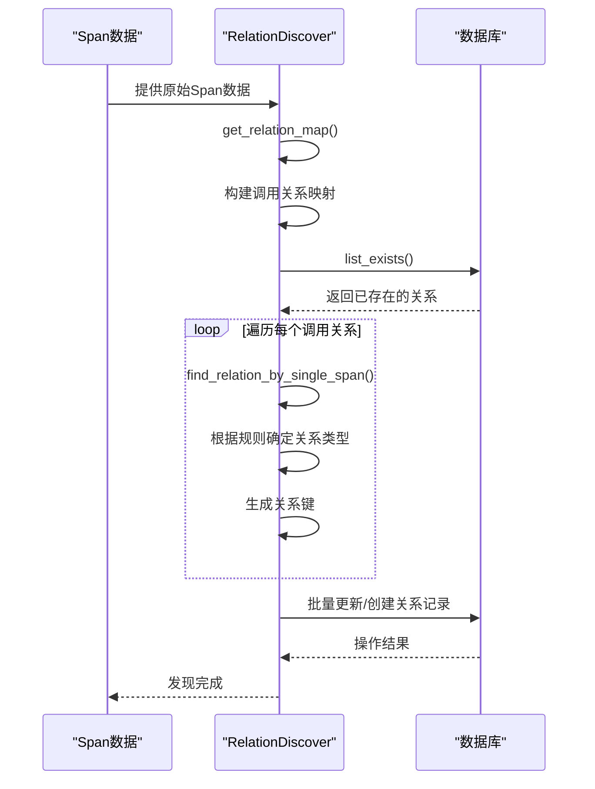
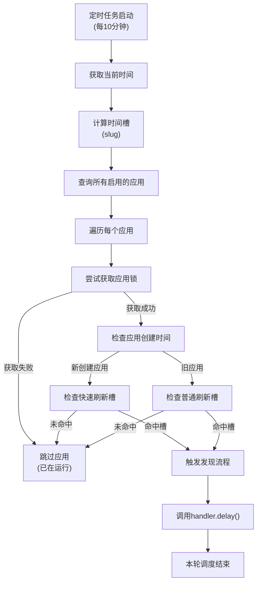
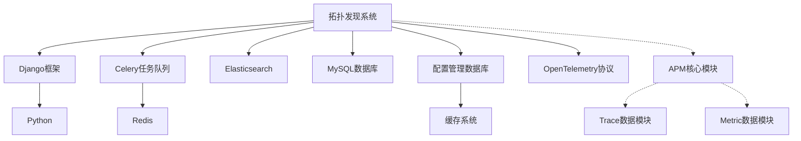

# 拓扑发现

<cite>
**本文档引用的文件**   
- [apps.py](file://bkmonitor/apm/apps.py)
- [tasks.py](file://bkmonitor/apm/task/tasks.py)
- [config.py](file://bkmonitor/apm/models/config.py)
- [discover_handler.py](file://bkmonitor/apm/core/handlers/discover_handler.py)
- [base.py](file://bkmonitor/apm/core/discover/base.py)
- [relation.py](file://bkmonitor/apm/core/discover/relation.py)
- [node.py](file://bkmonitor/apm/core/discover/node.py)
- [endpoint.py](file://bkmonitor/apm/core/discover/endpoint.py)
- [host.py](file://bkmonitor/apm/core/discover/host.py)
- [instance.py](file://bkmonitor/apm/core/discover/instance.py)
- [remote_service_relation.py](file://bkmonitor/apm/core/discover/remote_service_relation.py)
</cite>

## 目录
1. [简介](#简介)
2. [项目结构](#项目结构)
3. [核心组件](#核心组件)
4. [架构概述](#架构概述)
5. [详细组件分析](#详细组件分析)
6. [依赖分析](#依赖分析)
7. [性能考虑](#性能考虑)
8. [故障排除指南](#故障排除指南)
9. [结论](#结论)

## 简介
本文档详细阐述了蓝鲸监控平台中拓扑发现机制的技术实现。拓扑发现是应用性能监控（APM）系统的核心功能，通过自动识别应用节点及其依赖关系，为用户提供清晰的服务拓扑视图。该机制综合运用了服务注册中心、API调用链分析和配置文件解析等多种技术手段，实现了对复杂分布式系统的自动化拓扑构建。

## 项目结构
拓扑发现功能主要位于`bkmonitor/apm`目录下，其核心代码分布在`core/discover`子目录中。该功能通过Django应用的方式集成到主系统中，其初始化和配置管理遵循Django的应用生命周期。

**图源**
- [apps.py](file://bkmonitor/apm/apps.py)
- [tasks.py](file://bkmonitor/apm/task/tasks.py)
- [config.py](file://bkmonitor/apm/models/config.py)

**节源**
- [apps.py](file://bkmonitor/apm/apps.py)
- [tasks.py](file://bkmonitor/apm/task/tasks.py)
- [config.py](file://bkmonitor/apm/models/config.py)

## 核心组件
拓扑发现的核心由发现器（Discover）和发现容器（DiscoverContainer）构成。发现容器负责注册和管理所有发现器，而各个发现器则负责具体的发现逻辑。系统通过`apps.py`中的`ready`方法在应用启动时完成所有发现器的注册。

**节源**
- [apps.py](file://bkmonitor/apm/apps.py#L40-L65)
- [base.py](file://bkmonitor/apm/core/discover/base.py#L150-L170)

## 架构概述
拓扑发现系统采用模块化设计，其核心架构由发现容器、多种发现器和定时任务调度器组成。发现容器作为中央注册表，管理着针对不同数据类型（如Trace、Metric）和不同拓扑元素（如节点、关系、端点）的发现器。定时任务调度器则按照预设策略触发发现流程。

**图源**
- [apps.py](file://bkmonitor/apm/apps.py#L40-L65)
- [tasks.py](file://bkmonitor/apm/task/tasks.py#L50-L90)
- [base.py](file://bkmonitor/apm/core/discover/base.py#L150-L170)

## 详细组件分析
本节将深入分析拓扑发现系统中的各个关键组件，包括其工作原理、数据结构和交互流程。

### 发现容器与基类分析
`DiscoverContainer`是整个拓扑发现系统的核心管理组件，它使用一个`defaultdict`来注册和管理所有发现器。`DiscoverBase`是所有发现器的抽象基类，定义了通用的接口和方法。

**图源**
- [base.py](file://bkmonitor/apm/core/discover/base.py#L150-L199)

**节源**
- [base.py](file://bkmonitor/apm/core/discover/base.py#L150-L199)

### 节点发现器分析
`NodeDiscover`负责发现应用拓扑中的节点，如服务、数据库、消息队列等。它通过分析Trace数据中的Span，根据预定义的规则来识别节点类型和属性。

**图源**
- [node.py](file://bkmonitor/apm/core/discover/node.py#L0-L199)

**节源**
- [node.py](file://bkmonitor/apm/core/discover/node.py#L0-L199)

### 关系发现器分析
`RelationDiscover`负责发现服务间的依赖关系。它通过分析Span之间的父子关系和属性，来构建服务调用链。

**图源**
- [relation.py](file://bkmonitor/apm/core/discover/relation.py#L0-L199)

**节源**
- [relation.py](file://bkmonitor/apm/core/discover/relation.py#L0-L199)

### 定时任务与触发机制分析
拓扑发现的执行由Celery定时任务驱动，主要通过`topo_discover_cron`函数来调度。该机制实现了增量更新和性能优化。

**图源**
- [tasks.py](file://bkmonitor/apm/task/tasks.py#L50-L90)

**节源**
- [tasks.py](file://bkmonitor/apm/task/tasks.py#L50-L90)

## 依赖分析
拓扑发现系统依赖于多个内部和外部组件。内部依赖包括Django ORM、Celery任务队列和CMDB缓存。外部依赖则包括OpenTelemetry协议和各种数据库。

**图源**
- [apps.py](file://bkmonitor/apm/apps.py)
- [tasks.py](file://bkmonitor/apm/task/tasks.py)
- [base.py](file://bkmonitor/apm/core/discover/base.py)

**节源**
- [apps.py](file://bkmonitor/apm/apps.py)
- [tasks.py](file://bkmonitor/apm/task/tasks.py)

## 性能考虑
拓扑发现系统在设计时充分考虑了性能问题，采用了多种优化策略：
1. **增量更新**：通过`list_exists`方法只处理变化的数据，避免全量重建。
2. **批量处理**：使用`bulk_create`和`bulk_update`进行数据库操作，减少I/O开销。
3. **分批处理**：对于大量Span数据，使用`divide_biscuit`函数进行分批处理，防止内存溢出。
4. **缓存机制**：`EndpointDiscover`和`InstanceDiscover`使用Redis缓存来存储更新时间，避免频繁的数据库查询。
5. **锁机制**：使用`service_lock`防止同一应用的发现任务并发执行，保证数据一致性。

## 故障排除指南
在使用拓扑发现功能时，可能会遇到以下常见问题：
- **节点或关系未发现**：检查Trace数据是否上报，以及发现规则是否正确配置。
- **发现任务执行缓慢**：检查数据库性能，确认是否有大量Span数据需要处理。
- **数据不一致**：检查定时任务是否正常运行，以及应用锁是否被正确释放。
- **内存溢出**：对于超大规模应用，考虑调整`HANDLE_SPANS_BATCH_SIZE`参数。

**节源**
- [tasks.py](file://bkmonitor/apm/task/tasks.py#L80-L85)
- [node.py](file://bkmonitor/apm/core/discover/node.py#L100-L120)
- [endpoint.py](file://bkmonitor/apm/core/discover/endpoint.py#L100-L120)

## 结论
本文档详细解析了蓝鲸监控平台中拓扑发现机制的实现。该系统通过模块化的设计，将复杂的拓扑发现过程分解为多个独立的发现器，并通过统一的容器进行管理。其定时任务驱动的执行策略和多种性能优化手段，确保了系统在大规模环境下的稳定性和高效性。通过深入理解其架构和实现，用户可以更好地配置和优化拓扑发现过程，从而获得更准确、更及时的服务拓扑视图。