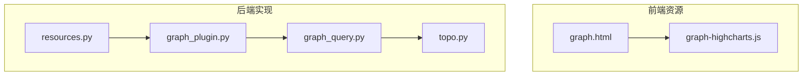
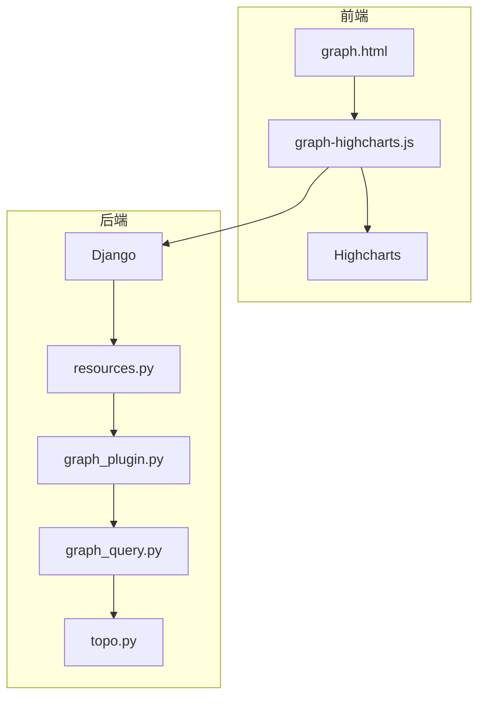
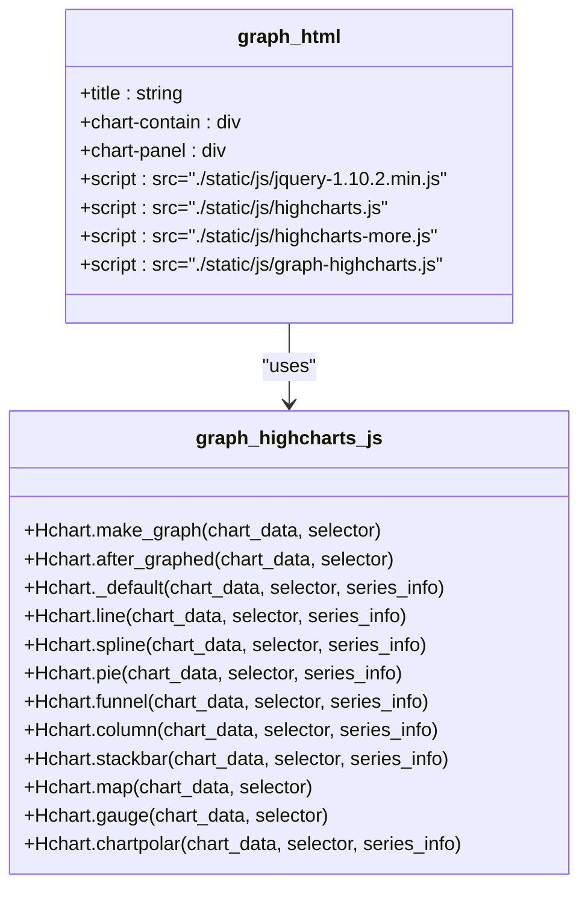
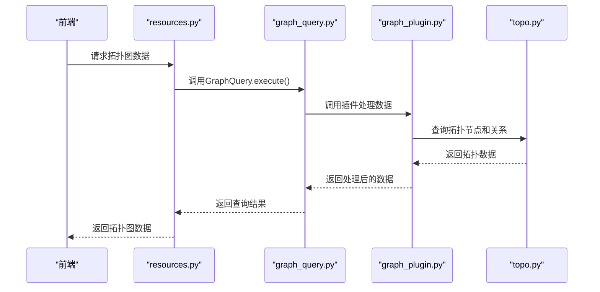
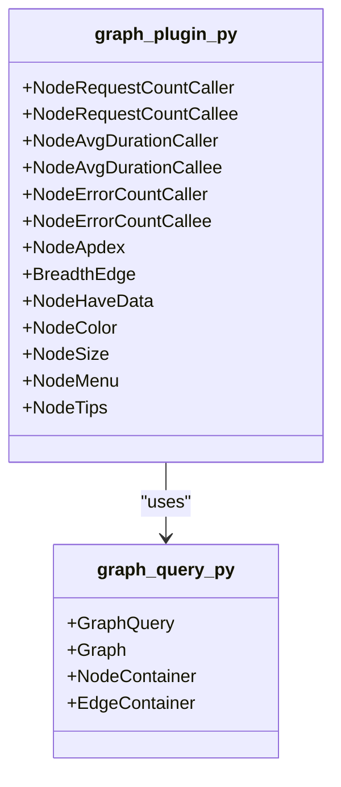
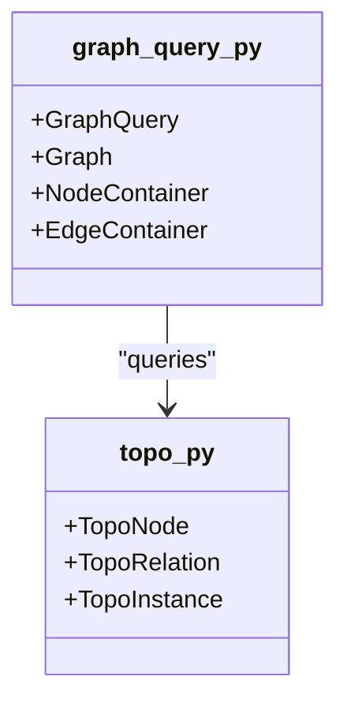
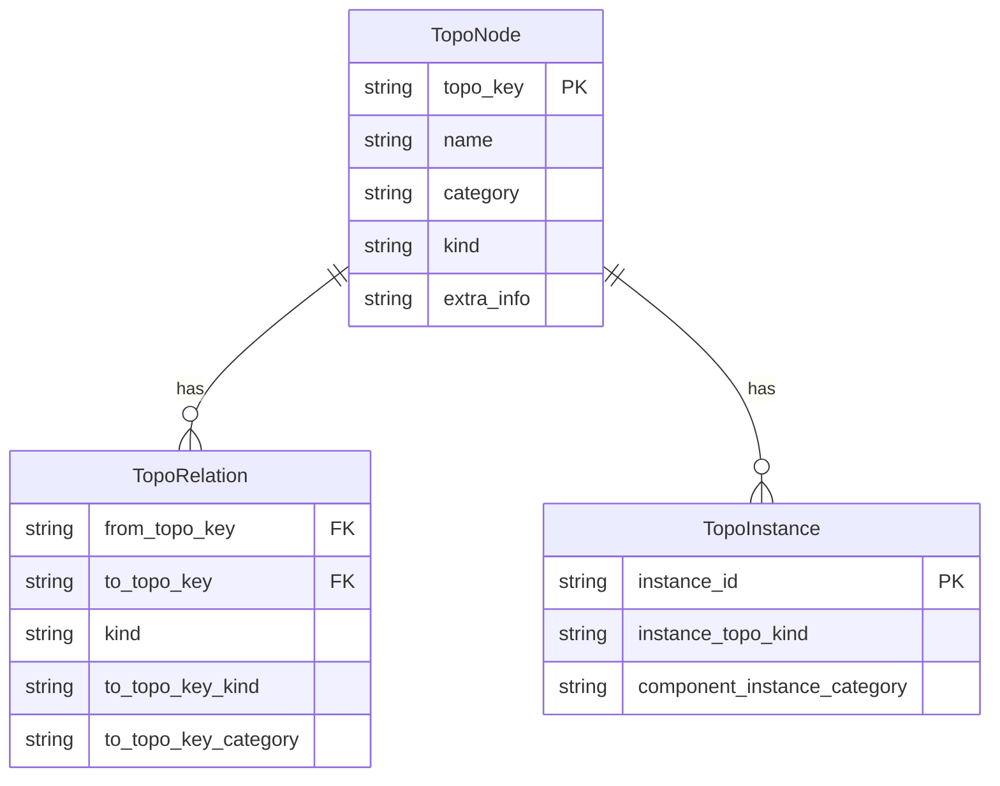
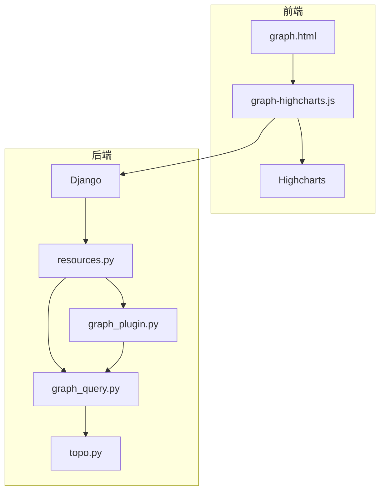

# 拓扑展示

<cite>
**本文档引用的文件**   
- [graph-highcharts.js](file://bkmonitor/alarm_backends/templates/image_exporter/static/js/graph-highcharts.js)
- [graph.html](file://bkmonitor/alarm_backends/templates/image_exporter/graph.html)
- [resources.py](file://bkmonitor/packages/apm_web/topo/resources.py)
- [graph_plugin.py](file://bkmonitor/packages/apm_web/topo/handle/graph_plugin.py)
- [graph_query.py](file://bkmonitor/packages/apm_web/topo/handle/graph_query.py)
- [topo.py](file://bkmonitor/apm/models/topo.py)
</cite>

## 目录
1. [项目结构](#项目结构)
2. [核心组件](#核心组件)
3. [架构概述](#架构概述)
4. [详细组件分析](#详细组件分析)
5. [依赖分析](#依赖分析)
6. [性能考虑](#性能考虑)
7. [故障排除指南](#故障排除指南)
8. [结论](#结论)

## 项目结构
项目结构显示了拓扑可视化功能主要分布在`bkmonitor`包下的`alarm_backends`和`packages`目录中。`alarm_backends`包含用于图像导出的前端资源，而`packages`目录则包含了APM（应用性能监控）相关的拓扑图功能实现。

**图源**
- [graph.html](file://bkmonitor/alarm_backends/templates/image_exporter/graph.html)
- [graph-highcharts.js](file://bkmonitor/alarm_backends/templates/image_exporter/static/js/graph-highcharts.js)
- [resources.py](file://bkmonitor/packages/apm_web/topo/resources.py)
- [graph_plugin.py](file://bkmonitor/packages/apm_web/topo/handle/graph_plugin.py)
- [graph_query.py](file://bkmonitor/packages/apm_web/topo/handle/graph_query.py)
- [topo.py](file://bkmonitor/apm/models/topo.py)

**节源**
- [graph.html](file://bkmonitor/alarm_backends/templates/image_exporter/graph.html)
- [graph-highcharts.js](file://bkmonitor/alarm_backends/templates/image_exporter/static/js/graph-highcharts.js)

## 核心组件
拓扑可视化功能的核心组件包括前端的`graph-highcharts.js`和`graph.html`，以及后端的`resources.py`、`graph_plugin.py`、`graph_query.py`和`topo.py`。这些组件共同实现了拓扑图的渲染、数据处理和交互功能。

**节源**
- [graph-highcharts.js](file://bkmonitor/alarm_backends/templates/image_exporter/static/js/graph-highcharts.js)
- [resources.py](file://bkmonitor/packages/apm_web/topo/resources.py)

## 架构概述
拓扑可视化功能的架构分为前端和后端两部分。前端负责展示和用户交互，使用Highcharts库进行图表渲染。后端负责数据查询和处理，通过Django框架提供API接口。

**图源**
- [graph.html](file://bkmonitor/alarm_backends/templates/image_exporter/graph.html)
- [graph-highcharts.js](file://bkmonitor/alarm_backends/templates/image_exporter/static/js/graph-highcharts.js)
- [resources.py](file://bkmonitor/packages/apm_web/topo/resources.py)
- [graph_plugin.py](file://bkmonitor/packages/apm_web/topo/handle/graph_plugin.py)
- [graph_query.py](file://bkmonitor/packages/apm_web/topo/handle/graph_query.py)
- [topo.py](file://bkmonitor/apm/models/topo.py)

## 详细组件分析
### 前端组件分析
前端组件主要由`graph.html`和`graph-highcharts.js`组成。`graph.html`定义了页面结构和样式，`graph-highcharts.js`则负责图表的渲染和交互。

#### graph.html
`graph.html`文件定义了拓扑图的HTML结构，包括标题、图表容器和必要的JavaScript库引用。它使用Highcharts库来渲染图表，并通过JavaScript函数`renderContext`来初始化图表。

**图源**
- [graph.html](file://bkmonitor/alarm_backends/templates/image_exporter/graph.html)
- [graph-highcharts.js](file://bkmonitor/alarm_backends/templates/image_exporter/static/js/graph-highcharts.js)

**节源**
- [graph.html](file://bkmonitor/alarm_backends/templates/image_exporter/graph.html)
- [graph-highcharts.js](file://bkmonitor/alarm_backends/templates/image_exporter/static/js/graph-highcharts.js)

### 后端组件分析
后端组件主要由`resources.py`、`graph_plugin.py`、`graph_query.py`和`topo.py`组成。这些组件共同实现了拓扑图的数据查询、处理和转换功能。

#### resources.py
`resources.py`文件定义了`TopoViewResource`类，该类负责处理前端请求并返回拓扑图数据。它通过调用`GraphQuery`类来查询数据，并使用`GraphQuery.create_converter`方法创建转换器。

**图源**
- [resources.py](file://bkmonitor/packages/apm_web/topo/resources.py)
- [graph_query.py](file://bkmonitor/packages/apm_web/topo/handle/graph_query.py)
- [graph_plugin.py](file://bkmonitor/packages/apm_web/topo/handle/graph_plugin.py)
- [topo.py](file://bkmonitor/apm/models/topo.py)

**节源**
- [resources.py](file://bkmonitor/packages/apm_web/topo/resources.py)

#### graph_plugin.py
`graph_plugin.py`文件定义了各种插件，用于处理拓扑图数据。这些插件包括节点和边的处理插件，以及数据转换插件。

**图源**
- [graph_plugin.py](file://bkmonitor/packages/apm_web/topo/handle/graph_plugin.py)
- [graph_query.py](file://bkmonitor/packages/apm_web/topo/handle/graph_query.py)

**节源**
- [graph_plugin.py](file://bkmonitor/packages/apm_web/topo/handle/graph_plugin.py)

#### graph_query.py
`graph_query.py`文件定义了`GraphQuery`类，该类负责查询拓扑图数据。它通过调用各种插件来处理数据，并返回处理后的结果。

**图源**
- [graph_query.py](file://bkmonitor/packages/apm_web/topo/handle/graph_query.py)
- [topo.py](file://bkmonitor/apm/models/topo.py)

**节源**
- [graph_query.py](file://bkmonitor/packages/apm_web/topo/handle/graph_query.py)

#### topo.py
`topo.py`文件定义了拓扑图的数据库模型，包括`TopoNode`、`TopoRelation`和`TopoInstance`。这些模型用于存储拓扑节点、关系和实例信息。

**图源**
- [topo.py](file://bkmonitor/apm/models/topo.py)

**节源**
- [topo.py](file://bkmonitor/apm/models/topo.py)

## 依赖分析
拓扑可视化功能的依赖关系如下图所示。前端依赖于Highcharts库进行图表渲染，后端依赖于Django框架提供API接口。`resources.py`依赖于`graph_plugin.py`和`graph_query.py`进行数据处理，`graph_query.py`依赖于`topo.py`进行数据查询。

**图源**
- [graph.html](file://bkmonitor/alarm_backends/templates/image_exporter/graph.html)
- [graph-highcharts.js](file://bkmonitor/alarm_backends/templates/image_exporter/static/js/graph-highcharts.js)
- [resources.py](file://bkmonitor/packages/apm_web/topo/resources.py)
- [graph_plugin.py](file://bkmonitor/packages/apm_web/topo/handle/graph_plugin.py)
- [graph_query.py](file://bkmonitor/packages/apm_web/topo/handle/graph_query.py)
- [topo.py](file://bkmonitor/apm/models/topo.py)

**节源**
- [graph.html](file://bkmonitor/alarm_backends/templates/image_exporter/graph.html)
- [graph-highcharts.js](file://bkmonitor/alarm_backends/templates/image_exporter/static/js/graph-highcharts.js)
- [resources.py](file://bkmonitor/packages/apm_web/topo/resources.py)
- [graph_plugin.py](file://bkmonitor/packages/apm_web/topo/handle/graph_plugin.py)
- [graph_query.py](file://bkmonitor/packages/apm_web/topo/handle/graph_query.py)
- [topo.py](file://bkmonitor/apm/models/topo.py)

## 性能考虑
拓扑可视化功能在性能方面需要考虑以下几点：
1. **数据查询优化**：通过索引和缓存机制优化数据库查询性能。
2. **前端渲染优化**：使用Highcharts的`cropThreshold`属性来优化大量数据的渲染性能。
3. **网络传输优化**：压缩数据传输，减少网络延迟。

## 故障排除指南
### 常见问题
1. **图表不显示**：检查`graph.html`中的JavaScript库引用是否正确。
2. **数据加载慢**：检查数据库查询性能，优化查询语句。
3. **交互功能失效**：检查`graph-highcharts.js`中的事件处理函数是否正确。

**节源**
- [graph.html](file://bkmonitor/alarm_backends/templates/image_exporter/graph.html)
- [graph-highcharts.js](file://bkmonitor/alarm_backends/templates/image_exporter/static/js/graph-highcharts.js)

## 结论
拓扑可视化功能通过前后端的紧密协作，实现了拓扑图的渲染和交互。前端使用Highcharts库进行图表渲染，后端通过Django框架提供API接口。通过优化数据查询和前端渲染，可以提高系统的性能和用户体验。