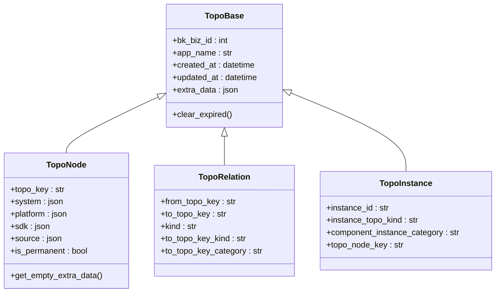
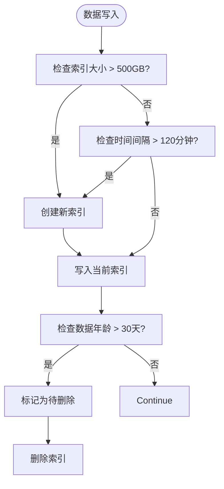

# 拓扑模型

<cite>
**本文档引用文件**  
- [topo.py](file://bkmonitor/apm/models/topo.py)
- [define.py](file://bkmonitor/api/cmdb/define.py)
- [resources.py](file://bkmonitor/apm/resources.py)
- [storage.py](file://bkmonitor/metadata/models/storage.py)
- [topo.md](file://bkmonitor/bkm_ipchooser/docs/apidocs/topo.md)
</cite>

## 目录
1. [引言](#引言)
2. [核心实体与属性定义](#核心实体与属性定义)
3. [层级关系与继承机制](#层级关系与继承机制)
4. [存储方式与索引策略](#存储方式与索引策略)
5. [模型版本管理与迁移机制](#模型版本管理与迁移机制)
6. [使用示例](#使用示例)
7. [常见问题与解决方案](#常见问题与解决方案)

## 引言

本文档旨在全面介绍蓝鲸监控平台中的拓扑数据模型。该模型是系统实现服务发现、依赖分析和告警关联的核心数据结构。文档将详细阐述拓扑模型中节点（Node）、边（Edge）、服务组（ServiceGroup）等核心实体的定义、它们之间的层级与继承关系、数据的存储与索引策略，以及相关的版本管理和使用方法，为开发者提供一份详尽的参考指南。

## 核心实体与属性定义

拓扑模型的核心由多个实体构成，这些实体定义了系统中各种资源的抽象表示。

### 节点（Node）

在 `apm/models/topo.py` 文件中，`TopoNode` 类是表示拓扑节点的核心实体。它继承自 `TopoBase`，并定义了以下关键属性：

- **topo_key**: 字符串类型，最大长度255，作为节点的唯一标识键，并建立了数据库索引以提高查询效率。
- **system**: JSONField类型，可为空，用于存储节点的系统类型信息。
- **platform**: JSONField类型，可为空，用于存储节点的部署平台信息。
- **sdk**: JSONField类型，可为空，用于存储上报数据的SDK信息。
- **source**: JSONField类型，存储服务的发现来源，例如 `["trace", "metric"]`。
- **is_permanent**: 布尔类型，默认为 `False`，标识该节点是否为永久保存。
- **extra_data**: JsonField类型，用于存储额外的、非结构化的数据，例如服务的分类（category）、类型（kind）等。

`TopoNode` 的基类 `TopoBase` 提供了所有拓扑实体共有的基础字段：
- **bk_biz_id**: 整数类型，表示业务ID。
- **app_name**: 字符串类型，最大长度128，表示应用名称。
- **created_at**: DateTime类型，自动记录创建时间，并建立索引。
- **updated_at**: DateTime类型，可为空，自动记录更新时间，并建立索引。
- **extra_data**: JsonField类型，用于存储额外数据。

**Section sources**
- [topo.py](file://bkmonitor/apm/models/topo.py#L0-L136)

### 边（Edge）

在拓扑模型中，边（Edge）用于表示节点之间的关系。在 `apm/models/topo.py` 文件中，`TopoRelation` 类定义了这种关系。

- **from_topo_key**: 字符串类型，最大长度255，表示关系的源节点key。
- **to_topo_key**: 字符串类型，最大长度255，表示关系的目标节点key。
- **kind**: 字符串类型，最大长度50，表示关系的类型，如 `"sync"` (同步) 或 `"async"` (异步)。
- **to_topo_key_kind**: 字符串类型，最大长度255，存储目标节点的类型。
- **to_topo_key_category**: 字符串类型，最大长度255，存储目标节点的分类。

此外，`KIND_MAPPING` 静态字典将OpenTelemetry的Span类型映射到拓扑关系类型，例如 `SpanKind.SPAN_KIND_CLIENT` 映射为 `"sync"`。

**Section sources**
- [topo.py](file://bkmonitor/apm/models/topo.py#L85-L117)

### 服务组（ServiceGroup）

虽然在提供的代码中没有直接名为 `ServiceGroup` 的类，但其概念通过 `ServiceInstance` 和 `ServiceCategoryNode` 等实体来体现。

- **ServiceInstance**: 在 `api/cmdb/define.py` 中定义，代表一个具体的服务实例。其关键属性包括 `service_instance_id` (服务实例ID), `name` (名称), `bk_host_id` (绑定的主机ID), `bk_module_id` (所属模块ID), `service_category_id` (所属服务分类ID) 和 `topo_link` (所属的拓扑链)。
- **ServiceCategoryNode**: 在 `api/cmdb/define.py` 中定义，代表服务分类的节点，用于组织和管理服务实例。其属性包括 `category_id` (分类ID), `category_name` (分类名称), `parent_id` (父节点ID) 和 `root_id` (根节点ID)。

**Section sources**
- [define.py](file://bkmonitor/api/cmdb/define.py#L0-L805)

## 层级关系与继承机制

拓扑模型通过继承和组合两种机制来构建复杂的层级结构。

### 继承机制

模型广泛使用了面向对象的继承。`TopoBase` 作为所有拓扑实体的抽象基类，通过 `abstract = True` 定义，确保它本身不会生成数据库表，但其所有子类（如 `TopoNode`, `TopoRelation`, `TopoInstance`）都会继承其 `bk_biz_id`, `app_name`, `created_at`, `updated_at` 等核心字段。这种设计保证了数据结构的一致性和可维护性。



**Diagram sources**
- [topo.py](file://bkmonitor/apm/models/topo.py#L0-L136)

### 层级关系

在CMDB的上下文中，拓扑的层级关系通过树形结构来表示。`api/cmdb/define.py` 文件中的 `TopoTree` 类是一个典型的树形结构实现。

- **TopoTree** 继承自 `TopoNode`，并包含一个 `child` 属性，该属性是一个 `TopoTree` 对象的列表，从而形成了父子节点的递归关系。
- 每个 `TopoTree` 节点还通过 `_parent` 属性持有对其父节点的引用，便于向上遍历。
- `convert_to_topo_link` 方法可以将这棵拓扑树转换为从叶子节点（如主机）到根节点（如业务）的拓扑链，这对于告警的根因分析至关重要。

```mermaid
graph TD
A[业务 (biz)] --> B[集群 (set)]
B --> C[模块 (module)]
C --> D[主机 (host)]
C --> E[服务实例 (service instance)]
```

**Diagram sources**
- [define.py](file://bkmonitor/api/cmdb/define.py#L317-L399)

## 存储方式与索引策略

拓扑数据的存储和索引策略是确保系统高性能查询的关键。

### 存储方式

拓扑数据主要存储在关系型数据库（如MySQL）中，以结构化的方式保存。`TopoNode`, `TopoRelation` 等实体都映射到数据库表。对于需要长期存储和全文检索的时序数据，系统使用Elasticsearch（ES）作为后端存储。

### 索引策略

1.  **数据库索引**:
    -   `TopoBase` 类通过 `index_together = ["bk_biz_id", "app_name"]` 定义了复合索引，这使得按业务和应用查询拓扑数据非常高效。
    -   `TopoNode` 的 `topo_key` 字段也建立了单独的数据库索引。

2.  **Elasticsearch索引策略**:
    在 `metadata/models/storage.py` 中，`ESStorage` 模型定义了ES索引的详细策略：
    - **retention**: 整数类型，默认30天，定义了索引数据的保留时间。
    - **date_format**: 字符串类型，默认为 `"%Y%m%d%H"`，定义了索引名称的时间格式，如 `table_id_2023101015`。
    - **slice_size**: 整数类型，默认500GB，当单个索引大小达到此阈值时，会创建新的索引。
    - **slice_gap**: 整数类型，默认120分钟，定义了按时间切分索引的时间间隔。
    - **warm_phase_days**: 整数类型，默认0，定义了数据从热节点（hot）迁移到暖节点（warm）的等待天数，用于冷热数据分离，优化存储成本。



**Diagram sources**
- [topo.py](file://bkmonitor/apm/models/topo.py#L0-L136)
- [storage.py](file://bkmonitor/metadata/models/storage.py#L1900-L2099)

## 模型版本管理与迁移机制

拓扑模型的版本管理主要通过数据库迁移（Database Migration）来实现。Django框架的 `migrations` 系统会跟踪模型定义（`models.py`）的变更，并生成相应的SQL脚本，以安全地更新生产环境的数据库结构。

- 当需要为 `TopoNode` 添加新字段时，开发者会修改 `topo.py` 文件，然后运行 `makemigrations` 命令生成迁移文件。
- 该迁移文件会被提交到代码仓库，并在部署时通过 `migrate` 命令应用到数据库，从而完成模型的版本升级。
- 对于 `extra_data` 这样的JSON字段，由于其灵活性，可以在不修改数据库结构的情况下动态添加新属性，这也是一种轻量级的“版本管理”方式。

**Section sources**
- [topo.py](file://bkmonitor/apm/models/topo.py#L0-L136)

## 使用示例

以下是一个通过API查询拓扑实例的简化示例：

```python
# 假设有一个资源类用于查询拓扑实例
class QueryTopoInstanceResource(Resource):
    def perform_request(self, validated_request_data):
        # 构建过滤参数
        filter_params = {
            "bk_biz_id": validated_request_data["bk_biz_id"],
            "app_name": validated_request_data["app_name"],
        }
        
        # 如果指定了服务名，则添加过滤条件
        if validated_request_data.get("service_name"):
            filter_params["topo_node_key__in"] = validated_request_data["service_name"]
        
        # 执行数据库查询
        queryset = TopoInstance.objects.filter(**filter_params)
        
        # 处理分页和排序
        page = validated_request_data.get("page", 1)
        page_size = validated_request_data.get("page_size", 10)
        sort_field = validated_request_data.get("sort")
        if sort_field:
            queryset = queryset.order_by(sort_field)
        
        # 分页
        paginator = Paginator(queryset, page_size)
        page_data = paginator.get_page(page)
        
        # 序列化并返回
        serializer = TopoInstanceSerializer(page_data, many=True)
        return {"total": paginator.count, "data": serializer.data}
```

**Section sources**
- [resources.py](file://bkmonitor/apm/resources.py#L700-L900)

## 常见问题与解决方案

### 问题1: 查询拓扑数据时性能缓慢

**原因**: 可能是由于缺少合适的索引或查询条件过于宽泛。

**解决方案**:
1.  确保查询条件中包含 `bk_biz_id` 和 `app_name`，以利用复合索引。
2.  检查 `TopoInstance` 或 `TopoNode` 的查询是否使用了 `topo_key` 等已建立索引的字段。
3.  避免在 `extra_data` 字段上进行复杂的JSON查询，这通常效率较低。

### 问题2: `updated_at` 字段未正确更新

**原因**: 在 `resources.py` 中，当请求的 `fields` 包含 `updated_at` 时，系统会从缓存中读取最新的时间戳，否则直接返回数据库中的值。

**解决方案**:
1.  确保在需要精确 `updated_at` 的查询中，将 `updated_at` 包含在请求的 `fields` 参数中。
2.  检查 `ApmCacheHandler` 的缓存是否正常工作。

### 问题3: 如何获取主机的完整拓扑路径？

**解决方案**: 可以利用 `TopoTree` 的 `convert_to_topo_link` 方法。该方法会返回一个字典，其中键是叶子节点（如主机）的ID，值是从该节点到根节点的完整拓扑链列表。

```python
# 伪代码示例
topo_tree = get_topo_tree(bk_biz_id=2)
topo_link_dict = topo_tree.convert_to_topo_link()
host_link = topo_link_dict.get("host|100")
# host_link 将是一个列表: [HostNode, ModuleNode, SetNode, BusinessNode]
```

**Section sources**
- [resources.py](file://bkmonitor/apm/resources.py#L799-L829)
- [define.py](file://bkmonitor/api/cmdb/define.py#L317-L399)