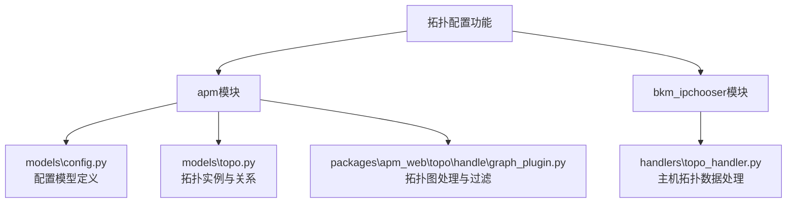
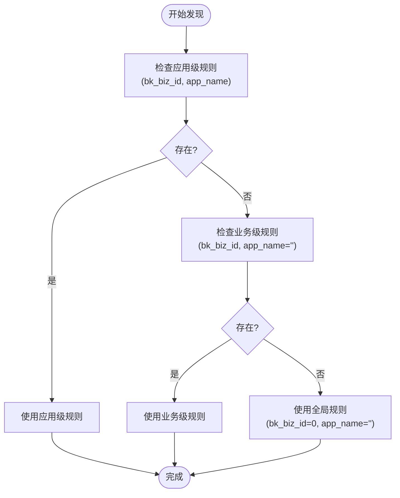
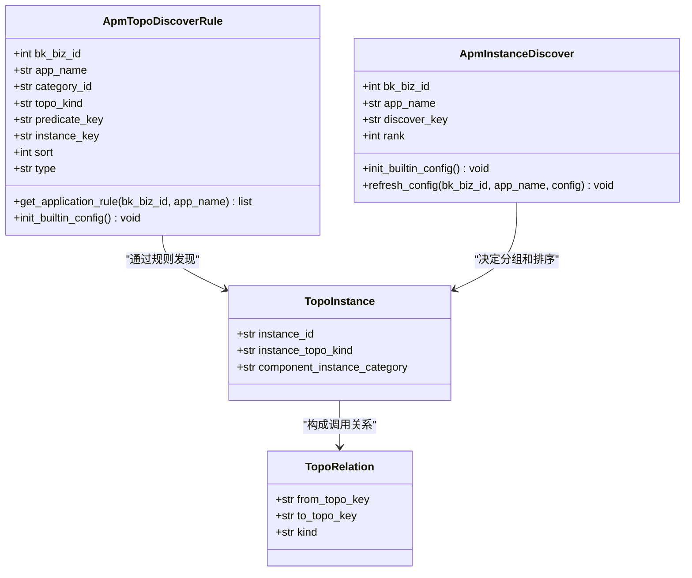

# 拓扑配置

<cite>
**本文档引用的文件**  
- [bkmonitor\apm\models\config.py](file://bkmonitor/apm/models/config.py)
- [bkmonitor\packages\apm_web\topo\handle\graph_plugin.py](file://bkmonitor/packages/apm_web/topo/handle/graph_plugin.py)
- [bkmonitor\apm\models\topo.py](file://bkmonitor/apm/models/topo.py)
- [bkmonitor\bkm_ipchooser\handlers\topo_handler.py](file://bkmonitor/bkm_ipchooser/handlers/topo_handler.py)
</cite>

## 目录
1. [引言](#引言)  
2. [项目结构分析](#项目结构分析)  
3. [核心组件分析](#核心组件分析)  
4. [拓扑发现配置](#拓扑发现配置)  
5. [拓扑分组与标签配置](#拓扑分组与标签配置)  
6. [拓扑过滤规则与显示策略](#拓扑过滤规则与显示策略)  
7. [配置继承机制与优先级规则](#配置继承机制与优先级规则)  
8. [最佳实践与常见问题](#最佳实践与常见问题)  
9. [结论](#结论)

## 引言

本文档旨在全面介绍蓝鲸监控平台中“拓扑配置”功能的实现机制与使用方法。拓扑配置是实现应用服务可视化、监控与管理的核心模块，支持自动发现服务实例、构建调用关系图、自定义分组与标签、设置过滤规则及显示策略。本文将深入解析其配置参数、作用范围、继承机制与优先级规则，并提供最佳实践建议，帮助用户根据实际业务需求定制化拓扑视图。

## 项目结构分析

拓扑配置功能主要分布在 `bkmonitor` 项目的 `apm`（应用性能管理）和 `bkm_ipchooser`（IP选择器）模块中。`apm` 模块负责应用级拓扑的发现、建模与展示，而 `bkm_ipchooser` 模块则提供底层的主机与节点拓扑数据支持。



**图示来源**  
- [bkmonitor\apm\models\config.py](file://bkmonitor/apm/models/config.py)
- [bkmonitor\apm\models\topo.py](file://bkmonitor/apm/models/topo.py)
- [bkmonitor\packages\apm_web\topo\handle\graph_plugin.py](file://bkmonitor/packages/apm_web/topo/handle/graph_plugin.py)
- [bkmonitor\bkm_ipchooser\handlers\topo_handler.py](file://bkmonitor/bkm_ipchooser/handlers/topo_handler.py)

## 核心组件分析

拓扑配置的核心由四个部分构成：**配置模型**、**拓扑实例**、**拓扑处理器**和**拓扑过滤器**。

### 配置模型 (ApmTopoDiscoverRule)

`ApmTopoDiscoverRule` 模型定义了如何从遥测数据（如OpenTelemetry）中发现和分类拓扑节点。其核心字段包括：

- **category_id**: 节点分类，如 `http`、`rpc`、`db`、`messaging` 等。
- **topo_kind**: 拓扑类型，分为 `service`（服务）和 `component`（组件）。
- **predicate_key**: 判断字段，用于匹配特定类型的Span。例如，`http.method` 用于识别HTTP服务。
- **instance_key**: 实例字段，用于唯一标识一个服务实例。例如，`service.name`。
- **endpoint_key**: 接口字段，用于标识服务内的具体接口，通常为 `span.name`。
- **sort**: 排序值，用于解决规则冲突时的优先级。

该模型支持按业务（`bk_biz_id`）和应用（`app_name`）进行配置，实现了配置的继承与覆盖。

**节段来源**  
- [bkmonitor\apm\models\config.py](file://bkmonitor/apm/models/config.py#L100-L200)

### 拓扑实例 (TopoInstance)

`TopoInstance` 模型存储了实际发现的拓扑节点实例。每个实例代表一个具体的服务或组件，其关键属性包括：

- **instance_id**: 实例的唯一标识符。
- **instance_topo_kind**: 实例的拓扑类型（服务或组件）。
- **component_instance_category**: 组件实例的分类（如数据库、消息队列）。

该模型与 `ApmTopoDiscoverRule` 关联，通过规则的匹配结果来创建和更新实例。

**节段来源**  
- [bkmonitor\apm\models\topo.py](file://bkmonitor/apm/models/topo.py#L85-L117)

### 拓扑处理器 (TopoHandler)

`bkm_ipchooser` 模块中的 `TopoHandler` 负责处理主机和节点级别的拓扑数据。它提供了查询主机、服务实例及其统计信息的接口，为上层应用拓扑提供了基础数据支持。

```python
# 示例：查询服务实例详情
class IpChooserServiceInstanceViewSet(CommonViewSet):
    @list_route(methods=["POST"], serializer_class=topo_sers.QueryServiceInstancesRequestSer)
    def details(self, request, *args, **kwargs):
        return Response(
            topo_handler.TopoHandler.query_service_instance(
                scope_list=self.validated_data["scope_list"],
                ...
            )
        )
```

**节段来源**  
- [bkmonitor\bkm_ipchooser\views.py](file://bkmonitor/bkm_ipchooser/views.py#L189-L219)

## 拓扑发现配置

拓扑发现的配置通过 `ApmTopoDiscoverRule` 模型进行管理。系统内置了一套通用规则（`COMMON_RULE`），并允许用户进行业务或应用级别的覆盖。

### 配置参数与作用范围

| 配置参数 | 说明 | 作用范围 |
| :--- | :--- | :--- |
| `bk_biz_id` | 业务ID | 全局（0）或指定业务 |
| `app_name` | 应用名称 | 全局（空字符串）或指定应用 |
| `category_id` | 节点分类 | 决定节点在拓扑图中的显示类别 |
| `topo_kind` | 拓扑类型 | 区分服务节点和组件节点 |
| `predicate_key` | 判断字段 | 用于匹配Span数据，决定是否应用此规则 |
| `instance_key` | 实例字段 | 用于聚合相同实例的Span数据 |
| `sort` | 排序 | 决定规则匹配的优先级，值越小优先级越高 |

**作用范围说明**：  
配置遵循“具体覆盖通用”的原则。系统会优先查找与当前业务和应用完全匹配的规则，若未找到，则回退到全局配置（`bk_biz_id=0` 且 `app_name=""`）。



**图示来源**  
- [bkmonitor\apm\models\config.py](file://bkmonitor/apm/models/config.py#L250-L270)

## 拓扑分组与标签配置

拓扑分组和标签功能主要通过 `ApmInstanceDiscover` 模型实现。该模型定义了如何从遥测数据中提取用于分组和排序的维度。

- **discover_key**: 指定用于分组的字段，如 `service.name`、`telemetry.sdk.language` 等。
- **rank**: 排序权重，值越小，在分组列表中越靠前。

用户可以通过配置 `discover_key` 的顺序来定制拓扑视图的分组逻辑。例如，将 `telemetry.sdk.language` 的 `rank` 设为0，可以实现按编程语言对服务进行分组。

**节段来源**  
- [bkmonitor\apm\models\config.py](file://bkmonitor/apm/models/config.py#L300-L320)

## 拓扑过滤规则与显示策略

拓扑图的过滤和显示由 `graph_plugin.py` 中的 `FilterChain` 和一系列 `Filter` 实现。

### 过滤规则

`FilterChain` 是一个过滤器链，按顺序执行多个过滤器。当前实现的过滤器包括：

- **GraphToListFilter**: 将图结构数据转换为节点和边的列表。
- **VirtualServiceFilter**: 过滤掉类型为 `VIRTUAL_SERVICE` 的虚拟服务节点。
- **ServiceNameFilter**: 根据指定的服务名称进行过滤，只保留与该服务相关的节点和边。

```python
# 过滤器链的创建
@classmethod
def new(cls, filter_params):
    c = cls()
    c.add(GraphToListFilter(filter_params))
    c.add(VirtualServiceFilter(filter_params))
    c.add(ServiceNameFilter(filter_params))
    return c
```

### 显示策略

显示策略主要通过 `TableViewConverter` 和 `PluginProvider` 实现。它们负责将过滤后的拓扑数据转换为前端可渲染的表格或图表格式，并可以注入额外的性能指标（如调用次数、错误率、平均耗时等）。

**节段来源**  
- [bkmonitor\packages\apm_web\topo\handle\graph_plugin.py](file://bkmonitor/packages/apm_web/topo/handle/graph_plugin.py#L1900-L2031)

## 配置继承机制与优先级规则

拓扑配置的继承机制遵循“业务 > 应用 > 全局”的层级结构。

1.  **优先级**：应用级配置 > 业务级配置 > 全局配置。
2.  **继承**：当某个应用没有定义特定配置时，系统会自动继承其所属业务的配置；如果业务也没有定义，则继承全局配置。
3.  **覆盖**：更具体的配置会完全覆盖更通用的配置，而不是进行合并。

例如，如果全局规则将 `rpc` 服务的 `instance_key` 定义为 `service.name`，但某业务希望使用 `rpc.service` 作为实例标识，则该业务可以创建一条 `bk_biz_id` 为该业务ID、`app_name` 为空的规则来覆盖全局设置。



**图示来源**  
- [bkmonitor\apm\models\config.py](file://bkmonitor/apm/models/config.py)
- [bkmonitor\apm\models\topo.py](file://bkmonitor/apm/models/topo.py)

## 最佳实践与常见问题

### 最佳实践

1.  **合理使用全局配置**：将通用的、适用于所有业务的规则（如标准的HTTP、RPC发现规则）配置在全局级别。
2.  **业务级定制**：对于有特殊需求的业务，创建业务级配置进行覆盖，避免影响其他业务。
3.  **应用级微调**：对于特定应用的特殊需求（如自定义服务名），使用应用级配置进行精确控制。
4.  **谨慎修改排序**：`sort` 字段直接影响规则匹配的优先级，修改时需确保不会导致预期外的规则被跳过。

### 常见问题

- **问题**：新部署的服务未出现在拓扑图中。  
  **解决方案**：检查 `ApmTopoDiscoverRule` 中是否有匹配该服务类型（如`trpc`）的规则，以及 `instance_key` 是否能正确提取服务实例。

- **问题**：拓扑图过于复杂，难以阅读。  
  **解决方案**：使用 `ServiceNameFilter` 进行服务过滤，或通过 `VirtualServiceFilter` 隐藏虚拟节点，也可以调整 `ApmInstanceDiscover` 的 `rank` 来优化分组。

- **问题**：业务配置未生效。  
  **解决方案**：检查配置的 `bk_biz_id` 是否正确，以及是否存在更高级别的应用配置覆盖了业务配置。

## 结论

本文档详细阐述了蓝鲸监控平台中拓扑配置功能的实现原理和使用方法。通过理解 `ApmTopoDiscoverRule` 等核心模型、掌握配置的继承与优先级规则，并灵活运用过滤与显示策略，用户可以有效地管理和定制应用拓扑视图，从而更直观地监控和分析系统架构与性能。