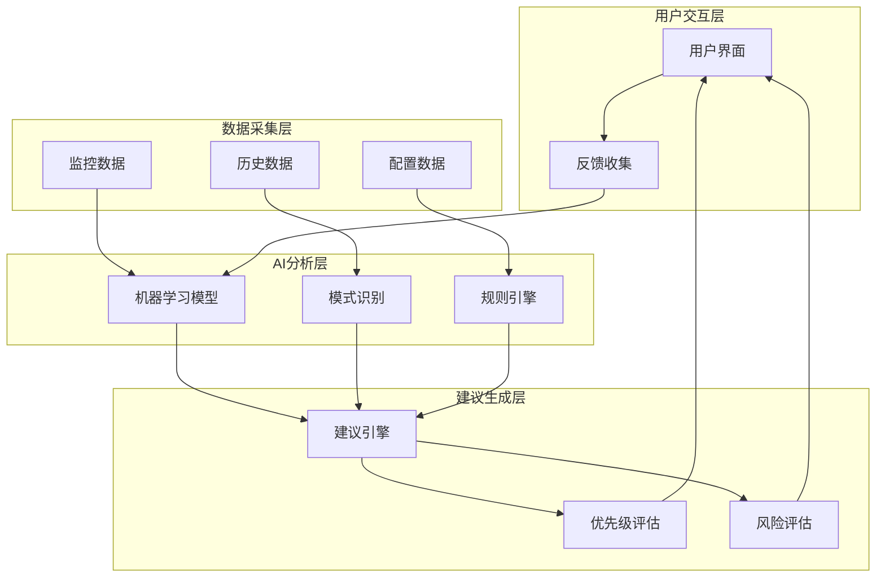
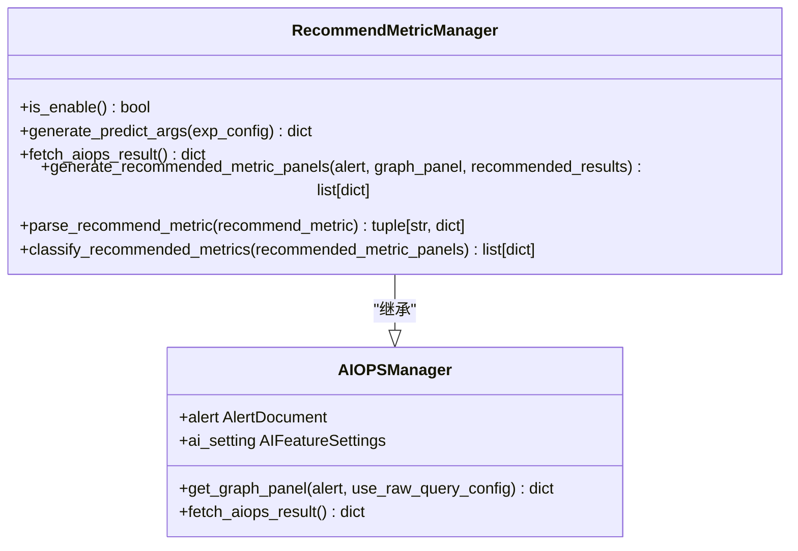
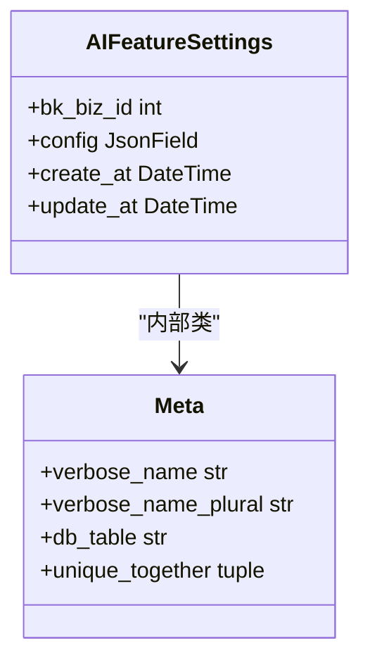
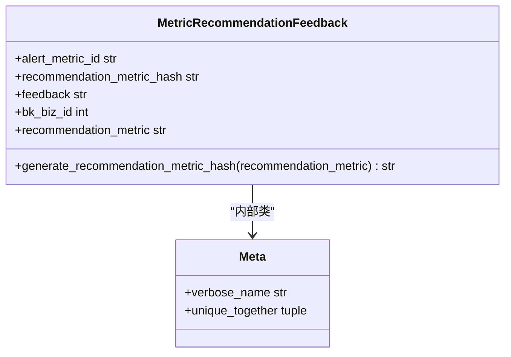

# 优化建议

<cite>
**本文档引用的文件**   
- [utils.py](file://bkmonitor\bkmonitor\aiops\alert\utils.py)
- [aiops.py](file://bkmonitor\bkmonitor\models\aiops.py)
- [aiops.py](file://bkmonitor\constants\aiops.py)
- [alert.py](file://bkmonitor\packages\fta_web\models\alert.py)
- [metric_recommendation.py](file://bkmonitor\packages\fta_web\alert\resources.py)
</cite>

## 目录
1. [简介](#简介)
2. [核心组件](#核心组件)
3. [架构概览](#架构概览)
4. [详细组件分析](#详细组件分析)
5. [依赖分析](#依赖分析)
6. [性能考量](#性能考量)
7. [故障排除指南](#故障排除指南)
8. [结论](#结论)

## 简介
本文档全面介绍APM平台提供的自动化性能优化建议功能。该功能基于AIOPS技术，通过分析系统监控数据，自动生成性能优化建议，帮助运维人员快速定位和解决性能问题。文档详细说明了建议生成逻辑、建议内容、优先级评估、风险评估以及建议采纳和验证流程。

## 核心组件
性能优化建议功能的核心组件包括AI功能配置、指标推荐管理器、指标推荐反馈等。这些组件协同工作，实现从数据采集、分析到建议生成和反馈收集的完整闭环。

**Section sources**
- [aiops.py](file://bkmonitor\bkmonitor\models\aiops.py#L17-L30)
- [aiops.py](file://bkmonitor\constants\aiops.py#L26)
- [alert.py](file://bkmonitor\packages\fta_web\models\alert.py#L177-L206)

## 架构概览
性能优化建议功能的架构主要包括数据采集层、AI分析层、建议生成层和用户交互层。数据采集层负责收集系统监控数据；AI分析层利用机器学习算法分析数据，识别异常和潜在问题；建议生成层根据分析结果生成具体的优化建议；用户交互层提供界面供用户查看建议、提供反馈。



**Diagram sources **
- [utils.py](file://bkmonitor\bkmonitor\aiops\alert\utils.py#L921-L1203)
- [aiops.py](file://bkmonitor\bkmonitor\models\aiops.py#L17-L30)

## 详细组件分析

### 指标推荐管理器分析
指标推荐管理器是性能优化建议功能的核心，负责根据告警信息生成推荐指标。

#### 类图


**Diagram sources **
- [utils.py](file://bkmonitor\bkmonitor\aiops\alert\utils.py#L921-L1203)

#### 方法分析
- **is_enable**: 检查当前业务是否启用了指标推荐功能。
- **generate_predict_args**: 基于告警信息构建AI服务的预测参数。
- **fetch_aiops_result**: 调用AI服务获取推荐结果。
- **generate_recommended_metric_panels**: 生成推荐指标的图表配置。
- **parse_recommend_metric**: 解析推荐的指标及其维度信息。
- **classify_recommended_metrics**: 对推荐指标进行分类。

**Section sources**
- [utils.py](file://bkmonitor\bkmonitor\aiops\alert\utils.py#L921-L1203)

### AI功能配置分析
AI功能配置类用于存储和管理AI功能的配置信息。

#### 类图


**Diagram sources **
- [aiops.py](file://bkmonitor\bkmonitor\models\aiops.py#L17-L30)

#### 字段说明
- **bk_biz_id**: 业务ID，用于标识配置所属的业务。
- **config**: 配置信息，以JSON格式存储。
- **create_at**: 创建时间。
- **update_at**: 更新时间。

**Section sources**
- [aiops.py](file://bkmonitor\bkmonitor\models\aiops.py#L17-L30)

### 指标推荐反馈分析
指标推荐反馈类用于收集用户对推荐指标的反馈。

#### 类图


**Diagram sources **
- [alert.py](file://bkmonitor\packages\fta_web\models\alert.py#L177-L206)

#### 字段说明
- **alert_metric_id**: 告警指标ID。
- **recommendation_metric_hash**: 推荐指标哈希值。
- **feedback**: 用户反馈，可选值为"点赞"或"点踩"。
- **bk_biz_id**: 业务ID。
- **recommendation_metric**: 推荐指标文本。

**Section sources**
- [alert.py](file://bkmonitor\packages\fta_web\models\alert.py#L177-L206)

## 依赖分析
性能优化建议功能依赖于多个组件和外部服务。

```mermaid
graph TD
RecommendMetricManager --> AIOPSManager : "继承"
RecommendMetricManager --> api.bkdata.api_serving_execute : "调用"
RecommendMetricManager --> MetricListCache : "查询"
AIFeatureSettings --> JsonField : "使用"
MetricRecommendationFeedback --> AbstractRecordModel : "继承"
MetricRecommendationFeedback --> _("点赞") : "使用"
MetricRecommendationFeedback --> _("点踩") : "使用"
```

**Diagram sources **
- [utils.py](file://bkmonitor\bkmonitor\aiops\alert\utils.py#L921-L1203)
- [aiops.py](file://bkmonitor\bkmonitor\models\aiops.py#L17-L30)
- [alert.py](file://bkmonitor\packages\fta_web\models\alert.py#L177-L206)

## 性能考量
性能优化建议功能在设计时考虑了多个性能因素：
1. 使用哈希值存储推荐指标，提高查询效率。
2. 批量查询指标数据，减少数据库访问次数。
3. 使用缓存机制，避免重复计算。
4. 异步处理反馈信息，不影响主流程性能。

## 故障排除指南
当性能优化建议功能出现问题时，可以按照以下步骤进行排查：
1. 检查AI功能是否已启用。
2. 检查AI服务是否正常运行。
3. 检查数据库连接是否正常。
4. 查看日志文件，定位具体错误信息。

**Section sources**
- [utils.py](file://bkmonitor\bkmonitor\aiops\alert\utils.py#L921-L1203)
- [aiops.py](file://bkmonitor\bkmonitor\models\aiops.py#L17-L30)

## 结论
APM平台的性能优化建议功能通过结合AI技术与系统监控数据，为运维人员提供了智能化的性能优化支持。该功能不仅能够自动识别潜在性能问题，还能提供具体的优化建议，并通过用户反馈不断优化推荐算法，形成一个持续改进的闭环系统。