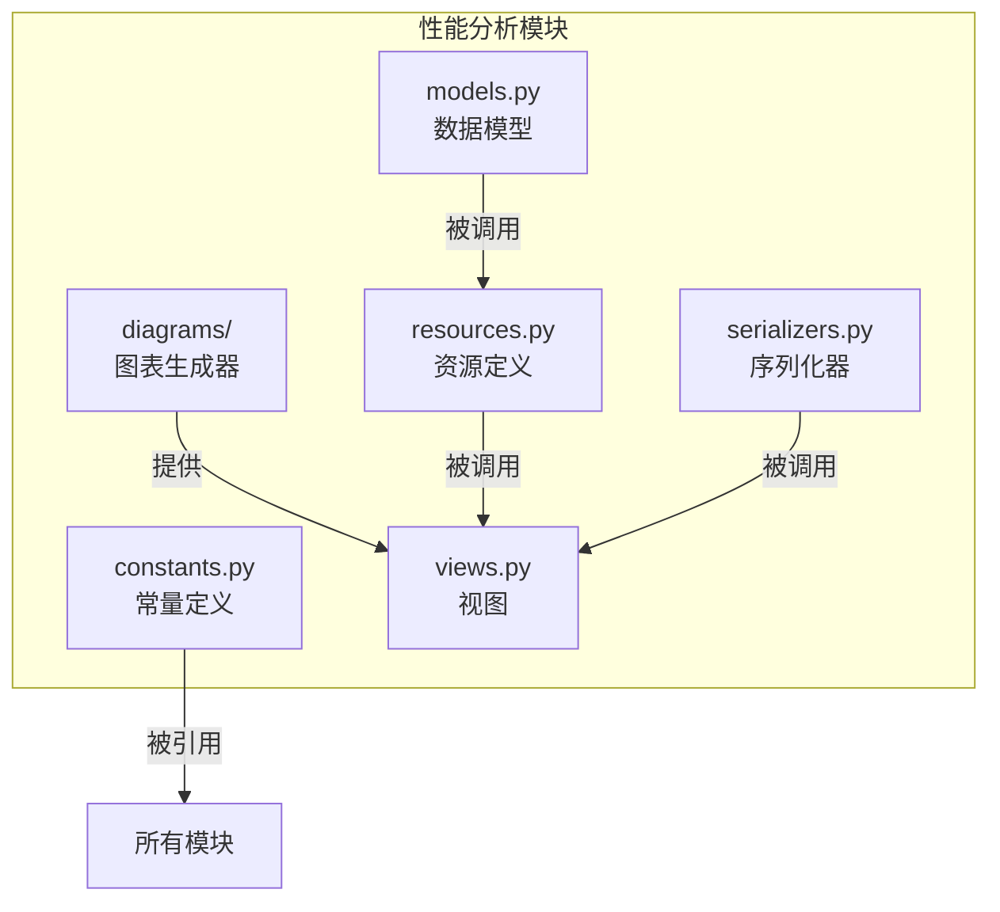
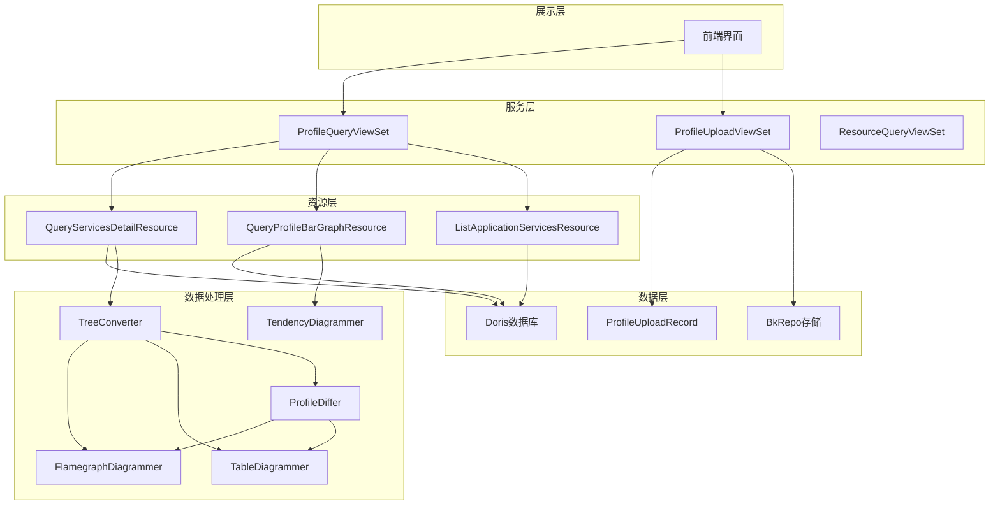
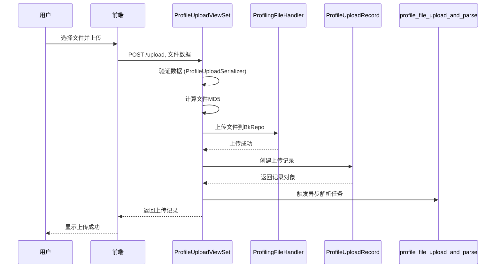
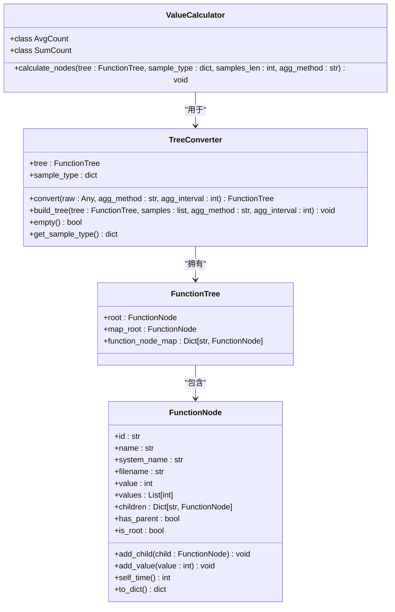
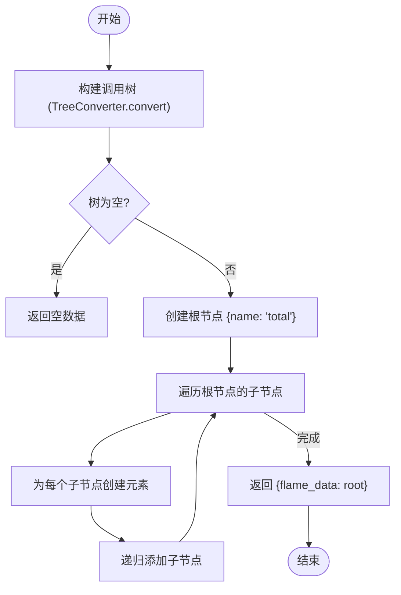
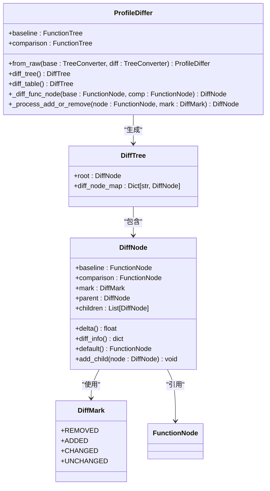

# 性能分析

<cite>
**本文档引用的文件**  
- [constants.py](file://bkmonitor/packages/apm_web/profile/constants.py)
- [views.py](file://bkmonitor/packages/apm_web/profile/views.py)
- [resources.py](file://bkmonitor/packages/apm_web/profile/resources.py)
- [serializers.py](file://bkmonitor/packages/apm_web/profile/serializers.py)
- [diff.py](file://bkmonitor/packages/apm_web/profile/diagrams/diff.py)
- [tendency.py](file://bkmonitor/packages/apm_web/profile/diagrams/tendency.py)
- [table.py](file://bkmonitor/packages/apm_web/profile/diagrams/table.py)
- [models.py](file://bkmonitor/packages/apm_web/profile/models.py)
- [flamegraph.py](file://bkmonitor/packages/apm_web/profile/diagrams/flamegraph.py)
- [tree_converter.py](file://bkmonitor/packages/apm_web/profile/diagrams/tree_converter.py)
- [base.py](file://bkmonitor/packages/apm_web/profile/diagrams/base.py)
- [ebpf_converter.py](file://bkmonitor/packages/apm_web/profile/diagrams/ebpf_converter.py)
</cite>

## 目录
1. [简介](#简介)
2. [项目结构](#项目结构)
3. [核心组件](#核心组件)
4. [架构概览](#架构概览)
5. [详细组件分析](#详细组件分析)
6. [依赖分析](#依赖分析)
7. [性能考虑](#性能考虑)
8. [故障排除指南](#故障排除指南)
9. [结论](#结论)

## 简介
本文档全面介绍蓝鲸监控平台（BlueKing - Monitor）中性能分析（Performance Profiling）功能的设计与实现。性能分析功能允许用户上传、查询、可视化和对比性能数据，支持多种数据格式（如pprof、perf_script、jfr等），并提供火焰图、调用树、趋势图、表格等多种分析视图。文档详细阐述了性能分析的工作流程、核心算法、数据结构和API接口，旨在帮助开发者和用户深入理解该功能的内部机制和使用方法。

## 项目结构
性能分析功能主要位于`bkmonitor/packages/apm_web/profile/`目录下，采用模块化设计，各模块职责清晰。



**图示来源**
- [constants.py](file://bkmonitor/packages/apm_web/profile/constants.py)
- [views.py](file://bkmonitor/packages/apm_web/profile/views.py)
- [resources.py](file://bkmonitor/packages/apm_web/profile/resources.py)
- [serializers.py](file://bkmonitor/packages/apm_web/profile/serializers.py)
- [models.py](file://bkmonitor/packages/apm_web/profile/models.py)
- [diagrams](file://bkmonitor/packages/apm_web/profile/diagrams)

**本节来源**
- [constants.py](file://bkmonitor/packages/apm_web/profile/constants.py)
- [views.py](file://bkmonitor/packages/apm_web/profile/views.py)

## 核心组件
性能分析功能的核心组件包括：
- **ProfileUploadViewSet**: 处理性能数据文件的上传。
- **ProfileQueryViewSet**: 处理性能数据的查询请求。
- **ProfileUploadRecord**: 数据库模型，记录上传的文件信息。
- **QueryServicesDetailResource**: 资源类，查询服务的详细信息。
- **TreeConverter**: 将原始数据转换为调用树结构。
- **FlamegraphDiagrammer**: 生成火焰图数据。

这些组件协同工作，实现了从数据上传到可视化展示的完整流程。

**本节来源**
- [views.py](file://bkmonitor/packages/apm_web/profile/views.py#L100-L200)
- [resources.py](file://bkmonitor/packages/apm_web/profile/resources.py#L100-L200)
- [models.py](file://bkmonitor/packages/apm_web/profile/models.py#L10-L50)
- [diagrams/tree_converter.py](file://bkmonitor/packages/apm_web/profile/diagrams/tree_converter.py#L10-L50)
- [diagrams/flamegraph.py](file://bkmonitor/packages/apm_web/profile/diagrams/flamegraph.py#L10-L50)

## 架构概览
整个性能分析功能的架构可以分为数据层、服务层和展示层。



**图示来源**
- [views.py](file://bkmonitor/packages/apm_web/profile/views.py)
- [resources.py](file://bkmonitor/packages/apm_web/profile/resources.py)
- [diagrams/tree_converter.py](file://bkmonitor/packages/apm_web/profile/diagrams/tree_converter.py)
- [diagrams/flamegraph.py](file://bkmonitor/packages/apm_web/profile/diagrams/flamegraph.py)
- [diagrams/table.py](file://bkmonitor/packages/apm_web/profile/diagrams/table.py)
- [diagrams/tendency.py](file://bkmonitor/packages/apm_web/profile/diagrams/tendency.py)
- [diagrams/diff.py](file://bkmonitor/packages/apm_web/profile/diagrams/diff.py)
- [models.py](file://bkmonitor/packages/apm_web/profile/models.py)

## 详细组件分析

### 文件上传分析
`ProfileUploadViewSet` 负责处理用户上传的性能分析文件。



**图示来源**
- [views.py](file://bkmonitor/packages/apm_web/profile/views.py#L100-L150)

**本节来源**
- [views.py](file://bkmonitor/packages/apm_web/profile/views.py#L100-L150)
- [serializers.py](file://bkmonitor/packages/apm_web/profile/serializers.py#L100-L120)

### 数据查询与转换分析
`TreeConverter` 是性能分析的核心，负责将从Doris数据库查询到的原始数据转换为可分析的调用树结构。



**图示来源**
- [diagrams/tree_converter.py](file://bkmonitor/packages/apm_web/profile/diagrams/tree_converter.py#L10-L150)
- [diagrams/base.py](file://bkmonitor/packages/apm_web/profile/diagrams/base.py#L10-L200)

**本节来源**
- [diagrams/tree_converter.py](file://bkmonitor/packages/apm_web/profile/diagrams/tree_converter.py#L10-L150)
- [diagrams/base.py](file://bkmonitor/packages/apm_web/profile/diagrams/base.py#L10-L200)

### 可视化图表生成分析
性能分析功能通过不同的`Diagrammer`类生成各种可视化图表。

#### 火焰图生成
`FlamegraphDiagrammer` 将 `FunctionTree` 转换为前端火焰图组件所需的数据结构。



**图示来源**
- [diagrams/flamegraph.py](file://bkmonitor/packages/apm_web/profile/diagrams/flamegraph.py#L10-L70)

#### 对比分析实现
`ProfileDiffer` 类实现了两个性能数据集的对比分析，用于识别性能差异。



**图示来源**
- [diagrams/diff.py](file://bkmonitor/packages/apm_web/profile/diagrams/diff.py#L10-L160)

**本节来源**
- [diagrams/diff.py](file://bkmonitor/packages/apm_web/profile/diagrams/diff.py#L10-L160)
- [diagrams/flamegraph.py](file://bkmonitor/packages/apm_web/profile/diagrams/flamegraph.py#L10-L70)
- [diagrams/table.py](file://bkmonitor/packages/apm_web/profile/diagrams/table.py#L10-L90)

## 依赖分析
性能分析功能依赖于多个内部和外部组件。

```mermaid
graph TD
ProfileUploadViewSet --> api.apm_api : "调用"
ProfileQueryViewSet --> api.apm_api : "调用"
QueryServicesDetailResource --> api.apm_api : "调用"
ListApplicationServicesResource --> api.apm_api : "调用"
ProfileUploadViewSet --> ProfilingFileHandler : "使用"
ProfilingFileHandler --> BkRepo : "上传文件"
TreeConverter --> ValueCalculator : "使用"
FlamegraphDiagrammer --> FunctionNode : "使用"
TableDiagrammer --> ProfileDiffer : "使用"
ProfileDiffer --> FunctionNode : "使用"
ProfileUploadRecord --> DjangoModel : "继承"
```

**图示来源**
- [views.py](file://bkmonitor/packages/apm_web/profile/views.py)
- [resources.py](file://bkmonitor/packages/apm_web/profile/resources.py)
- [diagrams/tree_converter.py](file://bkmonitor/packages/apm_web/profile/diagrams/tree_converter.py)
- [diagrams/base.py](file://bkmonitor/packages/apm_web/profile/diagrams/base.py)
- [models.py](file://bkmonitor/packages/apm_web/profile/models.py)

**本节来源**
- [views.py](file://bkmonitor/packages/apm_web/profile/views.py)
- [resources.py](file://bkmonitor/packages/apm_web/profile/resources.py)
- [diagrams](file://bkmonitor/packages/apm_web/profile/diagrams)

## 性能考虑
性能分析功能在设计时考虑了以下性能因素：
1.  **数据聚合**: 通过 `agg_interval` 参数对时间序列数据进行聚合，减少数据量。
2.  **查询优化**: 对于大型应用，限制最大查询样本数（`LARGE_SERVICE_MAX_QUERY_SIZE`）。
3.  **异步处理**: 文件上传后的解析和存储操作通过Celery异步任务 `profile_file_upload_and_parse` 执行，避免阻塞HTTP请求。
4.  **缓存**: 使用 `@using_cache` 装饰器对部分查询结果进行缓存，提高响应速度。
5.  **数据结构**: 使用 `function_node_map` 字典实现O(1)复杂度的节点查找，加速对比分析。

## 故障排除指南
### 上传文件失败
- **现象**: 上传接口返回错误。
- **排查步骤**:
  1.  检查 `views.py` 中 `upload` 方法的日志，确认是文件为空、验证失败还是BkRepo上传失败。
  2.  如果是BkRepo上传失败，检查 `ProfilingFileHandler` 的配置和网络连接。

### 查询无数据
- **现象**: 查询接口返回空结果。
- **排查步骤**:
  1.  检查 `resources.py` 中 `QueryServicesDetailResource` 的 `perform_request` 方法，确认应用是否存在且已启用性能分析。
  2.  检查 `api.apm_api.query_profile_services_detail` 接口是否返回了正确的服务列表。
  3.  确认Doris数据库中是否存在对应时间范围内的数据。

### 火焰图显示异常
- **现象**: 火焰图节点名称包含特殊字符或显示为乱码。
- **排查步骤**:
  1.  检查 `base.py` 中 `FunctionNode.replace_invalid_char` 方法，确认是否正确处理了堆栈信息中的特殊字符。
  2.  检查原始数据中的 `stacktrace` 字段，确认其JSON格式是否正确。

**本节来源**
- [views.py](file://bkmonitor/packages/apm_web/profile/views.py#L100-L150)
- [resources.py](file://bkmonitor/packages/apm_web/profile/resources.py#L10-L100)
- [base.py](file://bkmonitor/packages/apm_web/profile/diagrams/base.py#L100-L200)

## 结论
本文档详细分析了蓝鲸监控平台中性能分析功能的实现。该功能通过清晰的模块划分和分层架构，实现了从数据上传、存储、查询到多维度可视化分析的完整闭环。核心的 `TreeConverter` 和 `Diagrammer` 组件将复杂的性能数据转换为直观的图表，特别是 `ProfileDiffer` 组件提供的对比分析能力，极大地增强了性能问题的诊断效率。该设计具有良好的可扩展性，便于未来支持更多数据格式和分析视图。