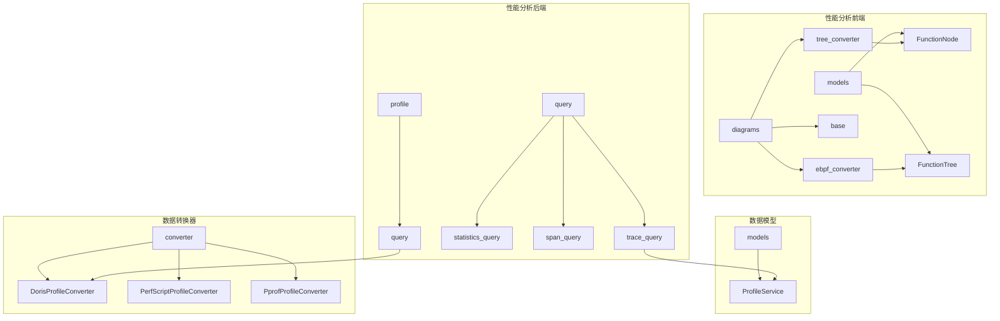
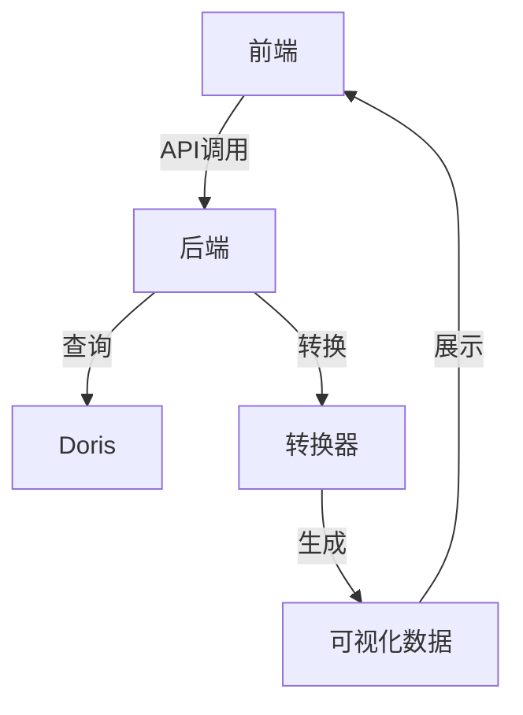
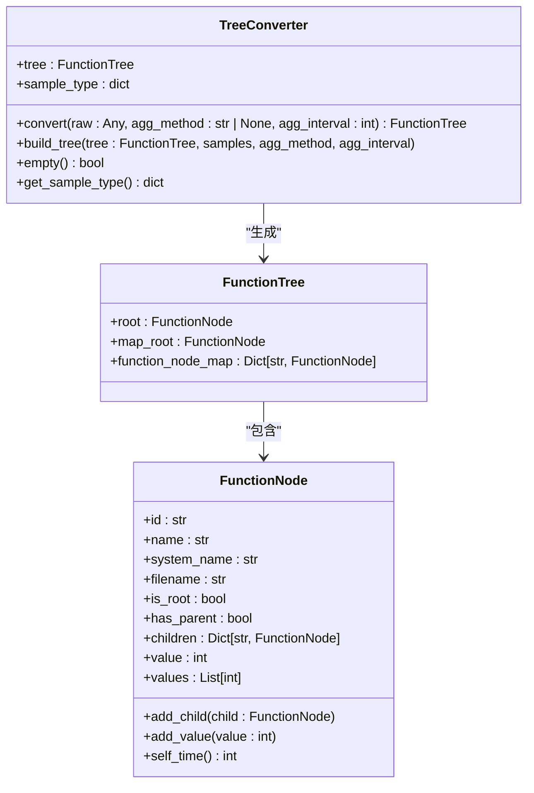
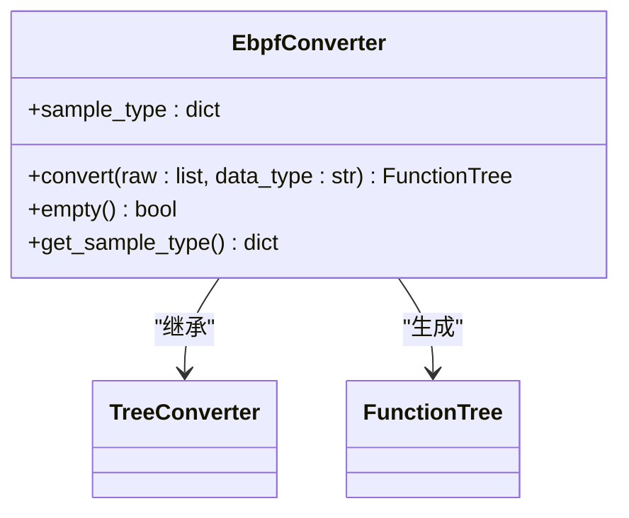
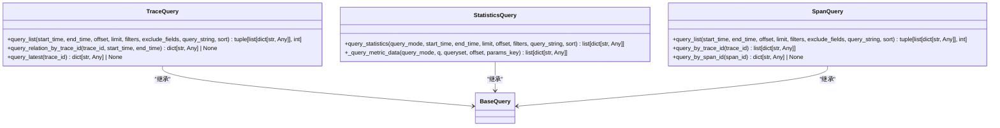
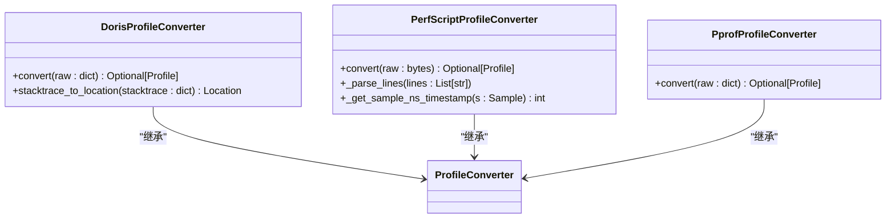
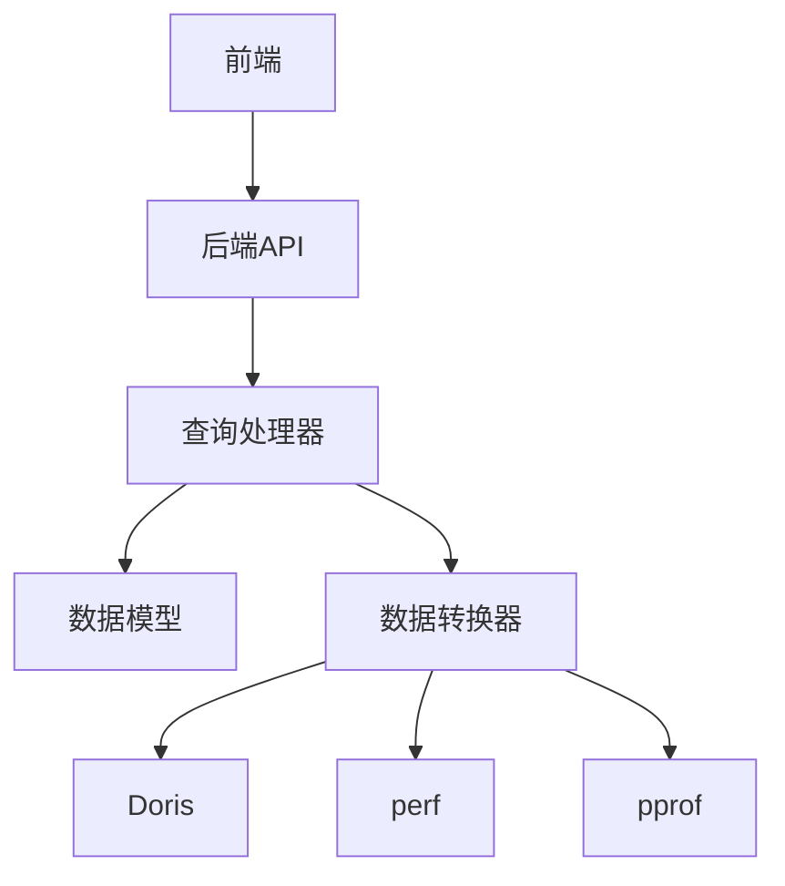

# 性能分析工具

<cite>
**本文档引用的文件**  
- [tree_converter.py](file://bkmonitor/packages/apm_web/profile/diagrams/tree_converter.py)
- [ebpf_converter.py](file://bkmonitor/packages/apm_web/profile/diagrams/ebpf_converter.py)
- [base.py](file://bkmonitor/packages/apm_web/profile/diagrams/base.py)
- [trace_query.py](file://bkmonitor/apm/core/handlers/query/trace_query.py)
- [statistics_query.py](file://bkmonitor/apm/core/handlers/query/statistics_query.py)
- [span_query.py](file://bkmonitor/apm/core/handlers/query/span_query.py)
- [query.py](file://bkmonitor/apm/core/handlers/profile/query.py)
- [profile.py](file://bkmonitor/apm/models/profile.py)
- [converter.py](file://bkmonitor/packages/apm_web/profile/doris/converter.py)
- [converter.py](file://bkmonitor/packages/apm_web/profile/perf/converter.py)
- [converter.py](file://bkmonitor/packages/apm_web/profile/pprof/converter.py)
</cite>

## 目录
1. [简介](#简介)
2. [项目结构](#项目结构)
3. [核心组件](#核心组件)
4. [架构概览](#架构概览)
5. [详细组件分析](#详细组件分析)
6. [依赖分析](#依赖分析)
7. [性能考虑](#性能考虑)
8. [故障排除指南](#故障排除指南)
9. [结论](#结论)

## 简介
本文档详细介绍了蓝鲸监控平台（BlueKing - Monitor）中性能分析工具的功能、实现机制和使用方法。重点涵盖火焰图、调用树、热点分析、内存分析等可视化工具，以及其背后的数据采集、转换与查询逻辑。文档旨在帮助用户理解性能分析工具的技术原理，掌握其使用方法，并能够进行二次开发。

## 项目结构
性能分析工具主要位于 `bkmonitor/packages/apm_web/profile` 和 `bkmonitor/apm/core/handlers` 目录下。`profile` 目录负责性能数据的可视化展示和前端交互，而 `handlers` 目录则负责后端的数据查询和处理逻辑。

**图源**
- [tree_converter.py](file://bkmonitor/packages/apm_web/profile/diagrams/tree_converter.py)
- [ebpf_converter.py](file://bkmonitor/packages/apm_web/profile/diagrams/ebpf_converter.py)
- [base.py](file://bkmonitor/packages/apm_web/profile/diagrams/base.py)
- [trace_query.py](file://bkmonitor/apm/core/handlers/query/trace_query.py)
- [query.py](file://bkmonitor/apm/core/handlers/profile/query.py)
- [profile.py](file://bkmonitor/apm/models/profile.py)
- [converter.py](file://bkmonitor/packages/apm_web/profile/doris/converter.py)

## 核心组件
性能分析工具的核心组件包括数据模型、查询处理器、转换器和可视化组件。数据模型定义了性能数据的结构，查询处理器负责从数据源获取数据，转换器将原始数据转换为可视化组件所需的格式，可视化组件则负责将数据以火焰图、调用树等形式展示给用户。

**节源**
- [profile.py](file://bkmonitor/apm/models/profile.py)
- [query.py](file://bkmonitor/apm/core/handlers/profile/query.py)
- [tree_converter.py](file://bkmonitor/packages/apm_web/profile/diagrams/tree_converter.py)

## 架构概览
性能分析工具的架构分为前端和后端两部分。前端负责数据的可视化展示，后端负责数据的查询和处理。前端通过API调用后端服务，后端服务从Doris等数据源查询数据，并通过转换器将数据转换为前端所需的格式。

**图源**
- [query.py](file://bkmonitor/apm/core/handlers/profile/query.py)
- [converter.py](file://bkmonitor/packages/apm_web/profile/doris/converter.py)

## 详细组件分析

### 调用树分析
调用树是性能分析工具中的重要可视化组件，用于展示函数调用的层次结构。`TreeConverter` 类负责将Doris查询出的原始数据转换为 `FunctionTree` 对象。

#### 调用树转换器

**图源**
- [tree_converter.py](file://bkmonitor/packages/apm_web/profile/diagrams/tree_converter.py#L15-L147)
- [base.py](file://bkmonitor/packages/apm_web/profile/diagrams/base.py#L50-L150)

**节源**
- [tree_converter.py](file://bkmonitor/packages/apm_web/profile/diagrams/tree_converter.py#L1-L147)

### eBPF数据处理
eBPF是一种内核技术，用于在不修改内核代码的情况下收集性能数据。`EbpfConverter` 类负责处理eBPF格式的数据。

#### eBPF转换器

**图源**
- [ebpf_converter.py](file://bkmonitor/packages/apm_web/profile/diagrams/ebpf_converter.py#L15-L113)

**节源**
- [ebpf_converter.py](file://bkmonitor/packages/apm_web/profile/diagrams/ebpf_converter.py#L1-L113)

### 数据查询
性能分析工具通过查询处理器从数据源获取数据。`TraceQuery`、`StatisticsQuery` 和 `SpanQuery` 是三个主要的查询处理器。

#### 查询处理器

**图源**
- [trace_query.py](file://bkmonitor/apm/core/handlers/query/trace_query.py#L15-L212)
- [statistics_query.py](file://bkmonitor/apm/core/handlers/query/statistics_query.py#L15-L330)
- [span_query.py](file://bkmonitor/apm/core/handlers/query/span_query.py#L15-L113)

**节源**
- [trace_query.py](file://bkmonitor/apm/core/handlers/query/trace_query.py#L1-L212)
- [statistics_query.py](file://bkmonitor/apm/core/handlers/query/statistics_query.py#L1-L330)
- [span_query.py](file://bkmonitor/apm/core/handlers/query/span_query.py#L1-L113)

### 数据转换
数据转换器负责将不同格式的性能数据转换为统一的 `Profile` 对象。`DorisProfileConverter`、`PerfScriptProfileConverter` 和 `PprofProfileConverter` 是三种主要的转换器。

#### 数据转换器

**图源**
- [converter.py](file://bkmonitor/packages/apm_web/profile/doris/converter.py#L15-L112)
- [converter.py](file://bkmonitor/packages/apm_web/profile/perf/converter.py#L15-L158)
- [converter.py](file://bkmonitor/packages/apm_web/profile/pprof/converter.py)

**节源**
- [converter.py](file://bkmonitor/packages/apm_web/profile/doris/converter.py#L1-L112)
- [converter.py](file://bkmonitor/packages/apm_web/profile/perf/converter.py#L1-L158)
- [converter.py](file://bkmonitor/packages/apm_web/profile/pprof/converter.py)

## 依赖分析
性能分析工具的各个组件之间存在紧密的依赖关系。前端组件依赖后端组件提供的API，后端组件依赖数据模型和查询处理器，查询处理器又依赖数据转换器。

**图源**
- [tree_converter.py](file://bkmonitor/packages/apm_web/profile/diagrams/tree_converter.py)
- [ebpf_converter.py](file://bkmonitor/packages/apm_web/profile/diagrams/ebpf_converter.py)
- [base.py](file://bkmonitor/packages/apm_web/profile/diagrams/base.py)
- [trace_query.py](file://bkmonitor/apm/core/handlers/query/trace_query.py)
- [statistics_query.py](file://bkmonitor/apm/core/handlers/query/statistics_query.py)
- [span_query.py](file://bkmonitor/apm/core/handlers/query/span_query.py)
- [query.py](file://bkmonitor/apm/core/handlers/profile/query.py)
- [profile.py](file://bkmonitor/apm/models/profile.py)
- [converter.py](file://bkmonitor/packages/apm_web/profile/doris/converter.py)
- [converter.py](file://bkmonitor/packages/apm_web/profile/perf/converter.py)
- [converter.py](file://bkmonitor/packages/apm_web/profile/pprof/converter.py)

**节源**
- [tree_converter.py](file://bkmonitor/packages/apm_web/profile/diagrams/tree_converter.py)
- [ebpf_converter.py](file://bkmonitor/packages/apm_web/profile/diagrams/ebpf_converter.py)
- [base.py](file://bkmonitor/packages/apm_web/profile/diagrams/base.py)
- [trace_query.py](file://bkmonitor/apm/core/handlers/query/trace_query.py)
- [statistics_query.py](file://bkmonitor/apm/core/handlers/query/statistics_query.py)
- [span_query.py](file://bkmonitor/apm/core/handlers/query/span_query.py)
- [query.py](file://bkmonitor/apm/core/handlers/profile/query.py)
- [profile.py](file://bkmonitor/apm/models/profile.py)
- [converter.py](file://bkmonitor/packages/apm_web/profile/doris/converter.py)
- [converter.py](file://bkmonitor/packages/apm_web/profile/perf/converter.py)
- [converter.py](file://bkmonitor/packages/apm_web/profile/pprof/converter.py)

## 性能考虑
性能分析工具在设计时考虑了性能优化。例如，`TreeConverter` 类中的 `build_tree` 方法通过 `visited_node` 集合避免重复处理节点，`StatisticsQuery` 类中的 `Deque` 类使用Redis缓存来提高查询效率。

## 故障排除指南
在使用性能分析工具时，可能会遇到数据不准确、查询超时等问题。建议检查数据源是否正常，查询参数是否正确，以及网络连接是否稳定。

**节源**
- [tree_converter.py](file://bkmonitor/packages/apm_web/profile/diagrams/tree_converter.py)
- [statistics_query.py](file://bkmonitor/apm/core/handlers/query/statistics_query.py)

## 结论
本文档详细介绍了蓝鲸监控平台中性能分析工具的架构、组件和实现机制。通过理解这些内容，用户可以更好地使用性能分析工具，进行性能问题的排查和优化。