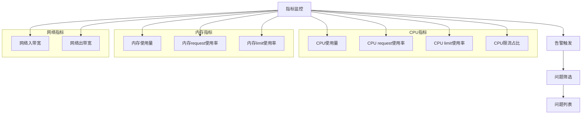
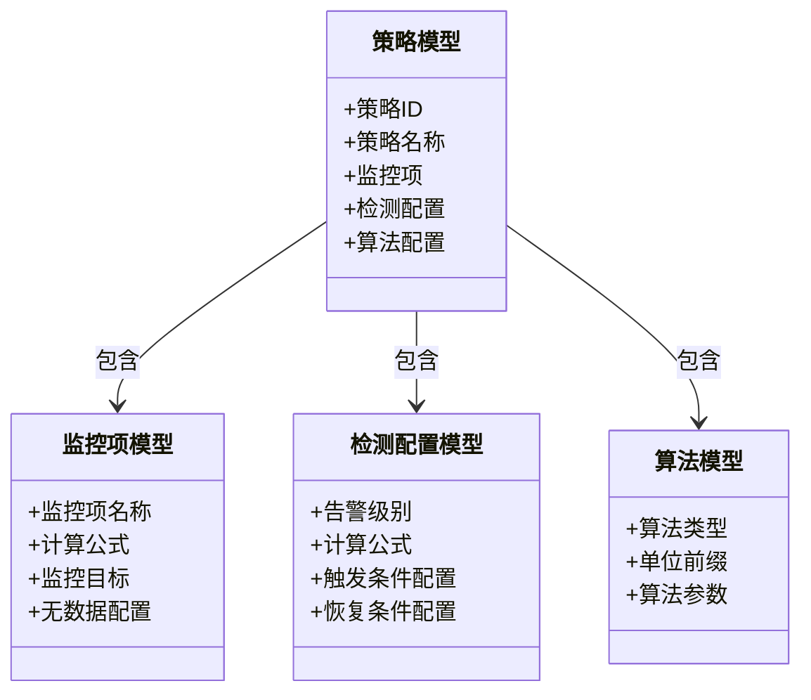
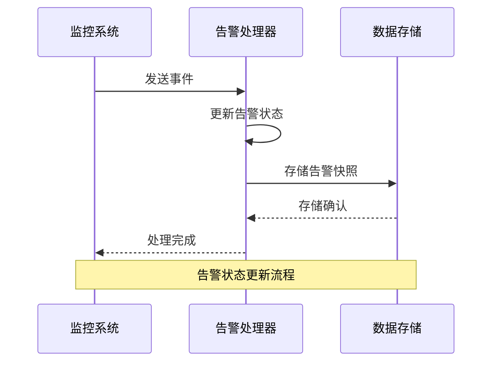
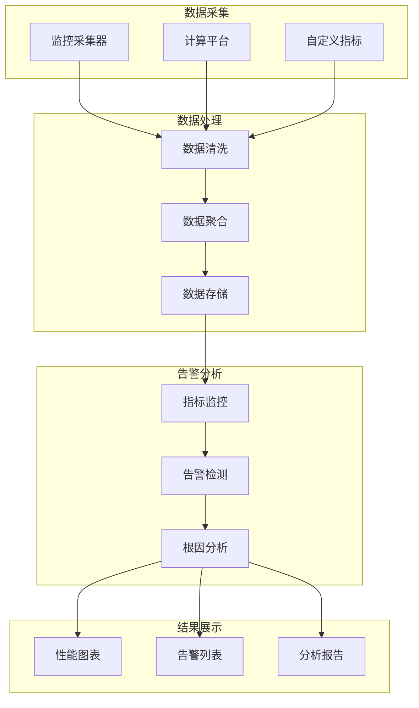

# 性能分析流程

<cite>
**本文档引用的文件**   
- [performance.py](file://bkmonitor/packages/monitor_web/k8s/scenario/performance.py)
- [profiling.py](file://bkmonitor/bkmonitor/profiling.py)
- [strategy.py](file://bkmonitor/bkmonitor/models/strategy.py)
- [alert.py](file://bkmonitor/alarm_backends/core/alert/alert.py)
- [strategy.py](file://bkmonitor/constants/strategy.py)
- [alert.py](file://bkmonitor/constants/alert.py)
- [data_source.py](file://bkmonitor/constants/data_source.py)
</cite>

## 目录
1. [问题定位](#问题定位)
2. [根因分析](#根因分析)
3. [问题验证](#问题验证)
4. [工具支持与数据流转](#工具支持与数据流转)
5. [典型故障场景应用](#典型故障场景应用)

## 问题定位

性能分析流程的第一阶段是问题定位，主要通过指标监控、告警触发和问题筛选来实现。系统通过预定义的性能指标对系统状态进行持续监控。

在Kubernetes场景下，性能分析主要关注CPU、内存和网络三大类指标。CPU指标包括CPU使用量、CPU request使用率、CPU limit使用率和CPU限流占比；内存指标包括内存使用量(Working Set)、内存request使用率、内存limit使用率；网络指标包括网络入带宽和网络出带宽。

**图示来源**
- [performance.py](file://bkmonitor/packages/monitor_web/k8s/scenario/performance.py#L30-L118)

当监控指标超过预设阈值时，系统会触发告警。告警状态包括未恢复(ABNORMAL)、已恢复(RECOVERED)和已失效(CLOSED)三种。系统通过策略配置来定义告警的触发条件和恢复条件。

**本节来源**
- [performance.py](file://bkmonitor/packages/monitor_web/k8s/scenario/performance.py#L30-L118)
- [alert.py](file://bkmonitor/constants/alert.py#L30-L196)

## 根因分析

根因分析阶段采用多种方法论来确定问题的根本原因，包括自顶向下分析、对比分析和相关性分析等技术。

系统通过策略模型来配置检测算法，支持多种算法类型，包括静态阈值算法、简易环比算法、高级环比算法、简易同比算法、高级同比算法等。这些算法可以根据不同的监控需求进行选择和组合。

**图示来源**
- [strategy.py](file://bkmonitor/bkmonitor/models/strategy.py#L0-L199)

在进行根因分析时，系统会收集相关指标数据，包括时序数据、事件数据和日志数据。数据来源标签包括监控采集器(bk_monitor)、计算平台(bk_data)和自定义指标(custom)等。

系统还支持智能检测算法，如时序预测、异常聚类和多元异常检测等，这些算法可以自动识别异常模式并提供根因建议。

**本节来源**
- [strategy.py](file://bkmonitor/bkmonitor/models/strategy.py#L0-L199)
- [data_source.py](file://bkmonitor/constants/data_source.py#L0-L199)

## 问题验证

问题验证阶段主要通过修复验证和回归测试等流程来确认问题是否已解决。

当系统检测到异常状态恢复时，会更新告警状态为已恢复(RECOVERED)。系统会记录告警的生命周期，包括首次异常时间、最新事件时间和状态变更时间等。

**图示来源**
- [alert.py](file://bkmonitor/alarm_backends/core/alert/alert.py#L0-L199)

系统还支持设置恢复延迟，即在异常状态消失后等待一段时间再确认问题已解决，以避免误判。关闭窗口大小默认为1小时，即1小时内没有更新的告警将被视为已关闭。

**本节来源**
- [alert.py](file://bkmonitor/alarm_backends/core/alert/alert.py#L0-L199)
- [alert.py](file://bkmonitor/constants/alert.py#L30-L196)

## 工具支持与数据流转

性能分析流程依赖于多种工具支持，包括指标采集、数据存储、告警处理和可视化展示等组件。

数据流转过程从指标采集开始，经过数据处理和存储，再到告警检测和分析，最后到结果展示。系统支持多种数据源，包括监控采集器、计算平台和自定义指标等。

**图示来源**
- [data_source.py](file://bkmonitor/constants/data_source.py#L0-L199)
- [strategy.py](file://bkmonitor/constants/strategy.py#L0-L199)

系统还提供了性能分析的核心功能，包括CPU性能分析和内存性能分析。这些功能可以深入到代码级别，分析函数调用栈和内存分配情况。

**本节来源**
- [profiling.py](file://bkmonitor/bkmonitor/profiling.py#L0-L199)
- [data_source.py](file://bkmonitor/constants/data_source.py#L0-L199)

## 典型故障场景应用

结合典型故障场景，展示性能分析流程的实际应用。

### 性能下降场景

当系统出现性能下降时，分析流程如下：
1. 通过CPU使用率、内存使用率等指标发现性能异常
2. 检查是否有CPU限流或内存不足的情况
3. 分析网络带宽使用情况，排除网络瓶颈
4. 使用根因分析算法确定问题根源
5. 验证修复措施是否有效

### 响应延迟场景

当系统出现响应延迟时，分析流程如下：
1. 监控请求延迟指标，如P99延迟
2. 分析服务调用链路，定位延迟较高的环节
3. 检查数据库查询性能，优化慢查询
4. 分析线程池使用情况，调整线程配置
5. 验证优化效果，确保延迟恢复正常

这些场景展示了性能分析流程在实际问题解决中的完整应用，从问题发现到最终验证的全过程。

**本节来源**
- [performance.py](file://bkmonitor/packages/monitor_web/k8s/scenario/performance.py#L30-L118)
- [profiling.py](file://bkmonitor/bkmonitor/profiling.py#L0-L199)
- [alert.py](file://bkmonitor/alarm_backends/core/alert/alert.py#L0-L199)