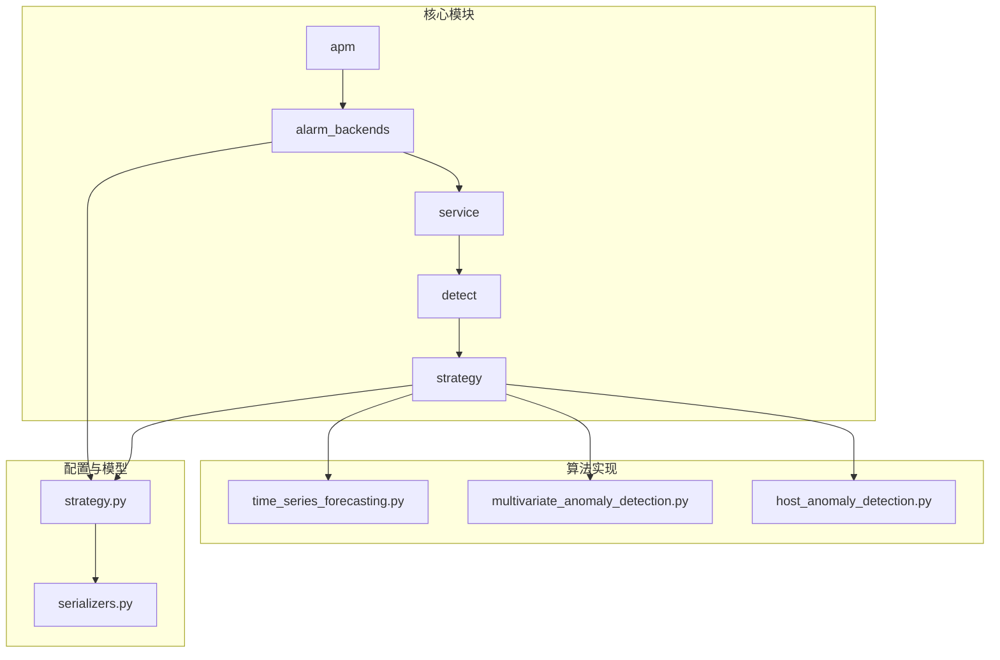
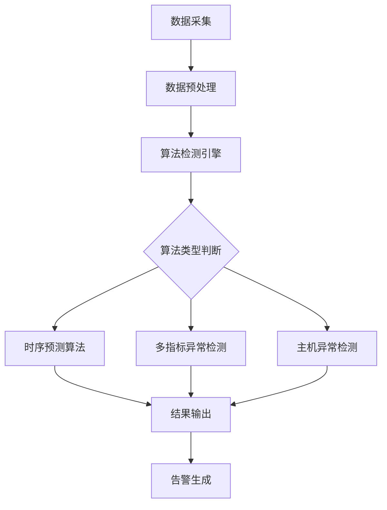
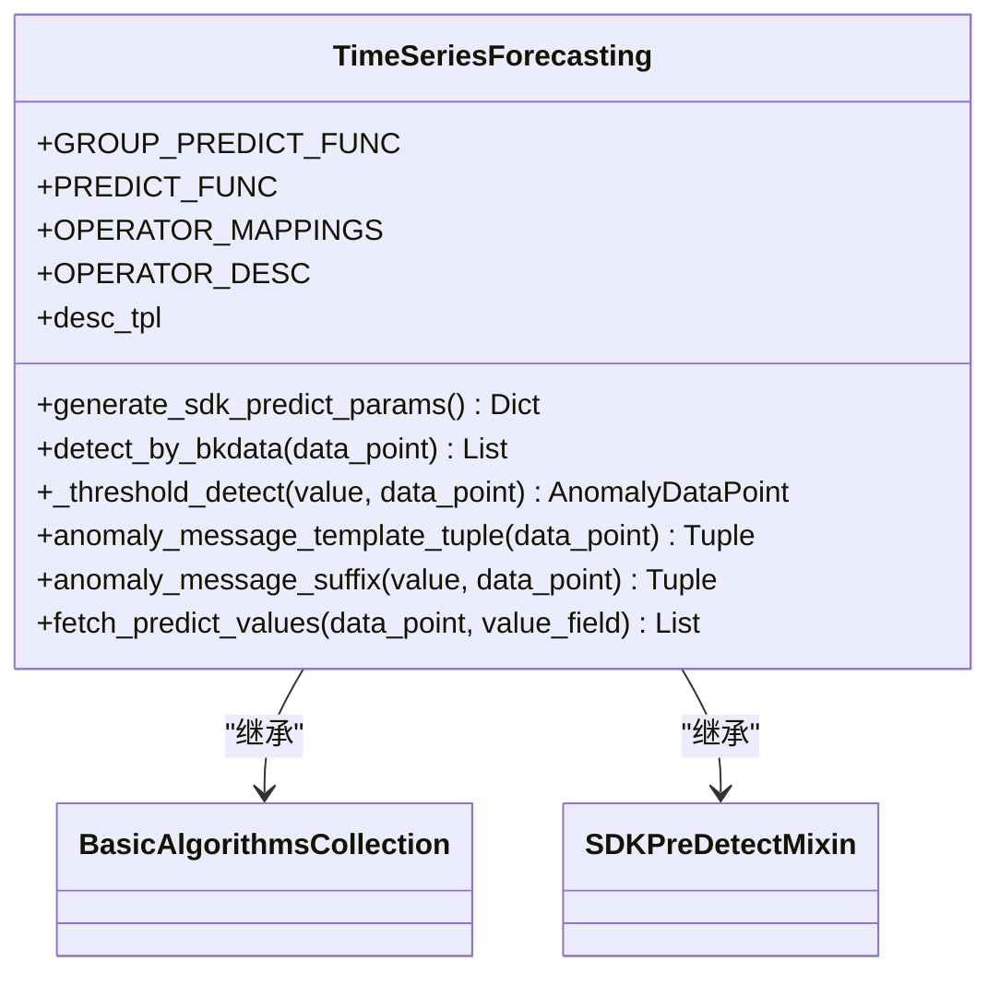
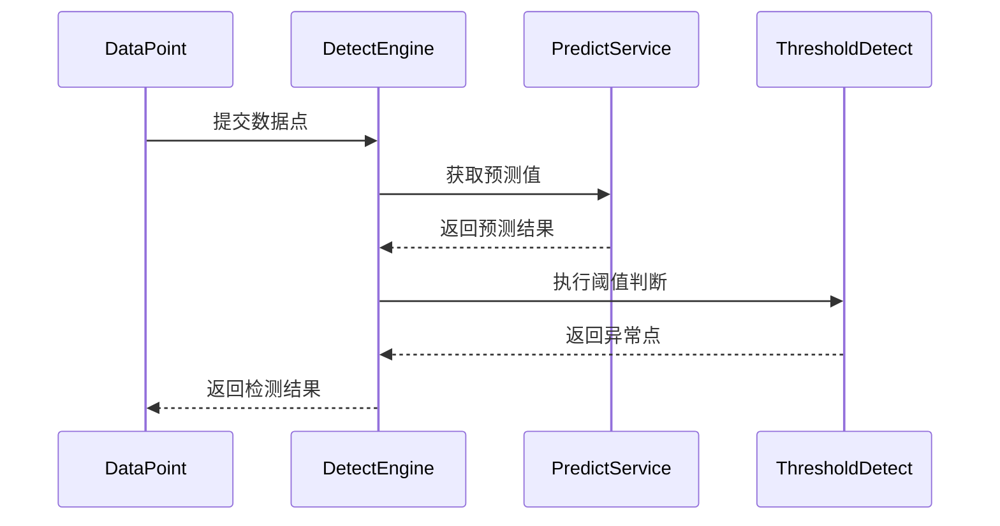
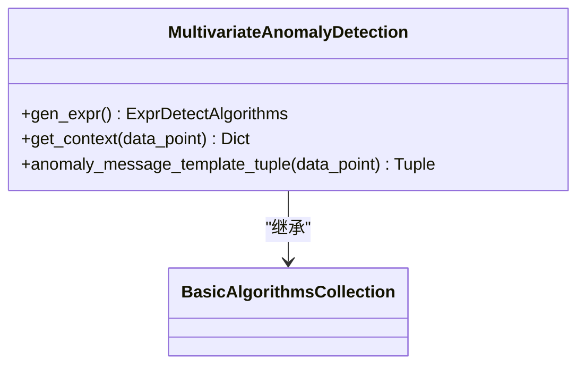
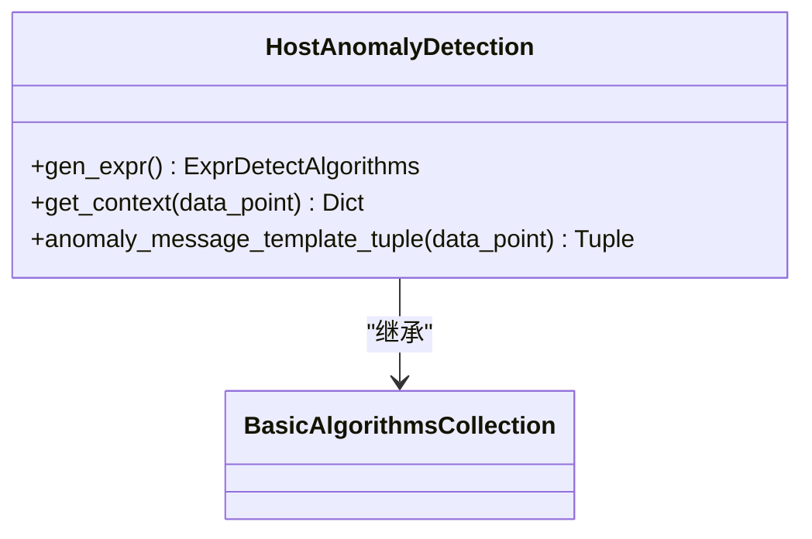
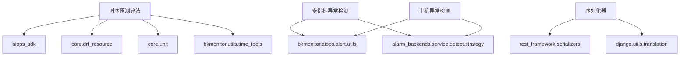

# 性能分析算法

<cite>
**本文档引用的文件**   
- [time_series_forecasting.py](file://bkmonitor/alarm_backends/service/detect/strategy/time_series_forecasting.py)
- [multivariate_anomaly_detection.py](file://bkmonitor/alarm_backends/service/detect/strategy/multivariate_anomaly_detection.py)
- [host_anomaly_detection.py](file://bkmonitor/alarm_backends/service/detect/strategy/host_anomaly_detection.py)
- [strategy.py](file://bkmonitor/bkmonitor/models/strategy.py)
- [serializers.py](file://bkmonitor/bkmonitor/strategy/serializers.py)
</cite>

## 目录
1. [引言](#引言)
2. [项目结构](#项目结构)
3. [核心组件](#核心组件)
4. [架构概述](#架构概述)
5. [详细组件分析](#详细组件分析)
6. [依赖分析](#依赖分析)
7. [性能考虑](#性能考虑)
8. [故障排除指南](#故障排除指南)
9. [结论](#结论)

## 引言
本文档深入解析了APM平台采用的核心性能分析算法和技术原理。文档详细说明了异常检测算法、趋势预测算法和关联分析算法的实现机制、应用场景和优化方法。通过分析代码结构和算法逻辑，为用户提供算法配置参数说明和调优建议，帮助用户根据实际业务场景调整算法行为。

## 项目结构
项目结构清晰地划分了不同功能模块，主要包含ai_agent、bkmonitor、api、apm等核心目录。其中，bkmonitor目录下的alarm_backends和服务模块是性能分析算法的核心实现区域。

**图源**
- [strategy.py](file://bkmonitor/bkmonitor/models/strategy.py)
- [time_series_forecasting.py](file://bkmonitor/alarm_backends/service/detect/strategy/time_series_forecasting.py)

## 核心组件
性能分析算法的核心组件主要包括时序预测算法、多指标异常检测算法和主机异常检测算法。这些算法基于计算平台的结果进行判断，实现了智能化的性能监控和异常检测。

**节源**
- [time_series_forecasting.py](file://bkmonitor/alarm_backends/service/detect/strategy/time_series_forecasting.py)
- [multivariate_anomaly_detection.py](file://bkmonitor/alarm_backends/service/detect/strategy/multivariate_anomaly_detection.py)
- [host_anomaly_detection.py](file://bkmonitor/alarm_backends/service/detect/strategy/host_anomaly_detection.py)

## 架构概述
APM平台的性能分析算法架构采用分层设计，从数据采集、预处理到算法检测和结果输出，形成了完整的监控闭环。算法实现基于策略模型和序列化器的配置，通过检测引擎执行具体的分析逻辑。

**图源**
- [time_series_forecasting.py](file://bkmonitor/alarm_backends/service/detect/strategy/time_series_forecasting.py)
- [strategy.py](file://bkmonitor/bkmonitor/models/strategy.py)

## 详细组件分析
### 时序预测算法分析
时序预测算法基于计算平台的预测结果进行静态阈值检测，通过比较预测值与设定阈值来判断异常。

#### 算法实现

**图源**
- [time_series_forecasting.py](file://bkmonitor/alarm_backends/service/detect/strategy/time_series_forecasting.py)

#### 工作流程

**图源**
- [time_series_forecasting.py](file://bkmonitor/alarm_backends/service/detect/strategy/time_series_forecasting.py)

#### 参数配置
时序预测算法的参数配置通过序列化器定义，主要包括：

- **args**: 算法参数，字典类型，必填
- **plan_id**: 方案ID，整数类型，必填
- **thresholds**: 阈值配置，必填
- **bound_type**: 边界类型，默认为"middle"（预测值）
  - "upper": 预测上界
  - "lower": 预测下界
  - "middle": 预测值
- **duration**: 预测时长(秒)，整数类型，必填，最小值0
- **visual_type**: 可视化类型，默认为"forecasting"

**节源**
- [serializers.py](file://bkmonitor/bkmonitor/strategy/serializers.py#L147-L185)
- [time_series_forecasting.py](file://bkmonitor/alarm_backends/service/detect/strategy/time_series_forecasting.py)

### 多指标异常检测算法分析
多指标异常检测算法基于计算平台的计算结果，通过判断结果表的is_anomaly值来识别异常。

#### 算法实现

**图源**
- [multivariate_anomaly_detection.py](file://bkmonitor/alarm_backends/service/detect/strategy/multivariate_anomaly_detection.py)

#### 工作原理
多指标异常检测算法通过以下步骤工作：
1. 获取数据点的异常排序信息
2. 解析异常数据
3. 生成异常描述模板
4. 判断异常条件

算法表达式为"value > 0"，异常消息模板包含异常指标的详细信息。

**节源**
- [multivariate_anomaly_detection.py](file://bkmonitor/alarm_backends/service/detect/strategy/multivariate_anomaly_detection.py)

### 主机异常检测算法分析
主机异常检测算法与多指标异常检测类似，但额外包含了主机的额外信息。

#### 算法实现

**图源**
- [host_anomaly_detection.py](file://bkmonitor/alarm_backends/service/detect/strategy/host_anomaly_detection.py)

#### 计算过程
主机异常检测算法的计算过程包括：
1. 获取数据点的异常排序和额外信息
2. 解析异常数据
3. 更新上下文信息
4. 生成异常描述

与多指标异常检测相比，主机异常检测额外处理了extra_info字段。

**节源**
- [host_anomaly_detection.py](file://bkmonitor/alarm_backends/service/detect/strategy/host_anomaly_detection.py)

## 依赖分析
性能分析算法的实现依赖于多个核心模块和外部服务。

**图源**
- [time_series_forecasting.py](file://bkmonitor/alarm_backends/service/detect/strategy/time_series_forecasting.py)
- [multivariate_anomaly_detection.py](file://bkmonitor/alarm_backends/service/detect/strategy/multivariate_anomaly_detection.py)
- [host_anomaly_detection.py](file://bkmonitor/alarm_backends/service/detect/strategy/host_anomaly_detection.py)
- [serializers.py](file://bkmonitor/bkmonitor/strategy/serializers.py)

## 性能考虑
### 算法性能优化策略
1. **数据采样**: 通过聚合周期(agg_interval)控制数据粒度
2. **计算复杂度控制**: 使用高效的算法实现和数据结构
3. **缓存机制**: 利用Redis等缓存频繁访问的数据
4. **异步处理**: 将耗时操作放入任务队列

### 准确性优化方法
1. **多算法组合**: 通过AND/OR连接符组合多个检测算法
2. **动态阈值**: 基于历史数据动态调整阈值
3. **时间窗口优化**: 合理设置检测时间窗口
4. **参数调优**: 根据业务特点调整算法参数

## 故障排除指南
### 常见问题及解决方案
1. **预测值获取失败**
   - 检查计算平台连接状态
   - 验证方案ID是否正确
   - 确认预测模型已正确部署

2. **异常检测不触发**
   - 检查阈值配置是否合理
   - 验证数据采集是否正常
   - 确认算法参数配置正确

3. **性能下降**
   - 检查数据采样率是否过高
   - 优化聚合周期设置
   - 调整算法复杂度

**节源**
- [time_series_forecasting.py](file://bkmonitor/alarm_backends/service/detect/strategy/time_series_forecasting.py#L88-L103)
- [strategy.py](file://bkmonitor/bkmonitor/models/strategy.py)

## 结论
APM平台的性能分析算法体系完整，涵盖了异常检测、趋势预测和关联分析等多个方面。通过合理的算法选择和参数配置，可以有效提升系统监控的准确性和及时性。建议根据实际业务场景选择合适的算法组合，并持续优化参数配置以达到最佳监控效果。