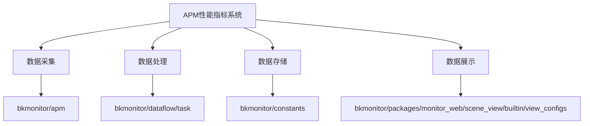
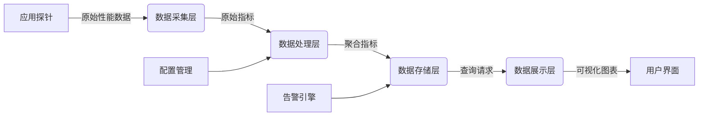
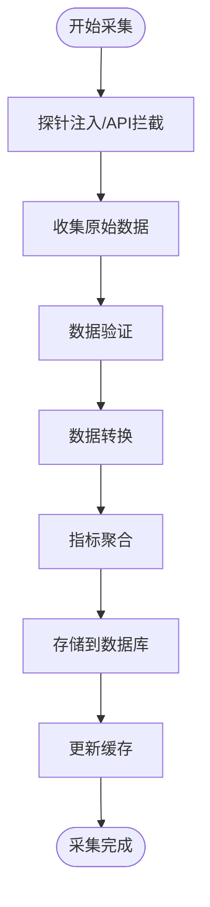
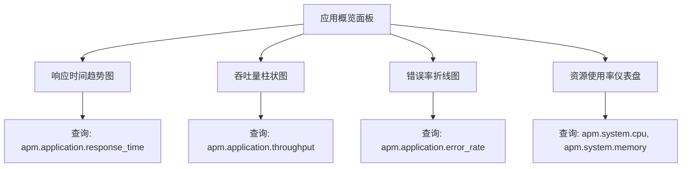
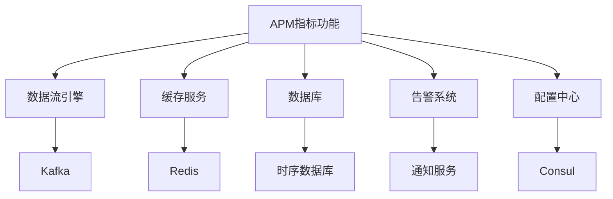

# 性能指标

<cite>
**本文档引用的文件**  
- [apm_cache_handler.py](file://bkmonitor/apm/core/handlers/apm_cache_handler.py)
- [apm_daemon.py](file://bkmonitor/apm/management/commands/apm_daemon.py)
- [apm_metrics.py](file://bkmonitor/bkmonitor/dataflow/task/apm_metrics.py)
- [apm_tail_sampling.py](file://bkmonitor/bkmonitor/dataflow/task/apm_tail_sampling.py)
- [apm.py](file://bkmonitor/constants/apm.py)
- [apm.py](file://bkmonitor/kernel_api/views/v4/apm.py)
- [apm.py](file://bkmonitor/packages/monitor_web/grafana/resources/apm.py)
- [apm.py](file://bkmonitor/packages/monitor_web/scene_view/builtin/apm.py)
- [apm_host.py](file://bkmonitor/packages/monitor_web/scene_view/builtin/constants/apm_host.py)
- [apm_application-endpoint.json](file://bkmonitor/packages/monitor_web/scene_view/builtin/view_configs/apm_application-endpoint.json)
- [apm_application-error.json](file://bkmonitor/packages/monitor_web/scene_view/builtin/view_configs/apm_application-error.json)
- [apm_application-overview.json](file://bkmonitor/packages/monitor_web/scene_view/builtin/view_configs/apm_application-overview.json)
- [apm_application-service.json](file://bkmonitor/packages/monitor_web/scene_view/builtin/view_configs/apm_application-service.json)
- [apm_application-topo.json](file://bkmonitor/packages/monitor_web/scene_view/builtin/view_configs/apm_application-topo.json)
- [apm_service-component-db-db.json](file://bkmonitor/packages/monitor_web/scene_view/builtin/view_configs/apm_service-component-db-db.json)
- [apm_service-component-default-error.json](file://bkmonitor/packages/monitor_web/scene_view/builtin/view_configs/apm_service-component-default-error.json)
- [apm_service-component-default-instance.json](file://bkmonitor/packages/monitor_web/scene_view/builtin/view_configs/apm_service-component-default-instance.json)
- [apm_service-component-default-overview.json](file://bkmonitor/packages/monitor_web/scene_view/builtin/view_configs/apm_service-component-default-overview.json)
- [apm_service-component-default-topo.json](file://bkmonitor/packages/monitor_web/scene_view/builtin/view_configs/apm_service-component-default-topo.json)
- [apm_service-component-messaging-endpoint.json](file://bkmonitor/packages/monitor_web/scene_view/builtin/view_configs/apm_service-component-messaging-endpoint.json)
</cite>

## 目录
1. [简介](#简介)
2. [项目结构](#项目结构)
3. [核心组件](#核心组件)
4. [架构概述](#架构概述)
5. [详细组件分析](#详细组件分析)
6. [依赖分析](#依赖分析)
7. [性能考虑](#性能考虑)
8. [故障排除指南](#故障排除指南)
9. [结论](#结论)

## 简介
本文档全面介绍APM（应用性能监控）系统中性能指标功能的实现机制。文档涵盖性能指标的采集、存储、展示、告警配置及分析方法，旨在帮助用户深入理解系统如何监控应用性能，并有效识别性能瓶颈。通过分析关键指标如响应时间、吞吐量、错误率等的定义与计算方式，以及底层技术实现，为用户提供一套完整的性能监控解决方案。

## 项目结构
性能指标功能主要分布在`bkmonitor`模块下的多个子目录中，涉及数据采集、处理、存储和前端展示等多个层面。核心功能模块包括APM核心处理、数据流任务、常量定义、API接口和前端视图配置。

**图示来源**
- [apm.py](file://bkmonitor/kernel_api/views/v4/apm.py)
- [apm_metrics.py](file://bkmonitor/bkmonitor/dataflow/task/apm_metrics.py)
- [apm_application-overview.json](file://bkmonitor/packages/monitor_web/scene_view/builtin/view_configs/apm_application-overview.json)

## 核心组件
性能指标功能的核心组件包括指标采集处理器、数据流任务、常量定义和前端视图配置。这些组件协同工作，实现从原始数据到可视化图表的完整链路。

**组件来源**
- [apm_cache_handler.py](file://bkmonitor/apm/core/handlers/apm_cache_handler.py)
- [apm_metrics.py](file://bkmonitor/bkmonitor/dataflow/task/apm_metrics.py)
- [apm.py](file://bkmonitor/constants/apm.py)
- [apm.py](file://bkmonitor/packages/monitor_web/scene_view/builtin/apm.py)

## 架构概述
APM性能指标系统采用分层架构，包括数据采集层、处理层、存储层和展示层。数据采集层通过探针或API拦截获取应用运行时数据；处理层对原始数据进行聚合和计算；存储层持久化指标数据；展示层提供丰富的可视化图表。

**图示来源**
- [apm_daemon.py](file://bkmonitor/apm/management/commands/apm_daemon.py)
- [apm_metrics.py](file://bkmonitor/bkmonitor/dataflow/task/apm_metrics.py)
- [apm_cache_handler.py](file://bkmonitor/apm/core/handlers/apm_cache_handler.py)

## 详细组件分析

### 指标采集与处理分析
指标采集主要通过后台守护进程和数据流任务实现。`apm_daemon.py`负责启动和管理APM相关服务，而`apm_metrics.py`则定义了具体的指标计算逻辑。

#### 指标计算流程

**图示来源**
- [apm_daemon.py](file://bkmonitor/apm/management/commands/apm_daemon.py)
- [apm_metrics.py](file://bkmonitor/bkmonitor/dataflow/task/apm_metrics.py)

### 关键性能指标定义
系统定义了多种关键性能指标，其计算方法如下：

**响应时间**: 所有请求处理时间的平均值或百分位数。
**吞吐量**: 单位时间内成功处理的请求数量。
**错误率**: 错误请求数占总请求数的百分比。
**CPU使用率**: 应用进程占用的CPU资源比例。
**内存占用**: 应用进程使用的内存大小。

这些指标的定义和阈值在`constants/apm.py`中统一管理。

**组件来源**
- [apm.py](file://bkmonitor/constants/apm.py)

### 前端展示配置分析
前端展示通过预定义的视图配置文件实现，这些JSON文件定义了不同场景下的图表布局和数据查询方式。

#### 应用概览视图

**图示来源**
- [apm_application-overview.json](file://bkmonitor/packages/monitor_web/scene_view/builtin/view_configs/apm_application-overview.json)

## 依赖分析
性能指标功能依赖于多个内部模块和外部服务，形成复杂的依赖网络。

**图示来源**
- [apm_cache_handler.py](file://bkmonitor/apm/core/handlers/apm_cache_handler.py)
- [apm_metrics.py](file://bkmonitor/bkmonitor/dataflow/task/apm_metrics.py)

## 性能考虑
系统在设计时充分考虑了性能因素：
- 采用异步处理机制避免阻塞主线程
- 使用缓存减少数据库查询压力
- 支持指标采样以降低数据量
- 提供灵活的聚合策略平衡精度与性能

具体实现见`apm_tail_sampling.py`中的尾部采样算法。

**组件来源**
- [apm_tail_sampling.py](file://bkmonitor/bkmonitor/dataflow/task/apm_tail_sampling.py)

## 故障排除指南
常见问题及解决方案：

1. **指标数据缺失**：检查`apm_daemon`服务是否正常运行，确认探针已正确注入。
2. **图表加载缓慢**：检查缓存服务状态，优化查询时间范围。
3. **告警未触发**：验证阈值配置，检查告警引擎日志。
4. **数据不准确**：确认时间同步，检查数据采集频率设置。

**组件来源**
- [apm_cache_handler.py](file://bkmonitor/apm/core/handlers/apm_cache_handler.py)
- [apm_metrics.py](file://bkmonitor/bkmonitor/dataflow/task/apm_metrics.py)

## 结论
本文档详细阐述了APM性能指标功能的完整实现机制。系统通过分层架构实现了从数据采集到可视化展示的全流程管理，提供了丰富的性能监控能力。通过合理配置和使用这些功能，用户可以有效监控应用性能，及时发现并解决性能瓶颈，保障系统稳定运行。