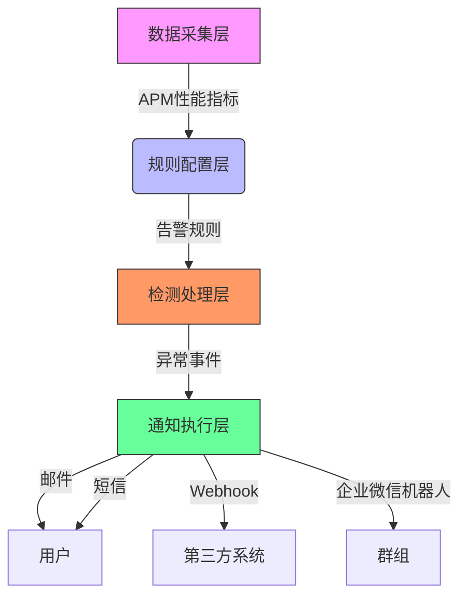
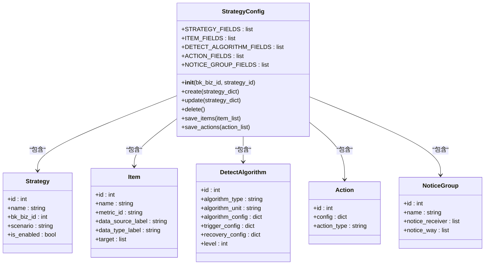
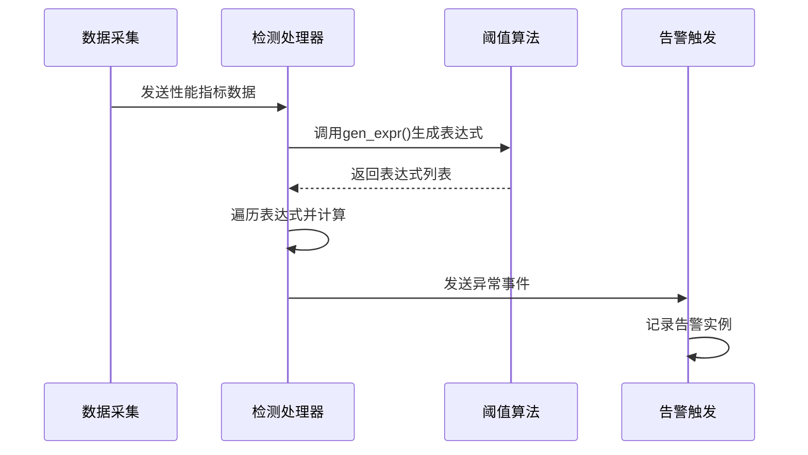
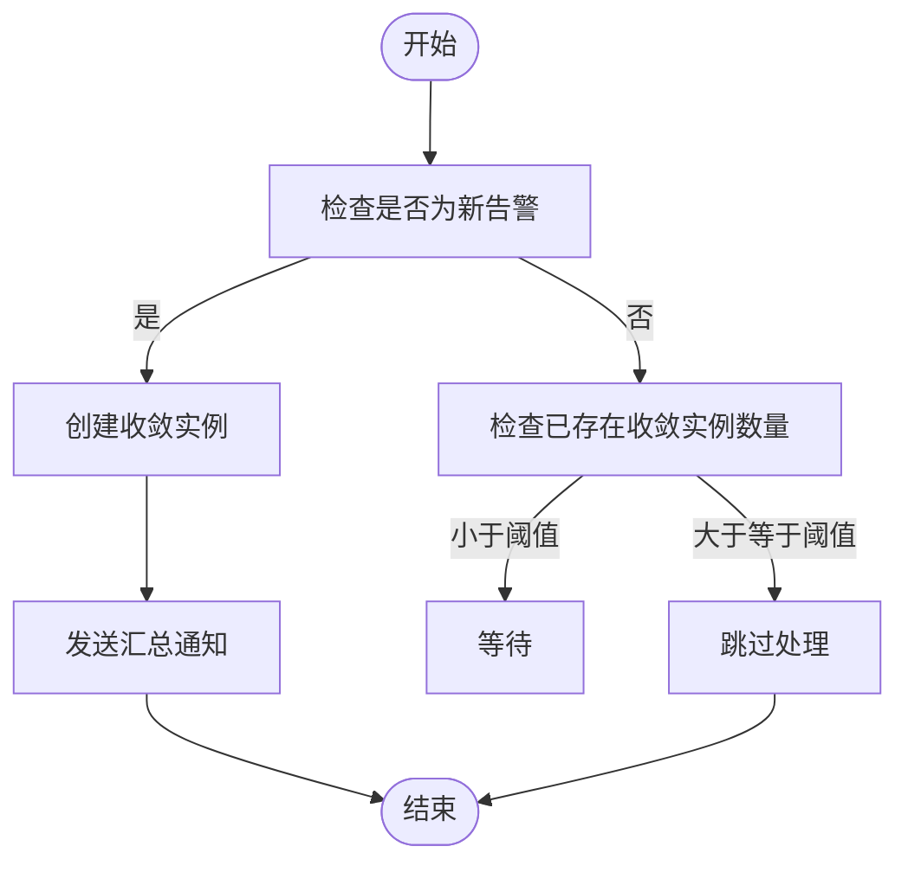
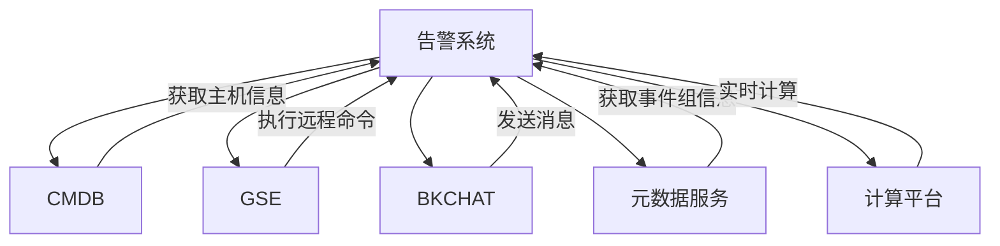

# 指标告警

<cite>
**本文档引用的文件**   
- [threshold.py](file://bkmonitor\alarm_backends\service\detect\strategy\threshold.py)
- [strategy.py](file://bkmonitor\bkmonitor\strategy\strategy.py)
- [converge_func.py](file://bkmonitor\alarm_backends\service\converge\converge_func.py)
- [processor.py](file://bkmonitor\alarm_backends\service\converge\processor.py)
- [alarm.py](file://bkmonitor\alarm_backends\core\context\alarm.py)
- [search_user_group_detail.md](file://bkmonitor\docs\api\apidocs\zh_hans\search_user_group_detail.md)
- [action_plugin_initial.json](file://bkmonitor\support-files\fta\action_plugin_initial.json)
</cite>

## 目录
1. [简介](#简介)
2. [项目结构](#项目结构)
3. [核心组件](#核心组件)
4. [架构概述](#架构概述)
5. [详细组件分析](#详细组件分析)
6. [依赖分析](#依赖分析)
7. [性能考虑](#性能考虑)
8. [故障排除指南](#故障排除指南)
9. [结论](#结论)

## 简介
本文档全面介绍了蓝鲸监控平台（BlueKing - Monitor）中APM性能指标的告警机制。文档详细阐述了告警规则的配置方法、告警触发的判断逻辑、告警通知的实现方式以及告警收敛和去重策略。通过分析核心代码文件，本文旨在为用户提供一个清晰、全面的指南，帮助用户建立有效的性能监控告警体系，及时发现和响应性能问题。

## 项目结构
蓝鲸监控平台的项目结构清晰，模块化程度高。核心的告警功能主要分布在`bkmonitor`目录下的`alarm_backends`和`bkmonitor`子模块中。`alarm_backends`负责告警的后端处理逻辑，包括检测、收敛和通知等；而`bkmonitor`则包含了告警策略、通知组等核心数据模型和业务逻辑。

```mermaid
graph TB
subgraph "核心模块"
A[alarm_backends] --> B[service]
A --> C[core]
D[bkmonitor] --> E[strategy]
D --> F[models]
end
subgraph "告警处理流程"
B --> F1[detect]
B --> F2[converge]
B --> F3[alert]
B --> F4[trigger]
end
subgraph "数据模型"
E --> M1[Strategy]
E --> M2[Item]
E --> M3[DetectAlgorithm]
F --> M4[Action]
F --> M5[NoticeGroup]
end
F1 --> "检测算法"
F2 --> "收敛策略"
F3 --> "通知渠道"
F4 --> "触发逻辑"
M1 --> "告警策略"
M2 --> "监控项"
M3 --> "检测算法配置"
M4 --> "动作配置"
M5 --> "通知组"
```

**图示来源**
- [alarm_backends/service](file://bkmonitor\alarm_backends\service)
- [bkmonitor/strategy](file://bkmonitor\bkmonitor\strategy)
- [bkmonitor/models](file://bkmonitor\bkmonitor\models)

**节来源**
- [alarm_backends/service](file://bkmonitor\alarm_backends\service)
- [bkmonitor/strategy](file://bkmonitor\bkmonitor\strategy)

## 核心组件
告警功能的核心组件包括告警规则配置、告警检测、告警收敛和告警通知。告警规则配置定义了监控的指标、阈值和触发条件；告警检测负责根据采集的性能指标进行异常判断；告警收敛用于避免告警风暴；告警通知则负责将告警信息发送给相关人员。

**节来源**
- [threshold.py](file://bkmonitor\alarm_backends\service\detect\strategy\threshold.py)
- [strategy.py](file://bkmonitor\bkmonitor\strategy\strategy.py)

## 架构概述
告警系统的架构分为数据采集层、规则配置层、检测处理层和通知执行层。数据采集层负责收集APM性能指标；规则配置层允许用户通过界面或API配置告警规则；检测处理层根据配置的规则对采集的数据进行实时分析和异常检测；通知执行层在检测到异常后，通过多种渠道发送告警通知。



**图示来源**
- [alarm_backends/service/detect](file://bkmonitor\alarm_backends\service\detect)
- [alarm_backends/service/alert](file://bkmonitor\alarm_backends\service\alert)
- [alarm_backends/service/converge](file://bkmonitor\alarm_backends\service\converge)

## 详细组件分析

### 告警规则配置分析
告警规则的配置主要通过`StrategyConfig`类来实现。该类定义了告警策略、监控项、检测算法和动作等核心字段。用户可以通过API或界面创建和更新告警策略。

#### 告警规则配置类图


**图示来源**
- [strategy.py](file://bkmonitor\bkmonitor\strategy\strategy.py#L0-L199)

**节来源**
- [strategy.py](file://bkmonitor\bkmonitor\strategy\strategy.py#L0-L199)

### 告警检测逻辑分析
告警检测的核心逻辑由`threshold.py`文件中的`AndThreshold`和`Threshold`类实现。`AndThreshold`类用于实现多个阈值条件的“与”逻辑，而`Threshold`类则用于实现多个阈值条件的“或”逻辑。

#### 阈值告警检测序列图


**图示来源**
- [threshold.py](file://bkmonitor\alarm_backends\service\detect\strategy\threshold.py#L0-L71)

**节来源**
- [threshold.py](file://bkmonitor\alarm_backends\service\detect\strategy\threshold.py#L0-L71)

### 告警收敛与去重分析
告警收敛和去重策略通过`converge`模块实现，主要包含`converge_func.py`和`processor.py`文件。`converge_func.py`定义了多种收敛策略，如`collect`（超出后汇总）、`collect_alarm`（汇总通知）等。

#### 告警收敛策略流程图


**图示来源**
- [converge_func.py](file://bkmonitor\alarm_backends\service\converge\converge_func.py#L179-L247)
- [processor.py](file://bkmonitor\alarm_backends\service\converge\processor.py#L59-L102)

**节来源**
- [converge_func.py](file://bkmonitor\alarm_backends\service\converge\converge_func.py#L179-L247)
- [processor.py](file://bkmonitor\alarm_backends\service\converge\processor.py#L59-L102)

### 告警通知渠道分析
系统支持多种告警通知渠道，包括邮件、短信、Webhook和企业微信机器人等。通知渠道的配置在`NoticeGroup`模型中定义，通过`channels`字段指定。

#### 告警通知渠道配置
| 字段 | 类型 | 描述 |
|------|------|------|
| bk_biz_id | int | 业务ID |
| name | string | 名称 |
| channels | list | 通知渠道，可选项 `user(内部用户)`, `wxwork-bot(企业微信机器人)` |
| id | int | 告警组ID |
| alert_notice | list | 告警通知方式 |
| action_notice | list | 告警处理通知配置 |

**节来源**
- [search_user_group_detail.md](file://bkmonitor\docs\api\apidocs\zh_hans\search_user_group_detail.md#L37-L57)

## 依赖分析
告警系统依赖于多个外部组件，包括CMDB（配置管理数据库）、GSE（通用服务引擎）和BKCHAT（企业微信机器人）。这些依赖通过API调用实现，确保了系统的灵活性和可扩展性。



**图示来源**
- [api/cmdb](file://bkmonitor\api\cmdb)
- [api/gse](file://bkmonitor\api\gse)
- [api/bkchat](file://bkmonitor\api\bkchat)

**节来源**
- [api/cmdb](file://bkmonitor\api\cmdb)
- [api/gse](file://bkmonitor\api\gse)
- [api/bkchat](file://bkmonitor\api\bkchat)

## 性能考虑
告警系统在设计时充分考虑了性能问题。通过使用Redis和Kafka等中间件，实现了高并发下的高效数据处理。同时，告警收敛和去重策略有效避免了告警风暴，减轻了系统负担。

## 故障排除指南
当告警功能出现问题时，可以按照以下步骤进行排查：
1. 检查数据采集是否正常。
2. 检查告警规则配置是否正确。
3. 查看告警处理日志，定位具体错误。
4. 检查通知渠道配置和网络连接。

**节来源**
- [alarm.py](file://bkmonitor\alarm_backends\core\context\alarm.py#L420-L453)

## 结论
本文档详细介绍了蓝鲸监控平台的指标告警功能，涵盖了告警规则配置、检测逻辑、收敛策略和通知渠道等方面。通过深入分析核心代码，为用户提供了全面的技术指导，有助于建立高效、可靠的性能监控告警体系。