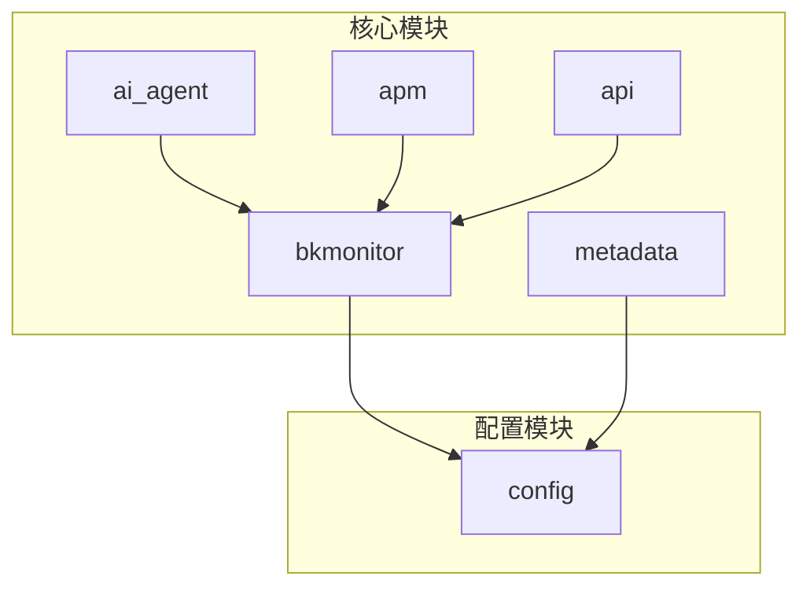
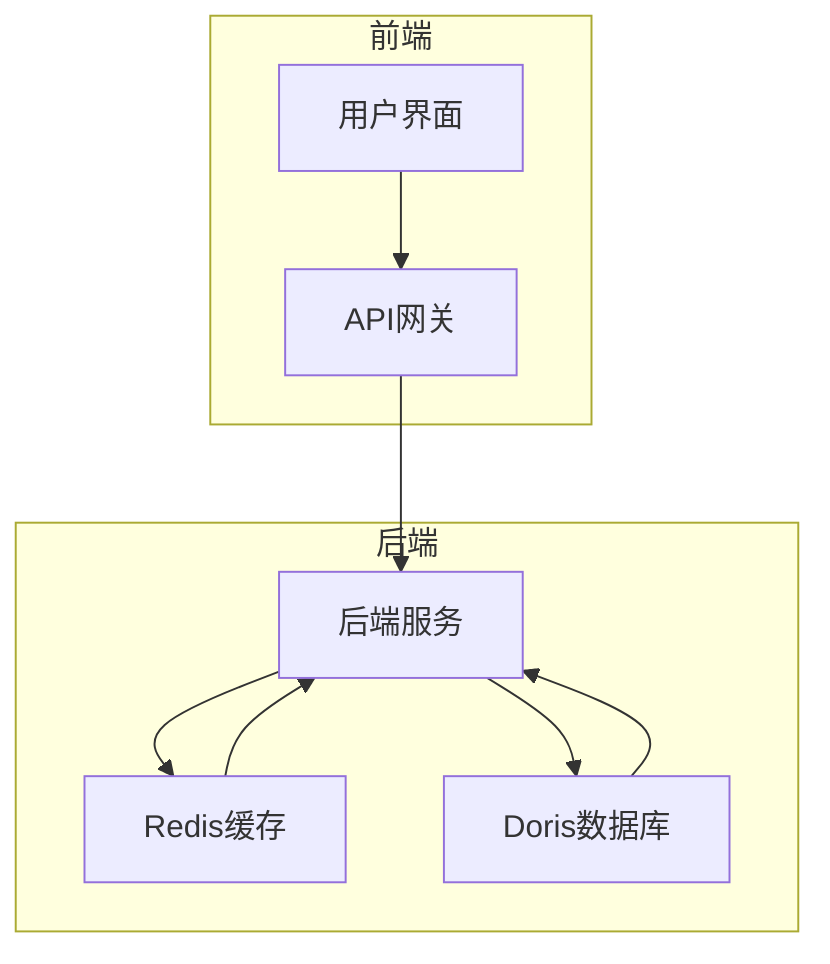
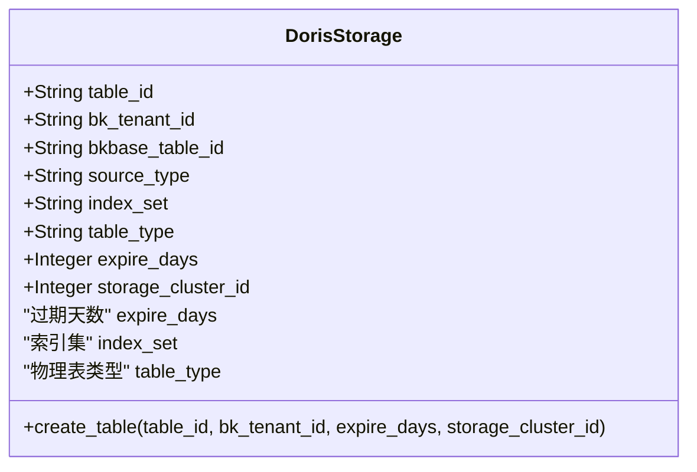
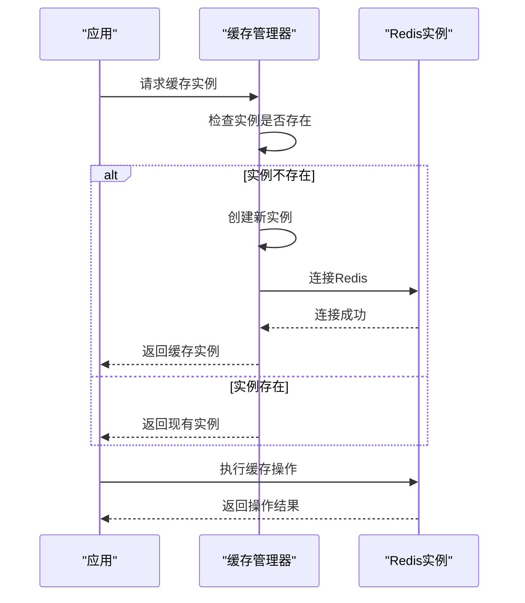
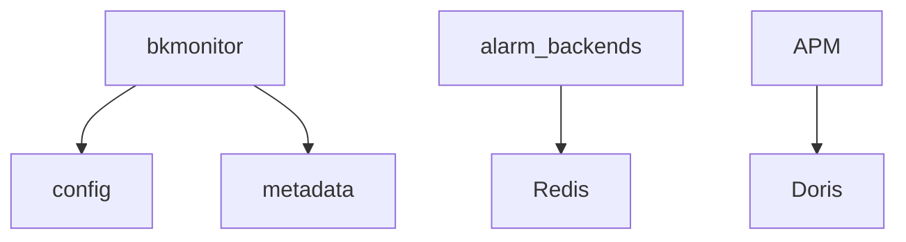

# 指标存储

<cite>
**本文档中引用的文件**   
- [redis.py](file://bkmonitor/alarm_backends/core/storage/redis.py)
- [redis.py](file://bkmonitor/config/tools/redis.py)
- [storage.py](file://bkmonitor/metadata/models/storage.py)
- [log_datalink.py](file://bkmonitor/metadata/resources/log_datalink.py)
- [space_table_id_redis.py](file://bkmonitor/metadata/models/space/space_table_id_redis.py)
</cite>

## 目录
1. [简介](#简介)
2. [项目结构](#项目结构)
3. [核心组件](#核心组件)
4. [架构概述](#架构概述)
5. [详细组件分析](#详细组件分析)
6. [依赖分析](#依赖分析)
7. [性能考虑](#性能考虑)
8. [故障排除指南](#故障排除指南)
9. [结论](#结论)

## 简介
本文档全面介绍了蓝鲸监控平台中APM性能指标的存储架构。文档详细阐述了指标数据的存储结构设计，包括时间序列数据库的选择和数据模型设计；解释了数据分片和分区策略，如何根据时间、服务、实例等维度进行数据组织；介绍了缓存机制的实现，包括Redis缓存的使用场景和配置方法。此外，文档还阐述了数据保留策略和归档机制，如何管理历史数据的存储周期，并提供了存储性能优化建议，包括索引策略、压缩算法等，帮助用户优化存储成本和查询性能。

## 项目结构
蓝鲸监控平台的项目结构遵循模块化设计，主要分为以下几个核心模块：`ai_agent`、`bkmonitor`、`apm`、`api`、`metadata`等。其中，`bkmonitor`模块是监控系统的核心，包含了告警后端、数据存储、服务管理等关键功能。`metadata`模块负责元数据管理，包括Doris存储配置和结果表管理。`config`模块则集中管理了Redis等外部服务的配置信息。

**图示来源**
- [redis.py](file://bkmonitor/config/tools/redis.py)
- [storage.py](file://bkmonitor/metadata/models/storage.py)

**本节来源**
- [redis.py](file://bkmonitor/config/tools/redis.py)
- [storage.py](file://bkmonitor/metadata/models/storage.py)

## 核心组件
本系统的核心组件包括基于Doris的时间序列数据库用于持久化存储APM指标数据，以及基于Redis的多级缓存系统用于提升数据访问性能。Doris作为列式存储数据库，提供了高效的数据压缩和查询性能，特别适合处理大规模时间序列数据。Redis则被用于缓存配置数据、服务间队列和临时状态信息，通过不同的数据库实例（db）进行逻辑隔离。

**本节来源**
- [redis.py](file://bkmonitor/alarm_backends/core/storage/redis.py)
- [storage.py](file://bkmonitor/metadata/models/storage.py)

## 架构概述
系统的整体架构采用分层设计，前端应用通过API网关访问后端服务，后端服务将采集到的APM性能指标数据写入Doris数据库进行持久化存储。同时，系统利用Redis作为缓存层，缓存频繁访问的配置数据和中间状态，减少对后端数据库的直接访问压力。数据保留策略通过DorisStorage模型中的`expire_days`字段进行配置，实现了自动化的数据生命周期管理。

**图示来源**
- [redis.py](file://bkmonitor/alarm_backends/core/storage/redis.py)
- [storage.py](file://bkmonitor/metadata/models/storage.py)

## 详细组件分析
### Doris存储组件分析
Doris存储组件是系统中负责APM指标数据持久化的关键部分。通过`DorisStorage`模型类，系统实现了对Doris数据库的配置和管理。该模型定义了结果表ID、租户ID、数据源类型、索引集、过期天数等关键字段，支持灵活的数据分片和生命周期管理。

#### 数据模型设计

**图示来源**
- [storage.py](file://bkmonitor/metadata/models/storage.py#L5290-L5411)

**本节来源**
- [storage.py](file://bkmonitor/metadata/models/storage.py#L5290-L5411)

### Redis缓存组件分析
Redis缓存组件为系统提供了高性能的数据访问能力。系统通过`BaseRedisCache`基类和`SentinelRedisCache`子类实现了对Redis哨兵模式的支持，确保了缓存服务的高可用性。缓存配置通过环境变量进行管理，支持不同场景下的灵活配置。

#### 缓存机制实现

**图示来源**
- [redis.py](file://bkmonitor/alarm_backends/core/storage/redis.py#L72-L110)
- [redis.py](file://bkmonitor/config/tools/redis.py#L0-L84)

**本节来源**
- [redis.py](file://bkmonitor/alarm_backends/core/storage/redis.py#L72-L110)
- [redis.py](file://bkmonitor/config/tools/redis.py#L0-L84)

## 依赖分析
系统各组件之间存在明确的依赖关系。`bkmonitor`模块依赖于`config`模块获取Redis配置，同时依赖于`metadata`模块进行Doris存储配置管理。`alarm_backends`服务依赖于Redis缓存进行数据交换和状态管理，而APM数据的持久化则完全依赖于Doris数据库。

**图示来源**
- [redis.py](file://bkmonitor/alarm_backends/core/storage/redis.py)
- [storage.py](file://bkmonitor/metadata/models/storage.py)

**本节来源**
- [redis.py](file://bkmonitor/alarm_backends/core/storage/redis.py)
- [storage.py](file://bkmonitor/metadata/models/storage.py)

## 性能考虑
为了优化存储性能，系统采用了多种策略。首先，通过Doris的列式存储和数据压缩技术，有效降低了存储空间占用。其次，利用Redis缓存频繁访问的数据，显著提升了查询响应速度。此外，合理的数据分片和分区策略，如基于时间和服务维度的分区，有助于提高查询效率和数据管理的灵活性。

## 故障排除指南
当遇到存储相关问题时，建议首先检查Redis和Doris服务的运行状态。对于缓存问题，可以查看Redis的连接配置和实例状态；对于数据存储问题，则需要检查DorisStorage模型的配置，特别是`expire_days`和`index_set`等关键字段是否正确设置。

**本节来源**
- [redis.py](file://bkmonitor/alarm_backends/core/storage/redis.py)
- [storage.py](file://bkmonitor/metadata/models/storage.py)

## 结论
本文档详细介绍了蓝鲸监控平台中APM性能指标的存储架构。通过Doris和Redis的有机结合，系统实现了高性能、高可用的指标数据存储解决方案。合理的数据模型设计、灵活的分片策略和有效的缓存机制，共同保障了系统的稳定运行和高效性能。未来，可以通过进一步优化索引策略和压缩算法，持续提升系统的存储效率和查询性能。