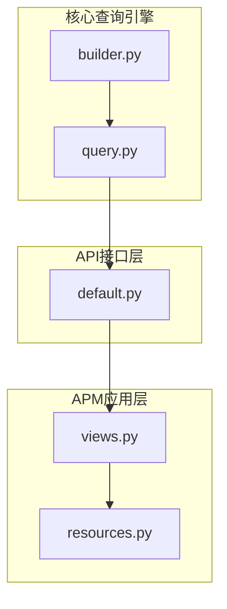
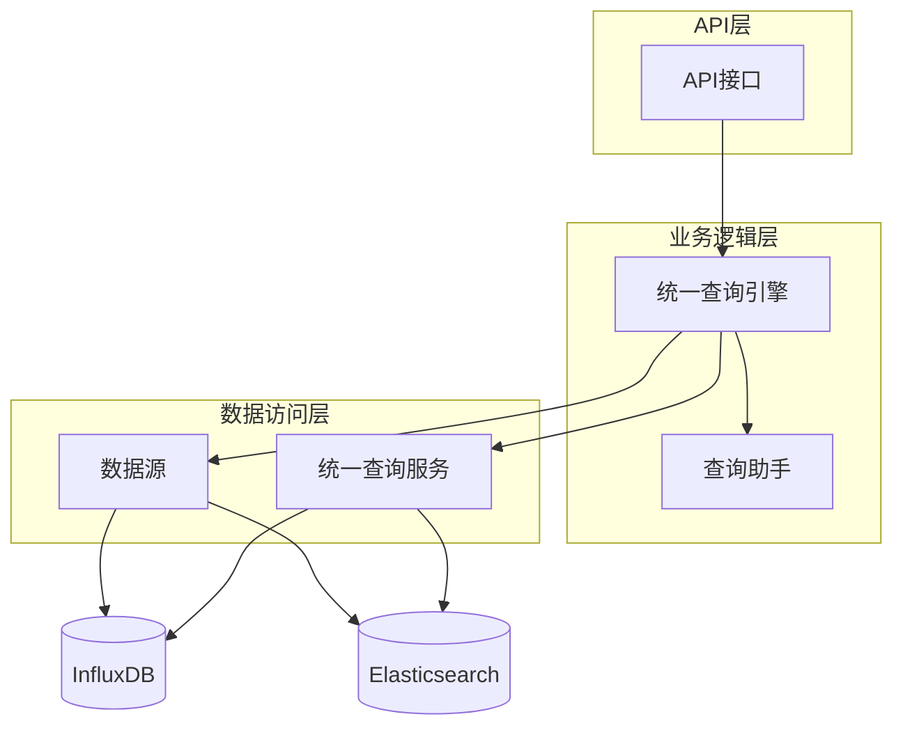
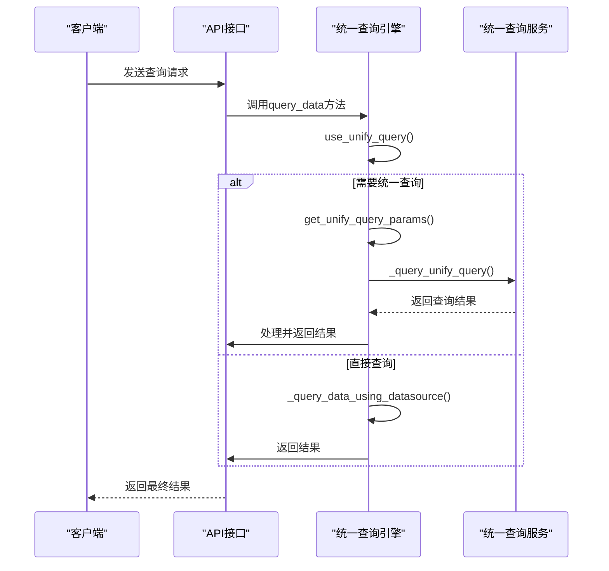
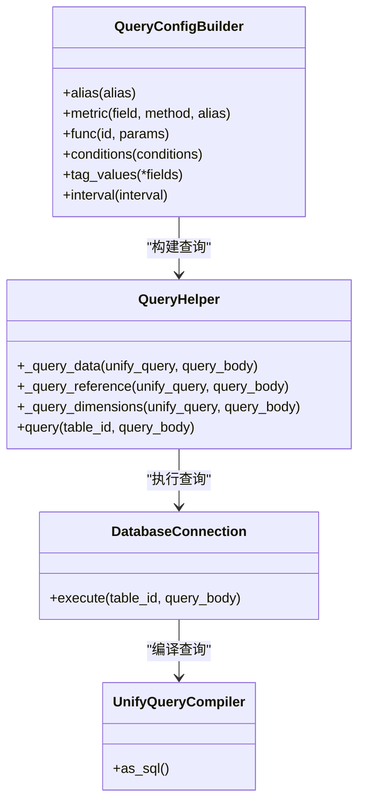
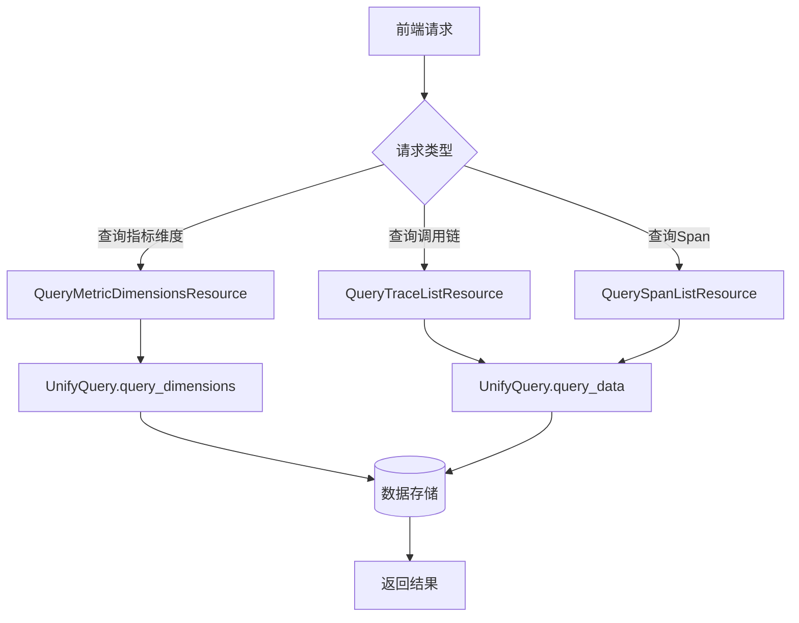
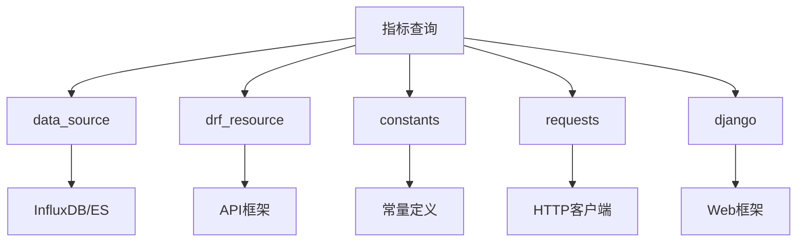

# 指标查询

<cite>
**本文档引用的文件**   
- [query_data.py](file://bkmonitor\packages\utils\query_data.py)
- [default.py](file://bkmonitor\api\unify_query\default.py)
- [builder.py](file://bkmonitor\bkmonitor\data_source\unify_query\builder.py)
- [query.py](file://bkmonitor\bkmonitor\data_source\unify_query\query.py)
- [views.py](file://bkmonitor\apm\views.py)
- [resources.py](file://bkmonitor\apm\resources.py)
</cite>

## 目录
1. [简介](#简介)
2. [项目结构](#项目结构)
3. [核心组件](#核心组件)
4. [架构概述](#架构概述)
5. [详细组件分析](#详细组件分析)
6. [依赖分析](#依赖分析)
7. [性能考虑](#性能考虑)
8. [故障排除指南](#故障排除指南)
9. [结论](#结论)

## 简介
本文档全面介绍了蓝鲸监控平台中APM性能指标的查询机制。文档详细阐述了指标查询功能的设计与实现，包括RESTful API端点定义、类似PromQL的查询语言支持、多维度数据筛选与聚合能力，以及查询性能优化策略。通过分析核心代码文件，本文档为用户提供了深入理解指标查询系统内部工作原理的视角，并提供了实用的查询示例，帮助用户高效地进行性能数据分析。

## 项目结构
蓝鲸监控平台的项目结构遵循模块化设计原则，将不同功能划分为独立的模块。与指标查询功能相关的代码主要分布在`bkmonitor`目录下的多个子模块中。核心的统一查询功能实现在`bkmonitor\bkmonitor\data_source\unify_query`包中，而API接口定义位于`bkmonitor\api\unify_query`目录。APM相关的查询视图和资源定义在`bkmonitor\apm`模块中。这种结构化的组织方式使得功能模块清晰，便于维护和扩展。

**图示来源**
- [builder.py](file://bkmonitor\bkmonitor\data_source\unify_query\builder.py)
- [query.py](file://bkmonitor\bkmonitor\data_source\unify_query\query.py)
- [default.py](file://bkmonitor\api\unify_query\default.py)
- [views.py](file://bkmonitor\apm\views.py)
- [resources.py](file://bkmonitor\apm\resources.py)

## 核心组件
指标查询功能的核心组件包括统一查询引擎、数据源抽象层和API接口。统一查询引擎（`UnifyQuery`类）是整个系统的大脑，负责协调查询流程，决定是使用统一查询服务还是直接查询数据源。数据源抽象层（`DataSource`类）提供了对不同后端存储（如InfluxDB、ES）的统一访问接口。API接口（`UnifyQueryAPIResource`类）则暴露了RESTful端点，供前端和其他服务调用。这些组件协同工作，实现了灵活、高效的指标查询能力。

**组件来源**
- [query.py](file://bkmonitor\bkmonitor\data_source\unify_query\query.py#L100-L200)
- [builder.py](file://bkmonitor\bkmonitor\data_source\unify_query\builder.py#L50-L100)
- [default.py](file://bkmonitor\api\unify_query\default.py#L50-L100)

## 架构概述
指标查询系统的架构采用分层设计，从上到下分为API层、业务逻辑层和数据访问层。API层接收外部请求并进行参数验证；业务逻辑层包含`UnifyQuery`和`QueryHelper`等核心类，负责构建查询、选择查询策略并处理结果；数据访问层通过`DataSource`实现与底层存储的交互。系统支持两种查询模式：直接查询数据源和通过统一查询服务。选择哪种模式取决于查询的复杂性，如是否涉及多指标聚合或使用表达式。

**图示来源**
- [default.py](file://bkmonitor\api\unify_query\default.py)
- [query.py](file://bkmonitor\bkmonitor\data_source\unify_query\query.py)
- [builder.py](file://bkmonitor\bkmonitor\data_source\unify_query\builder.py)

## 详细组件分析

### 统一查询引擎分析
`UnifyQuery`类是指标查询功能的核心，它封装了复杂的查询逻辑。该类在初始化时接收业务ID、数据源列表、表达式和函数等参数。其`query_data`方法是主要的查询入口，首先通过`use_unify_query`方法判断是否需要使用统一查询服务。如果查询涉及多数据源、表达式或特殊函数，则会调用`_query_unify_query`方法，通过API向统一查询服务发起请求。否则，会直接调用`_query_data_using_datasource`方法查询原始数据源。

**图示来源**
- [query.py](file://bkmonitor\bkmonitor\data_source\unify_query\query.py#L300-L500)

### 查询构建器分析
`QueryConfigBuilder`类提供了一种类ORM的接口，用于构建复杂的查询配置。它允许开发者以链式调用的方式添加指标、条件、分组等查询参数，极大地提高了代码的可读性和可维护性。`QueryHelper`类则负责将这些高级查询配置转换为统一查询服务所需的底层参数。`DatabaseConnection`和`UnifyQueryCompiler`类协同工作，将查询对象编译成可以发送给统一查询服务的JSON格式请求体。

**图示来源**
- [builder.py](file://bkmonitor\bkmonitor\data_source\unify_query\builder.py#L50-L200)

### APM查询资源分析
APM模块通过`ApplicationViewSet`暴露了一系列用于性能分析的API端点。`QueryMetricDimensionsResource`资源用于查询指标的维度信息，`QueryTraceListResource`用于查询调用链列表，`QuerySpanListResource`用于查询Span列表。这些资源最终会调用底层的`UnifyQuery`引擎来获取数据。这种设计将APM特定的业务逻辑与通用的查询能力解耦，使得系统既灵活又易于扩展。

**图示来源**
- [views.py](file://bkmonitor\apm\views.py#L50-L100)
- [resources.py](file://bkmonitor\apm\resources.py)

## 依赖分析
指标查询功能依赖于多个核心模块。`bkmonitor\data_source`模块提供了数据源的抽象和加载机制。`core.drf_resource`模块提供了构建RESTful API的基础框架。`constants.data_source`模块定义了数据源和数据类型的常量。此外，系统还依赖于`requests`库进行HTTP通信，以及`django`框架的序列化和视图功能。这些依赖关系确保了系统的稳定性和可扩展性。

**图示来源**
- [query.py](file://bkmonitor\bkmonitor\data_source\unify_query\query.py#L10-L50)
- [default.py](file://bkmonitor\api\unify_query\default.py#L10-L50)

## 性能考虑
系统在设计时充分考虑了性能优化。`UnifyQuery`类使用了`@cached_property`装饰器来缓存`space_uid`的计算结果，避免了重复查询。`using_cache`装饰器被用于`get_data_with_cache`方法，实现了数据查询结果的缓存，减少了对后端存储的直接访问压力。此外，`ThreadPool`被用于并发执行多个数据源的查询，显著提高了多指标查询的效率。对于瞬时查询（instant query），系统会自动调整结束时间，以保证与周期性查询行为的一致性。

## 故障排除指南
当遇到查询失败时，首先应检查日志中的`UNIFY_QUERY`记录，查看发送给统一查询服务的完整请求参数。如果`is_partial`字段为`True`，则表示查询结果不完整，可能需要调整时间范围或限制条件。对于权限问题，需确认`space_uid`和`bk_tenant_id`是否正确传递。如果查询性能低下，可以检查是否启用了缓存，以及查询条件是否过于宽泛导致返回大量数据。监控指标`DATASOURCE_QUERY_COUNT`和`DATASOURCE_QUERY_TIME`可以帮助识别性能瓶颈。

**故障排除来源**
- [query.py](file://bkmonitor\bkmonitor\data_source\unify_query\query.py#L600-L700)
- [default.py](file://bkmonitor\api\unify_query\default.py#L200-L300)

## 结论
蓝鲸监控平台的指标查询功能通过一个精心设计的分层架构，实现了强大而灵活的性能数据分析能力。系统通过统一查询引擎抽象了底层存储的复杂性，支持从简单的单指标查询到复杂的多维度聚合分析。类ORM的查询构建器极大地简化了复杂查询的编写。APM模块充分利用了这一通用能力，提供了丰富的性能监控API。未来，可以通过进一步优化缓存策略和引入更智能的查询计划来提升系统性能。