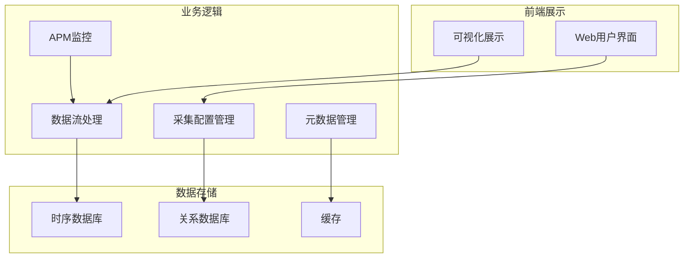
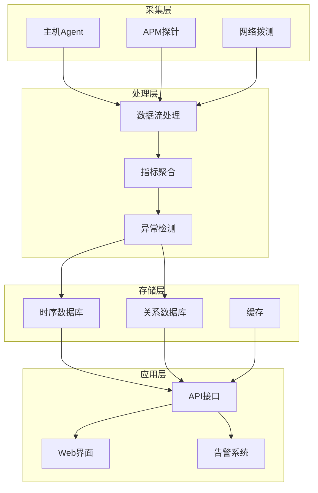
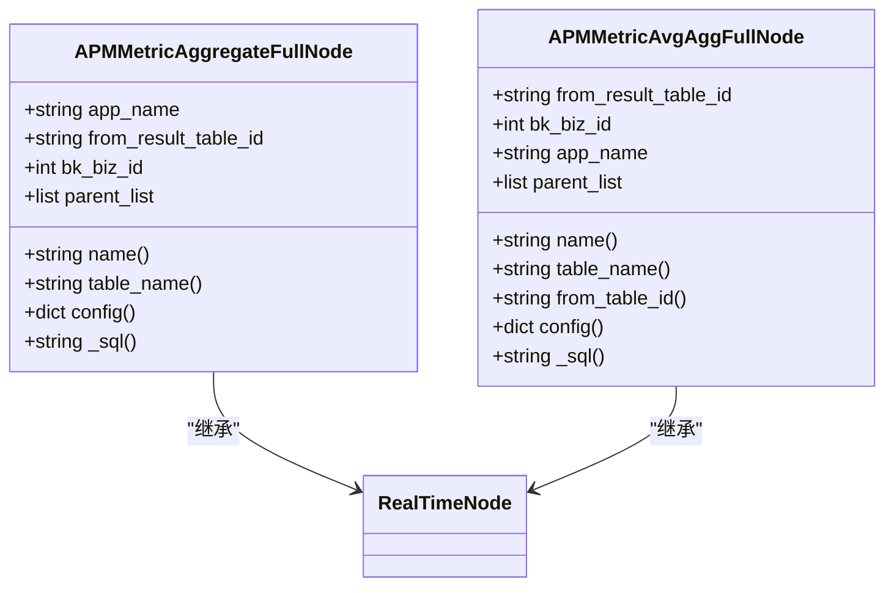
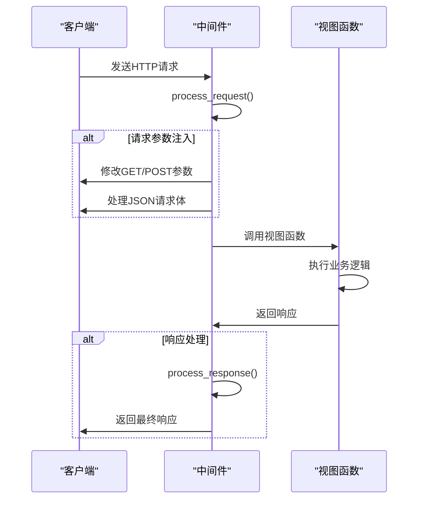
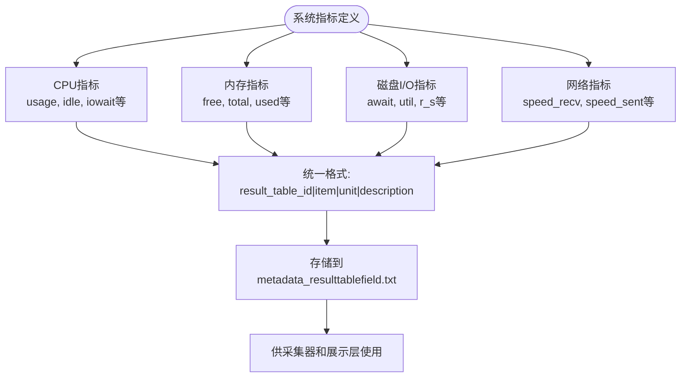
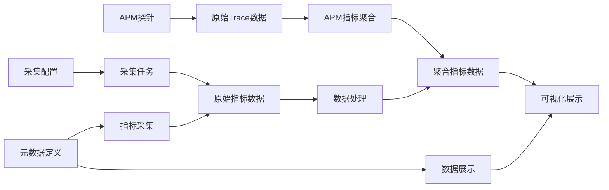

# 指标采集

<cite>
**本文档引用文件**   
- [apm_metrics.py](file://bkmonitor/bkmonitor/dataflow/task/apm_metrics.py)
- [middleware.py](file://bkmonitor/bkm_space/middleware.py)
- [authentication.py](file://bkmonitor/kernel_api/middlewares/authentication.py)
- [metadata_resulttablefield.txt](file://bkmonitor/metadata/data/metadata_resulttablefield.txt)
- [description_append.json](file://bkmonitor/metadata/data/description_append.json)
- [subscription_config.py](file://bkmonitor/metadata/models/custom_report/subscription_config.py)
- [built_in_metrics.py](file://bkmonitor/packages/monitor_web/strategies/metric_cache/built_in_metrics.py)
- [toolkit.py](file://bkmonitor/packages/monitor_web/collecting/resources/toolkit.py)
- [backend.py](file://bkmonitor/packages/monitor_web/collecting/resources/backend.py)
- [collecting/views.py](file://bkmonitor/packages/monitor_web/collecting/views.py)
- [apm_cache_handler.py](file://bkmonitor/apm/core/handlers/apm_cache_handler.py)
</cite>

## 目录
1. [简介](#简介)
2. [项目结构](#项目结构)
3. [核心组件](#核心组件)
4. [架构概述](#架构概述)
5. [详细组件分析](#详细组件分析)
6. [依赖分析](#依赖分析)
7. [性能考虑](#性能考虑)
8. [故障排除指南](#故障排除指南)
9. [结论](#结论)

## 简介
本项目旨在实现全面的性能监控功能，重点在于APM（应用性能监控）指标的采集与分析。系统通过多种技术手段采集不同层级的性能指标，包括应用层面的API调用信息、系统层面的资源使用情况等。监控系统采用分布式架构，支持大规模数据采集和实时处理，为运维人员提供全面的系统健康状况视图。

## 项目结构
项目采用模块化设计，各功能模块职责分明。核心监控功能位于`bkmonitor`目录下，包含数据流处理、采集配置管理、APM监控等子模块。`metadata`目录存储所有监控指标的元数据定义，`packages/monitor_web`包含前端展示和用户交互逻辑。系统通过清晰的分层设计，实现了采集、处理、存储和展示的分离。

**图示来源**
- [apm_metrics.py](file://bkmonitor/bkmonitor/dataflow/task/apm_metrics.py)
- [backend.py](file://bkmonitor/packages/monitor_web/collecting/resources/backend.py)

**本节来源**
- [apm_metrics.py](file://bkmonitor/bkmonitor/dataflow/task/apm_metrics.py)
- [backend.py](file://bkmonitor/packages/monitor_web/collecting/resources/backend.py)

## 核心组件
系统的核心组件包括APM指标聚合计算、采集配置管理、系统指标定义和API调用拦截。APM指标聚合通过Flink实时计算框架实现，对原始Trace数据进行聚合分析。采集配置管理模块负责采集任务的创建、更新和状态监控。系统指标定义文件详细描述了CPU、内存、磁盘I/O等系统级指标的采集内容。API调用拦截通过Django中间件实现，能够捕获和处理请求与响应信息。

**本节来源**
- [apm_metrics.py](file://bkmonitor/bkmonitor/dataflow/task/apm_metrics.py)
- [middleware.py](file://bkmonitor/bkm_space/middleware.py)
- [metadata_resulttablefield.txt](file://bkmonitor/metadata/data/metadata_resulttablefield.txt)

## 架构概述
系统采用分层架构设计，从数据采集到最终展示分为多个层次。最底层是数据采集层，通过各种探针和代理收集原始指标数据。中间是数据处理层，负责数据的清洗、聚合和转换。上层是存储层，将处理后的数据持久化到时序数据库和关系数据库。最上层是应用层，提供API接口和Web界面供用户查询和分析监控数据。各层之间通过标准接口通信，保证了系统的可扩展性和可维护性。

**图示来源**
- [apm_metrics.py](file://bkmonitor/bkmonitor/dataflow/task/apm_metrics.py)
- [backend.py](file://bkmonitor/packages/monitor_web/collecting/resources/backend.py)

## 详细组件分析

### APM指标聚合分析
APM指标聚合组件负责将原始的Trace数据转换为可分析的性能指标。系统通过Flink实时计算框架对数据流进行处理，计算调用次数、响应时间、错误率等关键性能指标。聚合结果按服务、接口等维度分组，便于后续的分析和展示。

**图示来源**
- [apm_metrics.py](file://bkmonitor/bkmonitor/dataflow/task/apm_metrics.py#L1-L100)

**本节来源**
- [apm_metrics.py](file://bkmonitor/bkmonitor/dataflow/task/apm_metrics.py#L1-L100)

### API调用拦截分析
API调用拦截通过Django中间件实现，能够在请求处理的各个阶段插入自定义逻辑。系统实现了参数注入中间件和认证中间件，分别负责请求参数的处理和用户身份验证。中间件机制使得系统能够在不修改业务代码的情况下，实现统一的请求处理逻辑。

**图示来源**
- [middleware.py](file://bkmonitor/bkm_space/middleware.py#L1-L50)
- [authentication.py](file://bkmonitor/kernel_api/middlewares/authentication.py#L150-L250)

**本节来源**
- [middleware.py](file://bkmonitor/bkm_space/middleware.py#L1-L50)
- [authentication.py](file://bkmonitor/kernel_api/middlewares/authentication.py#L150-L250)

### 系统指标定义分析
系统指标定义文件详细描述了各类系统级指标的采集内容和格式。指标按类别组织，包括CPU、内存、磁盘I/O、网络等。每个指标都有唯一的标识符、单位和中文描述，确保了指标的可读性和一致性。这些定义为数据采集和展示提供了标准依据。

**图示来源**
- [metadata_resulttablefield.txt](file://bkmonitor/metadata/data/metadata_resulttablefield.txt#L1-L100)
- [description_append.json](file://bkmonitor/metadata/data/description_append.json#L1-L100)

**本节来源**
- [metadata_resulttablefield.txt](file://bkmonitor/metadata/data/metadata_resulttablefield.txt#L1-L100)
- [description_append.json](file://bkmonitor/metadata/data/description_append.json#L1-L100)

## 依赖分析
系统各组件之间存在明确的依赖关系。APM指标聚合依赖于原始Trace数据的采集，采集配置管理依赖于元数据定义。前端展示依赖于处理后的聚合数据和配置信息。通过依赖注入和接口隔离，系统实现了组件间的松耦合，提高了代码的可测试性和可维护性。

**图示来源**
- [apm_metrics.py](file://bkmonitor/bkmonitor/dataflow/task/apm_metrics.py)
- [metadata_resulttablefield.txt](file://bkmonitor/metadata/data/metadata_resulttablefield.txt)

**本节来源**
- [apm_metrics.py](file://bkmonitor/bkmonitor/dataflow/task/apm_metrics.py)
- [metadata_resulttablefield.txt](file://bkmonitor/metadata/data/metadata_resulttablefield.txt)

## 性能考虑
系统在设计时充分考虑了性能影响。通过配置采集频率和QPS限制，可以平衡监控精度和系统开销。指标聚合采用流式处理，避免了大规模数据的批量处理带来的性能瓶颈。缓存机制的使用减少了对后端存储的直接访问，提高了系统响应速度。

**本节来源**
- [subscription_config.py](file://bkmonitor/metadata/models/custom_report/subscription_config.py#L150-L250)
- [apm_metrics.py](file://bkmonitor/bkmonitor/dataflow/task/apm_metrics.py#L1-L100)

## 故障排除指南
当系统出现性能问题时，应首先检查采集配置的QPS设置是否合理。如果发现数据延迟，需要检查Flink作业的处理能力。对于指标缺失问题，应验证采集探针是否正常运行。系统提供了详细的日志记录和监控指标，有助于快速定位和解决问题。

**本节来源**
- [backend.py](file://bkmonitor/packages/monitor_web/collecting/resources/backend.py#L300-L500)
- [toolkit.py](file://bkmonitor/packages/monitor_web/collecting/resources/toolkit.py#L250-L350)

## 结论
本系统通过多层次的指标采集和处理机制，实现了全面的应用性能监控。系统架构设计合理，组件职责分明，具有良好的可扩展性和可维护性。通过合理的配置和优化，可以在保证监控效果的同时，将系统开销控制在可接受范围内。未来可以进一步优化数据处理流程，提高系统的实时性和准确性。