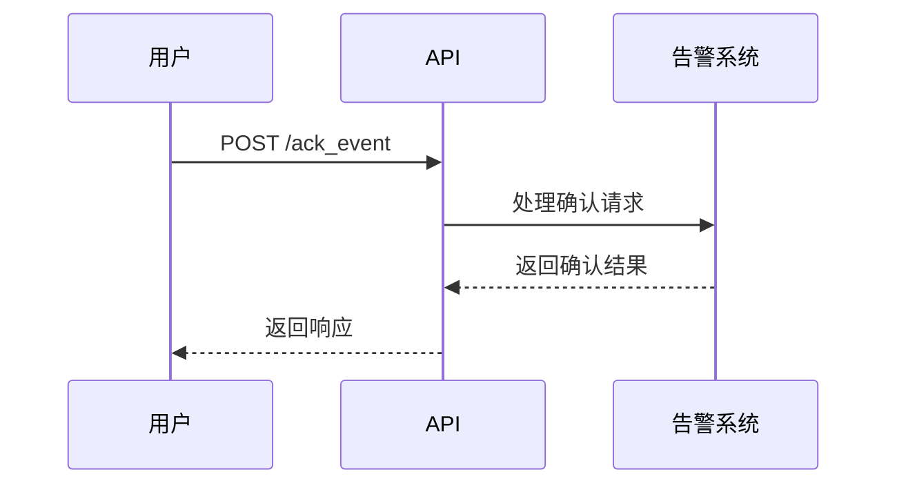
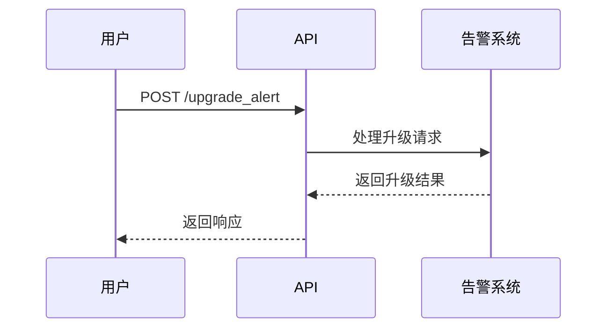
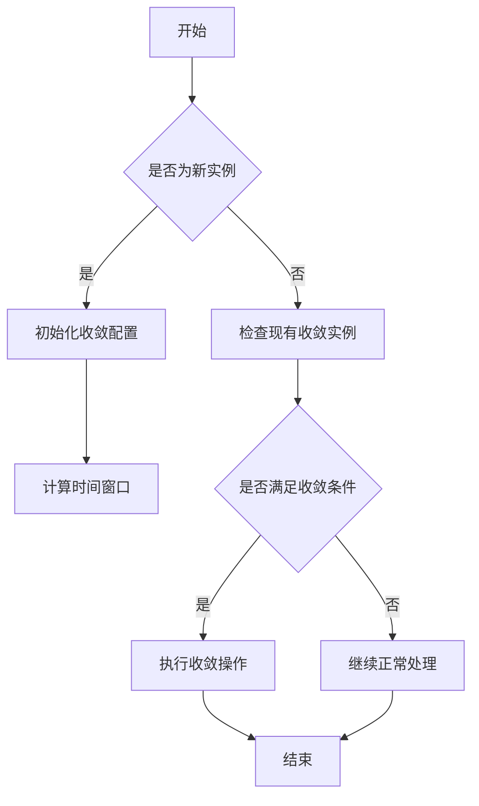
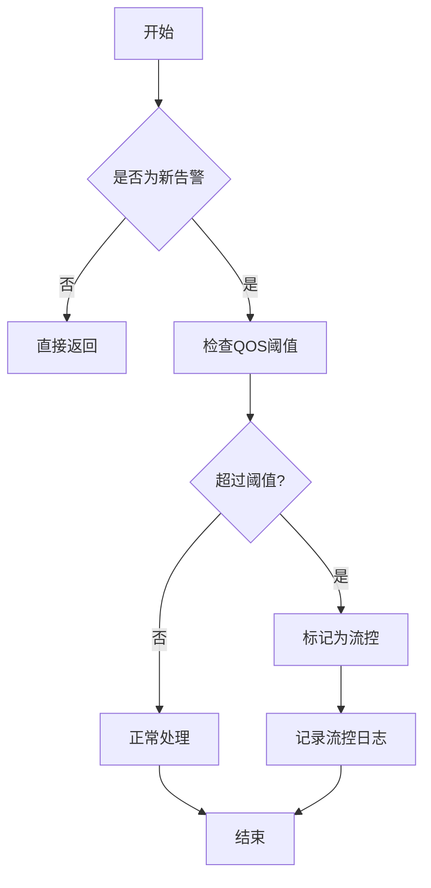

# 告警API

<cite>
**本文档引用文件**  
- [search_alert.md](file://bkmonitor/docs/api/apidocs/zh_hans/search_alert.md)
- [alert.py](file://bkmonitor/bkmonitor/documents/alert.py)
- [alert_events/views.py](file://bkmonitor/packages/monitor_web/alert_events/views.py)
- [converge_func.py](file://bkmonitor/alarm_backends/service/converge/converge_func.py)
- [alert.py](file://bkmonitor/alarm_backends/core/alert/alert.py)
- [alert.py](file://bkmonitor/constants/alert.py)
- [action.py](file://bkmonitor/constants/action.py)
</cite>

## 目录
1. [告警查询接口](#告警查询接口)
2. [告警处理操作](#告警处理操作)
3. [告警收敛机制](#告警收敛机制)
4. [告警数据结构](#告警数据结构)
5. [API性能与调用限制](#api性能与调用限制)

## 告警查询接口

告警查询接口用于获取系统中的告警列表，支持多种过滤条件、分页参数和排序选项。

### 请求参数

| 字段 | 类型 | 必选 | 描述 |
| ---- | ---- | ---- | ---- |
| bk_biz_ids | List[int] | 是 | 业务ID列表 |
| status | List[string] | 否 | 状态，可选 `MINE`, `ABNORMAL`, `CLOSED`, `RECOVERED` |
| conditions | List[Condition] | 否 | 过滤条件 |
| query_string | string | 否 | 查询字符串，语法：https://www.elastic.co/guide/en/elasticsearch/reference/current/query-dsl-query-string-query.html#query-string-query-notes |
| ordering | list[string] | 否 | 排序字段，字段前面加 "-" 代表倒序 |
| start_time | int | 是 | 开始时间 |
| end_time | int | 是 | 结束时间 |
| page | int | 是 | 页数 |
| page_size | int | 是 | 每页条数（最大5000） |
| show_overview | bool | 否 | 是否返回总览统计信息，默认 true |
| show_aggs | bool | 否 | 是否返回聚合统计信息，默认 true |
| show_dsl | Bool | 否 | 是否返回DSL，默认False |

### 过滤条件（conditions）

| 字段 | 类型 | 必须 | 描述 |
| :--- | :--- | :--- | :--- |
| key | string | 是 | 字段名 |
| value | List | 是 | 可取值的列表。当 `method = eq`，则满足其一即可；当`method = neq`，则全都不满足 |
| method | string | 是 | 匹配方式，可选 `eq`, `neq`，默认 `eq` |
| condition | string | 否 | 可选 `and`, `or` |

### 响应参数

| 字段 | 类型 | 描述 |
| ---- | ---- | ---- |
| result | bool | 请求是否成功 |
| code | int | 返回的状态码 |
| message | string | 描述信息 |
| data | dict | 相关的告警列表数据 |

#### data字段说明

| 字段 | 类型 | 描述 |
| ---- | ---- | ---- |
| alerts | List | 所有的告警列表 |
| total | int | 返回告警列表的条数 |
| aggs | List | 返回的聚合统计信息 |

**Section sources**
- [search_alert.md](file://bkmonitor/docs/api/apidocs/zh_hans/search_alert.md)

## 告警处理操作

告警处理操作包括告警状态变更、告警确认、告警升级等，通过API调用实现。

### 告警确认

告警确认操作通过POST请求实现，用于标记告警为已确认状态。

**Diagram sources**
- [alert_events/views.py](file://bkmonitor/packages/monitor_web/alert_events/views.py#L25-L46)

### 告警升级

告警升级操作通过设置监督人和调整严重级别实现。

**Section sources**
- [alert_events/views.py](file://bkmonitor/packages/monitor_web/alert_events/views.py)

## 告警收敛机制

告警收敛机制用于减少重复告警，提高告警处理效率。

### 收敛规则

| 收敛函数 | 描述 |
| ---- | ---- |
| skip_when_success | 成功后跳过 |
| approve_when_failed | 失败时审批 |
| skip_when_proceed | 执行中跳过 |
| wait_when_proceed | 执行中等待 |
| defense | 异常防御需审批 |
| skip_when_exceed | 超出后直接忽略 |
| collect | 超出后汇总 |
| collect_alarm | 汇总通知 |

### 收敛处理逻辑

**Diagram sources**
- [converge_func.py](file://bkmonitor/alarm_backends/service/converge/converge_func.py)

**Section sources**
- [converge_func.py](file://bkmonitor/alarm_backends/service/converge/converge_func.py)

## 告警数据结构

告警数据结构定义了告警的各个字段及其含义。

### 核心字段

| 字段 | 类型 | 描述 |
| ---- | ---- | ---- |
| id | String | 告警id |
| alert_name | String | 告警名称 |
| assignee | List(string) | 负责人列表 |
| begin_time | Int | 开始时间 |
| bk_biz_id | Int | 业务id |
| severity | Int | 级别 |
| status | String | 状态 |
| strategy_id | Int | 策略ID |
| create_time | Int | 创建时间 |
| is_ack | Bool | 是否确认 |
| is_handled | Bool | 是否已处理 |
| is_shielded | Bool | 是否已屏蔽 |

### 告警级别

| 级别 | 数值 | 描述 |
| ---- | ---- | ---- |
| 致命 | 1 | 严重问题，需要立即处理 |
| 预警 | 2 | 潜在问题，需要关注 |
| 提醒 | 3 | 一般问题，可后续处理 |

### 告警状态

| 状态 | 描述 |
| ---- | ---- |
| ABNORMAL | 未恢复 |
| RECOVERED | 已恢复 |
| CLOSED | 已失效 |

**Section sources**
- [alert.py](file://bkmonitor/bkmonitor/documents/alert.py)
- [alert.py](file://bkmonitor/constants/alert.py)

## API性能与调用限制

告警API具有性能特性和调用频率限制，以确保系统稳定性。

### QOS检测机制

告警QOS检测用于防止告警风暴，当告警数量超过阈值时进行流控。

**Diagram sources**
- [alert.py](file://bkmonitor/alarm_backends/core/alert/alert.py#L909-L962)

### 性能参数

| 参数 | 值 | 描述 |
| ---- | ---- | ---- |
| QOS_ALERT_THRESHOLD | 由配置决定 | 告警QOS阈值 |
| QOS_ALERT_WINDOW | 由配置决定 | 告警QOS窗口期 |
| MAX_PAGE_SIZE | 5000 | 每页最大条数 |

当告警所属策略在当前窗口期内产生的告警数量超过QOS阈值时，新的告警将被流控，直到数量低于阈值。

**Section sources**
- [alert.py](file://bkmonitor/alarm_backends/core/alert/alert.py)