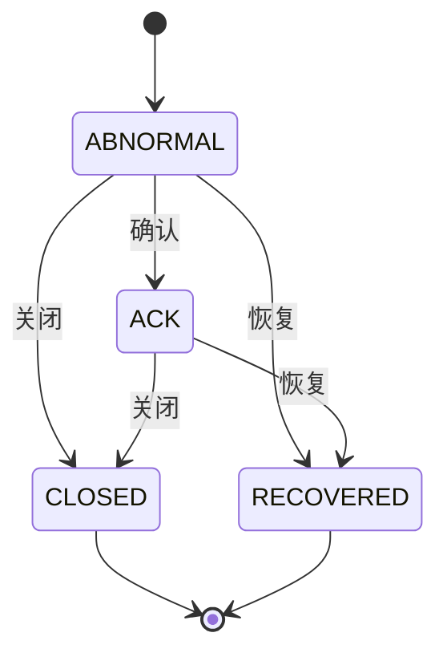

# 告警处理API

<cite>
**本文档引用的文件**   
- [alert_assign.py](file://bkmonitor/alarm_backends/service/fta_action/tasks/alert_assign.py)
- [frontend_resources.py](file://bkmonitor/packages/fta_web/action/resources/frontend_resources.py)
- [resources.py](file://bkmonitor/packages/fta_web/alert/resources.py)
- [upgrade.py](file://bkmonitor/alarm_backends/service/alert/manager/checker/upgrade.py)
- [alert.py](file://bkmonitor/alarm_backends/core/alert/alert.py)
</cite>

## 目录
1. [简介](#简介)
2. [核心操作API](#核心操作api)
3. [告警状态机转换规则](#告警状态机转换规则)
4. [操作审计日志](#操作审计日志)
5. [使用示例](#使用示例)

## 简介
本文档详细介绍了告警处理API的核心功能，包括告警状态变更、告警确认、告警升级和告警分配等操作。文档涵盖了API的HTTP方法、请求参数、权限要求和业务逻辑，并提供了告警状态机转换规则的完整说明。此外，还记录了操作审计日志的生成机制和存储位置，并通过实际使用示例展示了如何通过API完成常见的告警处理流程。

## 核心操作API

### 告警确认API
告警确认API用于确认告警，更新告警的确认状态。

**HTTP方法**: POST  
**请求参数**:
- `ids`: 告警ID列表
- `message`: 确认信息

**权限要求**: 用户必须具有相应的业务权限。

**业务逻辑**:
1. 检查告警是否存在且状态为异常。
2. 更新告警的确认状态，并记录操作日志。
3. 返回确认结果。

```python
class AckAlertResource(Resource):
    """
    告警确认
    """

    class RequestSerializer(serializers.Serializer):
        ids = serializers.ListField(label="告警ID", child=AlertIDField())
        message = serializers.CharField(required=True, allow_blank=True, label="确认信息")

    def perform_request(self, validated_request_data):
        alert_ids = validated_request_data["ids"]

        alerts_should_ack = set()
        alerts_already_ack = set()
        alerts_not_abnormal = set()

        alerts = AlertDocument.mget(alert_ids)

        for alert in alerts:
            if alert.status != EventStatus.ABNORMAL:
                alerts_not_abnormal.add(alert.id)
            elif alert.is_ack:
                alerts_already_ack.add(alert.id)
            else:
                alerts_should_ack.add(alert.id)

        alerts_not_exist = set(alert_ids) - alerts_should_ack - alerts_already_ack - alerts_not_abnormal

        now_time = int(time.time())
        # 保存流水日志
        AlertLog(
            alert_id=list(alerts_should_ack),
            op_type=AlertLog.OpType.ACK,
            create_time=now_time,
            description=validated_request_data["message"],
            operator=get_request_username(),
        ).save()

        # 更新告警确认状态
        alert_documents = [
            AlertDocument(
                id=alert_id,
                is_ack=True,
                is_ack_noticed=False,
                ack_operator=get_request_username(),
                update_time=now_time,
            )
            for alert_id in alerts_should_ack
        ]
        AlertDocument.bulk_create(alert_documents, action=BulkActionType.UPDATE)
        return {
            "alerts_ack_success": list(alerts_should_ack),
            "alerts_not_exist": list(alerts_not_exist),
            "alerts_already_ack": list(alerts_already_ack),
            "alerts_not_abnormal": list(alerts_not_abnormal),
        }
```

**Section sources**
- [resources.py](file://bkmonitor/packages/fta_web/alert/resources.py#L1189-L1268)

### 告警升级API
告警升级API用于升级告警，触发升级通知。

**HTTP方法**: POST  
**请求参数**:
- `alert_ids`: 告警ID列表
- `upgrade_config`: 升级配置

**权限要求**: 用户必须具有相应的业务权限。

**业务逻辑**:
1. 检查告警是否存在且状态为异常。
2. 判断是否需要升级，根据升级配置计算新的用户组。
3. 发送升级通知，并记录操作日志。
4. 返回升级结果。

```python
class UpgradeChecker(BaseChecker):
    """
    通知相关的状态检测
    """

    def check(self, alert: Alert):
        alert_doc = alert.to_document()
        notice_relation = alert_doc.strategy.get("notice", {}) if alert_doc.strategy else {}
        upgrade_notice = {
            "strategy_id": alert_doc.strategy_id,
            "signal": alert_doc.status.lower(),
            "alert_ids": [alert_doc.id],
            "severity": alert_doc.severity,
            "relation_id": notice_relation.get("id"),
            "notice_type": ActionNoticeType.UPGRADE,
        }
        upgrade_config = notice_relation.get("options", {}).get("upgrade_config") or {}
        assign_labels = {
            "bk_biz_id": alert.bk_biz_id,
            "assign_type": "alert_check",
            "notice_type": None,
            "alert_source": alert.top_event.get("plugin_id", ""),
        }
        rule_group_id = None
        exc = None
        with metrics.ALERT_ASSIGN_PROCESS_TIME.labels(**assign_labels).time():
            # 先判断是否有命中分派规则是否需要升级
            assign_mode = (
                notice_relation.get("options", {}).get("assign_mode") or [AssignMode.BY_RULE, AssignMode.ONLY_NOTICE]
                if alert_doc.strategy
                else [AssignMode.BY_RULE]
            )
            try:
                assign_manager = BackendAssignMatchManager(alert_doc, assign_mode=assign_mode)
            except BaseException as error:  # noqa
                exc = error
                logger.exception(
                    "[assign failed] alert(%s) strategy(%s) detail: %s", alert_doc.id, alert_doc.strategy_id, str(error)
                )
            matched_rules = assign_manager.get_matched_rules()
            need_upgrade = False
            if not matched_rules and AssignMode.ONLY_NOTICE in assign_mode:
                # 如果没有适配上规则，并且支持默认通知，则判断默认通知是否需要升级
                need_upgrade = self.need_origin_upgrade(alert_doc, upgrade_config)
            else:
                for rule in matched_rules:
                    rule_group_id = rule.assign_rule["assign_group_id"]
                    if rule.need_upgrade:
                        need_upgrade = True
                        break

        assign_labels.update({"rule_group_id": rule_group_id, "status": metrics.StatusEnum.from_exc(exc)})
        metrics.ALERT_ASSIGN_PROCESS_COUNT.labels(**assign_labels).inc()
        if need_upgrade:
            # 如果有的话，直接发送升级通知任务
            logger.info("[push upgrade action]  alert(%s) strategy(%s)", alert_doc.id, alert_doc.strategy_id)
            create_actions.delay(**upgrade_notice)
```

**Section sources**
- [upgrade.py](file://bkmonitor/alarm_backends/service/alert/manager/checker/upgrade.py#L25-L83)

### 告警分配API
告警分配API用于将告警分配给指定人员。

**HTTP方法**: POST  
**请求参数**:
- `appointees`: 指派成员列表
- `alert_ids`: 告警ID列表
- `reason`: 分派原因
- `notice_ways`: 通知类型
- `bk_biz_id`: 业务ID

**权限要求**: 用户必须具有相应的业务权限。

**业务逻辑**:
1. 检查告警是否存在且状态为异常。
2. 更新告警的分配状态，并记录操作日志。
3. 发送通知给指定人员。
4. 返回分配结果。

```python
class AssignAlertResource(Resource):
    """
    分派告警给到指定人员
    """

    class RequestSerializer(serializers.Serializer):
        appointees = serializers.ListField(child=serializers.CharField(), required=True, label="指派成员")
        alert_ids = serializers.ListField(child=serializers.CharField(), required=True, label="告警ID列表")
        reason = serializers.CharField(required=True, label="分派原因")
        notice_ways = serializers.ListField(required=True, child=serializers.CharField(), label="通知类型")
        bk_biz_id = serializers.CharField(required=True, label="业务ID")

    def perform_request(self, validated_request_data):
        operator = get_request_username()
        appointees = validated_request_data["appointees"]
        appointees_set = set(appointees)
        assign_reason = validated_request_data["reason"]
        alert_ids = validated_request_data["alert_ids"]
        current_time = int(time.time())
        alert_log = AlertLog(
            **dict(
                op_type=AlertLog.OpType.ACTION,
                alert_id=alert_ids,
                description=_("{creator}分派告警给({appointees}), 分派原因：{reason}").format(
                    creator=operator, appointees=",".join(appointees), reason=assign_reason
                ),
                time=current_time,
                create_time=current_time,
                event_id=current_time,
            )
        )
        alerts = AlertDocument.mget(alert_ids)
        alert_assignees = {alert.id: set(list(alert.appointee) + list(alert.assignee)) for alert in alerts}
        all_diff_assignees = []
        for alert in alerts:
            # 负责人 + 分派人差集
            diff_assignees = appointees_set.difference(alert_assignees[alert.id])
            all_diff_assignees.append(diff_assignees)
            # 分派人差集，不存在需要更新
            diff_appointees = appointees_set.difference(set(alert.appointee))

            if diff_appointees:
                alert.appointee.extend(list(diff_appointees))
                alert.assignee.extend(list(diff_assignees))

        notice_receivers = set()
        for notice_receiver in all_diff_assignees:
            notice_receivers = notice_receivers | notice_receiver

        assigned_alerts = [
            AlertDocument(id=alert.id, appointee=list(alert.appointee), assignee=list(alert.assignee))
            for alert in alerts
        ]
        AlertLog.bulk_create([alert_log])
        AlertDocument.bulk_create(assigned_alerts, action=BulkActionType.UPDATE)
        validated_request_data["notice_receivers"] = notice_receivers
        validated_request_data["operator"] = operator
        # 可以考虑改成同步
        notify_to_appointee.delay(validated_request_data)
        return {"assigned_alerts": [alert.id for alert in alerts], "notice_receivers": notice_receivers}
```

**Section sources**
- [frontend_resources.py](file://bkmonitor/packages/fta_web/action/resources/frontend_resources.py#L600-L799)

## 告警状态机转换规则
告警状态机管理告警的整个生命周期，从触发到恢复。状态机包括以下状态：
- **ABNORMAL**: 异常状态，告警被触发。
- **ACK**: 确认状态，告警已被确认。
- **CLOSED**: 关闭状态，告警已被关闭。
- **RECOVERED**: 恢复状态，告警已恢复正常。

状态转换规则如下：
1. **ABNORMAL -> ACK**: 当用户确认告警时，状态从异常变为确认。
2. **ABNORMAL -> CLOSED**: 当用户关闭告警时，状态从异常变为关闭。
3. **ABNORMAL -> RECOVERED**: 当告警条件不再满足时，状态从异常变为恢复。
4. **ACK -> CLOSED**: 当用户关闭已确认的告警时，状态从确认变为关闭。
5. **ACK -> RECOVERED**: 当告警条件不再满足时，状态从确认变为恢复。



**Diagram sources**
- [alert.py](file://bkmonitor/alarm_backends/core/alert/alert.py)

## 操作审计日志
操作审计日志记录了所有告警处理操作，包括确认、升级和分配等。日志存储在`AlertLog`模型中，包含以下字段：
- `op_type`: 操作类型（确认、升级、分配等）
- `alert_id`: 告警ID
- `description`: 操作描述
- `time`: 操作时间
- `create_time`: 创建时间
- `event_id`: 事件ID

日志生成机制如下：
1. 当用户执行告警处理操作时，系统会创建一个`AlertLog`对象。
2. `AlertLog`对象包含操作的详细信息，如操作类型、告警ID、操作描述等。
3. `AlertLog`对象被保存到数据库中，供后续查询和审计。

```python
alert_log = AlertLog(
    **dict(
        op_type=AlertLog.OpType.ACTION,
        alert_id=alert_ids,
        description=_("{creator}分派告警给({appointees}), 分派原因：{reason}").format(
            creator=operator, appointees=",".join(appointees), reason=assign_reason
        ),
        time=current_time,
        create_time=current_time,
        event_id=current_time,
    )
)
AlertLog.bulk_create([alert_log])
```

**Section sources**
- [frontend_resources.py](file://bkmonitor/packages/fta_web/action/resources/frontend_resources.py#L600-L799)

## 使用示例
以下示例展示了如何通过API完成常见的告警处理流程。

### 确认告警
```python
import requests

url = "http://your-api-endpoint/ack_alert"
data = {
    "ids": ["alert-1", "alert-2"],
    "message": "确认告警"
}
response = requests.post(url, json=data)
print(response.json())
```

### 升级告警
```python
import requests

url = "http://your-api-endpoint/upgrade_alert"
data = {
    "alert_ids": ["alert-1"],
    "upgrade_config": {
        "user_groups": [1, 2],
        "upgrade_interval": 30,
        "is_enabled": True
    }
}
response = requests.post(url, json=data)
print(response.json())
```

### 分配告警
```python
import requests

url = "http://your-api-endpoint/assign_alert"
data = {
    "appointees": ["user1", "user2"],
    "alert_ids": ["alert-1"],
    "reason": "紧急处理",
    "notice_ways": ["mail", "sms"],
    "bk_biz_id": "123"
}
response = requests.post(url, json=data)
print(response.json())
```

**Section sources**
- [resources.py](file://bkmonitor/packages/fta_web/alert/resources.py#L1189-L1268)
- [upgrade.py](file://bkmonitor/alarm_backends/service/alert/manager/checker/upgrade.py#L25-L83)
- [frontend_resources.py](file://bkmonitor/packages/fta_web/action/resources/frontend_resources.py#L600-L799)