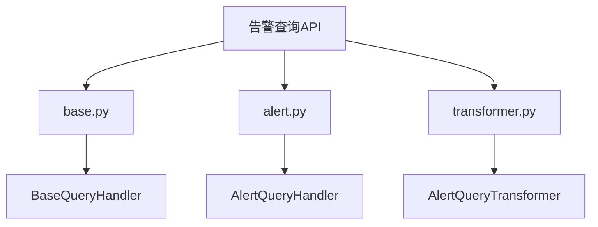
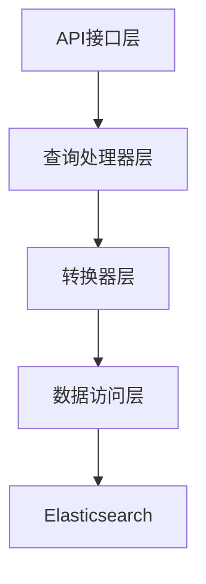
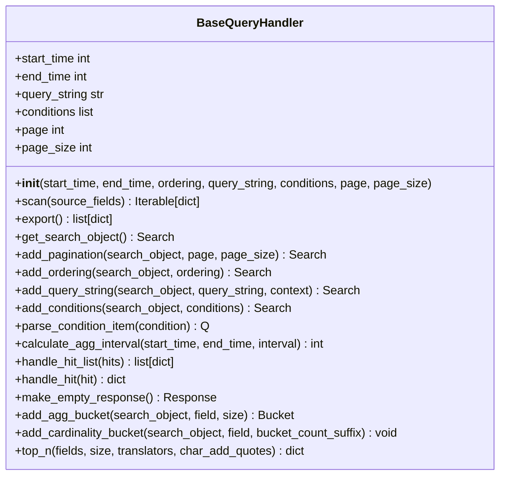
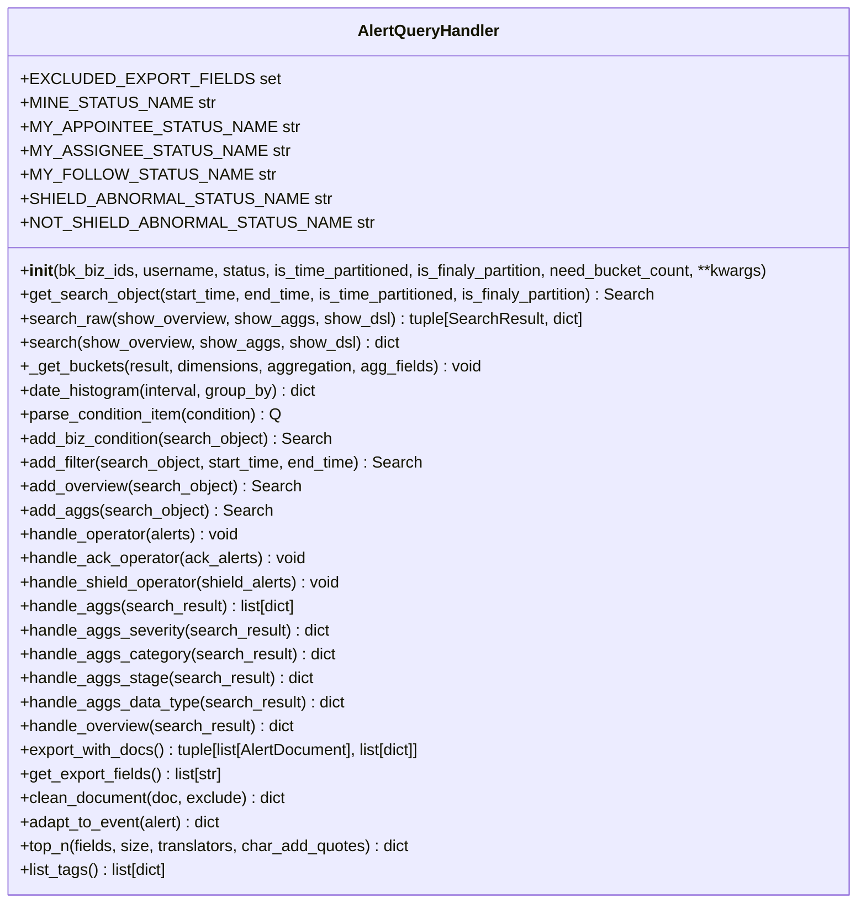
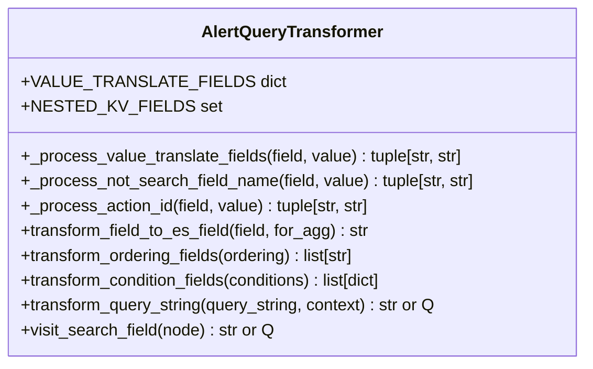
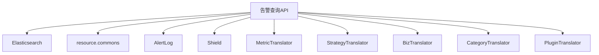

# 告警查询API

<cite>
**本文档引用的文件**   
- [base.py](file://bkmonitor/packages/fta_web/alert/handlers/base.py)
- [alert.py](file://bkmonitor/packages/fta_web/alert/handlers/alert.py)
- [transformer.py](file://bkmonitor/packages/fta_web/alert/handlers/transformer.py)
</cite>

## 目录
1. [简介](#简介)
2. [项目结构](#项目结构)
3. [核心组件](#核心组件)
4. [架构概述](#架构概述)
5. [详细组件分析](#详细组件分析)
6. [依赖分析](#依赖分析)
7. [性能考虑](#性能考虑)
8. [故障排除指南](#故障排除指南)
9. [结论](#结论)

## 简介
本文档详细介绍了告警查询API的实现机制和使用方法。重点说明了告警查询接口支持的过滤条件（如告警级别、状态、时间范围、业务范围等）、分页参数（offset、limit）和排序选项（按发生时间、级别排序等）。提供了完整的请求示例和响应数据结构，包括字段类型、必填性说明。解释了查询性能优化策略，如索引使用、缓存机制等。记录了可能的错误码和异常处理方式。

## 项目结构
告警查询功能主要位于`bkmonitor/packages/fta_web/alert/handlers/`目录下，核心文件包括`base.py`、`alert.py`和`transformer.py`。这些文件共同实现了告警查询的核心逻辑，包括查询处理、条件解析、结果格式化等功能。

**图示来源**
- [base.py](file://bkmonitor/packages/fta_web/alert/handlers/base.py)
- [alert.py](file://bkmonitor/packages/fta_web/alert/handlers/alert.py)
- [transformer.py](file://bkmonitor/packages/fta_web/alert/handlers/transformer.py)

## 核心组件
告警查询API的核心组件包括`BaseQueryHandler`、`AlertQueryHandler`和`AlertQueryTransformer`。这些组件通过继承和组合的方式，实现了灵活的查询处理能力。

**组件来源**
- [base.py](file://bkmonitor/packages/fta_web/alert/handlers/base.py#L316-L856)
- [alert.py](file://bkmonitor/packages/fta_web/alert/handlers/alert.py#L473-L1547)
- [transformer.py](file://bkmonitor/packages/fta_web/alert/handlers/transformer.py)

## 架构概述
告警查询API采用分层架构，从上到下依次为：API接口层、查询处理器层、转换器层和数据访问层。这种分层设计使得各组件职责清晰，便于维护和扩展。

**图示来源**
- [alert.py](file://bkmonitor/packages/fta_web/alert/handlers/alert.py#L473-L1547)
- [transformer.py](file://bkmonitor/packages/fta_web/alert/handlers/transformer.py)

## 详细组件分析
### BaseQueryHandler分析
`BaseQueryHandler`是所有查询处理器的基类，提供了通用的查询处理功能，如分页、排序、条件过滤等。

#### 类图

**图示来源**
- [base.py](file://bkmonitor/packages/fta_web/alert/handlers/base.py#L316-L856)

### AlertQueryHandler分析
`AlertQueryHandler`是告警查询的核心处理器，继承自`BaseQueryHandler`，并针对告警查询的特殊需求进行了扩展。

#### 类图

**图示来源**
- [alert.py](file://bkmonitor/packages/fta_web/alert/handlers/alert.py#L473-L1547)

### AlertQueryTransformer分析
`AlertQueryTransformer`是告警查询的转换器，负责将用户输入的查询条件转换为Elasticsearch DSL查询。

#### 类图

**图示来源**
- [transformer.py](file://bkmonitor/packages/fta_web/alert/handlers/transformer.py)

## 依赖分析
告警查询API依赖于Elasticsearch作为数据存储和查询引擎，同时依赖于多个内部模块，如`resource.commons`、`AlertLog`、`Shield`等，用于获取业务数据和处理逻辑。

**图示来源**
- [alert.py](file://bkmonitor/packages/fta_web/alert/handlers/alert.py#L473-L1547)
- [transformer.py](file://bkmonitor/packages/fta_web/alert/handlers/transformer.py)

## 性能考虑
告警查询API在性能方面做了多项优化，包括：
1. 使用Elasticsearch的聚合功能进行高效的数据统计。
2. 通过`track_total_hits=True`参数确保准确的总数统计。
3. 限制最大桶数量，防止超过Elasticsearch的限制。
4. 使用基数聚合桶来获取总桶数，用于分页。

## 故障排除指南
### 常见错误码
- **400 Bad Request**: 请求参数错误，检查请求参数是否符合要求。
- **500 Internal Server Error**: 服务器内部错误，检查服务器日志获取详细信息。
- **404 Not Found**: 请求的资源不存在，检查资源ID是否正确。

### 异常处理
告警查询API在搜索过程中发生错误时，会捕获异常并返回空的响应结果，同时记录异常日志。异常对象会包含已处理的结果数据，便于调试和分析。

**组件来源**
- [alert.py](file://bkmonitor/packages/fta_web/alert/handlers/alert.py#L473-L1547)

## 结论
告警查询API通过分层架构和模块化设计，实现了灵活、高效的告警查询功能。通过继承和组合的方式，各组件职责清晰，便于维护和扩展。性能优化策略确保了在大数据量下的查询效率，异常处理机制保证了系统的稳定性。