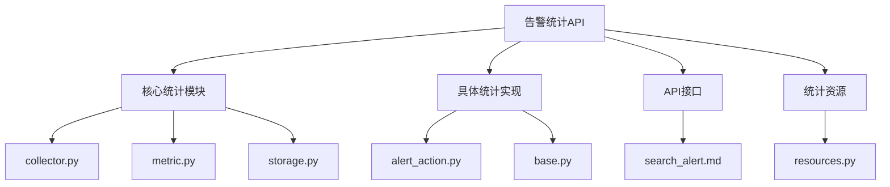
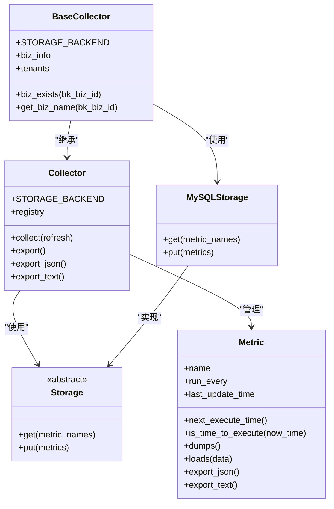
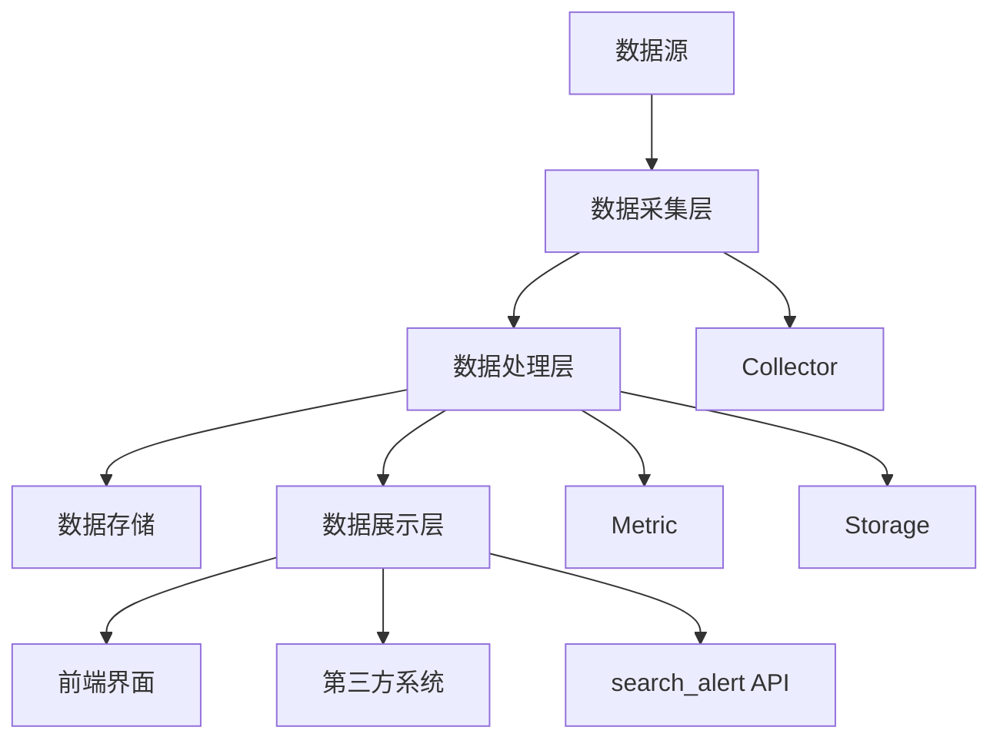

# 告警统计API

<cite>
**本文档引用的文件**  
- [collector.py](file://bkmonitor/core/statistics/collector.py)
- [metric.py](file://bkmonitor/core/statistics/metric.py)
- [storage.py](file://bkmonitor/core/statistics/storage.py)
- [base.py](file://bkmonitor/packages/monitor_web/statistics/v2/base.py)
- [alert_action.py](file://bkmonitor/packages/monitor_web/statistics/v2/alert_action.py)
- [search_alert.md](file://bkmonitor/docs/api/apidocs/zh_hans/search_alert.md)
- [home/resources.py](file://bkmonitor/packages/fta_web/home/resources.py)
</cite>

## 目录
1. [引言](#引言)
2. [项目结构分析](#项目结构分析)
3. [核心组件分析](#核心组件分析)
4. [架构概览](#架构概览)
5. [详细组件分析](#详细组件分析)
6. [统计维度与指标](#统计维度与指标)
7. [数据聚合与计算方法](#数据聚合与计算方法)
8. [统计结果数据结构](#统计结果数据结构)
9. [性能优化措施](#性能优化措施)
10. [典型使用场景](#典型使用场景)

## 引言

告警统计API是蓝鲸监控平台的核心功能之一，旨在为用户提供全面、灵活的告警数据统计与分析能力。该API支持多维度、多指标的告警数据聚合，能够满足日常运维、故障分析、性能评估等多种场景的需求。本文档详细说明告警统计API的功能特性、技术实现、数据结构和使用方法，帮助用户深入理解和高效使用该功能。

## 项目结构分析

通过对项目结构的分析，告警统计相关的核心代码主要分布在以下几个目录中：

- `bkmonitor/core/statistics/`：包含统计功能的核心实现，包括指标采集器、指标定义和存储机制。
- `bkmonitor/packages/monitor_web/statistics/v2/`：包含具体的统计采集器实现，如告警相关的统计。
- `bkmonitor/docs/api/apidocs/zh_hans/`：包含API文档，描述了告警查询接口的参数和响应格式。
- `bkmonitor/packages/fta_web/home/`：包含首页统计资源的实现，涉及告警数量的统计逻辑。



**图示来源**  
- [collector.py](file://bkmonitor/core/statistics/collector.py)
- [metric.py](file://bkmonitor/core/statistics/metric.py)
- [storage.py](file://bkmonitor/core/statistics/storage.py)
- [alert_action.py](file://bkmonitor/packages/monitor_web/statistics/v2/alert_action.py)
- [base.py](file://bkmonitor/packages/monitor_web/statistics/v2/base.py)
- [search_alert.md](file://bkmonitor/docs/api/apidocs/zh_hans/search_alert.md)
- [resources.py](file://bkmonitor/packages/fta_web/home/resources.py)

## 核心组件分析

告警统计API的核心组件主要包括指标采集器（Collector）、指标定义（Metric）和存储机制（Storage）。这些组件协同工作，实现了告警数据的采集、计算和存储。

**组件关系图**


**图示来源**  
- [collector.py](file://bkmonitor/core/statistics/collector.py#L1-L85)
- [metric.py](file://bkmonitor/core/statistics/metric.py#L1-L132)
- [storage.py](file://bkmonitor/core/statistics/storage.py#L1-L18)
- [base.py](file://bkmonitor/packages/monitor_web/statistics/v2/base.py#L1-L88)

## 架构概览

告警统计API的整体架构分为数据采集层、数据处理层和数据展示层。数据采集层负责从各个数据源收集原始告警数据；数据处理层负责对采集到的数据进行聚合、计算和存储；数据展示层通过API接口将统计结果提供给前端或其他系统使用。



**图示来源**  
- [collector.py](file://bkmonitor/core/statistics/collector.py)
- [metric.py](file://bkmonitor/core/statistics/metric.py)
- [storage.py](file://bkmonitor/core/statistics/storage.py)
- [search_alert.md](file://bkmonitor/docs/api/apidocs/zh_hans/search_alert.md)

## 详细组件分析

### 指标采集器分析

指标采集器（Collector）是告警统计的核心组件，负责协调指标的采集和存储。它通过反射机制自动发现并注册所有标记为`@register`的指标采集函数，并根据配置的时间间隔决定是否执行采集。

```python
class Collector:
    """
    指标采集器
    """

    STORAGE_BACKEND = Storage

    def __init__(self):
        self.storage = self.STORAGE_BACKEND()

    @property
    def registry(self):
        functions = {}
        for var_name in dir(self):
            if var_name == "registry":
                continue
            if var_name in MC.register_metrics:
                metric_func = getattr(self, var_name)
                functions[metric_func.metric.name] = metric_func
        return functions

    def collect(self, refresh=False):
        """
        采集指标
        :param refresh: 是否强制刷新
        """
        metric_functions = self.registry
        if not metric_functions:
            return

        metrics = self.storage.get(metric_names=list(metric_functions.keys()))
        metrics_mapping = {m.name: m for m in metrics}

        metrics_to_update = []
        err = None

        for metric_name, collect_func in metric_functions.items():
            cached_metric: Metric = metrics_mapping.get(metric_name, collect_func.metric)
            if refresh or cached_metric.is_time_to_execute():
                try:
                    metric = collect_func()
                    metrics_to_update.append(metric)
                except Exception as e:
                    err = e
                    continue

        if metrics_to_update:
            self.storage.put(metrics_to_update)

        # 指标数据应写尽写
        if err:
            raise err
```

**代码来源**  
- [collector.py](file://bkmonitor/core/statistics/collector.py#L1-L85)

### 指标定义分析

指标（Metric）类继承自Prometheus的Gauge类，用于定义和管理单个统计指标。每个指标都有一个名称、描述、标签和执行间隔。指标类提供了序列化和反序列化方法，便于在存储层进行持久化。

```python
class Metric(Gauge):
    def __init__(self, *args, run_every=5 * 60, **kwargs):
        super(Metric, self).__init__(*args, **kwargs)
        self.last_update_time = 0
        self.name = self._name
        self.run_every = run_every

    def next_execute_time(self) -> int:
        """
        计算下一次执行时间
        :return 下一次执行的时间戳(秒)
        """
        if not self.last_update_time:
            # 如果从未跑过
            return int(time.time())
        return self.last_update_time + self.run_every

    def is_time_to_execute(self, now_time=None) -> bool:
        """
        现在是否该执行了
        :param now_time: 当前时间
        :return: 是否该执行了
        """
        now_time = now_time or int(time.time())
        return self.next_execute_time() <= now_time

    def dumps(self) -> bytes:
        """
        将对象序列化，便于存储
        """
        return dill.dumps(self)

    @classmethod
    def loads(cls, data: bytes) -> "Metric":
        """
        反序列化为指标对象
        """
        return dill.loads(data)
```

**代码来源**  
- [metric.py](file://bkmonitor/core/statistics/metric.py#L1-L132)

### 存储机制分析

存储（Storage）是一个抽象基类，定义了获取和存储指标的接口。具体的存储实现（如MySQLStorage）需要继承该类并实现`get`和`put`方法。MySQLStorage使用Django ORM将指标数据存储在MySQL数据库中。

```python
class Storage(metaclass=abc.ABCMeta):
    """
    指标存储
    """

    def get(self, metric_names: List[str]) -> List[Metric]:
        raise NotImplementedError

    def put(self, metrics: List[Metric]):
        raise NotImplementedError

class MySQLStorage(Storage):
    def get(self, metric_names: list[str]) -> list[Metric]:
        metrics = StatisticsMetric.objects.filter(name__in=metric_names)
        return [Metric.loads(metric.data) for metric in metrics]

    def put(self, metrics: list[Metric]):
        for metric in metrics:
            StatisticsMetric.objects.update_or_create(
                name=metric.name,
                defaults={
                    "data": metric.dumps(),
                    "update_time": metric.last_update_time,
                },
            )
```

**代码来源**  
- [storage.py](file://bkmonitor/core/statistics/storage.py#L1-L18)
- [base.py](file://bkmonitor/packages/monitor_web/statistics/v2/base.py#L1-L88)

## 统计维度与指标

告警统计API支持多种维度和指标的聚合统计，能够满足不同场景的分析需求。

### 统计维度

告警统计支持以下主要维度：

- **业务维度**：按业务ID（bk_biz_id）进行统计，可以分析不同业务的告警情况。
- **告警类型维度**：按告警分类（category）进行统计，如主机、服务、应用等。
- **时间周期维度**：支持按不同时间范围（如1天、7天、30天）进行统计。
- **处理状态维度**：按告警的处理状态（如已处理、已确认、已屏蔽）进行统计。
- **严重级别维度**：按告警的严重级别（如致命、预警、提醒）进行统计。
- **数据类型维度**：按告警的数据来源类型（如时序数据、事件、日志）进行统计。

### 统计指标

告警统计API支持以下主要指标：

- **告警数量**：统计指定条件下的告警总数。
- **平均响应时间**：统计告警从产生到被处理的平均时间。
- **解决率**：统计已解决告警占总告警的比例。
- **自动恢复率**：统计自动恢复的告警占总告警的比例。
- **降噪比**：统计通过智能降噪减少的告警数量与总告警数量的比例。

```python
@register(labelnames=("bk_biz_id", "bk_biz_name", "time_range"))
def auto_recovery_ratio(self, metric: Metric):
    """
    自动恢复率
    """
    for day in ["1d", "7d", "15d", "30d"]:
        for bk_biz_id in self.biz_info.keys():
            overview_data = self.biz_alert_data[day].get(bk_biz_id)
            if not overview_data or overview_data["auto_recovery_ratio"] is None:
                continue
            metric.labels(bk_biz_id=bk_biz_id, bk_biz_name=self.get_biz_name(bk_biz_id), time_range=day).set(
                overview_data["auto_recovery_ratio"]
            )

@register(labelnames=("bk_biz_id", "bk_biz_name", "time_range"))
def noise_reduction_ratio(self, metric: Metric):
    """
    降噪比
    """
    for day in ["1d", "7d", "15d", "30d"]:
        for bk_biz_id in self.biz_info.keys():
            overview_data = self.biz_alert_data[day].get(bk_biz_id)
            if not overview_data or overview_data["noise_reduction_ratio"] is None:
                continue
            metric.labels(bk_biz_id=bk_biz_id, bk_biz_name=self.get_biz_name(bk_biz_id), time_range=day).set(
                overview_data["noise_reduction_ratio"]
            )
```

**代码来源**  
- [alert_action.py](file://bkmonitor/packages/monitor_web/statistics/v2/alert_action.py#L246-L263)

## 数据聚合与计算方法

告警统计API采用预计算和缓存策略来提高查询性能。数据聚合的计算方法和时间窗口配置如下：

### 计算方法

- **计数聚合**：对于告警数量等指标，采用简单的计数方法，统计符合条件的告警记录数。
- **时间差计算**：对于平均响应时间等指标，计算告警产生时间和处理时间的差值，然后求平均值。
- **比率计算**：对于解决率、自动恢复率等指标，采用分子除以分母的方法计算比率。

### 时间窗口配置

告警统计API支持多种时间窗口配置，包括：

- **5分钟**：用于实时监控和快速响应。
- **1天**：用于日度报表和日常分析。
- **7天**：用于周度报表和趋势分析。
- **30天**：用于月度报表和长期趋势分析。

```python
class TimeRange:
    FIVE_MIN = 5 * 60
    ONE_DAY = 60 * 24 * 60
    THREE_DAY = 3 * 60 * 24 * 60
    SEVEN_DAY = 7 * 60 * 24 * 60
    FOURTEEN_DAY = 14 * 60 * 24 * 60
    THIRTY_DAY = 30 * 60 * 24 * 60

TIME_RANGE = [
    ("5m", TimeRange.FIVE_MIN),
    ("1d", TimeRange.ONE_DAY),
    ("3d", TimeRange.THREE_DAY),
    ("7d", TimeRange.SEVEN_DAY),
    ("14d", TimeRange.FOURTEEN_DAY),
    ("30d", TimeRange.THIRTY_DAY),
]
```

**代码来源**  
- [base.py](file://bkmonitor/packages/monitor_web/statistics/v2/base.py#L1-L88)

## 统计结果数据结构

告警统计API的响应数据结构清晰，包含告警列表、总数和聚合统计信息。

### 响应参数

| 字段 | 类型 | 描述 |
| ---- | ---- | ---- |
| result | bool | 请求是否成功 |
| code | int | 返回的状态码 |
| message | string | 描述信息 |
| data | dict | 相关的告警列表数据 |

### data字段说明

| 字段 | 类型 | 描述 |
| ---- | ---- | ---- |
| alerts | List | 所有的告警列表 |
| total | int | 返回告警列表的条数 |
| aggs | List | 返回的聚合统计信息 |

### data.aggs字段说明

| 字段 | 类型 | 描述 |
| ---- | ---- | ---- |
| id | String | 聚合统计ID |
| name | String | 聚合统计名称 |
| count | Int | 相关数量 |
| children | List（agg） | 该聚合统计可选内容 |

**示例数据**
```json
{
    "message": "OK",
    "code": 200,
    "data": {
        "alerts": [
            {
                "id": "16424876305819837",
                "alert_name": "CPU使用率告警",
                "status": "ABNORMAL",
                "description": "AVG(CPU使用率) >= 0.0%, 当前值4.72973%",
                "severity": 3,
                "metric": [
                    "bk_monitor.system.cpu_summary.usage"
                ],
                "bk_biz_id": 5000140,
                "ip": "10.0.0.1",
                "bk_cloud_id": "0",
                "bk_service_instance_id": null,
                "bk_topo_node": [
                    "biz|5000140",
                    "module|5004200",
                    "set|5001626",
                    "module|5004201"
                ],
                "assignee": [
                    "xxxx"
                ],
                "is_ack": null,
                "is_shielded": false,
                "shield_left_time": "0s",
                "shield_id": [
                    11888
                ],
                "is_handled": true,
                "strategy_id": 41868,
                "create_time": 1642487630,
                "update_time": 1645669311,
                "begin_time": 1642487460,
                "end_time": null,
                "latest_time": 1645669200,
                "first_anomaly_time": 1642487460,
                "target_type": "HOST",
                "target": "10.0.0.1|0",
                "category": "os",
                "tags": [],
                "category_display": "主机-操作系统",
                "duration": "36d 19h",
                "ack_duration": 7882,
                "data_type": "time_series",
                "converge_id": "16424876305819837",
                "event_id": "c9c6e6781f39dc85e0888cf980b3f892.1645669200.41868.44543.3",
                "plugin_id": "bkmonitor",
                "stage_display": "已处理",
                "dimensions": [
                    {
                        "display_value": "10.0.0.1",
                        "display_key": "目标IP",
                        "value": "10.0.0.1",
                        "key": "ip"
                    },
                    {
                        "display_value": 0,
                        "display_key": "云区域ID",
                        "value": 124,
                        "key": "bk_cloud_id"
                    }
                ],
                "seq_id": 5819837,
                "dedupe_md5": "xxxxxxx",
                "dedupe_keys": [
                    "strategy_id",
                    "target_type",
                    "target",
                    "bk_biz_id"
                ],
                "dimension_message": "目标IP(10.0.0.1) - 云区域ID(0)",
                "metric_display": [
                    {
                        "id": "bk_monitor.system.cpu_summary.usage",
                        "name": "CPU使用率"
                    }
                ],
                "target_key": "主机 10.0.0.1",
                "strategy_name": "CPU使用率告警",
                "bk_biz_name": "demo"
            }
        ],
        "total": 1,
        "aggs": [
            {
                "id": "severity",
                "name": "级别",
                "count": 3,
                "children": [
                    {
                        "id": 1,
                        "name": "致命",
                        "count": 0
                    },
                    {
                        "id": 2,
                        "name": "预警",
                        "count": 0
                    },
                    {
                        "id": 3,
                        "name": "提醒",
                        "count": 3
                    }
                ]
            },
            {
                "id": "stage",
                "name": "处理阶段",
                "count": 3,
                "children": [
                    {
                        "id": "is_handled",
                        "name": "已处理",
                        "count": 1
                    },
                    {
                        "id": "is_ack",
                        "name": "已确认",
                        "count": 2
                    },
                    {
                        "id": "is_shielded",
                        "name": "已屏蔽",
                        "count": 0
                    }
                ]
            },
            {
                "id": "data_type",
                "name": "数据类型",
                "count": 3,
                "children": [
                    {
                        "id": "time_series",
                        "name": "时序数据",
                        "count": 3
                    },
                    {
                        "id": "event",
                        "name": "事件",
                        "count": 0
                    },
                    {
                        "id": "log",
                        "name": "日志",
                        "count": 0
                    }
                ]
            },
            {
                "id": "category",
                "name": "分类",
                "count": 3,
                "children": [
                    {
                        "id": "applications",
                        "name": "用户体验",
                        "index": 1,
                        "children": [
                            {
                                "id": "uptimecheck",
                                "name": "服务拨测",
                                "index": 1,
                                "count": 0
                            },
                            {
                                "id": "application_check",
                                "name": "业务应用",
                                "index": 2,
                                "count": 0
                            }
                        ],
                        "count": 0
                    },
                    {
                        "id": "services",
                        "name": "服务",
                        "index": 2,
                        "children": [
                            {
                                "id": "service_module",
                                "name": "服务模块",
                                "index": 1,
                                "count": 0
                            },
                            {
                                "id": "component",
                                "name": "组件",
                                "index": 2,
                                "count": 0
                            }
                        ],
                        "count": 0
                    },
                    {
                        "id": "hosts",
                        "name": "主机",
                        "index": 3,
                        "children": [
                            {
                                "id": "host_process",
                                "name": "进程",
                                "index": 1,
                                "count": 0
                            },
                            {
                                "id": "os",
                                "name": "操作系统",
                                "index": 2,
                                "count": 3
                            },
                            {
                                "id": "host_device",
                                "name": "主机设备",
                                "index": 3,
                                "count": 0
                            }
                        ],
                        "count": 3
                    },
                    {
                        "id": "data_center",
                        "name": "数据中心",
                        "index": 4,
                        "children": [
                            {
                                "id": "hardware_device",
                                "name": "硬件设备",
                                "index": 1,
                                "count": 0
                            }
                        ],
                        "count": 0
                    },
                    {
                        "id": "others",
                        "name": "其他",
                        "index": 5,
                        "children": [
                            {
                                "id": "other_rt",
                                "name": "其他",
                                "index": 2,
                                "count": 0
                            }
                        ],
                        "count": 0
                    }
                ]
            }
        ]
    },
    "result": true
}
```

**文档来源**  
- [search_alert.md](file://bkmonitor/docs/api/apidocs/zh_hans/search_alert.md)

## 性能优化措施

为了提高告警统计API的性能，系统采用了预计算和缓存策略。

### 预计算

系统在后台定期执行统计计算任务，将计算结果预先存储在数据库中。当用户请求统计数据时，直接从数据库中读取预计算的结果，避免了实时计算的开销。

```python
def collect(self, refresh=False):
    """
    采集指标
    :param refresh: 是否强制刷新
    """
    metric_functions = self.registry
    if not metric_functions:
        return

    metrics = self.storage.get(metric_names=list(metric_functions.keys()))
    metrics_mapping = {m.name: m for m in metrics}

    metrics_to_update = []
    err = None

    for metric_name, collect_func in metric_functions.items():
        cached_metric: Metric = metrics_mapping.get(metric_name, collect_func.metric)
        if refresh or cached_metric.is_time_to_execute():
            try:
                metric = collect_func()
                metrics_to_update.append(metric)
            except Exception as e:
                err = e
                continue

    if metrics_to_update:
        self.storage.put(metrics_to_update)

    # 指标数据应写尽写
    if err:
        raise err
```

### 缓存策略

系统使用MySQL作为指标数据的存储后端，通过`MySQLStorage`类实现数据的读写。指标数据在内存中以对象形式存在，通过`dill`库进行序列化后存储到数据库中，读取时再反序列化。

```python
class MySQLStorage(Storage):
    def get(self, metric_names: list[str]) -> list[Metric]:
        metrics = StatisticsMetric.objects.filter(name__in=metric_names)
        return [Metric.loads(metric.data) for metric in metrics]

    def put(self, metrics: list[Metric]):
        for metric in metrics:
            StatisticsMetric.objects.update_or_create(
                name=metric.name,
                defaults={
                    "data": metric.dumps(),
                    "update_time": metric.last_update_time,
                },
            )
```

**代码来源**  
- [collector.py](file://bkmonitor/core/statistics/collector.py#L1-L85)
- [storage.py](file://bkmonitor/core/statistics/storage.py#L1-L18)
- [base.py](file://bkmonitor/packages/monitor_web/statistics/v2/base.py#L1-L88)

## 典型使用场景

### 生成日报

通过调用告警统计API，可以生成每日的告警报表。例如，统计过去24小时内各业务的告警数量、严重级别分布和处理状态。

**请求示例**
```json
{
    "bk_biz_ids": [5000140],
    "start_time": 1645665785,
    "end_time": 1645669385,
    "show_aggs": true,
    "page": 1,
    "page_size": 10
}
```

### 生成周报

通过调整时间范围，可以生成周度报表。例如，统计过去7天内各分类的告警趋势和解决率。

**请求示例**
```json
{
    "bk_biz_ids": [5000140],
    "start_time": 1645060985,
    "end_time": 1645669385,
    "show_aggs": true,
    "page": 1,
    "page_size": 10
}
```

### 运营报表

结合多个维度的统计结果，可以生成综合的运营报表。例如，分析不同业务、不同分类的告警降噪效果和自动恢复率。

**请求示例**
```json
{
    "bk_biz_ids": [5000140, 5000141],
    "start_time": 1645665785,
    "end_time": 1645669385,
    "show_aggs": true,
    "conditions": [
        {
            "key": "category",
            "value": ["hosts", "services"],
            "method": "eq"
        }
    ],
    "page": 1,
    "page_size": 10
}
```

**文档来源**  
- [search_alert.md](file://bkmonitor/docs/api/apidocs/zh_hans/search_alert.md)