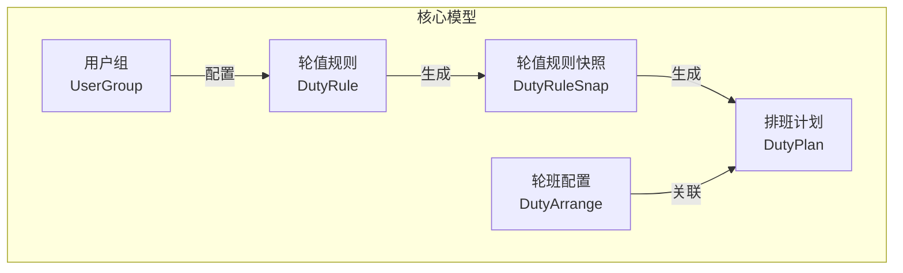
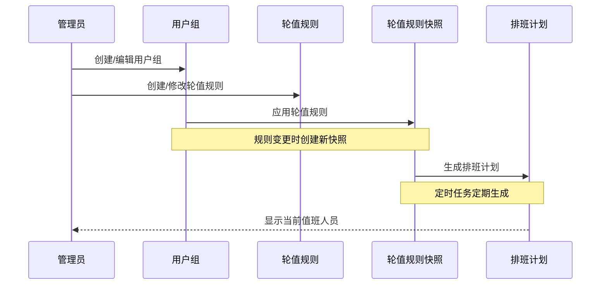
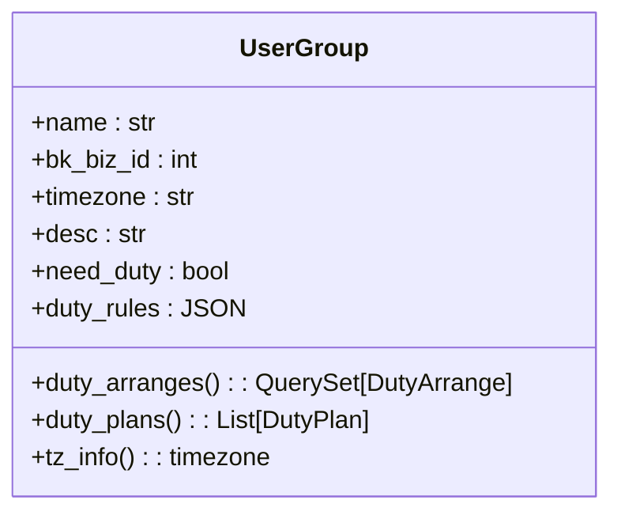
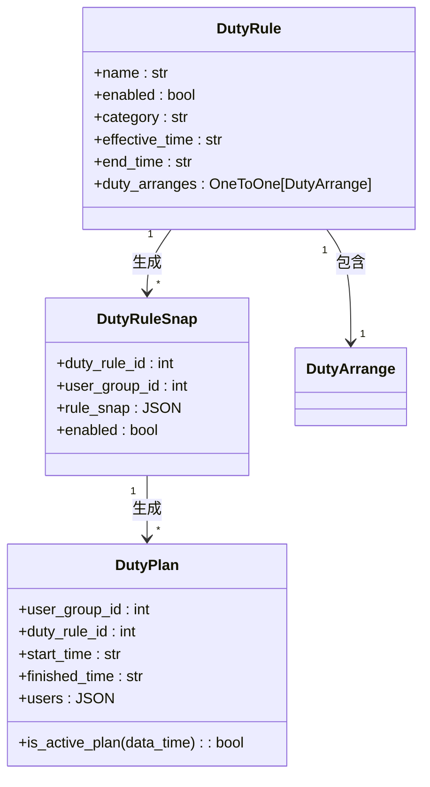
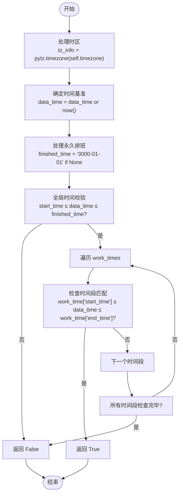

# 值班管理

<cite>
**本文档引用的文件**  
- [strategy.py](file://bkmonitor/bkmonitor/models/strategy.py#L464-L963)
- [test_duty_plan.py](file://bkmonitor/alarm_backends/tests/service/fta_action/duty/test_duty_plan.py#L339-L1307)
- [test_user_group.py](file://bkmonitor/tests/web/fta_actions/test_user_group.py#L225-L261)
</cite>

## 目录
1. [引言](#引言)  
2. [项目结构](#项目结构)  
3. [核心组件](#核心组件)  
4. [架构概览](#架构概览)  
5. [详细组件分析](#详细组件分析)  
6. [依赖分析](#依赖分析)  
7. [性能考量](#性能考量)  
8. [故障排查指南](#故障排查指南)  
9. [结论](#结论)

## 引言
本文档全面阐述了“值班管理”功能的设计与实现，涵盖值班周期定义、轮班规则配置、人员排班机制、节假日与特殊时段处理、数据存储结构、查询接口、状态同步、多级值班组配置、跨时区安排、冲突检测与解决、数据导入导出及系统集成等关键方面。文档基于对 `bk-monitor` 项目中相关代码的深入分析，旨在为开发者和运维人员提供一份详尽的技术参考。

## 项目结构
值班管理功能的核心数据模型和业务逻辑主要分布在 `bkmonitor` 模块下的 `models/strategy.py` 文件中。相关的测试用例位于 `alarm_backends/tests/service/fta_action/duty/` 和 `tests/web/fta_actions/` 目录下，用于验证排班计划的生成、更新和预览逻辑。



**图示来源**  
- [strategy.py](file://bkmonitor/bkmonitor/models/strategy.py#L464-L963)

**本节来源**  
- [strategy.py](file://bkmonitor/bkmonitor/models/strategy.py#L464-L963)

## 核心组件
值班管理功能的核心由以下几个关键模型构成，它们共同协作以实现复杂的排班逻辑。

**本节来源**  
- [strategy.py](file://bkmonitor/bkmonitor/models/strategy.py#L464-L963)

## 架构概览
整个值班管理系统的架构围绕“规则-快照-计划”三层模型构建。用户首先定义**轮值规则**（DutyRule），该规则包含轮班类型、生效时间等基本信息。当规则被应用到具体的**用户组**（UserGroup）时，系统会创建一个**轮值规则快照**（DutyRuleSnap），以固化当时的规则配置。最后，基于这个快照，系统会生成一系列具体的**排班计划**（DutyPlan），明确指定在特定时间段内由哪些人员值班。



**图示来源**  
- [strategy.py](file://bkmonitor/bkmonitor/models/strategy.py#L582-L963)
- [test_duty_plan.py](file://bkmonitor/alarm_backends/tests/service/fta_action/duty/test_duty_plan.py#L1227-L1279)

## 详细组件分析
本节将深入分析各个核心组件的实现细节。

### 用户组 (UserGroup) 分析
`UserGroup` 模型代表一个告警处理组，是值班管理的顶层容器。它定义了组的基本信息，如名称、时区、是否需要轮值等。

#### 数据结构


**图示来源**  
- [strategy.py](file://bkmonitor/bkmonitor/models/strategy.py#L464-L579)

**本节来源**  
- [strategy.py](file://bkmonitor/bkmonitor/models/strategy.py#L464-L579)

### 轮值规则 (DutyRule) 分析
`DutyRule` 模型定义了轮班的基本规则，是排班逻辑的源头。

#### 数据结构与关系


**图示来源**  
- [strategy.py](file://bkmonitor/bkmonitor/models/strategy.py#L582-L646)

**本节来源**  
- [strategy.py](file://bkmonitor/bkmonitor/models/strategy.py#L582-L646)

### 排班计划 (DutyPlan) 分析
`DutyPlan` 是最终的执行单元，它将抽象的规则转化为具体的时间段和人员安排。

#### 核心方法分析
`is_active_plan` 方法用于判断某个时间点是否命中当前排班计划。



**图示来源**  
- [strategy.py](file://bkmonitor/bkmonitor/models/strategy.py#L850-L893)

**本节来源**  
- [strategy.py](file://bkmonitor/bkmonitor/models/strategy.py#L850-L963)

## 依赖分析
各组件之间存在明确的依赖关系，形成了一个从配置到执行的链条。

```mermaid
graph TD
UserGroup --> DutyRule
DutyRule --> DutyRuleSnap
DutyRuleSnap --> DutyPlan
DutyArrange --> DutyPlan
DutyPlan --> UserGroup : 查询当前值班
```

**图示来源**  
- [strategy.py](file://bkmonitor/bkmonitor/models/strategy.py#L464-L963)

**本节来源**  
- [strategy.py](file://bkmonitor/bkmonitor/models/strategy.py#L464-L963)

## 性能考量
- **索引优化**：`DutyPlan` 模型在 `user_group_id`, `is_effective`, `finished_time` 字段上建立了复合索引，以加速按用户组和有效状态查询排班计划的性能。
- **缓存机制**：`UserGroup` 模型使用了 `@cached_property` 装饰器来缓存 `duty_arranges` 和 `duty_plans` 的查询结果，避免了重复的数据库访问。
- **批量操作**：`DutyArrange.bulk_create` 方法实现了批量创建、更新和删除，减少了数据库交互次数，提升了数据同步效率。

## 故障排查指南
1. **值班人员未正确显示**：检查 `DutyPlan` 的 `start_time` 和 `finished_time` 是否正确，确认 `is_effective` 字段为1，并验证 `work_times` 中的时间段是否与当前时间匹配。
2. **排班计划未生成**：检查 `DutyRule` 的 `enabled` 状态是否为 `True`，确认 `effective_time` 已到且未过 `end_time`。
3. **时区问题**：确保 `UserGroup` 和 `DutyPlan` 的 `timezone` 字段配置正确。系统在时区解析失败时会默认使用 `Asia/Shanghai`。
4. **规则变更未生效**：检查 `DutyRuleSnap` 表，确认规则变更后是否生成了新的快照。只有当规则的 `hash` 值发生变化时，才会创建新快照并触发排班计划的重新生成。

**本节来源**  
- [strategy.py](file://bkmonitor/bkmonitor/models/strategy.py#L850-L893)
- [test_duty_plan.py](file://bkmonitor/alarm_backends/tests/service/fta_action/duty/test_duty_plan.py#L1227-L1307)

## 结论
本文档详细解析了 `bk-monitor` 系统中值班管理功能的实现。该系统通过 `UserGroup`、`DutyRule`、`DutyRuleSnap` 和 `DutyPlan` 等核心模型，构建了一个灵活、可靠且可追溯的排班机制。其“规则-快照-计划”的三层架构设计，有效解决了规则变更带来的历史排班追溯问题。系统支持复杂的轮班规则、跨时区安排和备份人员配置，并通过索引、缓存和批量操作等手段保证了性能。通过本文档，开发者可以深入理解其工作原理，便于进行功能扩展、维护和故障排查。