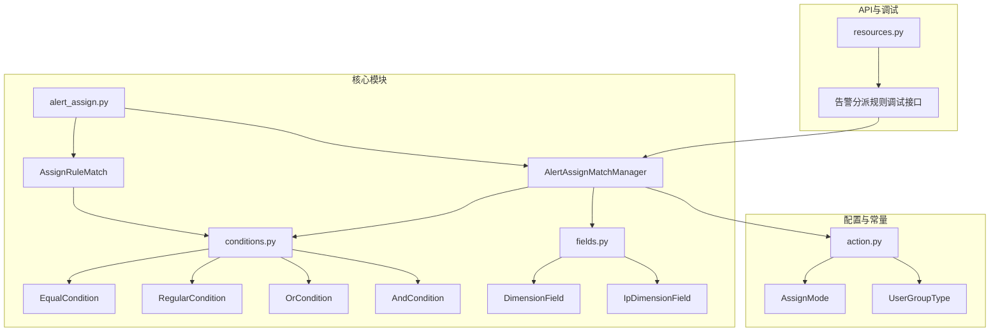
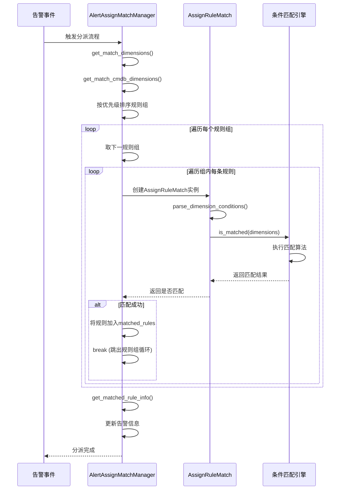
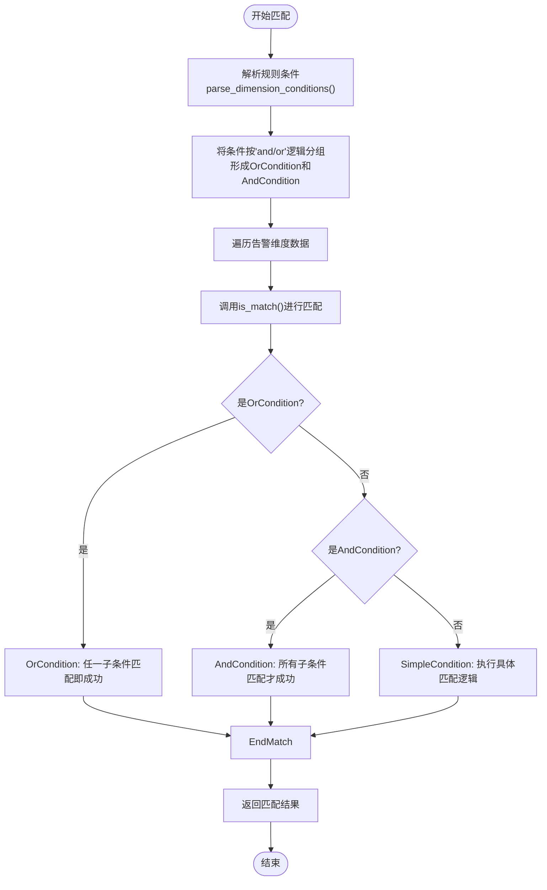
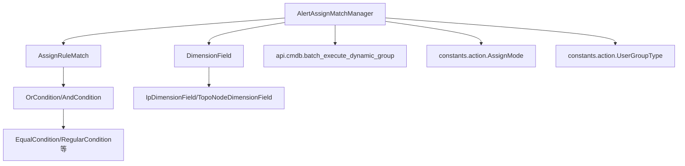

# 分配规则

<cite>
**本文档引用文件**   
- [alert_assign.py](file://bkmonitor\bkmonitor\action\alert_assign.py)
- [conditions.py](file://bkmonitor\bkmonitor\utils\range\conditions.py)
- [fields.py](file://bkmonitor\bkmonitor\utils\range\fields.py)
- [action.py](file://bkmonitor\constants\action.py)
- [resources.py](file://bkmonitor\packages\fta_web\assign\resources.py)
</cite>

## 目录
1. [引言](#引言)
2. [项目结构](#项目结构)
3. [核心组件](#核心组件)
4. [架构概览](#架构概览)
5. [详细组件分析](#详细组件分析)
6. [依赖分析](#依赖分析)
7. [性能考量](#性能考量)
8. [故障排查指南](#故障排查指南)
9. [结论](#结论)

## 引言
本文档旨在深入解析蓝鲸监控平台中的告警分配规则系统。该系统通过一套复杂的规则引擎，实现基于告警特征（如业务系统、故障类型、严重等级）的自动化分派。文档将详细阐述规则的匹配算法、执行流程、条件表达式语法、支持的匹配模式以及动态变量的使用方法。同时，通过实战案例和性能优化策略，为用户提供全面的配置和运维指导。

## 项目结构
告警分配规则功能主要分布在 `bkmonitor` 项目的多个模块中。核心逻辑位于 `bkmonitor/action` 目录下，特别是 `alert_assign.py` 文件。规则匹配的底层条件处理由 `bkmonitor/utils/range` 模块提供支持。规则的优先级和模式定义等常量则在 `constants/action.py` 中声明。



**图示来源**
- [alert_assign.py](file://bkmonitor\bkmonitor\action\alert_assign.py)
- [conditions.py](file://bkmonitor\bkmonitor\utils\range\conditions.py)
- [fields.py](file://bkmonitor\bkmonitor\utils\range\fields.py)
- [action.py](file://bkmonitor\constants\action.py)
- [resources.py](file://bkmonitor\packages\fta_web\assign\resources.py)

## 核心组件
告警分配规则系统的核心是 `AssignRuleMatch` 和 `AlertAssignMatchManager` 两个类。`AssignRuleMatch` 负责单条规则的解析和匹配，而 `AlertAssignMatchManager` 则负责管理整个匹配流程，包括数据准备、多规则匹配和结果整理。

**组件来源**
- [alert_assign.py](file://bkmonitor\bkmonitor\action\alert_assign.py#L59-L91)

## 架构概览
告警分配规则的执行流程是一个典型的“准备-匹配-执行”模式。系统首先从告警和CMDB中收集维度信息，然后按照优先级顺序，将告警与规则库中的规则进行匹配，最后根据匹配结果执行相应的分派动作。



**图示来源**
- [alert_assign.py](file://bkmonitor\bkmonitor\action\alert_assign.py#L282-L323)
- [alert_assign.py](file://bkmonitor\bkmonitor\action\alert_assign.py#L143-L179)

## 详细组件分析

### 规则匹配引擎分析
告警分配规则的核心是其匹配引擎，它能够根据预设的条件表达式，精确地将告警分派给相应的处理人。

#### 规则匹配类图

```mermaid
classDiagram
class Condition {
<<abstract>>
+is_match(data) bool
}
class SimpleCondition {
+cond_field DimensionField
+default_value_if_not_exists bool
+is_match(data) bool
+get_field(data) tuple
+_is_match(data_field) bool
}
class CompositeCondition {
+conditions list
+is_match(data) bool
+add(condition) void
+remove(condition) void
}
class OrCondition {
+is_match(data) bool
}
class AndCondition {
+is_match(data) bool
}
class EqualCondition {
+_is_match(data_field) bool
}
class NotEqualCondition {
+_is_match(data_field) bool
}
class IncludeCondition {
+_is_match(data_field) bool
}
class ExcludeCondition {
+_is_match(data_field) bool
}
class GreaterCondition {
+_is_match(data_field) bool
}
class LesserCondition {
+_is_match(data_field) bool
}
class RegularCondition {
+_is_match(data_field) bool
}
class NotRegularCondition {
+_is_match(data_field) bool
}
class IsSuperSetCondition {
+_is_match(data_field) bool
}
Condition <|-- SimpleCondition
Condition <|-- CompositeCondition
CompositeCondition <|-- OrCondition
CompositeCondition <|-- AndCondition
SimpleCondition <|-- EqualCondition
SimpleCondition <|-- NotEqualCondition
SimpleCondition <|-- IncludeCondition
SimpleCondition <|-- ExcludeCondition
SimpleCondition <|-- GreaterCondition
SimpleCondition <|-- LesserCondition
SimpleCondition <|-- RegularCondition
SimpleCondition <|-- NotRegularCondition
SimpleCondition <|-- IsSuperSetCondition
class DimensionField {
+name string
+value any
+get_value_from_data(data) tuple
+to_str_list() list
+to_float_list() list
+strip_str(value) string
}
class IpDimensionField {
+get_value_from_data(data) tuple
+to_str_list() list
}
class TopoNodeDimensionField {
+get_value_from_data(data) tuple
+to_str_list() list
}
DimensionField <|-- IpDimensionField
DimensionField <|-- TopoNodeDimensionField
```


**图示来源**
- [conditions.py](file://bkmonitor\bkmonitor\utils\range\conditions.py)
- [fields.py](file://bkmonitor\bkmonitor\utils\range\fields.py)

#### 规则匹配流程图


**图示来源**
- [conditions.py](file://bkmonitor\bkmonitor\utils\range\conditions.py#L20-L174)

### 规则引擎匹配算法与执行流程
告警分配规则的匹配算法基于维度（Dimension）和条件（Condition）的组合。其执行流程如下：

1.  **数据准备**：`AlertAssignMatchManager` 首先调用 `get_match_dimensions()` 和 `get_match_cmdb_dimensions()` 方法，从告警对象和CMDB中收集所有相关的维度信息，如 `alert.name`, `ip`, `host.bk_os_type`, `set.set_name` 等，构建成一个扁平化的字典。
2.  **规则加载与排序**：系统加载所有启用的分派规则，并根据 `priority` 字段从高到低进行排序。
3.  **条件解析**：对于每条规则，`AssignRuleMatch` 类的 `parse_dimension_conditions()` 方法会解析其 `conditions` 数组。它将连续的 `and` 条件视为一个组，而 `or` 条件则作为分隔符，将整个条件列表分割成多个 `and` 条件组。最终，这些组被构建成一个 `OrCondition` 实例，其中每个子条件是一个 `AndCondition` 实例。
4.  **执行匹配**：`AlertAssignMatchManager` 会遍历排序后的规则组。对于每个规则组，它会创建 `AssignRuleMatch` 实例，并调用其 `is_matched()` 方法。该方法会检查规则是否为新规则或已变更，如果是，则调用底层条件引擎的 `is_match()` 进行实际匹配。一旦在某个规则组中找到匹配的规则，匹配过程就会终止（优先级机制），不再检查后续的低优先级规则组。
5.  **结果整理与执行**：匹配成功后，`AlertAssignMatchManager` 会调用 `get_matched_rule_info()` 整理匹配结果，包括通知用户组、ITSM动作、告警严重性等，并最终更新告警对象的 `extra_info` 和 `assign_tags`。

**流程来源**
- [alert_assign.py](file://bkmonitor\bkmonitor\action\alert_assign.py#L282-L323)
- [alert_assign.py](file://bkmonitor\bkmonitor\action\alert_assign.py#L143-L179)

### 规则条件表达式语法与匹配模式
规则引擎支持丰富的条件表达式语法和多种匹配模式。

#### 条件表达式语法
规则的条件以JSON数组的形式定义，每个条件对象包含以下字段：
- `field` (string): 要匹配的维度字段名，如 `alert.name`, `ip`。
- `value` (string/array): 匹配的目标值，可以是单个值或值列表。
- `method` (string): 匹配方法，对应不同的匹配模式。
- `condition` (string): 逻辑连接符，`and` 或 `or`，用于构建复杂的条件组合。

#### 支持的匹配模式
通过 `method` 字段指定，支持以下模式：
- **精确匹配 (`eq`)**: `EqualCondition`，要求字段值与目标值完全相等。
- **不等于 (`neq`)**: `NotEqualCondition`，要求字段值与目标值不相等。
- **包含 (`include`)**: `IncludeCondition`，要求字段值字符串中包含目标值子串。
- **不包含 (`exclude`)**: `ExcludeCondition`，要求字段值字符串中不包含目标值子串。
- **大于 (`gt`)**: `GreaterCondition`，要求字段值（转换为浮点数）大于目标值。
- **小于 (`lt`)**: `LesserCondition`，要求字段值（转换为浮点数）小于目标值。
- **大于等于 (`gte`)**: `GreaterOrEqualCondition`，基于 `LesserCondition` 取反实现。
- **小于等于 (`lte`)**: `LesserOrEqualCondition`，基于 `GreaterCondition` 取反实现。
- **正则匹配 (`reg`)**: `RegularCondition`，要求字段值字符串能被目标值（作为正则表达式）匹配。
- **正则不匹配 (`nreg`)**: `NotRegularCondition`，要求字段值字符串不能被目标值（作为正则表达式）匹配。
- **超集匹配 (`superset`)**: `IsSuperSetCondition`，要求字段值列表是目标值列表的超集。

**语法来源**
- [conditions.py](file://bkmonitor\bkmonitor\utils\range\conditions.py)
- [as_code/ply/conditions/__init__.py](file://bkmonitor\bkmonitor\as_code\ply\conditions\__init__.py#L113-L145)

### 动态变量与上下文使用
规则引擎在匹配时，会将告警的上下文信息作为动态变量注入到维度字典中。这些变量可以直接在规则条件中引用。

#### 支持的动态变量
根据 `get_match_dimensions()` 方法的实现，以下动态变量可供使用：
- **告警基础属性**: `alert.event_source`, `alert.scenario`, `alert.strategy_id`, `alert.name`, `alert.metric`。
- **告警维度**: 直接使用 `dimensions` 中的 `key`，如 `bk_cloud_id`, `bk_host_id`。
- **标签**: 使用 `tags.*` 前缀，如 `tags.environment`。
- **CMDB属性**: 使用 `host.*`, `set.*`, `module.*` 前缀，如 `host.bk_os_type`, `set.set_name`。
- **特殊标志**: `is_empty_users` (通知用户是否为空)。

例如，一条规则可以设置 `field` 为 `alert.name`，`value` 为 `CPU.*告警`，`method` 为 `reg`，来匹配所有名称以"CPU"开头且以"告警"结尾的告警。

**变量来源**
- [alert_assign.py](file://bkmonitor\bkmonitor\action\alert_assign.py#L400-L450)

### 复杂规则配置实战案例
以下是几个复杂规则配置的实战案例。

#### 案例一：多条件组合
```json
{
  "conditions": [
    {"field": "alert.scenario", "value": ["os", "host"], "method": "eq", "condition": "and"},
    {"field": "alert.name", "value": "CPU总使用率告警", "method": "eq", "condition": "and"},
    {"field": "host.bk_os_type", "value": "LINUX", "method": "eq", "condition": "and"},
    {"field": "set.set_name", "value": "生产环境", "method": "eq", "condition": "or"},
    {"field": "module.module_name", "value": "核心服务", "method": "eq", "condition": "and"}
  ]
}
```
此规则表示：告警场景为"os"或"host" **并且** 告警名称为"CPU总使用率告警" **并且** 主机操作系统为"LINUX" **并且** (业务集为"生产环境" **或者** 模块为"核心服务")。

#### 案例二：嵌套规则与条件权重
虽然代码中没有直接体现“权重”概念，但通过**规则优先级**实现了类似效果。高优先级的规则组会先被匹配，一旦匹配成功，低优先级的规则组将被忽略。这相当于给高优先级规则赋予了更高的“权重”。

例如，可以创建一个优先级为100的规则组，用于处理所有“数据库”相关的严重告警，而将处理普通应用告警的规则组优先级设为50。这样，即使普通应用规则也能匹配到数据库告警，但由于优先级低，不会生效。

**案例来源**
- [alert_assign.py](file://bkmonitor\bkmonitor\action\alert_assign.py#L305-L331)
- [resources.py](file://bkmonitor\packages\fta_web\assign\resources.py#L199-L228)

## 依赖分析
告警分配规则系统依赖于多个内部和外部模块。



**图示来源**
- [alert_assign.py](file://bk-monitor\bkmonitor\action\alert_assign.py)
- [conditions.py](file://bkmonitor\bkmonitor\utils\range\conditions.py)
- [fields.py](file://bkmonitor\bkmonitor\utils\range\fields.py)
- [action.py](file://bkmonitor\constants\action.py)

## 性能考量
系统通过多种机制优化规则匹配性能：
1.  **优先级短路**：一旦在某个优先级的规则组中找到匹配项，立即停止对后续低优先级规则组的检查。
2.  **规则快照**：通过 `rule_snaps` 机制，如果规则未变更，可跳过复杂的条件匹配过程，直接认为匹配成功。
3.  **指标监控**：使用 `metrics.ALERT_ASSIGN_PROCESS_TIME` 和 `metrics.ALERT_ASSIGN_PROCESS_COUNT` 记录处理时间和次数，便于性能监控和问题定位。

**性能来源**
- [alert_assign.py](file://bkmonitor\bkmonitor\action\alert_assign.py#L688-L720)
- [create_action.py](file://bkmonitor\alarm_backends\service\fta_action\tasks\create_action.py#L618-L645)

## 故障排查指南
当告警分配失败时，可按以下步骤排查：

1.  **检查日志**：查看 `fta_action.run` 日志，搜索 `alert assign error` 关键字，定位异常堆栈。
2.  **验证规则启用状态**：确保相关规则和规则组的 `is_enabled` 字段为 `True`。
3.  **检查分派模式**：确认告警的 `assign_mode` 包含 `by_rule`。
4.  **调试规则**：使用 `resources.py` 中的调试接口，输入告警样例数据，验证规则匹配结果。
5.  **检查维度数据**：确认告警的维度数据（如 `ip`, `bk_cloud_id`）和CMDB属性是否正确，是否与规则条件匹配。
6.  **检查正则表达式**：如果使用了正则匹配，确保表达式语法正确，避免 `sre_constants.error` 异常。

**排查来源**
- [alert_assign.py](file://bkmonitor\bkmonitor\action\alert_assign.py#L688-L720)
- [create_action.py](file://bkmonitor\alarm_backends\service\fta_action\tasks\create_action.py#L618-L645)
- [resources.py](file://bkmonitor\packages\fta_web\assign\resources.py#L199-L228)

## 结论
蓝鲸监控平台的告警分配规则系统是一个功能强大且设计精巧的自动化分派引擎。它通过灵活的条件表达式、清晰的优先级机制和高效的匹配算法，实现了对复杂告警场景的精准分派。理解其核心组件、执行流程和配置方法，对于构建高效、可靠的运维自动化体系至关重要。