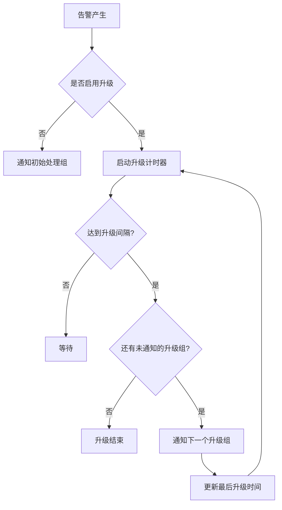
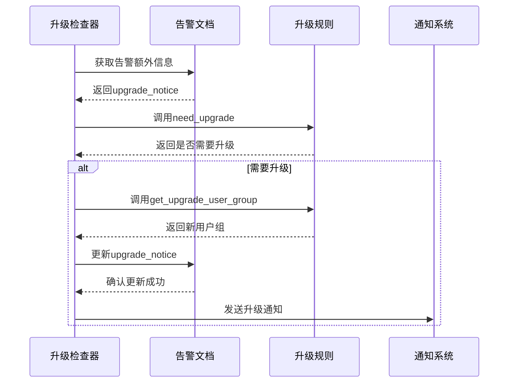
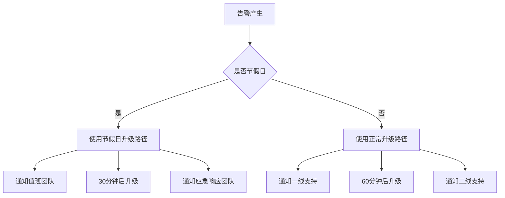

# 升级策略

<cite>
**本文档中引用的文件**   
- [upgrade.py](file://bkmonitor\alarm_backends\service\alert\manager\checker\upgrade.py)
- [alert_assign.py](file://bkmonitor\bkmonitor\action\alert_assign.py)
- [save_rule_group.md](file://bkmonitor\docs\api\apidocs\zh_hans\save_rule_group.md)
- [test_assign.py](file://bkmonitor\alarm_backends\tests\service\fta_action\test_assign.py)
- [action.py](file://bkmonitor\constants\action.py)
</cite>

## 目录
1. [引言](#引言)
2. [升级条件配置](#升级条件配置)
3. [升级路径定义](#升级路径定义)
4. [升级时间与频率设置](#升级时间与频率设置)
5. [兜底处理人设置](#兜底处理人设置)
6. [升级状态跟踪机制](#升级状态跟踪机制)
7. [升级记录存储结构](#升级记录存储结构)
8. [多场景升级策略配置示例](#多场景升级策略配置示例)
9. [升级策略测试验证方法](#升级策略测试验证方法)
10. [常见问题解决方案](#常见问题解决方案)

## 引言
本文档详细阐述了监控系统中告警未及时处理时的升级机制。系统通过配置化的升级策略，确保重要告警能够得到及时响应和处理。升级策略的核心是当告警在指定时间内未被处理时，自动将通知升级到更高权限或更高级别的处理人员。本文档将从配置方法、实现机制、状态跟踪到测试验证进行全面说明，为系统管理员和运维人员提供完整的升级策略指导。

## 升级条件配置

### 超时未响应配置
超时未响应是触发升级的主要条件之一。系统通过`upgrade_config`配置项中的`upgrade_interval`字段来定义升级周期，单位为分钟。当告警产生后，在指定的时间间隔内未被处理，则触发升级机制。

```json
{
  "upgrade_config": {
    "is_enabled": true,
    "user_groups": [68],
    "upgrade_interval": 1440
  }
}
```

在代码实现中，`UpgradeRuleMatch`类的`need_upgrade`方法负责判断是否满足升级条件。该方法接收两个参数：`notice_interval`（距离上次通知的时间间隔）和`last_group_index`（上次通知的用户组索引）。首先检查升级功能是否启用，然后比较配置的升级间隔与实际时间间隔：

```python
def need_upgrade(self, notice_interval, last_group_index=None):
    # 判断是否已经达到了升级的条件
    if not self.is_upgrade_enable:
        # 不需要升级的或者告警为空，直接返回False
        return False
    upgrade_interval = self.upgrade_config.get("upgrade_interval", 0) * 60
    if upgrade_interval <= notice_interval:
        # 时间间隔满足了之后, 判断是否已经全部通知完
        _, group_index = self.get_upgrade_user_group(last_group_index)
        return group_index != last_group_index
    return False
```

### 处理超时配置
处理超时配置与超时未响应类似，但更侧重于告警的持续时间。系统会检查告警的`duration`属性，即告警从产生到当前的时间。如果这个时间超过了配置的升级间隔，且尚未通知完所有升级组，则触发升级。

在`UpgradeChecker`类的`need_origin_upgrade`方法中，系统从告警的额外信息中获取上次升级时间，计算出距离上次升级的时间间隔，并与告警持续时间进行比较：

```python
@classmethod
def need_origin_upgrade(cls, alert_doc, upgrade_config):
    current_time = int(time.time()) + 30  # 从未来的30s开始算起
    upgrade_notice = alert_doc.extra_info.to_dict().get("upgrade_notice", {})
    last_upgrade_time = upgrade_notice.get("last_upgrade_time", current_time)
    last_group_index = upgrade_notice.get("last_group_index")
    latest_upgrade_interval = current_time - last_upgrade_time
    upgrade_rule = UpgradeRuleMatch(upgrade_config)
    return upgrade_rule.need_upgrade(latest_upgrade_interval or alert_doc.duration, last_group_index)
```

**Section sources**
- [alert_assign.py](file://bkmonitor\bkmonitor\action\alert_assign.py#L25-L61)
- [upgrade.py](file://bkmonitor\alarm_backends\service\alert\manager\checker\upgrade.py#L25-L57)

## 升级路径定义

### 逐级升级机制
逐级升级是最常见的升级模式，系统按照预定义的顺序，逐个将告警通知推送给不同的用户组。这种模式确保了告警处理的责任能够有序传递，避免了信息过载。

在`UpgradeRuleMatch`类的`get_upgrade_user_group`方法中实现了逐级升级的逻辑。该方法接收`last_group_index`参数，表示上次通知的用户组索引。如果该索引为`None`，表示这是第一次升级，返回第一个用户组；否则，检查是否存在下一个用户组，如果存在则返回下一个用户组：

```python
def get_upgrade_user_group(self, last_group_index=None, need_upgrade=True):
    """
    获取时间间隔已经满足的情况下是否还有关注人未通知
    :param last_group_index: 上一次的通知记录
    :param need_upgrade: 是否满足间隔条件
    :return:
    """
    upgrade_user_groups = self.upgrade_config.get("user_groups", [])
    if last_group_index is None and need_upgrade:
        # 第一次升级，返回第一组
        self.is_upgrade = True
        return [upgrade_user_groups[0]], 0
    if need_upgrade and last_group_index + 1 < len(upgrade_user_groups):
        # 如果升级之后再次超过升级事件，且存在下一个告警组， 则直接通知下一组成员
        self.is_upgrade = True
        group_index = last_group_index + 1
        return [upgrade_user_groups[group_index]], group_index
    return [], last_group_index
```

### 跨级升级机制
跨级升级允许系统根据告警的严重程度或业务重要性，直接跳过中间级别，将告警通知推送给更高级别的处理人员。这种机制适用于紧急情况，确保关键问题能够得到最高优先级的处理。

虽然代码中没有直接实现跨级升级的逻辑，但通过配置多个升级组并设置较短的升级间隔，可以实现类似的效果。例如，可以配置三个用户组：一线支持、二线支持和专家团队，将升级间隔设置为5分钟。这样，一个严重告警在10分钟内未被处理，就会直接通知到专家团队。

### 并行通知机制
并行通知机制允许系统同时向多个用户组发送告警通知。这种模式适用于需要多方协同处理的场景，确保所有相关方都能及时了解告警情况。

在当前实现中，并行通知主要通过在`user_groups`列表中配置多个用户组来实现。当告警触发时，系统会同时通知所有配置的用户组。这种机制与升级机制不同，它不是按时间顺序逐步通知，而是一次性通知所有相关方。



**Diagram sources**
- [alert_assign.py](file://bkmonitor\bkmonitor\action\alert_assign.py#L25-L71)
- [upgrade.py](file://bkmonitor\alarm_backends\service\alert\manager\checker\upgrade.py#L25-L57)

**Section sources**
- [alert_assign.py](file://bkmonitor\bkmonitor\action\alert_assign.py#L25-L71)

## 升级时间与频率设置

### 升级时间间隔配置
升级时间间隔是升级策略中的关键参数，它决定了告警在未被处理的情况下，多久后会升级到下一个处理组。该参数通过`upgrade_interval`字段进行配置，单位为分钟。

在API文档中，`upgrade_interval`字段的说明如下：

| 字段 | 类型 | 是否必须 | 描述 |
|------|------|----------|------|
| upgrade_interval | int | 否 | 升级周期，单位分钟，默认60 min |

默认值为60分钟，但可以根据实际需求进行调整。对于关键业务系统，可以设置较短的升级间隔（如15分钟），以确保问题能够快速得到响应；对于非关键系统，可以设置较长的升级间隔（如24小时），以减少不必要的打扰。

在代码实现中，`upgrade_interval`的值在`need_upgrade`方法中被转换为秒（乘以60），然后与实际的时间间隔进行比较：

```python
upgrade_interval = self.upgrade_config.get("upgrade_interval", 0) * 60
if upgrade_interval <= notice_interval:
    # 时间间隔满足了之后, 判断是否已经全部通知完
    _, group_index = self.get_upgrade_user_group(last_group_index)
    return group_index != last_group_index
```

### 重复提醒频率设置
重复提醒频率决定了在同一个处理组内，系统多久会重复发送一次告警通知。虽然当前代码实现中没有直接的重复提醒配置，但通过升级机制可以间接实现类似功能。

例如，可以将同一个用户组配置在升级路径的多个位置，通过设置不同的升级间隔来实现重复提醒。假设一线支持组需要每30分钟收到一次提醒，可以将该用户组配置在升级路径的第一和第二位置，设置第一个升级间隔为30分钟，第二个为60分钟。

另一种实现方式是利用系统的默认通知机制。系统在告警产生时会发送一次初始通知，然后根据升级配置发送后续通知。通过合理配置升级间隔，可以实现定期的重复提醒。

**Section sources**
- [save_rule_group.md](file://bkmonitor\docs\api\apidocs\zh_hans\save_rule_group.md#L57-L65)
- [alert_assign.py](file://bkmonitor\bkmonitor\action\alert_assign.py#L25-L61)

## 兜底处理人设置

### 最终兜底处理人配置
最终兜底处理人是升级策略中的最后一道防线，确保即使所有预设的升级路径都未能解决问题，告警仍然能够被某个人处理。在当前系统中，兜底处理人通过升级路径的最后一个用户组来实现。

当配置`upgrade_config`时，`user_groups`列表中的最后一个用户组即为最终兜底处理人。一旦告警升级到该用户组，系统会持续通知直到告警被处理或关闭。如果该用户组也无法处理告警，则需要通过其他渠道（如电话、即时通讯等）进行人工干预。

```python
if need_upgrade and last_group_index + 1 < len(upgrade_user_groups):
    # 如果升级之后再次超过升级事件，且存在下一个告警组， 则直接通知下一组成员
    self.is_upgrade = True
    group_index = last_group_index + 1
    return [upgrade_user_groups[group_index]], group_index
return [], last_group_index
```

当`last_group_index + 1`等于或大于`upgrade_user_groups`的长度时，`get_upgrade_user_group`方法返回空列表，表示没有更多的升级组，升级过程结束。

### 特殊情况处理
在某些特殊情况下，可能需要为特定类型的告警配置专门的兜底处理人。例如，数据库相关的告警可能需要DBA团队作为兜底处理人，而网络相关的告警则需要网络运维团队。

这种需求可以通过在告警分派规则中配置不同的`upgrade_config`来实现。每个分派规则可以有自己的升级路径和兜底处理人，系统会根据告警的特征（如维度、标签等）选择合适的分派规则。

**Section sources**
- [alert_assign.py](file://bkmonitor\bkmonitor\action\alert_assign.py#L63-L71)

## 升级状态跟踪机制

### 升级状态跟踪实现
系统通过在告警的额外信息（`extra_info`）中存储升级相关的状态来实现升级状态的跟踪。主要跟踪的字段包括`last_group_index`（上次通知的用户组索引）和`last_upgrade_time`（上次升级的时间）。

在`UpgradeChecker`类的`check`方法中，系统从告警文档的`extra_info`中获取`upgrade_notice`信息：

```python
upgrade_notice = alert_doc.extra_info.to_dict().get("upgrade_notice", {})
last_upgrade_time = upgrade_notice.get("last_upgrade_time", current_time)
last_group_index = upgrade_notice.get("last_group_index")
```

这些状态信息在每次升级时都会被更新，确保系统能够准确判断是否需要进行下一次升级。

### 状态更新流程
当系统决定进行升级时，会更新告警的额外信息，记录新的用户组索引和升级时间。在`alert_assign.py`的测试用例中，可以看到状态更新的逻辑：

```python
# 如果当前用户组索引与上次不同，更新告警的额外信息并记录日志
if current_group_index != last_group_index:
    logger.info(
        "[alert upgrade] alert(%s) current_group_index(%s), last_group_index(%s), last_upgrade_time(%s)",
        self.alert.id,
        current_group_index,
        last_group_index,
        last_upgrade_time,
    )
    self.alert.extra_info["upgrade_notice"] = {
        "last_group_index": current_group_index,
        "last_upgrade_time": current_time,
    }
```

这个更新过程确保了升级状态的连续性和准确性，为后续的升级决策提供了可靠的数据支持。



**Diagram sources**
- [upgrade.py](file://bkmonitor\alarm_backends\service\alert\manager\checker\upgrade.py#L39)
- [alert_assign.py](file://bkmonitor\bkmonitor\action\alert_assign.py#L346-L373)

**Section sources**
- [upgrade.py](file://bkmonitor\alarm_backends\service\alert\manager\checker\upgrade.py#L39)
- [alert_assign.py](file://bkmonitor\alarm_backends\service\fta_action\tasks\alert_assign.py#L346-L373)

## 升级记录存储结构

### 存储结构设计
升级记录主要存储在告警文档的`extra_info`字段中，这是一个灵活的JSON结构，可以存储各种与告警处理相关的元数据。升级相关的记录主要集中在`upgrade_notice`子字段中。

```json
{
  "extra_info": {
    "upgrade_notice": {
      "last_group_index": 1,
      "last_upgrade_time": 1700000000
    },
    "rule_snaps": {
      "9": {
        "user_groups": [62],
        "conditions": [...],
        "id": 9,
        "last_group_index": 1,
        "last_upgrade_time": 1700000000
      }
    }
  }
}
```

除了`upgrade_notice`，系统还在`rule_snaps`中为每个匹配的规则存储了独立的升级状态，包括`last_group_index`和`last_upgrade_time`。这种设计允许多个分派规则同时管理各自的升级状态。

### 数据持久化
升级记录通过Elasticsearch文档系统进行持久化存储。`AlertDocument`类继承自Elasticsearch的`DocType`，确保了升级状态能够被高效地存储和检索。

在测试用例中，可以看到升级记录的存储和验证过程：

```python
alert.extra_info["rule_snaps"] = {
    str(setup.id): {
        "user_groups": setup.user_groups,
        "conditions": setup.conditions,
        "id": setup.id,
        "last_group_index": 0,
        "last_upgrade_time": int(time.time()) - 31 * 60,
    }
}
AlertDocument.bulk_create([alert])
```

通过`bulk_create`方法，告警及其升级记录被批量写入Elasticsearch，确保了数据的一致性和可靠性。

**Section sources**
- [test_assign.py](file://bkmonitor\alarm_backends\tests\service\fta_action\test_assign.py#L843)
- [upgrade.py](file://bkmonitor\alarm_backends\service\alert\manager\checker\upgrade.py#L39)

## 多场景升级策略配置示例

### 基于业务重要性的差异化升级策略
对于不同重要性的业务系统，可以配置差异化的升级策略。关键业务系统需要更短的升级间隔和更高级别的兜底处理人。

**关键业务系统配置示例：**
```json
{
  "upgrade_config": {
    "is_enabled": true,
    "user_groups": [101, 102, 103],
    "upgrade_interval": 15
  }
}
```
- 用户组101：一线支持团队
- 用户组102：二线支持团队
- 用户组103：专家团队
- 升级间隔：15分钟

**非关键业务系统配置示例：**
```json
{
  "upgrade_config": {
    "is_enabled": true,
    "user_groups": [201, 202],
    "upgrade_interval": 1440
  }
}
```
- 用户组201：日常运维团队
- 用户组202：值班经理
- 升级间隔：24小时

### 节假日特殊升级规则
在节假日或非工作时间，正常的升级路径可能不适用，需要配置特殊的升级规则。这可以通过在分派规则中添加时间条件来实现。

```json
{
  "rules": [
    {
      "conditions": [
        {
          "field": "is_holiday",
          "value": ["true"],
          "method": "eq",
          "condition": "and"
        }
      ],
      "actions": [
        {
          "action_type": "notice",
          "upgrade_config": {
            "is_enabled": true,
            "user_groups": [301, 302],
            "upgrade_interval": 30
          },
          "is_enabled": true
        }
      ]
    }
  ]
}
```
在这个配置中，当`is_holiday`字段为`true`时，系统会使用节假日专用的升级路径，通知值班团队和应急响应团队，升级间隔为30分钟。



**Diagram sources**
- [save_rule_group.md](file://bkmonitor\docs\api\apidocs\zh_hans\save_rule_group.md#L57-L65)

**Section sources**
- [save_rule_group.md](file://bkmonitor\docs\api\apidocs\zh_hans\save_rule_group.md#L57-L65)

## 升级策略测试验证方法

### 单元测试验证
系统通过单元测试来验证升级策略的正确性。测试用例覆盖了各种场景，包括正常升级、重复提醒、升级结束等。

在`test_assign.py`测试文件中，有一个典型的升级测试用例：

```python
def test_upgrade(biz_mock, init_configs):
    alert.duration = 50 * 60
    alert.extra_info["rule_snaps"] = {
        setup.id: {
            "user_groups": setup.user_groups,
            "conditions": setup.conditions,
            "id": setup.id,
            "last_group_index": 0,
            "last_upgrade_time": int(time.time()) - 31 * 60,
        }
    }
    AlertDocument.bulk_create([alert])
    actions = create_actions(0, "abnormal", alerts=[alert], notice_type="upgrade")
    assert len(actions) == 2
    new_alert = AlertDocument.get(id=alert.id)
    assert new_alert.extra_info.rule_snaps[str(setup.id)]["last_group_index"] == 1
```

这个测试用例模拟了一个持续50分钟的告警，其上次升级时间是31分钟前。由于升级间隔配置为30分钟，系统应该触发升级，并将`last_group_index`从0更新为1。

### 集成测试验证
集成测试验证了升级策略在整个告警处理流程中的表现。测试重点关注升级通知的发送、状态的更新以及与其他告警处理动作的协调。

```python
# 升级结束，后面不再继续发通知了
alert.extra_info = new_alert.extra_info
alert.appointee = new_alert.appointee
AlertDocument.bulk_create([alert], action="update")
ActionInstance.objects.all().delete()
new_actions = create_actions(0, "abnormal", alerts=[alert], notice_type="upgrade")
assert len(new_actions) == 0
```

这个测试用例验证了当所有升级组都已通知完毕后，系统不会再发送新的升级通知，避免了不必要的重复通知。

**Section sources**
- [test_assign.py](file://bkmonitor\alarm_backends\tests\service\fta_action\test_assign.py#L861-L892)

## 常见问题解决方案

### 升级未触发问题
**问题现象：** 告警已持续超过配置的升级间隔，但未收到升级通知。

**可能原因及解决方案：**
1. **升级功能未启用**：检查`upgrade_config`中的`is_enabled`是否设置为`true`。
2. **用户组配置错误**：确认`user_groups`列表中配置的用户组ID是否正确，且用户组中包含有效的联系人。
3. **时间同步问题**：检查系统时间是否准确，时间偏差可能导致升级判断错误。
4. **状态更新失败**：查看日志中是否有更新`extra_info`失败的记录，确保Elasticsearch连接正常。

### 重复升级问题
**问题现象：** 系统在短时间内重复发送升级通知。

**可能原因及解决方案：**
1. **升级间隔设置过短**：检查`upgrade_interval`配置，确保其值合理。
2. **状态未正确更新**：确认`last_upgrade_time`是否被正确更新，避免系统误判为需要再次升级。
3. **并发处理问题**：检查是否有多个进程同时处理同一个告警，导致重复升级。可以通过日志中的`alert_id`和时间戳来排查。

### 升级路径中断问题
**问题现象：** 升级到某个用户组后，后续的升级组未收到通知。

**可能原因及解决方案：**
1. **用户组列表配置不完整**：检查`user_groups`列表，确保包含了所有需要通知的用户组。
2. **用户组权限问题**：确认后续用户组是否有接收告警通知的权限。
3. **系统异常**：查看系统日志，检查是否有异常导致升级流程中断。

**Section sources**
- [alert_assign.py](file://bkmonitor\bkmonitor\action\alert_assign.py#L25-L71)
- [upgrade.py](file://bkmonitor\alarm_backends\service\alert\manager\checker\upgrade.py#L25-L57)
- [test_assign.py](file://bkmonitor\alarm_backends\tests\service\fta_action\test_assign.py#L861-L892)