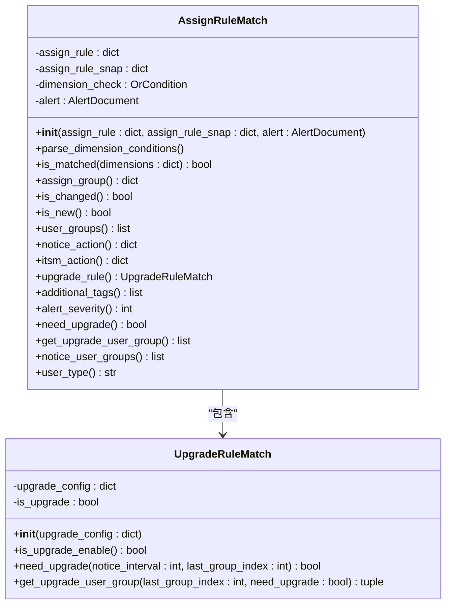
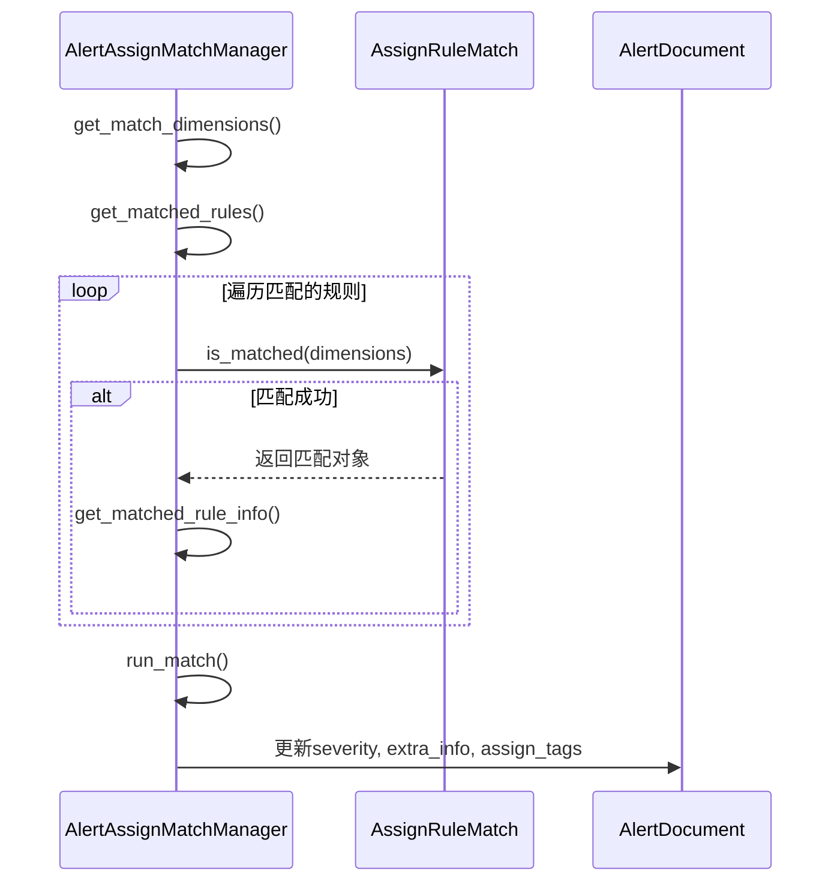
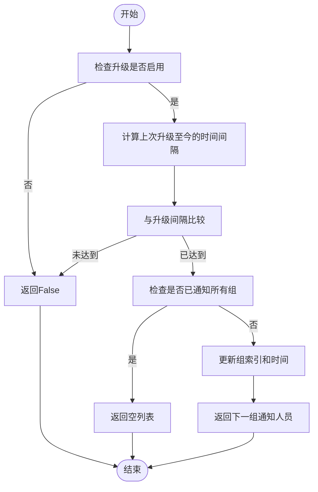

# 告警分配

<cite>
**本文档引用的文件**
- [alert_assign.py](file://bkmonitor\bkmonitor\action\alert_assign.py)
- [action.py](file://bkmonitor\constants\action.py)
- [assign.py](file://bkmonitor\bkmonitor\models\fta\assign.py)
- [create_action.py](file://bkmonitor\alarm_backends\service\fta_action\tasks\create_action.py)
- [resources.py](file://bkmonitor\packages\fta_web\assign\resources.py)
</cite>

## 目录
1. [引言](#引言)
2. [核心概念](#核心概念)
3. [告警分配规则](#告警分配规则)
4. [告警分配管理器](#告警分配管理器)
5. [升级规则](#升级规则)
6. [数据模型](#数据模型)
7. [配置与序列化](#配置与序列化)
8. [处理流程](#处理流程)
9. [故障排查](#故障排查)
10. [结论](#结论)

## 引言
本文档详细阐述了蓝鲸监控平台中告警分配机制的实现原理。告警分配是监控系统的核心功能之一，它根据预设的规则和条件，将产生的告警自动分派给相应的处理人员或团队。本系统通过灵活的规则引擎、优先级控制和升级机制，实现了智能化、自动化的告警分派，确保告警能够被及时、准确地响应和处理。

## 核心概念
告警分配机制涉及多个核心概念，包括分派模式、用户组类型、通知类型等，这些概念定义了告警分配的基本行为和规则。

### 分派模式
分派模式决定了告警分配的策略。系统支持两种主要的分派模式：
- **分派 (by_rule)**: 基于预设的分派规则进行分配。系统会根据告警的属性（如严重程度、业务系统、故障类型等）匹配相应的规则，并将告警分配给规则中指定的用户组。
- **仅通知 (only_notice)**: 不基于规则进行分派，而是直接通知预设的默认通知人员。

**Section sources**
- [action.py](file://bkmonitor\constants\action.py#L18-L22)

### 用户组类型
用户组类型定义了通知对象的角色，主要有两种：
- **负责人 (main)**: 对告警负有直接处理责任的人员或团队。
- **关注人 (follower)**: 需要了解告警情况但不直接负责处理的人员或团队。

**Section sources**
- [action.py](file://bkmonitor\constants\action.py#L750-L758)

### 通知类型
通知类型标识了通知的触发场景，其中与告警分配相关的主要类型是：
- **告警通知 (alert_notice)**: 在告警产生、恢复或关闭时发送的通知。
- **升级 (upgrade)**: 当告警在一定时间内未被处理时，触发的升级通知，会通知更高级别的负责人。

**Section sources**
- [action.py](file://bkmonitor\constants\action.py#L788-L796)

## 告警分配规则
告警分配规则是实现自动分派的核心。系统通过 `AssignRuleMatch` 类来表示和处理单个分派规则。

### 规则匹配逻辑
`AssignRuleMatch` 类负责判断一条告警是否匹配某个分派规则。其核心逻辑如下：

**Diagram sources**
- [alert_assign.py](file://bkmonitor\bkmonitor\action\alert_assign.py#L100-L300)

#### 条件解析
规则的匹配条件以 `conditions` 字段存储，支持 `and` 和 `or` 逻辑。`parse_dimension_conditions` 方法会将这些条件解析成一个 `OrCondition` 对象，以便进行高效的条件检查。

#### 匹配判断
`is_matched` 方法是判断规则是否匹配的核心。它首先检查规则是否发生了变化（通过 `is_changed` 属性），如果规则是新增的或已修改，则需要重新进行维度匹配；否则，直接认为匹配成功，以提高性能。

#### 附加功能
除了基本的匹配，`AssignRuleMatch` 还集成了其他功能：
- **通知动作 (notice_action)**: 获取规则中配置的通知插件。
- **ITSM动作 (itsm_action)**: 获取规则中配置的ITSM流程。
- **升级规则 (upgrade_rule)**: 返回一个 `UpgradeRuleMatch` 实例，用于处理告警升级。
- **附加标签 (additional_tags)**: 获取规则中配置的附加标签，这些标签会被添加到告警上。

**Section sources**
- [alert_assign.py](file://bkmonitor\bkmonitor\action\alert_assign.py#L100-L300)

## 告警分配管理器
`AlertAssignMatchManager` 类是告警分配的总控中心，负责协调整个分派过程。

### 功能概述
该管理器的主要职责包括：
1.  **数据准备**: 收集告警相关的所有维度信息，包括告警自身属性、CMDB拓扑信息等。
2.  **规则匹配**: 遍历所有分派规则，找出与当前告警匹配的规则。
3.  **结果整理**: 汇总匹配到的规则信息，如通知人员、关注人、ITSM流程等。
4.  **状态更新**: 更新告警对象的严重性、标签和额外信息。

**Diagram sources**
- [alert_assign.py](file://bkmonitor\bkmonitor\action\alert_assign.py#L300-L600)

### 匹配维度构建
`get_match_dimensions` 方法是数据准备的关键。它将来自不同来源的信息（告警事件、策略、CMDB等）整合成一个统一的维度字典，作为规则匹配的输入。

### 规则匹配流程
`get_matched_rules` 方法执行规则匹配。它会：
1.  检查分派模式是否为 `by_rule`。
2.  遍历所有规则组（按优先级降序）。
3.  对于每个规则，先将动态分组条件转换为主机ID列表。
4.  创建 `AssignRuleMatch` 实例并调用 `is_matched` 方法进行匹配。
5.  一旦在某个优先级的规则组中找到匹配的规则，立即停止后续规则的匹配，以保证高优先级规则的优先性。

**Section sources**
- [alert_assign.py](file://bkmonitor\bkmonitor\action\alert_assign.py#L300-L600)

## 升级规则
升级规则用于处理告警长时间未被处理的情况，通过逐级通知更高级别的负责人来确保问题得到解决。

### 升级机制
`UpgradeRuleMatch` 类实现了升级逻辑。其核心方法是 `need_upgrade` 和 `get_upgrade_user_group`。

**Diagram sources**
- [alert_assign.py](file://bkmonitor\bkmonitor\action\alert_assign.py#L20-L100)

#### 升级条件
`need_upgrade` 方法判断是否需要进行升级。它检查两个条件：
1.  升级功能是否已启用。
2.  自上次升级以来的时间间隔是否已超过配置的 `upgrade_interval`。

#### 获取升级组
`get_upgrade_user_group` 方法在满足升级条件后，返回下一个需要通知的用户组。它通过 `last_group_index` 记录上次通知的组索引，并递增该索引以获取下一组。

**Section sources**
- [alert_assign.py](file://bkmonitor\bkmonitor\action\alert_assign.py#L20-L100)

## 数据模型
告警分配功能的数据模型定义了规则和规则组的存储结构。

### 告警分派规则组
`AlertAssignGroup` 模型代表一个分派规则组，包含多个规则。其主要字段有：
- **id**: 规则组的唯一标识。
- **name**: 规则组名称。
- **priority**: 优先级，数值越大优先级越高。
- **is_enabled**: 是否启用。
- **source**: 来源系统。

### 告警分派规则
`AlertAssignRule` 模型代表单个分派规则，与规则组是一对多关系。其主要字段有：
- **id**: 规则的唯一标识。
- **assign_group_id**: 关联的规则组ID。
- **conditions**: 匹配条件，JSON格式。
- **user_groups**: 通知的用户组ID列表。
- **actions**: 动作配置，如通知、ITSM等。
- **additional_tags**: 附加标签。
- **alert_severity**: 指定的告警严重性。

**Section sources**
- [assign.py](file://bkmonitor\bkmonitor\models\fta\assign.py#L28-L59)

## 配置与序列化
系统的配置和序列化逻辑确保了规则的正确保存和读取。

### 规则保存
`save` 方法在 `serializers/assign.py` 中定义，负责保存分派规则组和规则。它会：
1.  创建或更新 `AlertAssignGroup` 对象。
2.  遍历规则列表，创建或更新 `AlertAssignRule` 对象。
3.  将规则与规则组关联。

**Section sources**
- [assign.py](file://bkmonitor\bkmonitor\action\serializers\assign.py#L238-L275)

## 处理流程
告警分配的完整处理流程如下：

1.  **初始化**: 创建 `AlertAssignMatchManager` 实例，传入告警对象、通知人员、规则列表等。
2.  **数据准备**: 调用 `get_match_dimensions` 构建完整的匹配维度。
3.  **规则匹配**: 调用 `get_matched_rules` 找出所有匹配的规则。
4.  **结果整理**: 如果有匹配的规则，调用 `get_matched_rule_info` 汇总通知人员、ITSM流程等信息。
5.  **状态更新**: 调用 `run_match` 更新告警的严重性、额外信息和分派标签。
6.  **日志记录**: 调用 `get_alert_log` 生成告警分派的日志记录。

**Section sources**
- [alert_assign.py](file://bkmonitor\bkmonitor\action\alert_assign.py#L600-L763)

## 故障排查
在排查告警分配问题时，可以参考以下步骤：

1.  **检查分派模式**: 确认告警所属策略的分派模式是否为 `by_rule`。
2.  **检查规则状态**: 确认相关的分派规则组和规则是否已启用。
3.  **检查匹配条件**: 核对告警的维度信息是否与规则的 `conditions` 匹配。可以查看 `get_match_dimensions` 的输出。
4.  **检查日志**: 查看 `logger` 记录的日志，特别是 `is_matched` 和 `need_upgrade` 方法的执行情况。
5.  **检查升级配置**: 如果涉及升级，确认 `upgrade_config` 中的 `upgrade_interval` 和 `user_groups` 配置是否正确。

**Section sources**
- [alert_assign.py](file://bkmonitor\bkmonitor\action\alert_assign.py)

## 结论
本文档详细解析了蓝鲸监控平台告警分配机制的实现。该机制通过 `AlertAssignMatchManager` 作为核心控制器，结合 `AssignRuleMatch` 和 `UpgradeRuleMatch` 等组件，实现了基于规则的、支持优先级和升级的智能告警分派。系统设计灵活，通过清晰的数据模型和配置接口，能够满足复杂的告警分派需求，是保障系统稳定运行的重要组成部分。