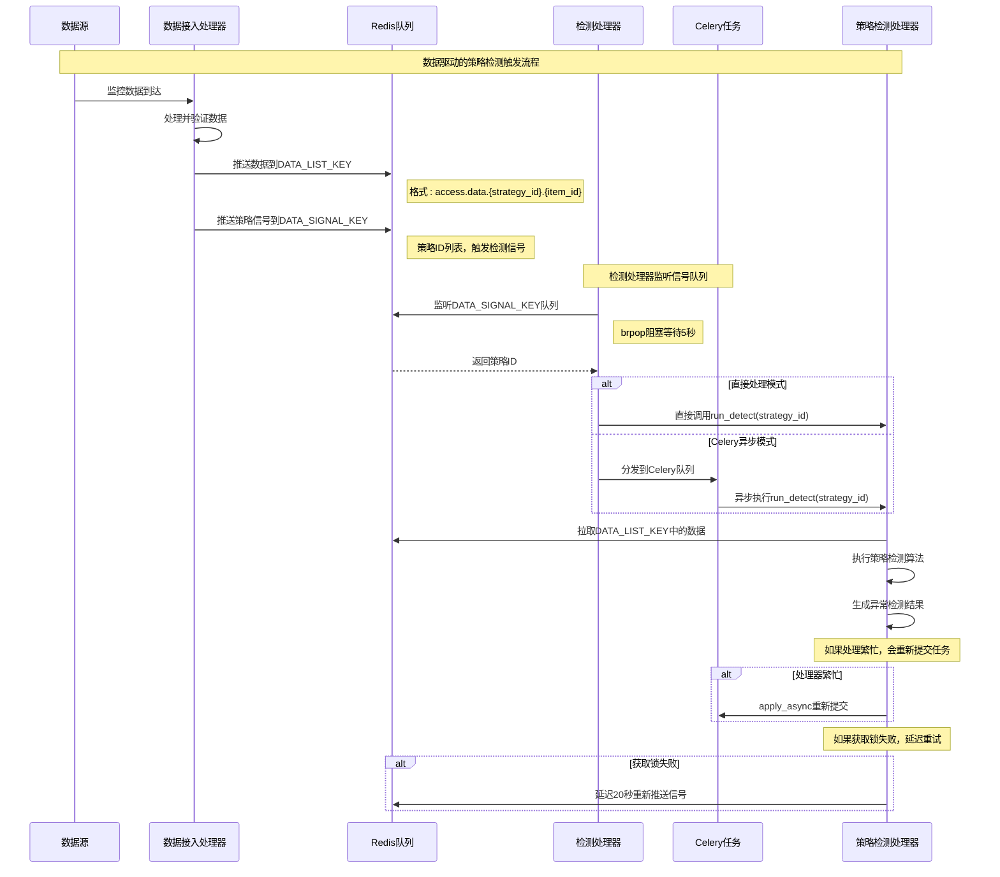
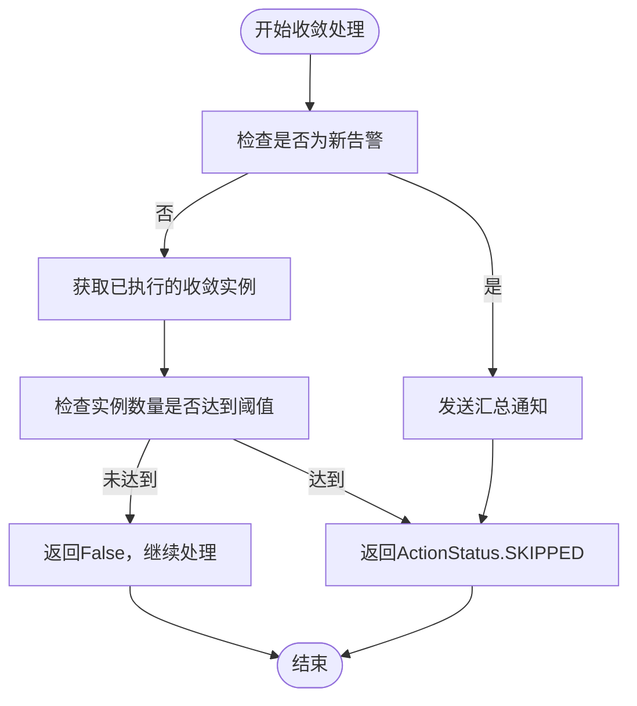
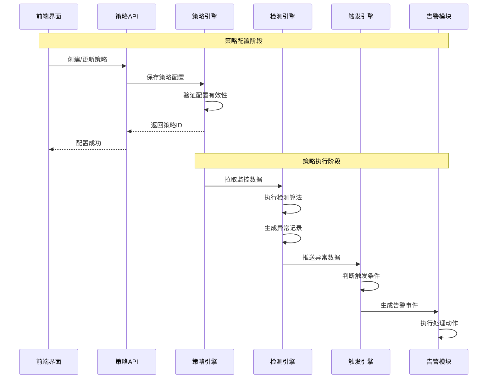
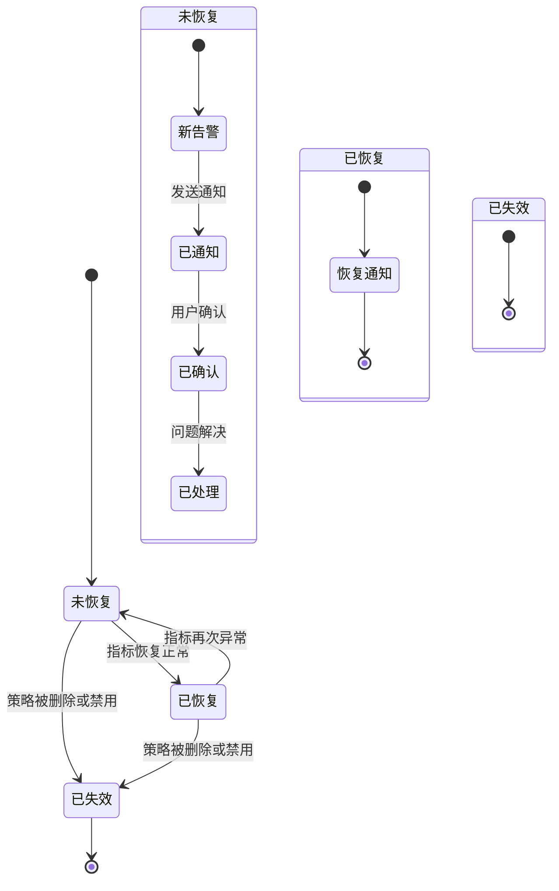

# 告警处理

<cite>
**本文档引用的文件**   
- [alert.py](file://bkmonitor\constants\alert.py)
- [action.py](file://bkmonitor\constants\action.py)
- [strategy.py](file://bkmonitor\constants\strategy.py)
- [策略引擎.md](file://wiki\策略引擎.md)
- [save_user_group.md](file://bkmonitor\docs\api\apidocs\zh_hans\save_user_group.md)
- [search_alarm_strategy_without_biz.md](file://bkmonitor\docs\api\apidocs\zh_hans\search_alarm_strategy_without_biz.md)
- [action_plugin_initial.json](file://bkmonitor\support-files\fta\action_plugin_initial.json)
- [alert_assign.py](file://bkmonitor\alarm_backends\service\fta_action\tasks\alert_assign.py)
- [create_action.py](file://bkmonitor\alarm_backends\service\fta_action\tasks\create_action.py)
- [converge_func.py](file://bkmonitor\alarm_backends\service\converge\converge_func.py)
- [processor.py](file://bkmonitor\alarm_backends\service\converge\processor.py)
- [alert.py](file://bkmonitor\alarm_backends\service\alert\manager\checker\action.py)
- [README.md](file://bkmonitor\alarm_backends\service\alert\README.md)
</cite>

## 目录
1. [告警处理流程概述](#告警处理流程概述)
2. [告警检测机制](#告警检测机制)
3. [告警收敛策略](#告警收敛策略)
4. [告警分配规则](#告警分配规则)
5. [告警通知方式](#告警通知方式)
6. [告警处理流程时序图](#告警处理流程时序图)
7. [告警状态机](#告警状态机)
8. [实际案例与配置示例](#实际案例与配置示例)

## 告警处理流程概述

告警处理是监控系统的核心功能，负责从告警检测到最终通知的完整处理链路。该流程始于监控数据的接入，经过策略检测、告警触发、收敛处理、分配决策，最终通过多种渠道通知相关人员。整个流程采用事件驱动架构，确保实时性和高效性。系统通过策略配置实现灵活的告警规则定义，支持阈值检测、智能检测等多种算法。告警收敛机制有效避免了告警风暴，而分派规则则确保告警能够准确送达责任人。通知系统支持微信、短信、邮件等多种渠道，满足不同场景的需求。

**文档来源**
- [策略引擎.md](file://wiki\策略引擎.md)

## 告警检测机制

告警检测机制基于策略配置，通过事件驱动的方式实时响应监控数据变化。系统不采用传统的定时任务模式，而是当监控数据到达时，由数据接入处理器推送信号到Redis队列，触发后续的检测流程。

### 策略配置

告警策略由多个组件构成，包括监控项、查询配置、检测算法和触发条件。监控项定义了需要监控的指标，查询配置指定了数据源和查询方式，检测算法实现了具体的异常判断逻辑，而触发条件则决定了告警的严重程度和触发频率。



**图源**
- [策略引擎.md](file://wiki\策略引擎.md)

### 检测算法

系统支持多种检测算法，包括：
- **阈值检测**：基于固定阈值判断指标是否异常
- **智能检测**：使用机器学习算法识别异常模式
- **高级环比检测**：比较当前数据与历史同期数据

这些算法在`bkmonitor/alarm_backends/service/detect/strategy/`目录下实现，由策略检测处理器统一调用。

**文档来源**
- [策略引擎.md](file://wiki\策略引擎.md)

## 告警收敛策略

告警收敛策略旨在避免短时间内大量相似告警的重复通知，通过合并和去重机制有效控制告警风暴。

### 收敛功能类型

系统提供了多种收敛功能，可根据不同场景进行配置：

| 收敛功能 | 描述 |
|---------|------|
| 成功后跳过 | 如果当前策略存在其他告警已处理成功，则跳过当前告警 |
| 执行中跳过 | 如果当前策略存在其他正在处理的告警，则跳过当前告警 |
| 执行中等待 | 等待其他告警处理完成后再处理当前告警 |
| 超出后忽略 | 超出数量的告警将不进行处理 |
| 异常防御审批 | 产生审批单据，由负责人决定是否执行 |
| 超出后汇总 | 超出数量的告警不处理，但发送汇总通知 |

```python
class ConvergeFunction:
    SKIP_WHEN_SUCCESS = "skip_when_success"
    SKIP_WHEN_PROCEED = "skip_when_proceed"
    WAIT_WHEN_PROCEED = "wait_when_proceed"
    SKIP_WHEN_EXCEED = "skip_when_exceed"
    DEFENSE = "defense"
    COLLECT = "collect"
    COLLECT_ALARM = "collect_alarm"
```

**文档来源**
- [action.py](file://bkmonitor\constants\action.py)

### 收敛配置

收敛配置包含时间窗口、数量阈值和匹配条件等参数。系统支持两级收敛：主收敛和子收敛。主收敛用于控制告警处理的总体频率，而子收敛则用于更精细的控制。

```json
"converge_config": {
    "is_enabled": true,
    "converge_func": "collect",
    "timedelta": 60,
    "count": 1,
    "condition": [
        {"dimension": "strategy_id", "value": ["self"]},
        {"dimension": "dimensions", "value": ["self"]}
    ],
    "need_biz_converge": true,
    "sub_converge_config": {
        "timedelta": 60,
        "count": 2,
        "condition": [
            {"dimension": "bk_biz_id", "value": ["self"]},
            {"dimension": "notice_receiver", "value": ["self"]}
        ],
        "converge_func": "collect_alarm"
    }
}
```

**文档来源**
- [search_alarm_strategy_without_biz.md](file://bkmonitor\docs\api\apidocs\zh_hans\search_alarm_strategy_without_biz.md)

### 收敛维度

系统支持多种收敛维度，可根据不同维度进行告警合并：

- **策略**：strategy_id
- **告警名称**：alert_name
- **业务**：bk_biz_id
- **告警级别**：alert_level
- **目标**：target
- **维度**：dimensions



**图源**
- [converge_func.py](file://bkmonitor\alarm_backends\service\converge\converge_func.py)

## 告警分配规则

告警分配规则决定了告警应由哪些人员或团队处理，支持基于规则的分派和默认通知两种模式。

### 分派模式

系统支持两种分派模式：

1. **基于规则分派**：根据预定义的规则匹配责任人
2. **仅通知**：不进行规则匹配，直接通知配置的人员

```python
class AssignMode:
    BY_RULE = "by_rule"
    ONLY_NOTICE = "only_notice"

    ASSIGN_MODE_CHOICE = [(BY_RULE, "分派"), (ONLY_NOTICE, "仅通知")]
```

**文档来源**
- [action.py](file://bkmonitor\constants\action.py)

### 分派规则匹配

分派规则匹配流程如下：

1. 检查分派模式，若不包含"by_rule"则跳过匹配
2. 创建分派匹配管理器
3. 执行规则匹配逻辑
4. 记录匹配结果和调试信息

```python
def get_matched_rules(self) -> list[AssignRuleMatch]:
    """
    适配分派规则, 后台通过缓存获取
    :return: 返回匹配的分派规则列表
    """
    if self.assign_mode is None or AssignMode.BY_RULE not in self.assign_mode:
        return []
    
    manager = BackendAssignMatchManager(
        self.alert,
        self.get_origin_notice_all_receivers(),
        assign_mode=self.assign_mode,
        cmdb_attrs=self.cmdb_attrs
    )
    return manager.get_matched_rules()
```

**文档来源**
- [alert_assign.py](file://bkmonitor\alarm_backends\service\fta_action\tasks\alert_assign.py)

### 分配管理器

`AlertAssigneeManager`是告警分配的核心类，负责管理告警处理通知人。它根据告警信息、通知用户组、分派模式等参数，计算出最终的处理人列表。

```python
class AlertAssigneeManager:
    """
    告警处理通知人管理模块
    """

    def __init__(
        self,
        alert: AlertDocument,
        notice_user_groups: list = None,
        assign_mode: AssignMode = None,
        upgrade_config=None,
        notice_type: ActionNoticeType = None,
        user_type: UserGroupType = UserGroupType.MAIN,
        new_alert=False,
    ):
        # 初始化属性和匹配状态
        pass
```

**文档来源**
- [alert_assign.py](file://bkmonitor\alarm_backends\service\fta_action\tasks\alert_assign.py)

## 告警通知方式

告警通知系统支持多种渠道，可根据告警级别和场景灵活配置。

### 通知渠道

系统支持以下通知渠道：

- **微信**：weixin
- **短信**：sms
- **语音通知**：voice
- **企业微信机器人**：wxwork-bot
- **邮件**：email

```json
{
    "name": "weixin（微信）",
    "receivers": ["user1", "user2"]
}
```

**文档来源**
- [save_user_group.md](file://bkmonitor\docs\api\apidocs\zh_hans\save_user_group.md)

### 通知配置

通知配置包含生效时间范围、通知级别和通知方式等信息。系统支持为不同级别的告警配置不同的通知方式。

```json
"alert_notice": [
    {
        "time_range": "00:00:00--23:59:59",
        "notify_config": [
            {"level": 1, "notice_ways": ["weixin", "mail"]},
            {"level": 2, "notice_ways": ["weixin", "mail"]},
            {"level": 3, "notice_ways": ["weixin", "mail"]}
        ]
    }
]
```

**文档来源**
- [save_user_group.md](file://bkmonitor\docs\api\apidocs\zh_hans\save_user_group.md)

### 通知模板

系统支持自定义通知模板，使用Jinja2语法，可根据不同场景渲染不同的通知内容。

```python
DEFAULT_TEMPLATE: str = (
    "{{content.level}}\n"
    "{{content.begin_time}}\n"
    "{{content.time}}\n"
    "{{content.duration}}\n"
    "{{content.target_type}}\n"
    "{{content.data_source}}\n"
    "{{content.content}}\n"
    "{{content.current_value}}\n"
    "{{content.biz}}\n"
    "{{content.target}}\n"
    "{{content.dimension}}\n"
    "{{content.detail}}\n"
    "{{content.related_info}}\n"
    "{{content.recommended_metrics}}\n"
    "{{content.anomaly_dimensions}}\n"
)
```

**文档来源**
- [alert.py](file://bkmonitor\constants\alert.py)

## 告警处理流程时序图



**图源**
- [策略引擎.md](file://wiki\策略引擎.md)

## 告警状态机



**文档来源**
- [alert.py](file://bkmonitor\constants\alert.py)

## 实际案例与配置示例

### 完整策略配置示例

```json
{
    "id": 38297,
    "name": "CPU使用率监控",
    "items": [
        {
            "name": "AVG(CPU使用率)",
            "query_configs": [
                {
                    "metric_id": "bk_monitor.system.cpu_summary.usage",
                    "result_table_id": "system.cpu_summary",
                    "agg_method": "AVG",
                    "agg_interval": 60
                }
            ],
            "algorithms": [
                {
                    "type": "Threshold",
                    "level": 1,
                    "config": [
                        [
                            {
                                "method": "gte",
                                "threshold": 80
                            }
                        ]
                    ]
                }
            ]
        }
    ],
    "notice": {
        "user_groups": [63722],
        "signal": ["abnormal", "no_data"],
        "options": {
            "converge_config": {
                "is_enabled": true,
                "converge_func": "collect",
                "timedelta": 60,
                "count": 1,
                "condition": [
                    {"dimension": "strategy_id", "value": ["self"]}
                ]
            }
        },
        "config": {
            "template": [
                {
                    "signal": "abnormal",
                    "message_tmpl": "{{content.level}}\n{{content.time}}\n{{content.content}}",
                    "title_tmpl": "{{business.bk_biz_name}} - {{alarm.name}}"
                }
            ]
        }
    }
}
```

**文档来源**
- [search_alarm_strategy_without_biz.md](file://bkmonitor\docs\api\apidocs\zh_hans\search_alarm_strategy_without_biz.md)

### 告警分配配置示例

```python
{
    "assign_mode": ["by_rule"],
    "upgrade_config": {},
    "start_time": "00:00:00",
    "end_time": "23:59:59"
}
```

**文档来源**
- [create_action.py](file://bkmonitor\alarm_backends\service\fta_action\tasks\create_action.py)

### 通知方式配置示例

```json
{
    "alert_notice": [
        {
            "time_range": "00:00:00--23:59:59",
            "notify_config": [
                {
                    "level": 1,
                    "notice_ways": [
                        {
                            "name": "weixin",
                            "receivers": ["zhangsan", "lisi"]
                        },
                        {
                            "name": "sms",
                            "receivers": ["zhangsan"]
                        }
                    ]
                }
            ]
        }
    ]
}
```

**文档来源**
- [save_user_group.md](file://bkmonitor\docs\api\apidocs\zh_hans\save_user_group.md)