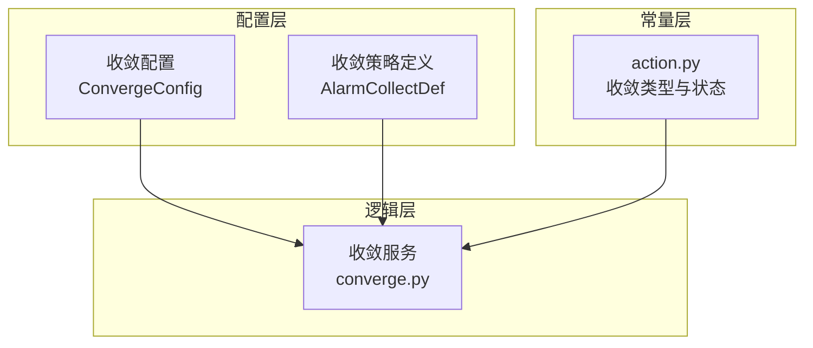
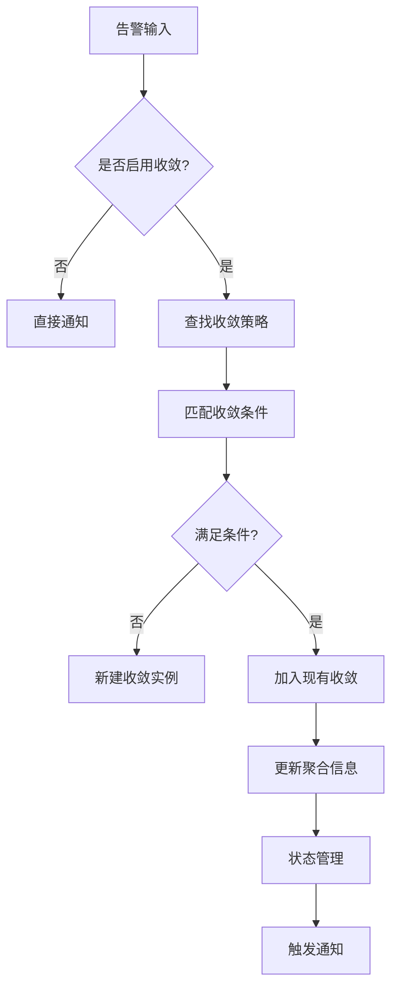
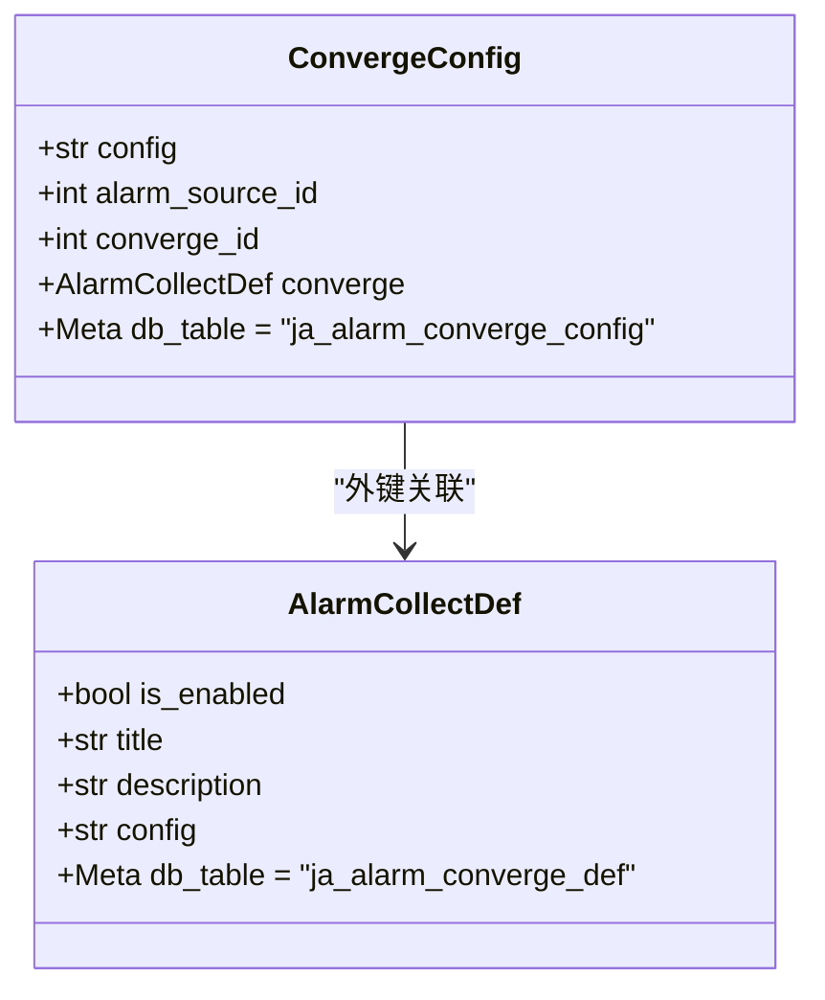
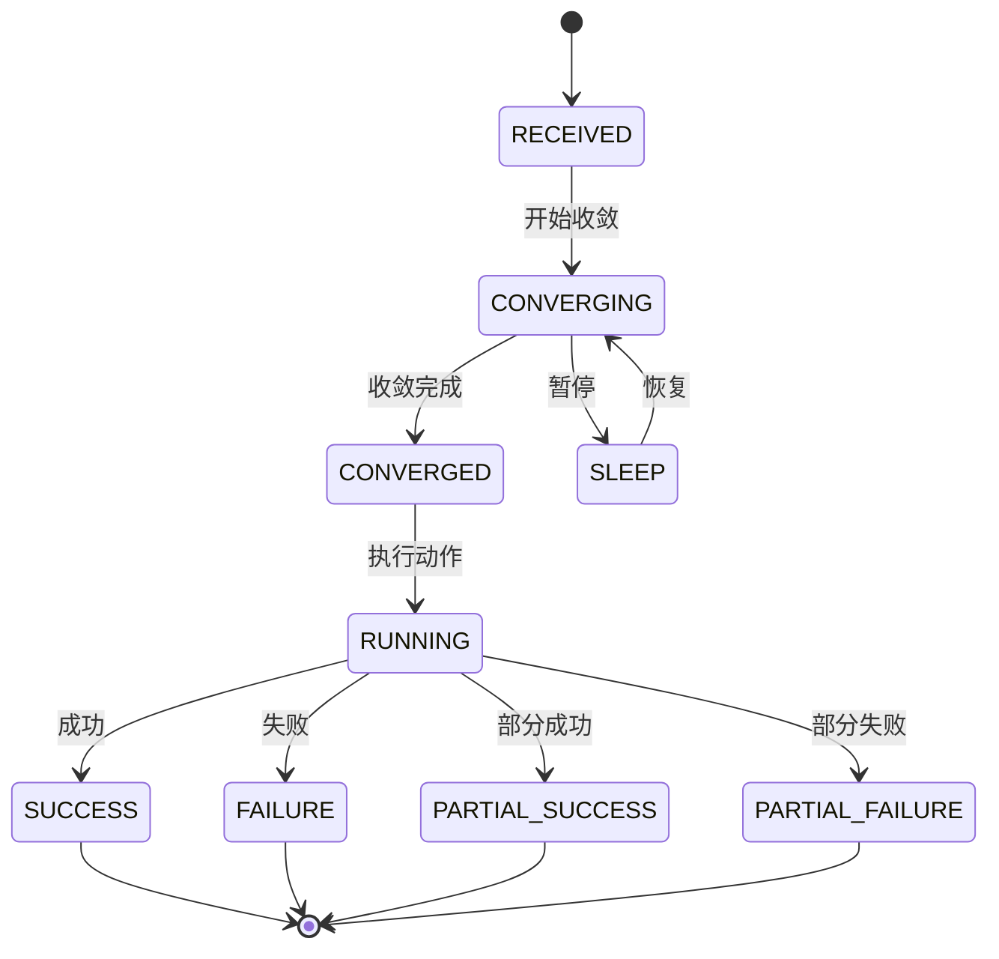
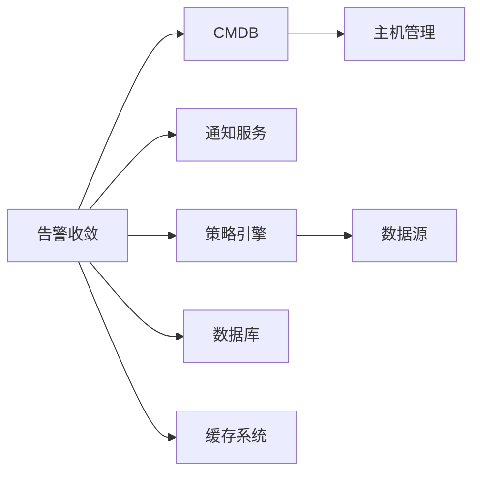

# 告警收敛

<cite>
**本文档引用文件**  
- [action.py](file://bkmonitor/constants/action.py#L500-L699)
- [base.py](file://bkmonitor/packages/monitor_api/models/base.py#L540-L579)
- [service/converge.py](file://bkmonitor/alarm_backends/service/converge.py)
</cite>

## 目录
1. [引言](#引言)
2. [项目结构](#项目结构)
3. [核心组件](#核心组件)
4. [架构概览](#架构概览)
5. [详细组件分析](#详细组件分析)
6. [依赖分析](#依赖分析)
7. [性能考量](#性能考量)
8. [故障排查指南](#故障排查指南)
9. [结论](#结论)

## 引言
告警收敛机制是监控系统中用于减少告警风暴、提升告警有效性的关键功能。当系统出现异常时，可能在短时间内产生大量重复或相似的告警，导致运维人员信息过载，难以快速定位问题。告警收敛通过将多个相似告警合并为一个聚合告警，显著降低告警数量，同时保留关键信息，帮助用户更高效地响应事件。

本文档全面介绍告警收敛的设计理念与实现方式，涵盖收敛策略、配置方法、算法逻辑、状态管理及最佳实践，旨在为开发者和运维人员提供完整的参考。

## 项目结构
告警收敛功能主要分布在 `bkmonitor` 模块下的多个子系统中，涉及配置管理、策略定义、服务处理等模块。核心路径包括：

- `bkmonitor/constants/action.py`：定义收敛类型、状态等常量
- `bkmonitor/packages/monitor_api/models/base.py`：定义收敛配置与策略的数据模型
- `bkmonitor/alarm_backends/service/converge.py`：实现收敛逻辑的核心服务模块

该结构体现了配置与逻辑分离的设计原则，便于扩展和维护。



**图示来源**  
- [base.py](file://bkmonitor/packages/monitor_api/models/base.py#L540-L579)
- [action.py](file://bkmonitor/constants/action.py#L500-L699)

## 核心组件
告警收敛的核心组件包括收敛策略定义、收敛配置模型和收敛服务逻辑。这些组件协同工作，实现从告警接收、匹配、聚合到状态管理的完整流程。

- **收敛策略定义（AlarmCollectDef）**：定义是否启用、名称、描述及具体收敛规则。
- **收敛配置（ConvergeConfig）**：关联告警源与收敛策略，支持细粒度配置。
- **收敛类型与状态（ConvergeType, ActionStatus）**：定义收敛行为类型及生命周期状态。

**本节来源**  
- [base.py](file://bkmonitor/packages/monitor_api/models/base.py#L540-L579)
- [action.py](file://bkmonitor/constants/action.py#L500-L699)

## 架构概览
告警收敛的整体架构采用分层设计，分为数据模型层、配置管理层和服务执行层。



**图示来源**  
- [action.py](file://bkmonitor/constants/action.py#L500-L699)
- [base.py](file://bkmonitor/packages/monitor_api/models/base.py#L540-L579)

## 详细组件分析

### 收敛策略与配置分析
告警收敛的核心在于策略的灵活配置。系统通过 `AlarmCollectDef` 类定义收敛策略，其字段包括：

- `is_enabled`: 是否启用该策略
- `title`: 策略名称
- `config`: JSON 格式的配置内容，包含时间窗口、计数阈值、收敛维度等

默认配置示例如下：
```json
{
  "is_enabled": true,
  "timedelta": 60,
  "count": 1,
  "condition": [
    {"dimension": "strategy_id", "value": ["self"]},
    {"dimension": "alert_level", "value": ["self"]}
  ],
  "converge_func": "collect"
}
```
此配置表示：在60秒内，若同一策略、同一告警级别的告警出现1次以上，则进行收敛。

#### 收敛维度说明
- `strategy_id`: 策略ID，确保同策略告警可被聚合
- `dimensions`: 自定义维度（如IP、服务名）
- `alert_level`: 告警级别（致命、严重、警告）
- `bk_biz_id`: 业务ID，支持按业务隔离收敛
- `notice_receiver`: 通知接收人
- `notice_way`: 通知方式



**图示来源**  
- [base.py](file://bkmonitor/packages/monitor_api/models/base.py#L540-L579)

### 收敛状态管理分析
告警收敛的状态机设计确保了流程的可控性和可观测性。`ActionStatus` 类定义了完整的状态生命周期：



关键状态分组：
- **进行中状态（PROCEED_STATUS）**：`RECEIVED`, `WAITING`, `CONVERGING`, `SLEEP`, `CONVERGED`, `RUNNING`
- **终止状态（END_STATUS）**：`SUCCESS`, `PARTIAL_SUCCESS`, `FAILURE`, `PARTIAL_FAILURE`, `SKIPPED`, `SHIELD`
- **可执行状态（CAN_EXECUTE_STATUS）**：`RECEIVED`, `CONVERGED`, `RUNNING`, `RETRYING`

**本节来源**  
- [action.py](file://bkmonitor/constants/action.py#L500-L699)

## 依赖分析
告警收敛模块依赖于多个核心系统组件：



- **CMDB**：用于获取业务拓扑和主机信息，支持按业务维度收敛
- **通知服务**：收敛完成后触发通知
- **策略引擎**：提供原始告警数据
- **数据库**：持久化收敛策略与配置
- **缓存系统**：提升收敛匹配性能

**图示来源**  
- [action.py](file://bkmonitor/constants/action.py#L500-L699)
- [base.py](file://bkmonitor/packages/monitor_api/models/base.py#L540-L579)

## 性能考量
告警收敛在高并发场景下需关注以下性能点：

1. **收敛匹配效率**：使用缓存（如Redis）存储活跃收敛实例，避免频繁数据库查询。
2. **条件判断优化**：对收敛维度进行索引化处理，加快匹配速度。
3. **异步处理**：收敛逻辑应异步执行，避免阻塞主告警流程。
4. **配置热加载**：支持运行时动态更新收敛策略，无需重启服务。

建议在大规模部署时，对收敛规则进行分级管理，优先处理高频告警类型。

## 故障排查指南
常见问题及解决方案：

| 问题现象 | 可能原因 | 解决方案 |
|--------|--------|--------|
| 告警未收敛 | 收敛策略未启用 | 检查 `AlarmCollectDef.is_enabled` |
| 收敛不生效 | 条件配置错误 | 验证 `condition` 中维度是否匹配 |
| 收敛延迟 | 缓存未命中 | 检查Redis连接状态与缓存键 |
| 状态异常 | 状态机卡住 | 查看日志中 `ActionStatus` 转换记录 |

**本节来源**  
- [action.py](file://bkmonitor/constants/action.py#L500-L699)
- [base.py](file://bkmonitor/packages/monitor_api/models/base.py#L540-L579)

## 结论
告警收敛机制通过策略化、可配置的方式有效缓解了告警风暴问题。其核心设计包括灵活的收敛维度、清晰的状态管理、可扩展的配置模型。合理配置收敛规则不仅能减少无效告警，还能提升告警的可读性和响应效率。建议结合业务特点制定收敛策略，并定期评估收敛效果，持续优化配置。