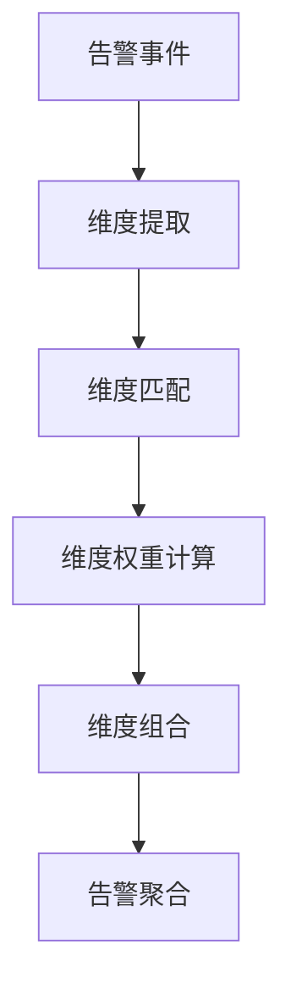
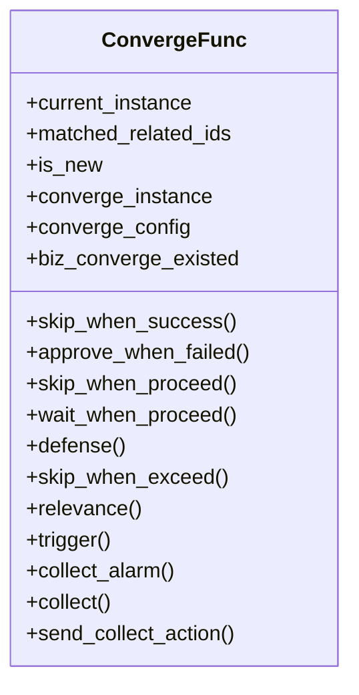
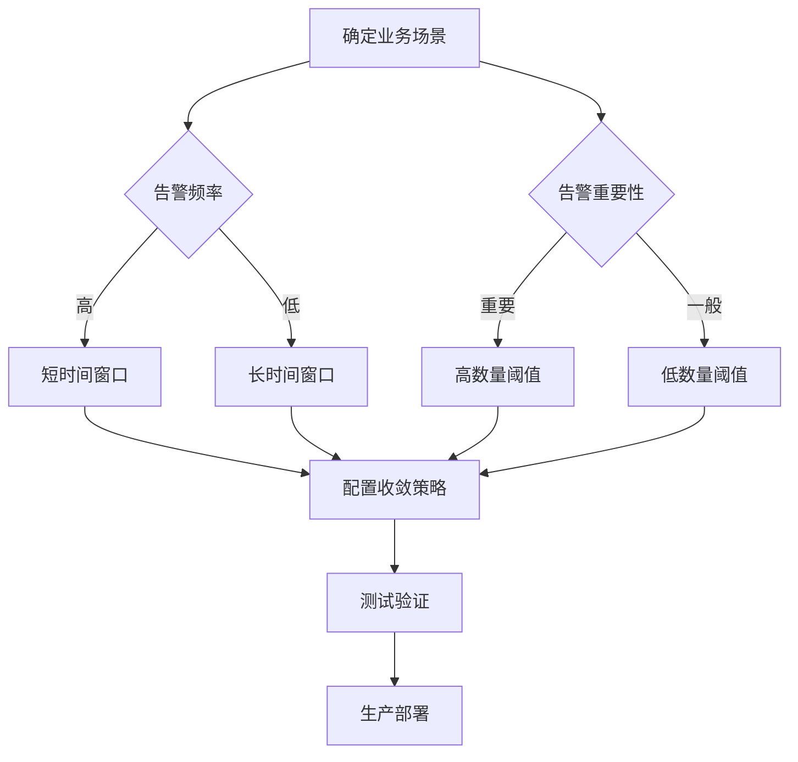

# 收敛维度

<cite>
**本文档引用的文件**   
- [processor.py](file://bkmonitor/alarm_backends/service/converge/processor.py)
- [converge_func.py](file://bkmonitor/alarm_backends/service/converge/converge_func.py)
- [action.py](file://bkmonitor/bkmonitor/action/serializers/action.py)
- [dimension.py](file://bkmonitor/alarm_backends/service/converge/dimension.py)
- [action.py](file://bkmonitor/constants/action.py)
</cite>

## 目录
1. [引言](#引言)
2. [收敛维度概述](#收敛维度概述)
3. [核心实现机制](#核心实现机制)
4. [维度提取与处理](#维度提取与处理)
5. [维度匹配与聚合](#维度匹配与聚合)
6. [维度权重与计算](#维度权重与计算)
7. [维度组合策略](#维度组合策略)
8. [配置最佳实践](#配置最佳实践)
9. [代码示例](#代码示例)
10. [总结](#总结)

## 引言
收敛维度是告警系统中实现告警聚合与降噪的核心机制。通过多维度分析，系统能够将相似的告警事件进行智能聚合，避免告警风暴，提高运维效率。本文档详细阐述了收敛维度的实现机制、核心算法以及配置最佳实践。

## 收敛维度概述
收敛维度是指在告警收敛过程中用于匹配和聚合告警事件的属性或特征。系统支持多种维度类型，包括业务维度、告警类型、资源维度等，通过灵活的配置实现精准的告警聚合。

**Section sources**
- [action.py](file://bkmonitor/constants/action.py#L130-L160)

## 核心实现机制
收敛维度的核心实现机制包括维度提取、维度匹配、维度权重计算和维度组合等环节。系统通过这些机制实现告警事件的智能聚合。



**Diagram sources**
- [processor.py](file://bkmonitor/alarm_backends/service/converge/processor.py#L545-L580)
- [dimension.py](file://bkmonitor/alarm_backends/service/converge/dimension.py#L242-L271)

## 维度提取与处理
维度提取是收敛过程的第一步，系统从告警事件中提取关键属性作为收敛维度。

### 维度值处理
系统对维度值进行特殊处理，当值为列表且长度≥4时，执行压缩处理逻辑：

```python
def get_dimension_value(self, value):
    """
    处理维度值
    当value为列表且长度>=4时，执行特殊压缩处理逻辑
    """
    if isinstance(value, list):
        if len(value) >= 4:
            h = hashlib.md5(str(value).encode()).hexdigest()[:5]
            value = [value[0], f"{h}.{len(value) - 2}", value[-1]]
        dimension_value = ",".join(map(str, value))
    else:
        dimension_value = value
    return dimension_value
```

### 维度生成
系统通过`get_dimension`方法生成最终的维度字符串：

```python
def get_dimension(self, safe_length=0):
    """
    通过收敛条件中配置的收敛规则获取到维度信息
    """
    converge_dimension = ["#{}".format(self.converge_config["converge_func"])]
    self.converge_config["converged_condition"] = {}
    dimension_conditions = {
        condition["dimension"]: condition for condition in self.converge_config.get("condition")
    }
    # 合并原始配置和当前配置的维度条件
    dimension_conditions.update(
        {condition["dimension"]: condition for condition in self.origin_converge_config.get("condition", [])}
    )
    dimension_conditions = collections.OrderedDict(sorted(dimension_conditions.items()))

    # 遍历所有维度条件
    for dimension_condition in dimension_conditions.values():
        key = dimension_condition["dimension"]
        values = deepcopy(dimension_condition["value"])
        for index, value in enumerate(values):
            if value == "self":
                values[index] = self.context.get(key, "")
            converge_dimension.append(f"|{key}:{self.get_dimension_value(values[index])}")
        self.converge_config["converged_condition"][key] = [
            value[0] if isinstance(value, list) else value for value in values
        ]
    dimension = "".join(converge_dimension)
    return dimension
```

**Section sources**
- [processor.py](file://bkmonitor/alarm_backends/service/converge/processor.py#L545-L604)

## 维度匹配与聚合
维度匹配是告警聚合的关键步骤，系统通过配置的维度条件进行匹配。

### 匹配流程
1. 合并原始配置和当前配置的维度条件
2. 替换'self'为上下文实际值
3. 生成维度键值对
4. 存储收敛配置的维度条件

### 收敛函数
系统提供多种收敛函数实现不同的聚合策略：



**Diagram sources**
- [converge_func.py](file://bkmonitor/alarm_backends/service/converge/converge_func.py#L27-L325)

## 维度权重与计算
系统通过维度组合实现权重计算，不同维度的组合产生不同的收敛效果。

### 权重机制
系统通过维度条件的组合隐式实现权重计算：
- 多维度条件的AND关系相当于增加权重
- 时间窗口和数量阈值控制收敛强度
- 收敛函数类型决定处理策略

### 二级收敛
系统支持二级收敛，优先级高于一级收敛：

```python
class ConvergeConfigSlz(ConvergeConfigDetailSlz):
    """
    一级收敛：包含二级收敛的内容
    二级收敛的优先级 > 一级收敛
    """
    sub_converge_config = ConvergeConfigDetailSlz(required=False)
    need_biz_converge = serializers.BooleanField(required=False, default=True, help_text="是否需要业务汇总")
```

**Section sources**
- [action.py](file://bkmonitor/bkmonitor/action/serializers/action.py#L60-L93)

## 维度组合策略
通过维度组合实现精准的告警聚合，系统支持灵活的组合配置。

### 组合原则
1. **业务维度**：`bk_biz_id` - 按业务聚合
2. **告警类型**：`alert_name` - 按告警名称聚合
3. **资源维度**：`strategy_id` - 按策略聚合
4. **级别维度**：`alert_level` - 按告警级别聚合

### 组合示例
```json
{
    "converge_config": {
        "converge_func": "collect",
        "timedelta": 60,
        "count": 1,
        "condition": [
            {"dimension": "strategy_id", "value": ["self"]},
            {"dimension": "dimensions", "value": ["self"]},
            {"dimension": "alert_level", "value": ["self"]},
            {"dimension": "signal", "value": ["self"]},
            {"dimension": "bk_biz_id", "value": ["self"]},
            {"dimension": "notice_receiver", "value": ["self"]},
            {"dimension": "notice_way", "value": ["self"]},
            {"dimension": "notice_info", "value": ["self"]}
        ],
        "need_biz_converge": true
    }
}
```

**Section sources**
- [action.py](file://bkmonitor/bkmonitor/action/serializers/action.py#L60-L93)

## 配置最佳实践
### 有效收敛维度定义
1. **选择关键维度**：优先选择业务、告警类型、资源等关键维度
2. **避免过度细化**：不要使用过于具体的维度导致聚合效果差
3. **考虑业务场景**：根据实际业务需求选择合适的维度组合

### 避免维度爆炸
1. **限制维度数量**：避免同时使用过多维度
2. **使用默认配置**：参考系统默认的收敛配置
3. **测试验证**：在生产环境前充分测试配置效果

### 业务场景调整
1. **高频率告警**：使用较短时间窗口和较低数量阈值
2. **重要告警**：使用较长时间窗口和较高数量阈值
3. **跨业务告警**：启用业务汇总功能



**Diagram sources**
- [processor.py](file://bkmonitor/alarm_backends/service/converge/processor.py#L158-L186)

## 代码示例
### 维度处理完整流程
```python
class ConvergeProcessor:
    def __init__(self, instance_id, instance_type, converge_config=None, alerts=None):
        self.instance_id = instance_id
        self.instance_type = instance_type
        self.converge_config = converge_config or {}
        self.alerts = alerts
        self.context = None
        self.dimension = ""
        
    def process(self):
        # 1. 获取收敛上下文
        self.get_converge_context()
        
        # 2. 设置收敛参数
        self.set_converge_count_and_timedelta(self.converge_config)
        
        # 3. 计算时间窗口
        self.start_time = self.instance.create_time - timedelta(
            minutes=self.max_converge_timedelta or self.converge_timedelta
        )
        self.end_timestamp = int(
            (self.instance.create_time + timedelta(
                minutes=self.max_converge_timedelta or self.converge_timedelta
            )).timestamp()
        )
        
        # 4. 生成维度
        self.dimension = self.get_dimension(safe_length=128)
        
        # 5. 执行收敛
        self.execute_converge()
        
    def get_dimension(self, safe_length=0):
        # 维度生成逻辑
        converge_dimension = ["#{}".format(self.converge_config["converge_func"])]
        dimension_conditions = {
            condition["dimension"]: condition for condition in self.converge_config.get("condition")
        }
        # ... 其他处理逻辑
        return dimension
```

**Section sources**
- [processor.py](file://bkmonitor/alarm_backends/service/converge/processor.py#L100-L186)

## 总结
收敛维度是告警系统智能化的重要组成部分。通过合理的维度配置和组合策略，可以有效实现告警聚合，避免告警风暴。在实际应用中，需要根据具体业务场景调整配置，通过测试验证确保收敛效果。