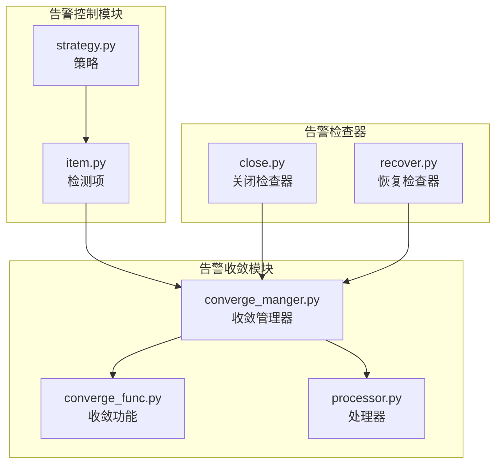
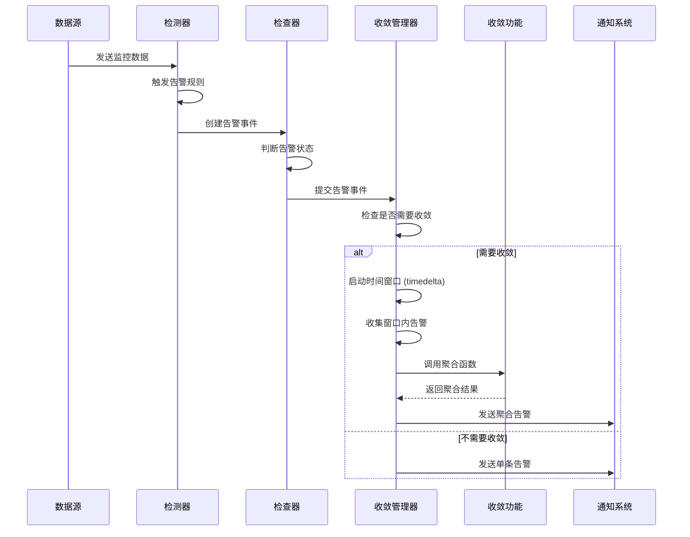
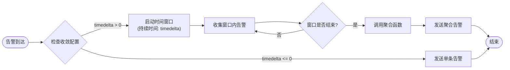
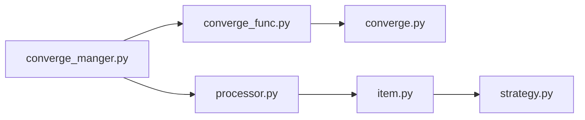

# 时间窗口

<cite>
**本文档引用的文件**  
- [converge_func.py](file://bkmonitor/alarm_backends/service/converge/converge_func.py)
- [converge_manger.py](file://bkmonitor/alarm_backends/service/converge/converge_manger.py)
- [converge.py](file://bkmonitor/alarm_backends/core/context/converge.py)
- [item.py](file://bkmonitor/alarm_backends/core/control/item.py)
- [strategy.py](file://bkmonitor/alarm_backends/core/control/strategy.py)
- [close.py](file://bkmonitor/alarm_backends/service/alert/manager/checker/close.py)
- [recover.py](file://bkmonitor/alarm_backends/service/alert/manager/checker/recover.py)
- [processor.py](file://bkmonitor/alarm_backends/service/converge/processor.py)
- [period.py](file://bkmonitor/bkmonitor/utils/range/period.py)
</cite>

## 目录
1. [引言](#引言)
2. [项目结构](#项目结构)
3. [核心组件](#核心组件)
4. [架构概述](#架构概述)
5. [详细组件分析](#详细组件分析)
6. [依赖分析](#依赖分析)
7. [性能考虑](#性能考虑)
8. [故障排除指南](#故障排除指南)
9. [结论](#结论)

## 引言
本文档全面介绍蓝鲸监控系统中时间窗口机制的设计与实现，重点聚焦于告警收敛功能中的时间窗口算法。文档详细阐述了滑动窗口、固定窗口等不同时间窗口算法的适用场景和实现差异，深入解析窗口大小配置、窗口滑动策略、窗口内告警聚合规则等核心参数的配置方法及其对系统行为的影响。同时，提供性能优化建议，并通过实际案例说明如何根据告警频率和业务需求合理设置时间窗口参数。

## 项目结构
时间窗口机制主要分布在 `bkmonitor` 仓库的 `alarm_backends` 模块中，其核心功能围绕告警的检测、收敛和处理展开。关键的代码路径包括：
- **告警控制层**：`alarm_backends/core/control/` 负责策略和检测项的配置管理。
- **告警服务层**：`alarm_backends/service/` 包含告警处理的核心逻辑，其中 `converge` 子模块专门处理告警收敛。
- **告警上下文**：`alarm_backends/core/context/` 提供告警处理所需的上下文信息。



**图示来源**
- [converge_manger.py](file://bkmonitor/alarm_backends/service/converge/converge_manger.py)
- [converge_func.py](file://bkmonitor/alarm_backends/service/converge/converge_func.py)
- [processor.py](file://bkmonitor/alarm_backends/service/converge/processor.py)
- [item.py](file://bkmonitor/alarm_backends/core/control/item.py)
- [strategy.py](file://bkmonitor/alarm_backends/core/control/strategy.py)
- [close.py](file://bkmonitor/alarm_backends/service/alert/manager/checker/close.py)
- [recover.py](file://bkmonitor/alarm_backends/service/alert/manager/checker/recover.py)

**本节来源**
- [bkmonitor/alarm_backends/service/converge/](file://bkmonitor/alarm_backends/service/converge/)
- [bkmonitor/alarm_backends/core/control/](file://bkmonitor/alarm_backends/core/control/)

## 核心组件
时间窗口机制的核心组件是告警收敛管理器（`ConvergeManager`）和告警收敛功能（`converge_func`）。`ConvergeManager` 负责协调整个收敛流程，它接收告警事件，根据配置的收敛规则调用 `converge_func` 中的聚合函数。`converge_func` 模块实现了具体的聚合逻辑，如按维度聚合、按时间窗口聚合等。这些组件共同作用，将短时间内频繁触发的相似告警合并为一条，从而减少告警噪音。

**本节来源**
- [converge_manger.py](file://bkmonitor/alarm_backends/service/converge/converge_manger.py)
- [converge_func.py](file://bkmonitor/alarm_backends/service/converge/converge_func.py)

## 架构概述
时间窗口机制是告警处理流水线中的关键一环。当监控数据触发告警规则后，系统会生成原始告警事件。这些事件首先被 `Checker`（检查器）处理，进行状态判断（如是否恢复）。随后，事件被送入 `ConvergeManager`。`ConvergeManager` 会检查该告警是否需要进行收敛。如果需要，则根据 `converge_config` 中定义的 `timedelta`（时间间隔）和 `count`（次数）等参数，启动一个时间窗口。在窗口持续期间，所有匹配的告警都会被收集起来，而不是立即发送通知。当窗口结束时，`converge_func` 会将窗口内的所有告警聚合为一条汇总告警，再交由后续的通知系统处理。



**图示来源**
- [converge_manger.py](file://bkmonitor/alarm_backends/service/converge/converge_manger.py)
- [converge_func.py](file://bkmonitor/alarm_backends/service/converge/converge_func.py)
- [close.py](file://bkmonitor/alarm_backends/service/alert/manager/checker/close.py)
- [recover.py](file://bkmonitor/alarm_backends/service/alert/manager/checker/recover.py)

## 详细组件分析

### 告警收敛管理器分析
`ConvergeManager` 是时间窗口机制的调度中心。其核心方法 `converge()` 接收告警列表，并根据每个告警的 `converge_config` 来决定如何处理。

```python
# 伪代码示例，基于 converge_manger.py 的逻辑
def converge(self, alerts):
    for alert in alerts:
        config = alert.converge_config
        if config and config.get("timedelta") > 0:
            # 启动一个时间窗口，持续时间为 timedelta
            window = TimeWindow(duration=config["timedelta"])
            # 将告警加入窗口
            window.add(alert)
            # 启动一个定时器，当窗口到期时执行聚合
            self.schedule_window_closure(window)
        else:
            # 无需收敛，直接发送
            self.send_alert(alert)
```

**图示来源**
- [converge_manger.py](file://bkmonitor/alarm_backends/service/converge/converge_manger.py)

### 时间窗口算法分析
系统主要实现了基于固定时间间隔的滑动窗口模式。其核心参数是 `timedelta`，它定义了窗口的持续时间（单位为秒）。

#### 滑动窗口与固定窗口
- **固定窗口**：将时间轴划分为互不重叠的固定区间（如每5分钟一个窗口）。一个告警事件只属于一个窗口。
- **滑动窗口**：窗口在时间轴上连续滑动，任何时刻都存在一个“当前窗口”。一个告警事件可能属于多个重叠的窗口。

在本系统中，`timedelta` 参数实现的是一种**基于事件触发的滑动窗口**。当第一个告警到达时，系统启动一个持续时间为 `timedelta` 的窗口。在此期间到达的所有相关告警都被收集。窗口结束后，如果又有新的告警到达，则会立即启动一个新的窗口。这种模式更符合告警事件突发性的特点。



**图示来源**
- [processor.py](file://bkmonitor/alarm_backends/service/converge/processor.py#L145-L152)
- [converge_manger.py](file://bkmonitor/alarm_backends/service/converge/converge_manger.py)

### 窗口大小与滑动策略配置
窗口的核心参数在 `converge_config` 字典中配置，主要包含：
- **timedelta**: 必填项，定义窗口的持续时间（秒）。例如，`"timedelta": 60` 表示窗口持续60秒。
- **count**: 可选项，定义在 `timedelta` 时间内，需要累积多少条告警才触发聚合。如果未设置 `count`，则窗口结束时无论有多少条告警都会进行聚合。

配置示例：
```python
converge_config = {
    "timedelta": 300,  # 5分钟的时间窗口
    "count": 3,        # 累积3条告警才聚合
    "dimension": ["bk_biz_id", "ip"]  # 按业务和IP聚合
}
```

**本节来源**
- [processor.py](file://bkmonitor/alarm_backends/service/converge/processor.py#L145-L152)
- [converge_manger.py](file://bkmonitor/alarm_backends/service/converge/converge_manger.py)

### 窗口内告警聚合规则
聚合规则由 `converge_func.py` 模块中的函数实现。最常见的规则是按维度聚合。系统会根据 `converge_config` 中的 `dimension` 字段，将告警分组。对于每个维度组合，系统会启动一个独立的时间窗口。

聚合逻辑包括：
1.  **时间范围合并**：聚合后的告警的开始时间（`begin_time`）是窗口内所有告警的最早开始时间，结束时间（`end_time`）是最晚的结束时间或当前时间。
2.  **状态继承**：如果窗口内有任何一条告警处于“异常”状态，则聚合后的告警状态为“异常”。
3.  **信息保留**：保留一条原始告警作为“示例告警”（`alert_example`），以便查看详情。

```python
# 伪代码示例，基于 converge_func.py 的逻辑
for alert in window_alerts:
    key = generate_key(alert, dimensions)  # 根据维度生成聚合键
    if key not in aggregate_results:
        aggregate_results[key] = {
            "begin_time": alert["begin_time"],
            "end_time": alert["end_time"],
            "status": alert["status"],
            "alert_example": alert,
            "count": 1
        }
    else:
        # 更新时间范围
        aggregate_results[key]["begin_time"] = min(aggregate_results[key]["begin_time"], alert["begin_time"])
        aggregate_results[key]["end_time"] = max(aggregate_results[key]["end_time"], alert["end_time"])
        # 更新状态
        if alert["status"] == "ABNORMAL":
            aggregate_results[key]["status"] = "ABNORMAL"
        aggregate_results[key]["count"] += 1
```

**本节来源**
- [converge_func.py](file://bkmonitor/alarm_backends/service/converge/converge_func.py#L989-L1009)

## 依赖分析
时间窗口机制依赖于多个核心模块：
- **告警上下文**：`core/context/converge.py` 提供了聚合所需的上下文数据。
- **策略配置**：`core/control/` 模块提供了 `check_window_size` 等参数，这些参数虽然主要用于告警检测，但其设计理念与收敛窗口相似。
- **时间工具**：`utils/range/period.py` 提供了时间范围判断的基础功能。



**图示来源**
- [converge_manger.py](file://bkmonitor/alarm_backends/service/converge/converge_manger.py)
- [converge_func.py](file://bkmonitor/alarm_backends/service/converge/converge_func.py)
- [converge.py](file://bkmonitor/alarm_backends/core/context/converge.py)
- [processor.py](file://bkmonitor/alarm_backends/service/converge/processor.py)
- [item.py](file://bkmonitor/alarm_backends/core/control/item.py)
- [strategy.py](file://bkmonitor/alarm_backends/core/control/strategy.py)

## 性能考虑
时间窗口机制对系统性能有显著影响，主要体现在内存和计算效率上。
- **内存使用**：系统需要在内存中维护所有活动的时间窗口及其包含的告警。如果 `timedelta` 设置过长或告警量巨大，可能导致内存消耗过高。建议根据业务告警频率合理设置 `timedelta`，避免设置过长的窗口。
- **计算效率**：窗口的启动、告警的归类、聚合计算等操作都会消耗CPU资源。优化聚合键（`dimension`）的选择，避免使用过于细粒度的维度，可以减少聚合组的数量，从而提升效率。

## 故障排除指南
- **问题：告警没有被收敛**
  - **检查**：确认告警的 `converge_config` 中 `timedelta` 是否大于0。
  - **检查**：确认 `timedelta` 和 `count` 的配置是否合理。例如，如果 `count` 设置为10，但在 `timedelta` 时间内只产生了5条告警，则不会触发聚合。
- **问题：系统内存占用过高**
  - **检查**：审查所有告警策略的 `timedelta` 配置，是否有设置过长（如数小时）的情况。
  - **检查**：分析告警量，如果告警量巨大，考虑优化监控策略或增加收敛维度以分散聚合压力。

**本节来源**
- [processor.py](file://bkmonitor/alarm_backends/service/converge/processor.py#L145-L152)
- [converge_manger.py](file://bkmonitor/alarm_backends/service/converge/converge_manger.py)

## 结论
本文档详细阐述了蓝鲸监控系统中时间窗口机制的实现。该机制通过 `timedelta` 参数实现了一种基于事件触发的滑动窗口算法，有效减少了告警噪音。通过合理配置 `timedelta` 和 `count` 参数，并结合按维度聚合的规则，可以灵活应对不同的业务场景。在实际应用中，应根据告警的频率和重要性，权衡告警的及时性与噪音控制，找到最优的配置参数。同时，需关注其对系统内存和性能的影响，确保系统的稳定运行。