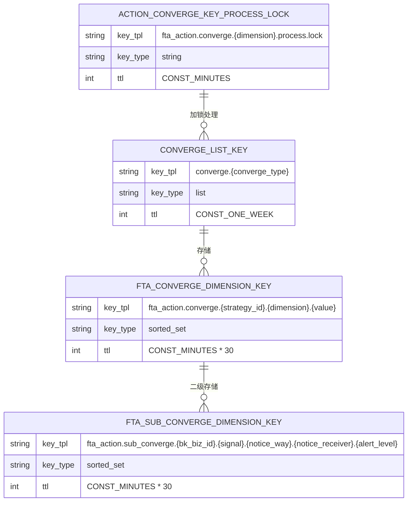
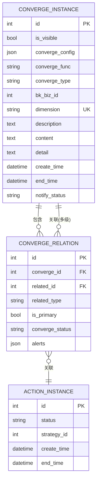

# 状态管理

<cite>
**本文档引用的文件**   
- [key.py](file://bkmonitor/alarm_backends/core/cache/key.py#L400-L1074)
- [action.py](file://bkmonitor/bkmonitor/models/fta/action.py#L681-L847)
- [converge_manger.py](file://bkmonitor/alarm_backends/service/converge/converge_manger.py#L273-L593)
- [converge_func.py](file://bkmonitor/alarm_backends/service/converge/converge_func.py#L27-L65)
- [processor.py](file://bkmonitor/alarm_backends/service/converge/processor.py#L307-L343)
</cite>

## 目录
1. [引言](#引言)
2. [收敛状态的生命周期管理](#收敛状态的生命周期管理)
3. [状态存储设计](#状态存储设计)
4. [状态一致性与同步机制](#状态一致性与同步机制)
5. [状态恢复机制](#状态恢复机制)
6. [监控指标与故障排查](#监控指标与故障排查)

## 引言
本文档详细阐述了蓝鲸监控系统中告警收敛状态的管理机制。重点介绍收敛状态的创建、更新、过期、清除等全生命周期管理流程，以及基于Redis的状态存储设计。同时，文档还涵盖了状态一致性保障、分布式环境下的同步策略和状态恢复机制等关键设计，并提供了运维监控和故障排查的指导。

## 收敛状态的生命周期管理

收敛状态的生命周期管理是告警处理流程中的核心环节，它确保了相关告警能够被有效地聚合和管理。整个生命周期主要由创建、更新、过期和清除四个阶段构成。

### 状态创建
当系统检测到多个告警符合预设的收敛规则时，会触发收敛流程。此时，系统会创建一个新的`ConvergeInstance`（收敛实例）对象。该对象的创建过程如下：
1.  **初始化**：根据收敛配置（`converge_config`）和匹配到的告警信息，初始化一个新的`ConvergeInstance`。
2.  **设置属性**：设置`converge_type`（收敛类型，如"converge"或"action"）、`bk_biz_id`（业务ID）、`dimension`（收敛维度，通常是一个唯一的哈希值）等关键属性。
3.  **持久化**：将新创建的`ConvergeInstance`对象保存到数据库中，生成唯一的`id`。

```python
# 伪代码示例：创建收敛实例
new_converge_instance = ConvergeInstance(
    converge_type="converge",
    bk_biz_id=biz_id,
    dimension=dimension_hash,
    description="由多个告警自动收敛生成",
    converge_config=converge_config
)
new_converge_instance.save()  # 持久化到数据库
```

**Section sources**
- [action.py](file://bkmonitor/bkmonitor/models/fta/action.py#L681-L754)

### 状态更新
收敛状态在创建后并非一成不变，它会随着关联告警的变化而动态更新。
1.  **关联告警**：通过`ConvergeRelation`（收敛关联）模型，将新产生的、符合条件的告警（`ActionInstance`）或下一级收敛事件关联到已有的`ConvergeInstance`上。
2.  **更新描述**：随着关联告警数量的增加，系统会定期更新`ConvergeInstance`的`description`（描述）字段，以反映最新的聚合情况。
3.  **状态变更**：如果所有关联的告警都已恢复，则`ConvergeInstance`的状态也会被标记为已结束。

```python
# 伪代码示例：更新收敛实例描述
ConvergeInstance.objects.filter(id=converge_id).update(description=new_description)
```

**Section sources**
- [converge_manger.py](file://bkmonitor/alarm_backends/service/converge/converge_manger.py#L513-L538)

### 状态过期与清除
为了防止系统中积累过多的陈旧状态，收敛实例具有明确的过期和清除机制。
1.  **过期策略**：`ConvergeInstance`本身没有固定的TTL（Time To Live），其生命周期由业务逻辑控制。当一个收敛实例下的所有关联告警都已关闭或恢复，并且经过一段静默期后，系统会认为该收敛实例已“结束”。
2.  **清除流程**：调用`end_converge_by_id`方法来终止一个收敛实例。该方法会：
    *   设置`end_time`（结束时间）字段。
    *   递归地终止所有与之关联的多级收敛实例。
    *   更新数据库记录，标记为不可见（`is_visible=False`）。

```python
# 伪代码示例：终止收敛实例
ConvergeInstanceManager.end_converge_by_id(converge_id)
```

**Section sources**
- [converge_manger.py](file://bkmonitor/alarm_backends/service/converge/converge_manger.py#L273-L305)

## 状态存储设计

系统的状态管理主要依赖于Redis和MySQL两种存储，分别用于缓存和持久化。

### Redis存储结构
Redis被广泛用于存储临时状态和队列，以提高系统性能。以下是与收敛状态相关的关键Redis键设计：



**Diagram sources**
- [key.py](file://bkmonitor/alarm_backends/core/cache/key.py#L600-L800)

*   **待收敛队列 (`CONVERGE_LIST_KEY`)**：一个Redis List，用于存放待处理的收敛任务。不同的`converge_type`对应不同的队列。
*   **收敛维度存储 (`FTA_CONVERGE_DIMENSION_KEY`)**：一个Redis Sorted Set，用于存储特定策略和维度下的告警信息。`score`通常为告警的产生时间，便于按时间排序。
*   **二级收敛维度存储 (`FTA_SUB_CONVERGE_DIMENSION_KEY`)**：另一个Sorted Set，用于更细粒度的二级收敛，如按业务、通知方式等进行聚合。
*   **处理锁 (`ACTION_CONVERGE_KEY_PROCESS_LOCK`)**：一个Redis String，用作分布式锁，防止同一维度的收敛任务被多个进程同时处理。

### MySQL存储结构
对于需要长期保存和查询的状态，系统使用MySQL数据库进行持久化。



**Diagram sources**
- [action.py](file://bkmonitor/bkmonitor/models/fta/action.py#L681-L847)

*   **`converge_instance` 表**：存储收敛实例的主信息。`dimension`字段是唯一键（UK），确保了同一维度下不会创建重复的收敛事件。
*   **`converge_relation` 表**：存储收敛实例与告警实例（或下一级收敛实例）之间的多对多关系。`unique_together`约束确保了关系的唯一性。

## 状态一致性与同步机制

在分布式环境下，保证状态的一致性至关重要。系统通过以下机制来实现：

### 分布式锁
在处理关键操作（如创建收敛、更新状态）时，系统会使用Redis实现的分布式锁。
*   **锁的获取**：在`processor.py`中，`lock()`方法会尝试获取一个基于`dimension`的锁（`ACTION_CONVERGE_KEY_PROCESS_LOCK`）。只有成功获取锁的进程才能继续执行后续的收敛逻辑。
*   **锁的释放**：在操作完成后，通过`unlock()`方法释放锁，确保其他进程可以继续处理。

```python
# 伪代码示例：使用分布式锁
def process_converge():
    lock = get_lock(dimension)
    if lock.acquire(blocking=False):  # 尝试非阻塞获取锁
        try:
            # 执行收敛逻辑
            do_converge()
        finally:
            lock.release()  # 释放锁
    else:
        # 锁已被占用，将任务重新推入队列稍后重试
        push_converge_queue()
```

**Section sources**
- [processor.py](file://bkmonitor/alarm_backends/service/converge/processor.py#L307-L343)

### 原子性操作
对于数据库操作，系统利用了Django ORM的原子性（`atomic`）和数据库的唯一约束来保证数据一致性。
*   **唯一约束**：`converge_instance`表的`dimension`字段和`converge_relation`表的联合唯一约束，防止了重复数据的插入。
*   **事务处理**：在创建或更新复杂状态时，会将相关操作放在一个数据库事务中，确保要么全部成功，要么全部回滚。

## 状态恢复机制

系统具备一定的状态恢复能力，以应对进程崩溃或网络中断等异常情况。
1.  **队列驱动**：核心的收敛流程是基于Redis List队列（`CONVERGE_LIST_KEY`）驱动的。即使处理进程意外退出，未完成的任务仍然保留在队列中。
2.  **幂等性设计**：收敛处理逻辑被设计为幂等的。这意味着即使同一个任务被多次执行，最终的状态也是一致的。这主要通过`dimension`的唯一性和数据库的约束来保证。
3.  **重试机制**：在`processor.py`的`run`方法中，捕获到未知异常时，会将任务重新推回收敛队列（`push_converge_queue()`），并在一段时间后重试，从而实现自动恢复。

```python
# 伪代码示例：异常处理与重试
try:
    do_converge()
except Exception as e:
    logger.exception("Converge failed")
    push_converge_queue(delay=60)  # 1分钟后重试
```

**Section sources**
- [processor.py](file://bkmonitor/alarm_backends/service/converge/processor.py#L307-L343)

## 监控指标与故障排查

为了保障状态管理系统的稳定运行，运维人员应关注以下监控指标和排查方法。

### 关键监控指标
| 指标名称 | 说明 | 告警阈值 |
| :--- | :--- | :--- |
| `redis_queue_length{queue="converge.*"}` | 待收敛队列的长度 | 持续增长超过1000 |
| `converge_process_lock_failures` | 获取收敛处理锁失败的次数 | 5分钟内超过10次 |
| `converge_processing_duration` | 单次收敛处理的耗时 | 平均超过10秒 |
| `mysql_table_rows{table="converge_instance"}` | `converge_instance`表的总行数 | 非预期的快速增长 |

### 故障排查方法
1.  **队列积压**：
    *   **现象**：`converge.*`队列长度持续增长。
    *   **排查**：
        *   检查是否有足够的`converge`任务消费者在运行。
        *   查看`converge`任务处理进程的日志，寻找`ConvergeLockError`或异常堆栈。
        *   使用`redis-cli`检查`ACTION_CONVERGE_KEY_PROCESS_LOCK`锁是否被长时间占用。

2.  **状态不一致**：
    *   **现象**：前端显示的收敛告警数量与实际不符。
    *   **排查**：
        *   检查`converge_relation`表中，`converge_id`为特定ID的记录数量是否正确。
        *   确认`ConvergeInstance`的`description`字段是否被正确更新。
        *   回顾`converge_manger.py`中的`count_instance`和`converge`方法逻辑。

3.  **重复收敛**：
    *   **现象**：同一组告警被创建了多个收敛事件。
    *   **排查**：
        *   检查`converge_instance`表中，`dimension`字段是否真的重复。如果重复，说明`dimension`的计算逻辑可能有问题。
        *   确认分布式锁（`ACTION_CONVERGE_KEY_PROCESS_LOCK`）是否正常工作，是否存在锁失效的情况。