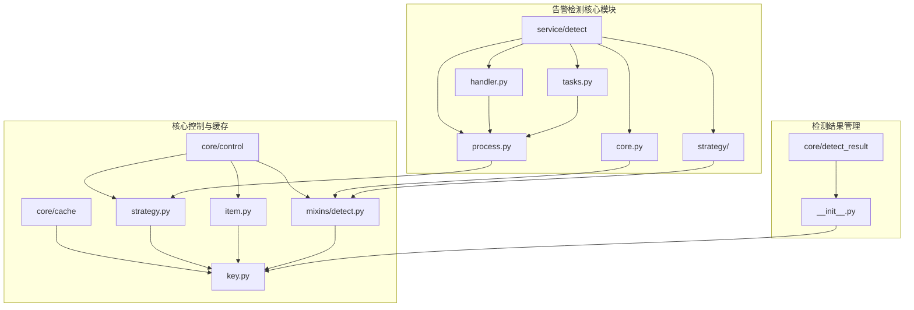
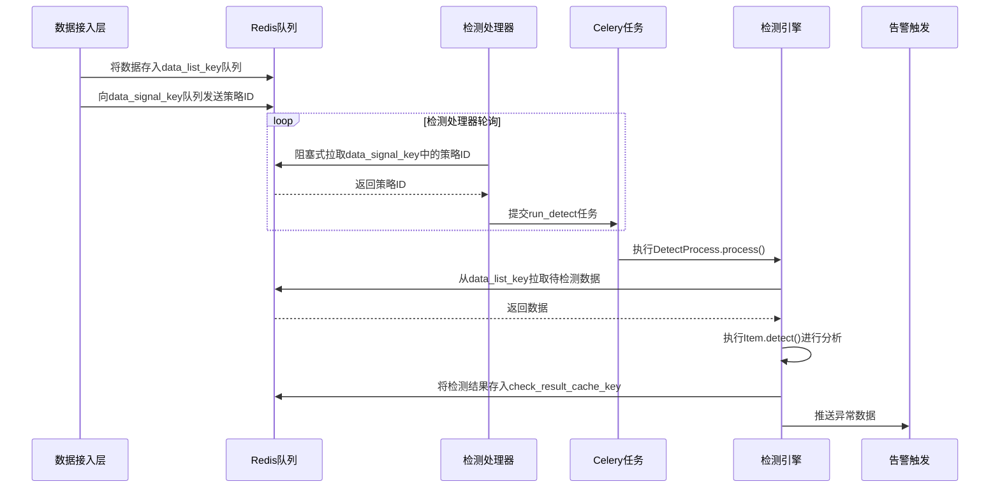
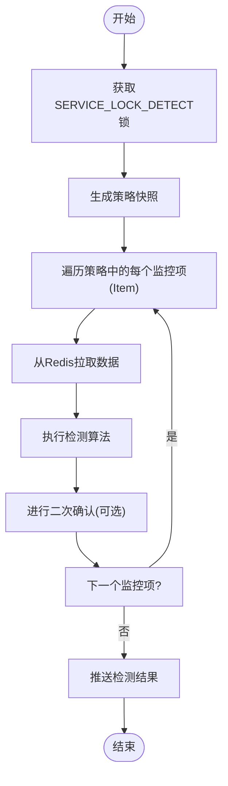
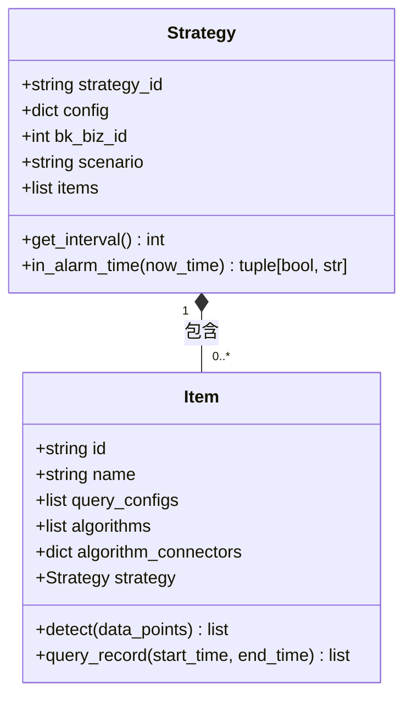
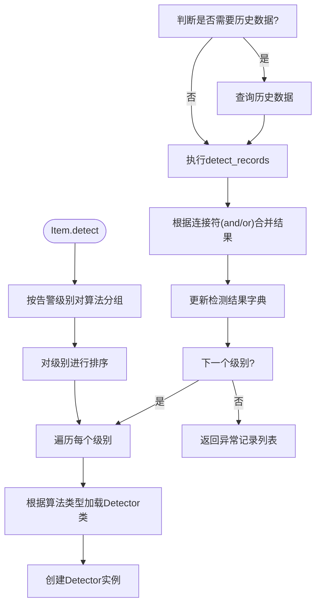
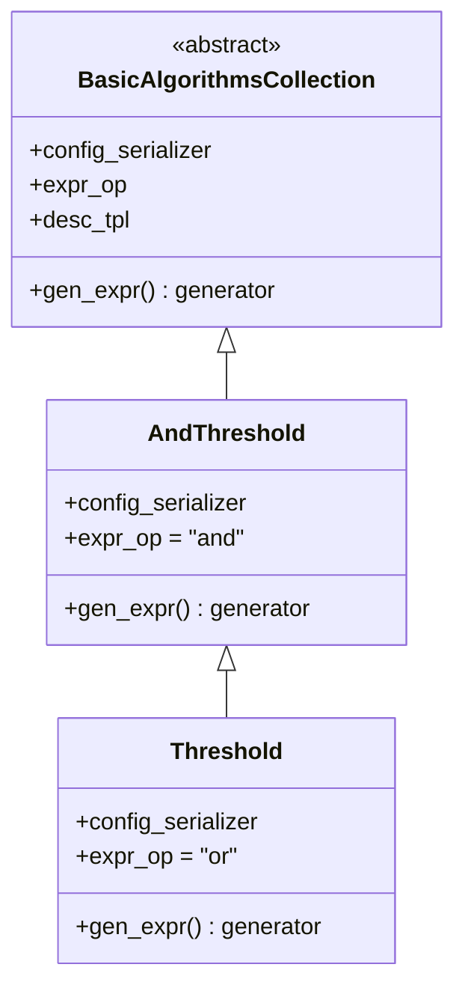
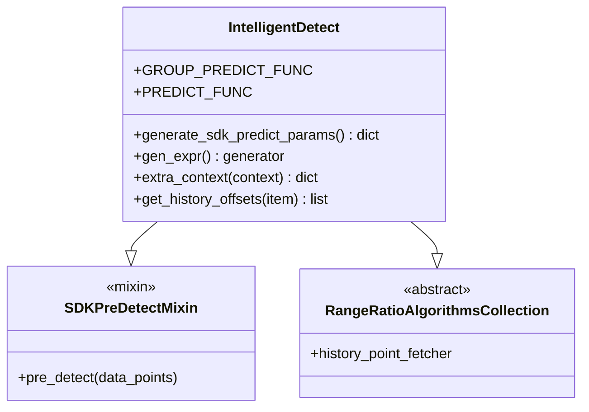
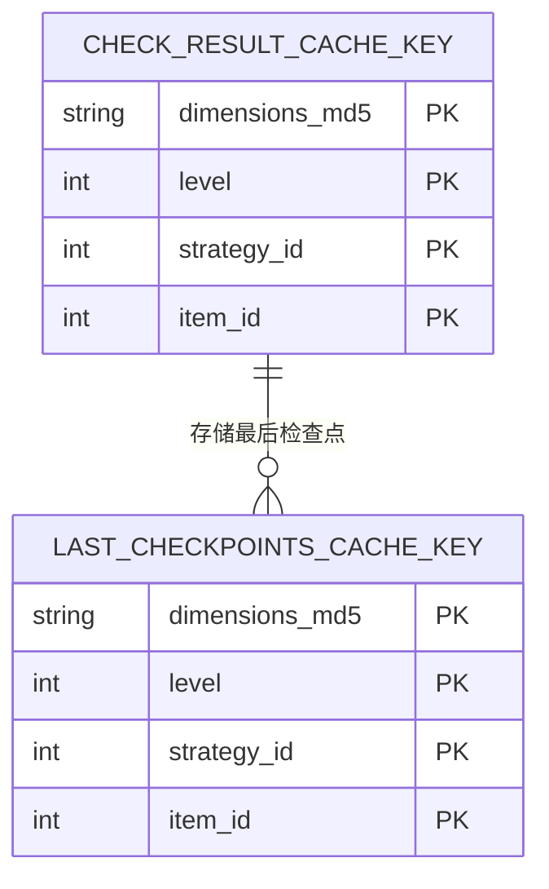
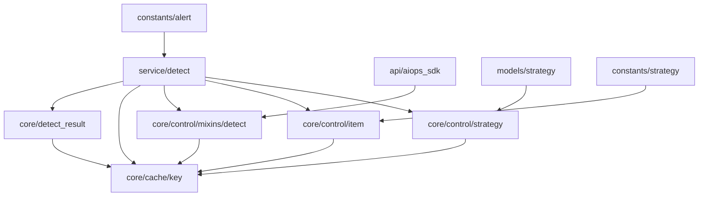

# 告警检测

<cite>
**本文档引用的文件**   
- [process.py](file://bkmonitor\alarm_backends\service\detect\process.py)
- [core.py](file://bkmonitor\alarm_backends\service\detect\core.py)
- [threshold.py](file://bkmonitor\alarm_backends\service\detect\strategy\threshold.py)
- [intelligent_detect.py](file://bkmonitor\alarm_backends\service\detect\strategy\intelligent_detect.py)
- [strategy.py](file://bkmonitor\alarm_backends\core\control\strategy.py)
- [item.py](file://bkmonitor\alarm_backends\core\control\item.py)
- [detect.py](file://bkmonitor\alarm_backends\core\control\mixins\detect.py)
- [key.py](file://bkmonitor\alarm_backends\core\cache\key.py)
- [__init__.py](file://bkmonitor\alarm_backends\core\detect_result\__init__.py)
- [handler.py](file://bkmonitor\alarm_backends\service\detect\handler.py)
- [tasks.py](file://bkmonitor\alarm_backends\service\detect\tasks.py)
- [strategy.py](file://bkmonitor\constants\strategy.py)
- [alert.py](file://bkmonitor\constants\alert.py)
- [models.py](file://bkmonitor\models\strategy.py)
</cite>

## 目录
1. [引言](#引言)
2. [项目结构](#项目结构)
3. [核心组件](#核心组件)
4. [架构概述](#架构概述)
5. [详细组件分析](#详细组件分析)
6. [依赖分析](#依赖分析)
7. [性能考虑](#性能考虑)
8. [故障排除指南](#故障排除指南)
9. [结论](#结论)

## 引言
本文档旨在深入阐述蓝鲸监控平台中告警检测机制的核心原理与实现细节。告警检测是监控系统的核心功能，它负责根据预设的监控策略和阈值规则，对实时采集的数据进行分析，以判断系统是否出现异常，并在满足条件时触发告警。本文档将从数据流、核心引擎、检测算法、配置管理到性能优化等多个维度，全面解析该机制，为开发者和运维人员提供一份详尽的技术参考。

## 项目结构
告警检测功能主要集中在 `bkmonitor/alarm_backends` 目录下，其核心逻辑位于 `service/detect` 子目录中。该模块采用分层设计，各组件职责清晰。

**图示来源**
- [process.py](file://bkmonitor\alarm_backends\service\detect\process.py)
- [strategy.py](file://bkmonitor\alarm_backends\core\control\strategy.py)
- [item.py](file://bkmonitor\alarm_backends\core\control\item.py)
- [detect.py](file://bkmonitor\alarm_backends\core\control\mixins\detect.py)
- [key.py](file://bkmonitor\alarm_backends\core\cache\key.py)
- [__init__.py](file://bkmonitor\alarm_backends\core\detect_result\__init__.py)

## 核心组件
告警检测系统由多个核心组件构成，它们协同工作以完成从数据接收、分析到告警触发的完整流程。主要组件包括：
*   **检测处理器 (DetectProcess)**: 检测流程的执行核心，协调数据拉取、处理和推送。
*   **检测混入 (DetectMixin)**: 提供检测算法的执行框架，是所有具体检测策略的基类。
*   **策略 (Strategy)** 和 **监控项 (Item)**: 代表告警策略的配置模型，包含检测逻辑、阈值和目标等信息。
*   **检测算法 (Algorithms)**: 实现具体检测逻辑的类，如阈值检测、环比检测等。
*   **数据点 (DataPoint)**: 封装从数据接入层传递过来的原始监控数据。
*   **检测结果 (CheckResult)**: 管理检测结果的存储，使用Redis进行缓存。

**组件来源**
- [process.py](file://bkmonitor\alarm_backends\service\detect\process.py)
- [detect.py](file://bkmonitor\alarm_backends\core\control\mixins\detect.py)
- [strategy.py](file://bkmonitor\alarm_backends\core\control\strategy.py)
- [item.py](file://bkmonitor\alarm_backends\core\control\item.py)
- [threshold.py](file://bkmonitor\alarm_backends\service\detect\strategy\threshold.py)
- [core.py](file://bkmonitor\alarm_backends\service\detect\core.py)
- [__init__.py](file://bkmonitor\alarm_backends\core\detect_result\__init__.py)

## 架构概述
告警检测系统采用事件驱动和任务队列相结合的架构。数据接入层（access）将采集到的数据存入Redis队列，并向检测服务发送信号。检测服务通过Celery任务队列接收信号，加载对应的策略配置，执行检测逻辑，并将异常结果推送给告警触发模块。

**图示来源**
- [handler.py](file://bkmonitor\alarm_backends\service\detect\handler.py)
- [tasks.py](file://bkmonitor\alarm_backends\service\detect\tasks.py)
- [process.py](file://bkmonitor\alarm_backends\service\detect\process.py)
- [key.py](file://bkmonitor\alarm_backends\core\cache\key.py)

## 详细组件分析

### 检测流程分析
`DetectProcess` 类是告警检测的主控制器，其 `process` 方法定义了完整的检测流程。

**图示来源**
- [process.py](file://bkmonitor\alarm_backends\service\detect\process.py#L150-L181)

**流程来源**
- [process.py](file://bkmonitor\alarm_backends\service\detect\process.py#L150-L181)

### 策略与监控项分析
`Strategy` 和 `Item` 类是告警策略的配置模型。`Strategy` 代表一个完整的告警策略，包含一个或多个 `Item`。`Item` 代表策略中的一个监控指标，它定义了数据查询方式、检测算法和目标等。

**图示来源**
- [strategy.py](file://bkmonitor\alarm_backends\core\control\strategy.py#L20-L200)
- [item.py](file://bkmonitor\alarm_backends\core\control\item.py#L50-L200)

**组件来源**
- [strategy.py](file://bkmonitor\alarm_backends\core\control\strategy.py#L20-L200)
- [item.py](file://bkmonitor\alarm_backends\core\control\item.py#L50-L200)

### 检测算法分析
检测算法的执行由 `DetectMixin` 类提供框架。它根据监控项的配置，动态加载并实例化具体的检测算法类（如 `Threshold`），然后执行检测。

**图示来源**
- [detect.py](file://bkmonitor\alarm_backends\core\control\mixins\detect.py#L42-L213)

**算法来源**
- [detect.py](file://bkmonitor\alarm_backends\core\control\mixins\detect.py#L42-L213)

### 阈值检测算法
`threshold.py` 文件实现了最基础的静态阈值检测。它支持多种比较方法（如大于、小于、等于），并能处理多个阈值条件的组合。

**图示来源**
- [threshold.py](file://bkmonitor\alarm_backends\service\detect\strategy\threshold.py#L42-L72)

**阈值来源**
- [threshold.py](file://bkmonitor\alarm_backends\service\detect\strategy\threshold.py#L42-L72)

### 智能检测算法
`intelligent_detect.py` 实现了基于机器学习的智能异常检测。它不直接进行数值比较，而是依赖于计算平台（AIOPS SDK）返回的 `is_anomaly` 标记来判断异常。

**图示来源**
- [intelligent_detect.py](file://bkmonitor\alarm_backends\service\detect\strategy\intelligent_detect.py#L42-L105)

**智能检测来源**
- [intelligent_detect.py](file://bkmonitor\alarm_backends\service\detect\strategy\intelligent_detect.py#L42-L105)

### 检测结果存储
检测结果的存储由 `CheckResult` 类管理，主要使用两种Redis数据结构：
1.  **SortedSet (有序集合)**: 使用 `CHECK_RESULT_CACHE_KEY` 键，存储每个维度（dimensions_md5）在特定级别（level）上的检测结果。集合中的每个成员是一个时间戳，分数也是时间戳，用于按时间排序和快速查找过期数据。
2.  **Hash (哈希)**: 使用 `LAST_CHECKPOINTS_CACHE_KEY` 键，存储每个维度的最后检测时间点（checkpoint），用于实现“无数据”告警。

**图示来源**
- [key.py](file://bkmonitor\alarm_backends\core\cache\key.py#L200-L400)
- [__init__.py](file://bkmonitor\alarm_backends\core\detect_result\__init__.py#L50-L170)

**结果存储来源**
- [key.py](file://bkmonitor\alarm_backends\core\cache\key.py#L200-L400)
- [__init__.py](file://bkmonitor\alarm_backends\core\detect_result\__init__.py#L50-L170)

## 依赖分析
告警检测模块依赖于多个内部和外部组件。其核心依赖关系如下图所示。

**图示来源**
- [process.py](file://bkmonitor\alarm_backends\service\detect\process.py)
- [strategy.py](file://bkmonitor\alarm_backends\core\control\strategy.py)
- [item.py](file://bkmonitor\alarm_backends\core\control\item.py)
- [detect.py](file://bkmonitor\alarm_backends\core\control\mixins\detect.py)
- [key.py](file://bkmonitor\alarm_backends\core\cache\key.py)
- [__init__.py](file://bkmonitor\alarm_backends\core\detect_result\__init__.py)

**依赖来源**
- [process.py](file://bkmonitor\alarm_backends\service\detect\process.py)
- [strategy.py](file://bkmonitor\alarm_backends\core\control\strategy.py)
- [item.py](file://bkmonitor\alarm_backends\core\control\item.py)
- [detect.py](file://bkmonitor\alarm_backends\core\control\mixins\detect.py)
- [key.py](file://bkmonitor\alarm_backends\core\cache\key.py)
- [__init__.py](file://bkmonitor\alarm_backends\core\detect_result\__init__.py)

## 性能考虑
告警检测系统在设计时考虑了性能和稳定性：
1.  **并发控制**: 使用 `service_lock` 装饰器确保同一策略的检测任务不会并发执行，防止数据竞争。
2.  **数据量限制**: 在 `pull_data` 方法中，通过 `SQL_MAX_LIMIT` 配置限制单次拉取的数据量，避免内存溢出。
3.  **缓存优化**: 大量使用 `@cached_property` 装饰器，避免对策略和监控项配置的重复解析。
4.  **批量操作**: 在存储检测结果时，使用Redis Pipeline进行批量写入，显著减少网络往返次数。
5.  **异步处理**: 通过Celery将检测任务异步化，避免阻塞主线程。

## 故障排除指南
当告警检测出现问题时，可以参考以下步骤进行排查：
1.  **检查日志**: 首先查看 `detect` 模块的日志（`logger = logging.getLogger("detect")`），重点关注 `ERROR` 和 `WARNING` 级别的日志。
2.  **检查数据流**: 确认数据是否成功写入 `data_list_key` 队列，以及 `data_signal_key` 队列是否有待处理的策略ID。
3.  **检查锁状态**: 如果日志中出现 `Failed to acquire lock`，说明检测任务被阻塞，需检查前一个任务是否卡住。
4.  **检查Redis**: 确认Redis服务是否正常，以及相关的缓存键（如 `check_result_cache_key`）是否被正确创建和更新。
5.  **检查策略配置**: 确认策略的生效时间、目标和查询条件是否正确，特别是 `agg_condition` 的配置。

**故障来源**
- [process.py](file://bkmonitor\alarm_backends\service\detect\process.py)
- [handler.py](file://bkmonitor\alarm_backends\service\detect\handler.py)
- [key.py](file://bkmonitor\alarm_backends\core\cache\key.py)

## 结论
本文档详细解析了蓝鲸监控平台告警检测机制的实现。该机制通过一个清晰的分层架构，将数据处理、策略执行、算法实现和结果存储分离，保证了系统的可维护性和可扩展性。其核心在于 `DetectProcess` 控制器和 `DetectMixin` 混入类，它们共同驱动着从数据拉取到异常判定的完整流程。系统支持从简单的阈值告警到复杂的智能异常检测等多种模式，并通过Redis缓存和Celery异步任务保证了高性能和高可用性。理解这些核心组件和流程，对于定制化开发和系统运维都至关重要。