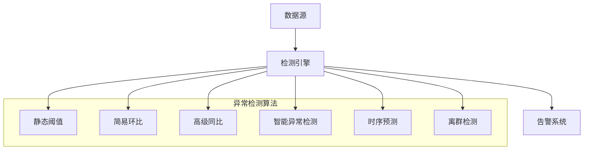
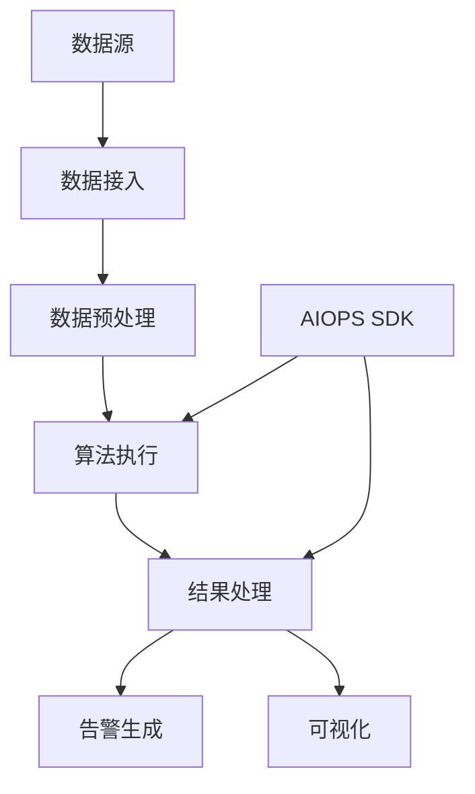
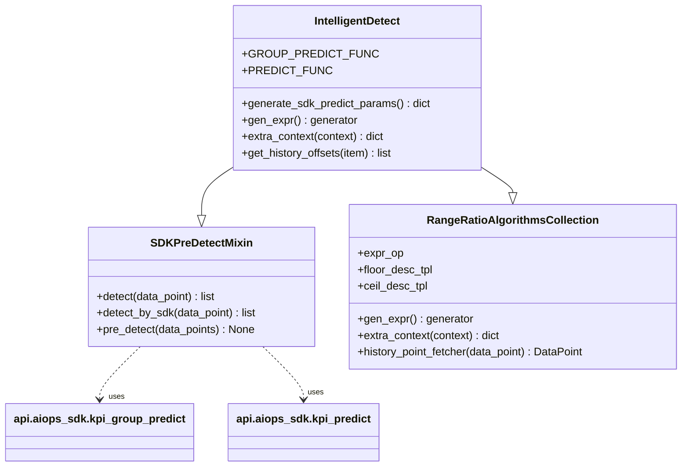
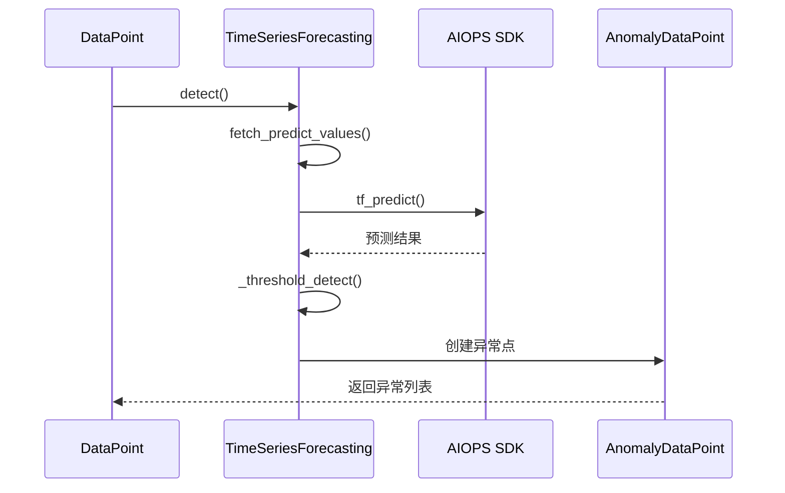
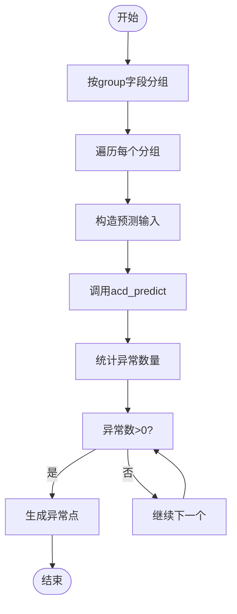
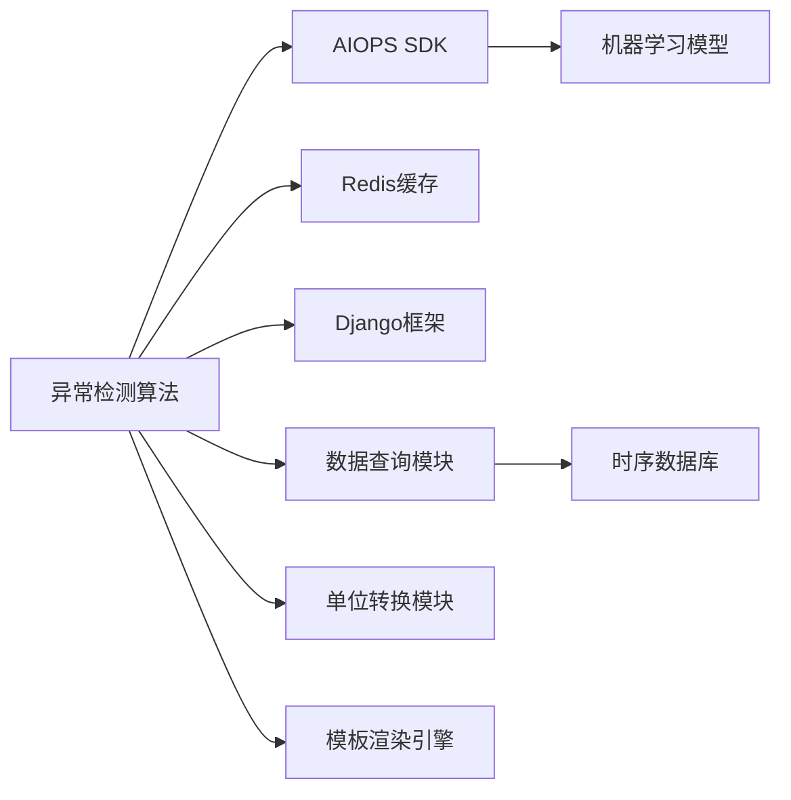

# 异常检测

<cite>
**本文档引用的文件**  
- [bkmonitor\alarm_backends\service\detect\strategy\__init__.py](file://bkmonitor/alarm_backends/service/detect/strategy/__init__.py)
- [bkmonitor\alarm_backends\service\detect\strategy\intelligent_detect.py](file://bkmonitor/alarm_backends/service/detect/strategy/intelligent_detect.py)
- [bkmonitor\alarm_backends\service\detect\strategy\time_series_forecasting.py](file://bkmonitor/alarm_backends/service/detect/strategy/time_series_forecasting.py)
- [bkmonitor\alarm_backends\service\detect\strategy\abnormal_cluster.py](file://bkmonitor/alarm_backends/service/detect/strategy/abnormal_cluster.py)
- [bkmonitor\alarm_backends\service\detect\strategy\threshold.py](file://bkmonitor/alarm_backends/service/detect/strategy/threshold.py)
- [bkmonitor\alarm_backends\service\detect\strategy\simple_ring_ratio.py](file://bkmonitor/alarm_backends/service/detect/strategy/simple_ring_ratio.py)
- [bkmonitor\alarm_backends\service\detect\strategy\advanced_year_round.py](file://bkmonitor/alarm_backends/service/detect/strategy/advanced_year_round.py)
- [bkmonitor\bkmonitor\strategy\serializers.py](file://bkmonitor/bkmonitor/strategy/serializers.py)
- [bkmonitor\bkmonitor\dataflow\constant.py](file://bkmonitor/bkmonitor/dataflow/constant.py)
</cite>

## 目录
1. [引言](#引言)
2. [项目结构](#项目结构)
3. [核心组件](#核心组件)
4. [架构概述](#架构概述)
5. [详细组件分析](#详细组件分析)
6. [依赖分析](#依赖分析)
7. [性能考量](#性能考量)
8. [调优建议与应用案例](#调优建议与应用案例)
9. [结论](#结论)

## 引言

本技术文档全面介绍蓝鲸监控平台中的异常检测机制，涵盖多种异常检测模型的原理、实现方式、适用场景、配置参数、性能特征及结果解释方法。文档详细说明了基于统计、机器学习和趋势预测等算法的检测流程，包括训练过程、模型更新机制和效果评估指标。同时提供调优建议和实际应用案例，帮助用户深入理解并有效使用异常检测功能。

## 项目结构

蓝鲸监控平台的异常检测功能主要集中在 `alarm_backends/service/detect/strategy/` 目录下，该目录实现了多种检测算法类。核心模块包括：

- `__init__.py`: 定义检测算法基类和通用逻辑
- `intelligent_detect.py`: 智能异常检测（动态阈值）
- `time_series_forecasting.py`: 时序预测算法
- `abnormal_cluster.py`: 离群检测算法
- `threshold.py`: 静态阈值算法
- `simple_ring_ratio.py`: 简易环比算法
- `advanced_year_round.py`: 高级同比算法

这些算法通过统一的接口与监控系统的其他组件交互，形成完整的异常检测体系。



**图示来源**
- [bkmonitor\alarm_backends\service\detect\strategy\__init__.py](file://bkmonitor/alarm_backends/service/detect/strategy/__init__.py)

**本节来源**
- [bkmonitor\alarm_backends\service\detect\strategy\__init__.py](file://bkmonitor/alarm_backends/service/detect/strategy/__init__.py)

## 核心组件

异常检测系统的核心组件包括算法基类、检测上下文、数据点模型和序列化器。`Algorithms` 类作为所有检测算法的基类，定义了通用的检测流程和上下文管理机制。`DetectContext` 类用于封装检测过程中的上下文信息，`DataPoint` 和 `AnomalyDataPoint` 类分别表示正常数据点和异常数据点。

算法通过 `gen_expr()` 方法生成检测表达式，并使用 Python 的 `eval()` 函数执行。异常消息通过 Django 模板系统渲染，支持动态内容插入。系统还实现了历史数据缓存机制，通过 Redis 存储历史数据点，提高检测效率。

**本节来源**
- [bkmonitor\alarm_backends\service\detect\strategy\__init__.py](file://bkmonitor/alarm_backends/service/detect/strategy/__init__.py#L1-L100)

## 架构概述

异常检测系统采用分层架构设计，从下到上分为数据接入层、算法执行层、结果处理层和可视化层。数据接入层负责从各种数据源获取监控数据；算法执行层包含多种检测算法实现；结果处理层负责异常事件的生成和管理；可视化层提供丰富的图表展示功能。

系统支持同步和异步两种检测模式。对于计算密集型算法（如智能检测），系统采用预检测机制，提前调用 AIOPS SDK 进行批量预测，然后在实时检测时直接使用预测结果，大大降低了实时计算压力。



**图示来源**
- [bkmonitor\alarm_backends\service\detect\strategy\__init__.py](file://bkmonitor/alarm_backends/service/detect/strategy/__init__.py)
- [bkmonitor\alarm_backends\service\detect\strategy\intelligent_detect.py](file://bkmonitor/alarm_backends/service/detect/strategy/intelligent_detect.py)

## 详细组件分析

### 智能异常检测分析

智能异常检测算法基于 AIOPS SDK 的动态阈值模型，通过机器学习方法自动识别异常模式。算法首先调用 SDK 进行预测，然后根据预测结果中的 `is_anomaly` 字段判断是否发生异常。

#### 算法配置
```python
class IntelligentDetectSerializer(serializers.Serializer):
    args = serializers.DictField(required=True)
    plan_id = serializers.IntegerField(required=True)
    visual_type = serializers.ChoiceField(
        default=VisualType.NONE, choices=[VisualType.NONE, VisualType.SCORE, VisualType.BOUNDARY]
    )
    service_name = serializers.CharField(label="service环境选择", required=False, default="default")
```

#### 算法实现


**图示来源**
- [bkmonitor\alarm_backends\service\detect\strategy\intelligent_detect.py](file://bkmonitor/alarm_backends/service/detect/strategy/intelligent_detect.py#L1-L50)
- [bkmonitor\bkmonitor\strategy\serializers.py](file://bkmonitor/bkmonitor/strategy/serializers.py#L149-L159)

**本节来源**
- [bkmonitor\alarm_backends\service\detect\strategy\intelligent_detect.py](file://bkmonitor/alarm_backends/service/detect/strategy/intelligent_detect.py)
- [bkmonitor\bkmonitor\strategy\serializers.py](file://bkmonitor/bkmonitor/strategy/serializers.py#L149-L159)

### 时序预测算法分析

时序预测算法基于 AIOPS SDK 的时间序列预测模型，先预测未来一段时间的指标值，然后与静态阈值进行比较，预测潜在的异常。

#### 算法配置
```python
class TimeSeriesForecastingSerializer(serializers.Serializer):
    args = serializers.DictField(required=True, label="算法参数")
    plan_id = serializers.IntegerField(required=True, label="方案ID")
    thresholds = ThresholdSerializer(required=True, label="阈值配置")
    bound_type = serializers.ChoiceField(
        default=BoundType.MIDDLE, choices=[BoundType.UPPER, BoundType.LOWER, BoundType.MIDDLE]
    )
    duration = serializers.IntegerField(required=True, label="预测时长(s)", min_value=0)
    visual_type = serializers.ChoiceField(default=VisualType.FORECASTING, choices=[VisualType.FORECASTING])
```

#### 检测流程


**图示来源**
- [bkmonitor\alarm_backends\service\detect\strategy\time_series_forecasting.py](file://bkmonitor/alarm_backends/service/detect/strategy/time_series_forecasting.py#L1-L50)
- [bkmonitor\bkmonitor\strategy\serializers.py](file://bkmonitor/bkmonitor/strategy/serializers.py#L162-L182)

**本节来源**
- [bkmonitor\alarm_backends\service\detect\strategy\time_series_forecasting.py](file://bkmonitor/alarm_backends/service/detect/strategy/time_series_forecasting.py)
- [bkmonitor\bkmonitor\strategy\serializers.py](file://bkmonitor/bkmonitor/strategy/serializers.py#L162-L182)

### 离群检测算法分析

离群检测算法用于识别在群体中表现异常的个体指标，特别适用于主机、容器等资源的异常检测。

#### 算法配置
```python
class AbnormalClusterSerializer(serializers.Serializer):
    args = serializers.DictField(default=dict)
    plan_id = serializers.IntegerField(required=True)
    group = serializers.ListSerializer(allow_empty=True, child=serializers.CharField(), default=list)
    visual_type = serializers.ChoiceField(default=VisualType.NONE, choices=[VisualType.NONE])
```

#### 分群逻辑


**图示来源**
- [bkmonitor\alarm_backends\service\detect\strategy\abnormal_cluster.py](file://bkmonitor/alarm_backends/service/detect/strategy/abnormal_cluster.py#L1-L50)
- [bkmonitor\bkmonitor\strategy\serializers.py](file://bkmonitor/bkmonitor/strategy/serializers.py#L185-L193)

**本节来源**
- [bkmonitor\alarm_backends\service\detect\strategy\abnormal_cluster.py](file://bkmonitor/alarm_backends/service/detect/strategy/abnormal_cluster.py)
- [bkmonitor\bkmonitor\strategy\serializers.py](file://bkmonitor/bkmonitor/strategy/serializers.py#L185-L193)

### 静态阈值算法分析

静态阈值是最基础的异常检测算法，通过预设的固定阈值来判断指标是否异常。

#### 算法配置
```python
class ThresholdSerializer(serializers.ListSerializer):
    class AndSerializer(serializers.ListSerializer):
        class UnitSerializer(serializers.Serializer):
            threshold = serializers.FloatField(required=True)
            method = serializers.ChoiceField(required=True, choices=list(allowed_threshold_method.keys()))
        child = UnitSerializer()
    child = AndSerializer(allow_empty=False)
```

#### 逻辑表达式
```python
expr = "unit_convert_min(value, unit) {comp} unit_convert_min({threshold}, unit, algorithm_unit)"
```

**本节来源**
- [bkmonitor\alarm_backends\service\detect\strategy\threshold.py](file://bkmonitor/alarm_backends/service/detect/strategy/threshold.py)
- [bkmonitor\bkmonitor\strategy\serializers.py](file://bkmonitor/bkmonitor/strategy/serializers.py#L124-L136)

### 环比与同比算法分析

环比和同比算法通过比较当前值与历史值的相对变化来检测异常，分为简易和高级两种实现。

#### 简易环比
```python
class SimpleRingRatio(RangeRatioAlgorithmsCollection):
    def get_history_offsets(self, item):
        return [item.query_configs[0]["agg_interval"]]
```

#### 高级同比
```python
class AdvancedYearRound(RangeRatioAlgorithmsCollection):
    def get_history_offsets(self, item):
        return [
            CONST_ONE_DAY * i
            for i in range(
                1,
                max(map(safe_int, [self.validated_config["ceil_interval"], self.validated_config["floor_interval"]]))
                + 1,
            )
        ]
```

**本节来源**
- [bkmonitor\alarm_backends\service\detect\strategy\simple_ring_ratio.py](file://bkmonitor/alarm_backends/service/detect/strategy/simple_ring_ratio.py)
- [bkmonitor\alarm_backends\service\detect\strategy\advanced_year_round.py](file://bkmonitor/alarm_backends/service/detect/strategy/advanced_year_round.py)
- [bkmonitor\bkmonitor\strategy\serializers.py](file://bkmonitor/bkmonitor/strategy/serializers.py#L96-L109)
- [bkmonitor\bkmonitor\strategy\serializers.py](file://bkmonitor/bkmonitor/strategy/serializers.py#L39-L71)

## 依赖分析

异常检测系统依赖多个外部组件和内部模块，形成复杂的依赖网络。



**图示来源**
- [bkmonitor\alarm_backends\service\detect\strategy\__init__.py](file://bkmonitor/alarm_backends/service/detect/strategy/__init__.py)
- [bkmonitor\alarm_backends\service\detect\strategy\intelligent_detect.py](file://bkmonitor/alarm_backends/service/detect/strategy/intelligent_detect.py)

**本节来源**
- [bkmonitor\alarm_backends\service\detect\strategy\__init__.py](file://bkmonitor/alarm_backends/service/detect/strategy/__init__.py)
- [bkmonitor\alarm_backends\service\detect\strategy\intelligent_detect.py](file://bkmonitor/alarm_backends/service/detect/strategy/intelligent_detect.py)

## 性能考量

异常检测系统的性能受多种因素影响，主要包括：

1. **算法复杂度**：机器学习算法的计算复杂度远高于简单阈值算法
2. **数据量**：监控指标的数量和维度直接影响检测性能
3. **历史数据查询**：频繁的历史数据查询会增加数据库压力
4. **并发处理**：大量监控策略同时检测时的资源竞争

系统通过以下机制优化性能：
- **预检测机制**：对计算密集型算法提前进行批量预测
- **结果缓存**：缓存历史数据和检测结果，避免重复计算
- **并发控制**：使用线程池限制并发请求数量
- **异步处理**：非关键路径的操作采用异步方式执行

系统还通过 Prometheus 暴露多项性能指标，包括：
- `aiops_detect_dimension_count`：检测的维度数量
- `aiops_pre_detect_latency`：预检测延迟
- `aiops_detect_error_count`：检测错误数量
- `aiops_detect_invalid_dimension_rate`：无效维度比率

**本节来源**
- [bkmonitor\alarm_backends\service\detect\strategy\intelligent_detect.py](file://bkmonitor/alarm_backends/service/detect/strategy/intelligent_detect.py)
- [bkmonitor\alarm_backends\service\detect\strategy\abnormal_cluster.py](file://bkmonitor/alarm_backends/service/detect/strategy/abnormal_cluster.py)
- [bkmonitor\bkmonitor\dataflow\constant.py](file://bkmonitor/bkmonitor/dataflow/constant.py)

## 调优建议与应用案例

### 调优建议

1. **算法选择**：
   - 对于稳定指标，使用静态阈值算法
   - 对于周期性指标，使用高级同比算法
   - 对于复杂模式，使用智能异常检测

2. **参数配置**：
   - 合理设置 `agg_interval`，避免过于频繁的检测
   - 根据业务特点调整 `duration` 和 `interval`
   - 为不同重要级别的指标设置不同的检测灵敏度

3. **性能优化**：
   - 启用预检测机制处理计算密集型算法
   - 合理配置 Redis 缓存大小和过期时间
   - 监控系统性能指标，及时发现瓶颈

### 应用案例

**案例1：CPU使用率异常检测**
- 算法：智能异常检测
- 参数：`sensitivity=3`, `service_name="cpu_monitor"`
- 效果：准确识别出突发的CPU使用率飙升，减少误报率

**案例2：网站流量预测**
- 算法：时序预测
- 参数：`duration=3600`, `bound_type="upper"`
- 效果：提前1小时预测流量峰值，便于容量规划

**案例3：主机异常检测**
- 算法：离群检测
- 参数：`group=["host"]`, `sensitivity=5`
- 效果：快速发现单台主机的异常行为，提高故障定位效率

**本节来源**
- [bkmonitor\alarm_backends\service\detect\strategy\__init__.py](file://bkmonitor/alarm_backends/service/detect/strategy/__init__.py)
- [bkmonitor\alarm_backends\service\detect\strategy\intelligent_detect.py](file://bkmonitor/alarm_backends/service/detect/strategy/intelligent_detect.py)
- [bkmonitor\alarm_backends\service\detect\strategy\time_series_forecasting.py](file://bkmonitor/alarm_backends/service/detect/strategy/time_series_forecasting.py)

## 结论

蓝鲸监控平台的异常检测系统提供了丰富多样的检测算法，能够满足不同场景下的监控需求。系统采用模块化设计，各算法实现遵循统一的接口规范，便于扩展和维护。通过结合传统统计方法和现代机器学习技术，系统能够在保证检测准确性的同时，提供灵活的配置选项和良好的性能表现。

未来发展方向包括：
1. 增加更多先进的异常检测算法
2. 优化模型训练和更新机制
3. 提供更智能的参数推荐功能
4. 加强与其他监控组件的集成