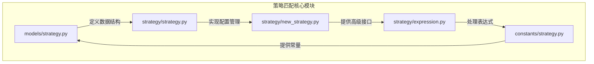
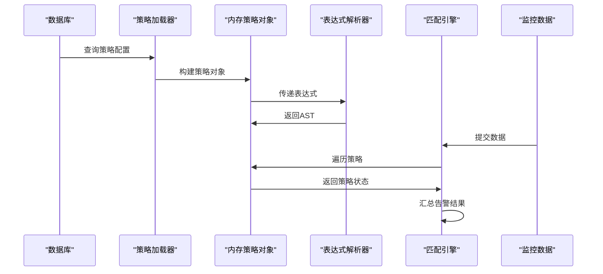
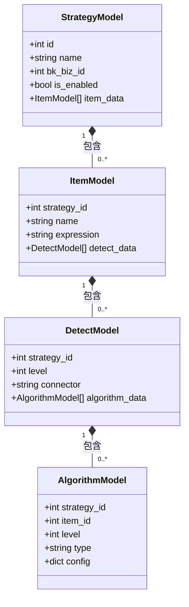
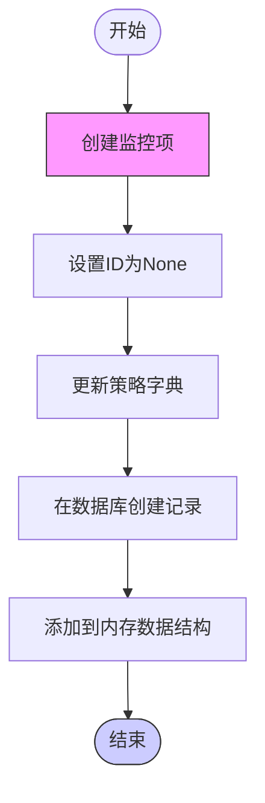
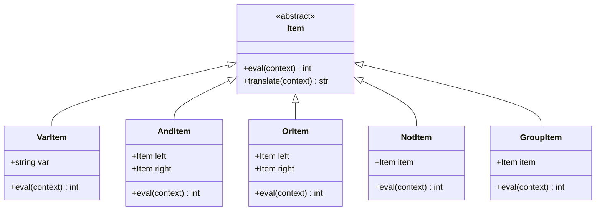
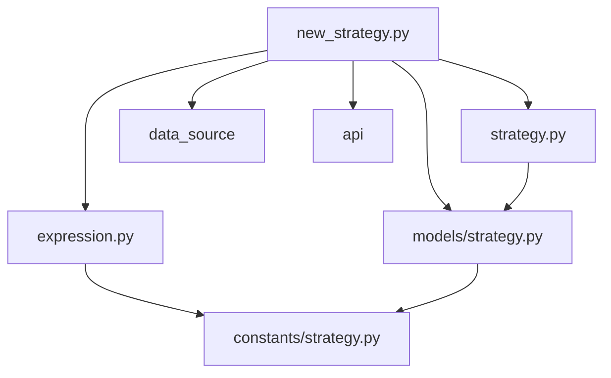

# 策略匹配

<cite>
**本文档引用文件**   
- [strategy.py](file://bkmonitor\bkmonitor\strategy\strategy.py)
- [strategy.py](file://bkmonitor\bkmonitor\models\strategy.py)
- [strategy.py](file://bkmonitor\constants\strategy.py)
- [expression.py](file://bkmonitor\bkmonitor\strategy\expression.py)
- [new_strategy.py](file://bkmonitor\bkmonitor\strategy\new_strategy.py)
</cite>

## 目录
1. [引言](#引言)
2. [项目结构](#项目结构)
3. [核心组件](#核心组件)
4. [架构概述](#架构概述)
5. [详细组件分析](#详细组件分析)
6. [依赖分析](#依赖分析)
7. [性能考虑](#性能考虑)
8. [故障排除指南](#故障排除指南)
9. [结论](#结论)

## 引言
本文档详细阐述了蓝鲸监控平台中策略匹配机制的实现原理。该机制负责将实时监控数据与预定义的告警策略进行匹配，是告警系统的核心。文档深入分析了策略的加载、匹配算法、优先级处理、并发匹配以及性能优化等关键环节，旨在为开发者提供全面的理解和优化指导。

## 项目结构
蓝鲸监控平台的策略匹配功能主要分布在`bkmonitor`模块下的`strategy`子模块中。其核心文件包括：
- `bkmonitor/models/strategy.py`: 定义了策略、监控项、检测算法等核心数据模型。
- `bkmonitor/strategy/strategy.py`: 实现了策略配置的加载、更新和管理逻辑。
- `bkmonitor/strategy/new_strategy.py`: 提供了策略的高级抽象和操作接口。
- `bkmonitor/strategy/expression.py`: 实现了告警关联表达式的解析和计算。
- `constants/strategy.py`: 定义了策略相关的常量和配置选项。

**图源**
- [models/strategy.py](file://bkmonitor\bkmonitor\models\strategy.py)
- [strategy/strategy.py](file://bkmonitor\bkmonitor\strategy\strategy.py)
- [new_strategy.py](file://bkmonitor\bkmonitor\strategy\new_strategy.py)
- [expression.py](file://bkmonitor\bkmonitor\strategy\expression.py)
- [constants/strategy.py](file://bkmonitor\constants\strategy.py)

## 核心组件
策略匹配机制的核心由数据模型、配置管理、表达式解析和匹配引擎四部分构成。数据模型定义了策略的静态结构；配置管理负责策略的动态加载和更新；表达式解析器将复杂的关联逻辑转换为可执行的树结构；匹配引擎则利用这些信息对实时数据进行评估。

**节源**
- [models/strategy.py](file://bkmonitor\bkmonitor\models\strategy.py)
- [strategy.py](file://bkmonitor\bkmonitor\strategy\strategy.py)
- [new_strategy.py](file://bkmonitor\bkmonitor\strategy\new_strategy.py)
- [expression.py](file://bkmonitor\bkmonitor\strategy\expression.py)

## 架构概述
整个策略匹配流程遵循“加载-解析-匹配”的模式。首先，系统从数据库加载策略配置并构建内存中的策略对象。接着，对于包含复杂逻辑的策略，表达式解析器会将其转换为抽象语法树（AST）。最后，当监控数据到达时，匹配引擎会遍历所有相关策略，计算其表达式的值，以决定是否触发告警。

**图源**
- [models/strategy.py](file://bkmonitor\bkmonitor\models\strategy.py)
- [strategy.py](file://bkmonitor\bkmonitor\strategy\strategy.py)
- [expression.py](file://bkmonitor\bkmonitor\strategy\expression.py)

## 详细组件分析

### 策略数据模型分析
策略系统采用分层的数据模型来组织配置。`StrategyModel`代表一个完整的告警策略，它通过外键关联到多个`ItemModel`（监控项）。每个监控项又关联一个或多个`DetectModel`（检测配置），而检测配置则包含具体的`AlgorithmModel`（检测算法）。这种设计支持一个策略下对多个指标进行多条件、多级别的监控。

**图源**
- [models/strategy.py](file://bkmonitor\bkmonitor\models\strategy.py#L400-L600)

### 策略配置管理分析
`StrategyConfig`类是策略配置管理的核心。它通过字典形式在内存中维护策略的完整配置，并提供`create_item`、`update_item`、`delete_item`等方法来实现对监控项的增删改操作。该类还通过`_update_obj_by_dict`等私有方法确保配置变更能正确同步到数据库模型实例。

**图源**
- [strategy.py](file://bkmonitor\bkmonitor\strategy\strategy.py#L100-L200)
**节源**
- [strategy.py](file://bkmonitor\bkmonitor\strategy\strategy.py#L100-L200)

### 表达式解析与计算分析
`expression.py`文件实现了一个基于PLY（Python Lex-Yacc）的表达式解析器，用于处理多告警关联策略。它首先通过词法分析器（lexer）将输入字符串（如"A && (B || C)"）分解为`VAR`、`AND`、`OR`等Token。然后，语法分析器（yacc）根据预定义的语法规则，将这些Token构建成一棵抽象语法树（AST）。AST的节点由`Item`类的子类（如`AndItem`、`OrItem`、`NotItem`）表示，每个节点都实现了`eval`方法来计算其值。

**图源**
- [expression.py](file://bkmonitor\bkmonitor\strategy\expression.py#L100-L200)

## 依赖分析
策略匹配系统依赖于多个外部模块和内部组件。它依赖`constants`模块获取数据源、数据类型等枚举值；依赖`models`模块进行数据库的CRUD操作；依赖`data_source`模块来加载和查询监控数据。同时，`new_strategy.py`模块作为高层接口，依赖于`strategy.py`和`expression.py`的底层实现。

**图源**
- [new_strategy.py](file://bkmonitor\bkmonitor\strategy\new_strategy.py)
- [strategy.py](file://bkmonitor\bkmonitor\strategy\strategy.py)
- [expression.py](file://bkmonitor\bkmonitor\strategy\expression.py)
- [models/strategy.py](file://bkmonitor\bkmonitor\models\strategy.py)
- [constants/strategy.py](file://bkmonitor\constants\strategy.py)

## 性能考虑
为了保证策略匹配的高效性，系统采用了多种优化措施。首先，策略配置在加载后会缓存在内存中，避免了频繁的数据库查询。其次，对于复杂的表达式，系统通过构建AST来避免重复的字符串解析。此外，`StrategyConfig`类在更新策略时，会精确地只更新发生变化的字段，减少了不必要的数据库写入。

## 故障排除指南
当策略匹配出现问题时，可以按照以下步骤进行排查：
1.  **检查策略状态**：确认`StrategyModel.is_enabled`为`True`，且`is_invalid`为`False`。
2.  **验证监控数据**：使用`query_api`工具检查`metric_id`对应的数据是否存在且格式正确。
3.  **审查表达式语法**：如果使用了关联表达式，检查其语法是否正确，变量名是否与监控项ID匹配。
4.  **查看日志**：检查`bkmonitor`服务的日志，搜索与策略ID相关的错误信息。

**节源**
- [models/strategy.py](file://bkmonitor\bkmonitor\models\strategy.py)
- [new_strategy.py](file://bkmonitor\bkmonitor\strategy\new_strategy.py)

## 结论
蓝鲸监控平台的策略匹配机制是一个设计精巧、层次分明的系统。它通过清晰的数据模型、灵活的配置管理和高效的表达式解析，实现了对复杂监控场景的精准告警。理解其内部原理有助于开发者更好地配置、调试和优化告警策略，从而提升系统的稳定性和可靠性。