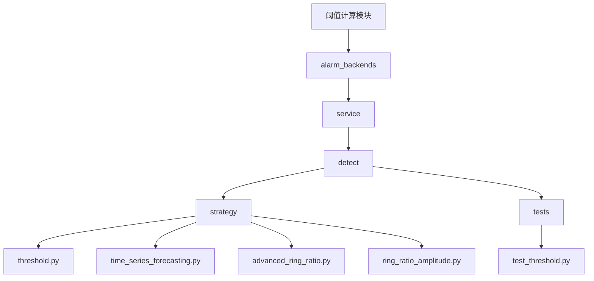
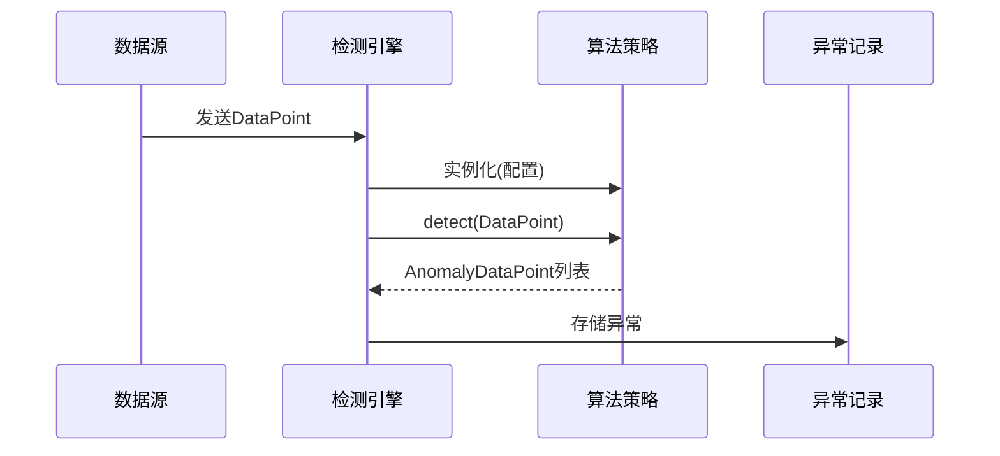
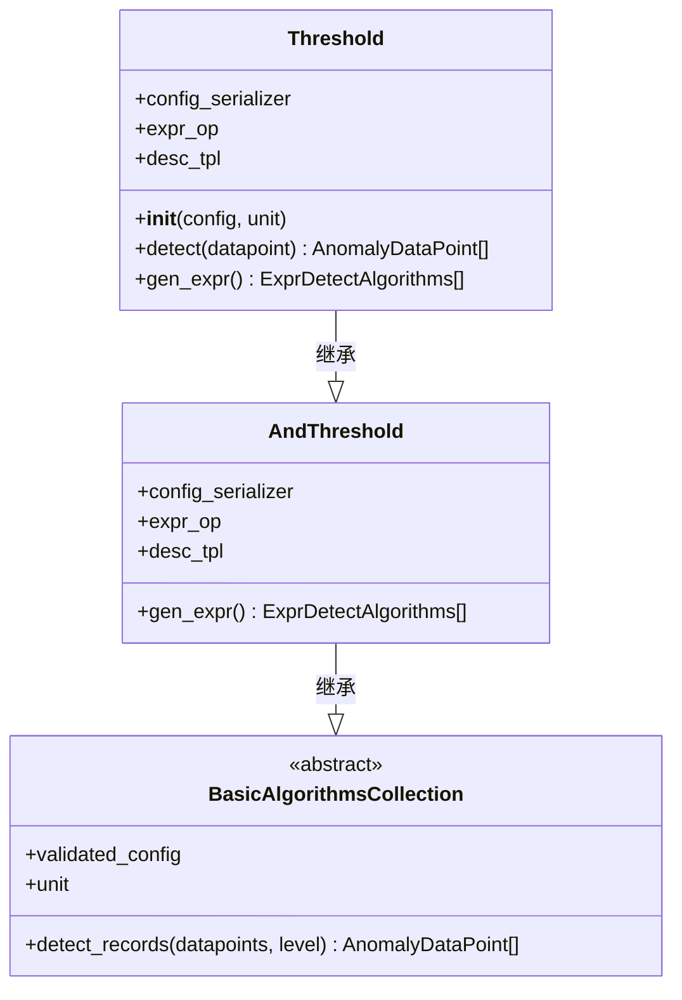
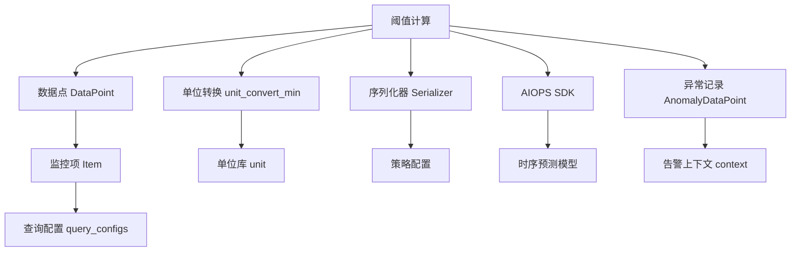

# 阈值计算

<cite>
**本文档引用的文件**  
- [threshold.py](file://bkmonitor/alarm_backends/service/detect/strategy/threshold.py)
- [test_threshold.py](file://bkmonitor/alarm_backends/tests/service/detect/test_threshold.py)
- [time_series_forecasting.py](file://bkmonitor/alarm_backends/service/detect/strategy/time_series_forecasting.py)
- [advanced_ring_ratio.py](file://bkmonitor/alarm_backends/service/detect/strategy/advanced_ring_ratio.py)
- [common_utils.py](file://bkmonitor/bkmonitor/utils/common_utils.py)
</cite>

## 目录
1. [引言](#引言)
2. [项目结构](#项目结构)
3. [核心组件](#核心组件)
4. [架构概览](#架构概览)
5. [详细组件分析](#详细组件分析)
6. [依赖分析](#依赖分析)
7. [性能考量](#性能考量)
8. [故障排除指南](#故障排除指南)
9. [结论](#结论)

## 引言
本文档旨在深入解析蓝鲸监控平台中的阈值计算机制。重点涵盖静态阈值、动态阈值（如时序预测）和百分比阈值（如环比突增）等多种阈值类型的计算方法与实现逻辑。文档将详细阐述阈值计算过程中的关键技术点，包括时间窗口处理、数据聚合、异常值过滤、精度控制和性能优化策略，并提供配置最佳实践与常见问题解决方案。

## 项目结构
阈值计算功能主要分布在 `bkmonitor` 仓库的 `alarm_backends/service/detect/strategy/` 目录下。该目录包含了多种检测算法的实现，每种算法对应一个独立的 Python 文件。核心的静态阈值算法位于 `threshold.py`，而更复杂的动态和百分比阈值算法则分布在 `time_series_forecasting.py`、`advanced_ring_ratio.py` 等文件中。相关的测试文件位于 `alarm_backends/tests/service/detect/` 目录下，用于验证算法的正确性。



**图示来源**
- [threshold.py](file://bkmonitor/alarm_backends/service/detect/strategy/threshold.py)
- [time_series_forecasting.py](file://bkmonitor/alarm_backends/service/detect/strategy/time_series_forecasting.py)
- [advanced_ring_ratio.py](file://bkmonitor/alarm_backends/service/detect/strategy/advanced_ring_ratio.py)

**本节来源**
- [threshold.py](file://bkmonitor/alarm_backends/service/detect/strategy/threshold.py)
- [time_series_forecasting.py](file://bkmonitor/alarm_backends/service/detect/strategy/time_series_forecasting.py)

## 核心组件
阈值计算的核心组件是 `Threshold` 类，它位于 `threshold.py` 文件中，负责处理最基本的静态阈值检测。此外，`TimeSeriesForecasting` 类实现了基于机器学习的动态阈值，而 `AdvancedRingRatio` 类则用于处理基于百分比变化的环比突增检测。这些类都继承自 `BasicAlgorithmsCollection`，遵循统一的接口和配置模式。

**本节来源**
- [threshold.py](file://bkmonitor/alarm_backends/service/detect/strategy/threshold.py#L1-L50)
- [time_series_forecasting.py](file://bkmonitor/alarm_backends/service/detect/strategy/time_series_forecasting.py#L1-L50)
- [advanced_ring_ratio.py](file://bkmonitor/alarm_backends/service/detect/strategy/advanced_ring_ratio.py#L1-L50)

## 架构概览
整个阈值计算系统采用策略模式，不同的阈值算法作为独立的策略类实现。当一个监控数据点（`DataPoint`）到达时，系统会根据预设的策略配置，选择相应的算法类进行实例化，并调用其 `detect` 方法进行检测。算法类内部通过解析配置、执行数据聚合与比较，最终生成异常记录（`AnomalyDataPoint`）。



**图示来源**
- [threshold.py](file://bkmonitor/alarm_backends/service/detect/strategy/threshold.py)
- [test_threshold.py](file://bkmonitor/alarm_backends/tests/service/detect/test_threshold.py)

## 详细组件分析

### 静态阈值分析
静态阈值是最基础的阈值类型，通过将当前数据点的值与一个预设的固定值进行比较来判断是否异常。

#### 实现逻辑
`Threshold` 类是静态阈值的核心实现。它支持多种比较方法，如 `gte` (>=), `gt` (>), `eq` (=), `neq` (!=), `lt` (<), `lte` (<=)。算法配置是一个二维列表，列表中的每个元素代表一个“与”（AND）条件组，而组内的多个条件则通过“或”（OR）逻辑连接。

```python
# 示例配置：满足 (value > 6 且 value <= 99 且 value != 50) 或 (value = 6) 任一条件即告警
algorithms_config = [
    [{"threshold": 6, "method": "gt"}, {"threshold": 99, "method": "lte"}, {"threshold": 50, "method": "neq"}],
    [{"threshold": 6, "method": "eq"}],
]
```

在 `test_threshold.py` 的测试用例 `test_detect_multi` 中，验证了这种复合逻辑的正确性：当数据点值为99时，触发3个异常（满足第一个条件组），值为6时，触发1个异常（满足第二个条件组）。



**图示来源**
- [threshold.py](file://bkmonitor/alarm_backends/service/detect/strategy/threshold.py#L31-L70)
- [test_threshold.py](file://bkmonitor/alarm_backends/tests/service/detect/test_threshold.py#L57-L78)

**本节来源**
- [threshold.py](file://bkmonitor/alarm_backends/service/detect/strategy/threshold.py)
- [test_threshold.py](file://bkmonitor/alarm_backends/tests/service/detect/test_threshold.py)

### 动态阈值分析
动态阈值不依赖于固定值，而是根据历史数据模式动态生成一个合理的范围。

#### 实现逻辑
`TimeSeriesForecasting` 类实现了动态阈值。它首先调用 `aiops_sdk.tf_predict` 接口获取未来一段时间的预测值序列。然后，它使用 `_threshold_detect` 方法，将预测值与用户配置的静态阈值（如“预测值 > 100”）进行比较。这种方式可以有效应对具有明显周期性或趋势的数据，避免在正常波动时产生误报。

```python
def _threshold_detect(self, value: float, data_point) -> Union[AnomalyDataPoint, None]:
    """
    静态阈值检测
    """
    threshold_config = self.validated_config["thresholds"]
    for and_configs in threshold_config:
        for and_config in and_configs:
            method = and_config["method"]
            threshold = and_config["threshold"]
            op = self.OPERATOR_MAPPINGS[method]
            actual_value = unit_convert_min(value, data_point.unit)
            excepted_value = unit_convert_min(threshold, data_point.unit, self.unit)
            if not op(actual_value, excepted_value):
                break
        else:
            # 只要有一组满足阈值判断，则认为满足条件
            anomaly_point = AnomalyDataPoint(data_point=data_point, detector=self)
            return anomaly_point
    return None
```

此代码片段清晰地展示了动态阈值如何复用静态阈值的比较逻辑。

**本节来源**
- [time_series_forecasting.py](file://bkmonitor/alarm_backends/service/detect/strategy/time_series_forecasting.py#L103-L130)

### 百分比阈值分析
百分比阈值用于检测数据相对于历史值的突变，常用于环比（Ring Ratio）或同比（Year Round）分析。

#### 实现逻辑
`AdvancedRingRatio` 类用于检测环比突增或突降。其核心是 `extra_context` 方法，该方法会从历史数据中拉取指定周期前的数据点（由 `history_point_fetcher` 实现），并计算其均值或瞬时值作为基准。然后，将当前值与该基准值进行百分比比较。

```python
# 模板定义了告警信息的格式
floor_desc_tpl = _(
    "较前{{floor_interval}}个时间点的{{fetch_desc}}({{floor_history_value|auto_unit:unit}})下降超过{{floor}}%"
)
ceil_desc_tpl = _(
    "较前{{ceil_interval}}个时间点的{{fetch_desc}}({{ceil_history_value|auto_unit:unit}})上升超过{{ceil}}%"
)
```

例如，配置“较前1个周期的均值上升超过10%”，系统会获取上一个周期的数据点，计算其均值，再判断当前值是否比该均值高出10%以上。

**本节来源**
- [advanced_ring_ratio.py](file://bkmonitor/alarm_backends/service/detect/strategy/advanced_ring_ratio.py#L29-L58)

## 依赖分析
阈值计算模块依赖于多个其他模块，形成了一个清晰的依赖链。



**图示来源**
- [threshold.py](file://bkmonitor/alarm_backends/service/detect/strategy/threshold.py)
- [time_series_forecasting.py](file://bkmonitor/alarm_backends/service/detect/strategy/time_series_forecasting.py)
- [common_utils.py](file://bkmonitor/bkmonitor/utils/common_utils.py)

**本节来源**
- [threshold.py](file://bkmonitor/alarm_backends/service/detect/strategy/threshold.py)
- [time_series_forecasting.py](file://bkmonitor/alarm_backends/service/detect/strategy/time_series_forecasting.py)

## 性能考量
虽然未找到直接的性能优化代码，但从设计上可以推断出一些性能考量：
1.  **配置预处理**：`Threshold` 类在初始化时会通过 `gen_expr` 方法生成表达式，避免了在每次 `detect` 调用时重复解析配置。
2.  **高效的数据拉取**：`history_point_fetcher` 方法通过批量计算时间偏移量来一次性拉取所需的历史数据点，减少了不必要的查询。
3.  **早期退出**：在 `_threshold_detect` 方法中，一旦发现某个“与”条件组中的一个条件不满足，就会立即 `break`，避免了无谓的后续比较。

## 故障排除指南
根据测试代码和实现逻辑，常见的问题及解决方案如下：

*   **问题**：配置错误导致 `InvalidAlgorithmsConfig` 异常。
    *   **原因**：阈值配置为空或包含不支持的 `method`（如 `unknown`）。
    *   **解决方案**：检查策略配置，确保 `method` 字段为 `gte`, `gt`, `eq`, `neq`, `lt`, `lte` 之一，且 `threshold` 为有效数值。

*   **问题**：单位转换导致阈值比较不准确。
    *   **原因**：数据点的单位（如 `B`）与阈值配置的单位（如 `Ki`）不同，但未正确处理。
    *   **解决方案**：在配置阈值时，明确指定单位。系统会通过 `unit_convert_min` 函数自动进行单位换算，确保比较的准确性。如 `test_unit` 测试用例所示，1025 字节会被正确识别为大于 1KiB。

*   **问题**：动态阈值无告警。
    *   **原因**：时序预测模型尚未训练完成或未接入，导致 `fetch_predict_values` 返回空。
    *   **解决方案**：检查 AIOPS 服务状态和模型训练进度，确保预测服务正常运行。

**本节来源**
- [test_threshold.py](file://bkmonitor/alarm_backends/tests/service/detect/test_threshold.py#L80-L110)

## 结论
蓝鲸监控平台的阈值计算机制设计灵活且功能强大。它通过模块化的策略类实现了从简单的静态阈值到复杂的动态和百分比阈值的全覆盖。系统通过统一的接口和严谨的配置校验，确保了计算的准确性和可靠性。理解其核心类（如 `Threshold` 和 `TimeSeriesForecasting`）的实现逻辑，以及 `DataPoint` 和 `AnomalyDataPoint` 的数据流转，是进行有效监控策略配置和问题排查的关键。未来可进一步探索更多高级算法（如标准差、移动平均）的实现细节。