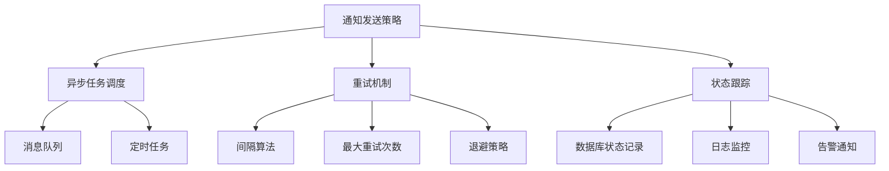
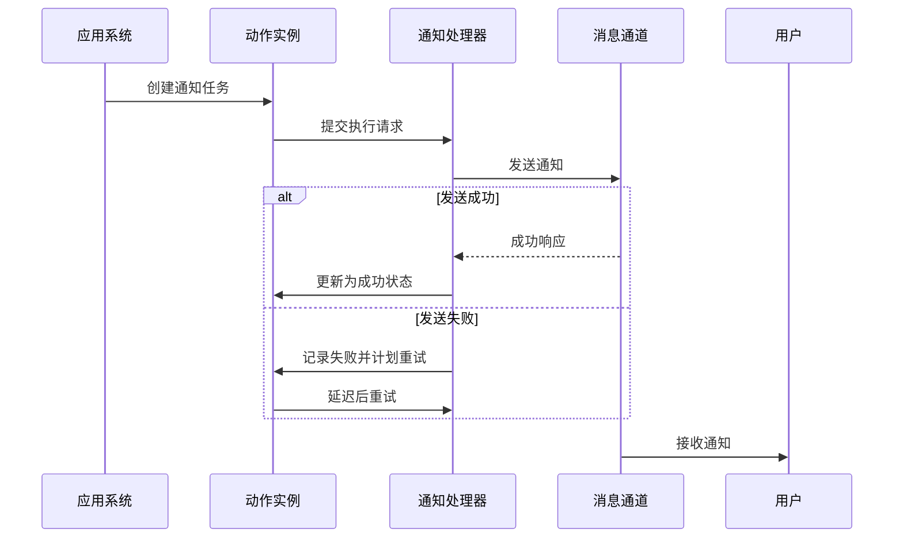
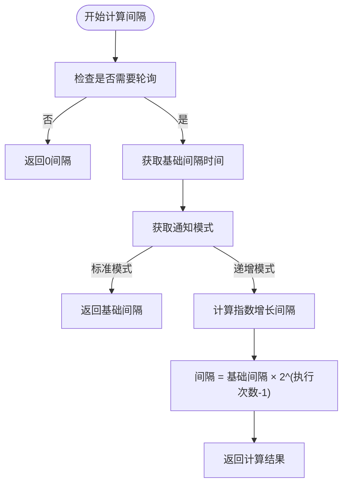
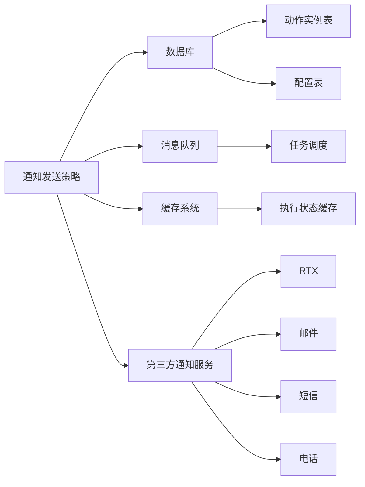

# 发送策略

<cite>
**本文档引用的文件**  
- [action.py](file://bkmonitor\alarm_backends\service\alert\manager\checker\action.py#L172-L221)
- [processor.py](file://bkmonitor\alarm_backends\service\fta_action\notice\processor.py#L146-L182)
- [__init__.py](file://bkmonitor\alarm_backends\service\fta_action\__init__.py#L500-L651)
- [test_notice_execute.py](file://bkmonitor\alarm_backends\tests\service\fta_action\test_notice_execute.py#L2449-L2477)
</cite>

## 目录
1. [简介](#简介)
2. [项目结构](#项目结构)
3. [核心组件](#核心组件)
4. [架构概述](#架构概述)
5. [详细组件分析](#详细组件分析)
6. [依赖分析](#依赖分析)
7. [性能考虑](#性能考虑)
8. [故障排查指南](#故障排查指南)
9. [结论](#结论)

## 简介
本文档全面介绍监控系统中通知发送的异步处理机制、重试策略和状态跟踪功能。重点说明消息队列的使用方式、任务调度机制和并发控制策略。详细描述失败重试的间隔算法、最大重试次数、退避策略等配置参数。同时解释发送状态的监控指标、日志记录和告警机制，并提供性能调优建议，包括批量发送、连接池管理、流量控制等内容。

## 项目结构
本项目采用模块化设计，主要功能分布在多个子目录中。与通知发送策略相关的核心逻辑位于 `alarm_backends/service/fta_action` 和 `alarm_backends/service/alert/manager/checker` 目录下。其中：
- `fta_action` 模块负责动作实例的执行、状态更新和通知发送
- `alert/manager/checker/action.py` 实现了通知间隔的动态计算逻辑
- `notice/processor.py` 处理具体的通知发送流程和重试机制



**图示来源**  
- [action.py](file://bkmonitor\alarm_backends\service\alert\manager\checker\action.py#L172-L221)
- [processor.py](file://bkmonitor\alarm_backends\service\fta_action\notice\processor.py#L146-L182)

## 核心组件
系统的核心组件包括通知处理器、状态管理器和重试控制器。通知处理器负责实际的消息发送，状态管理器维护动作实例的生命周期状态，重试控制器根据配置策略决定是否以及何时进行重试。

**组件来源**  
- [__init__.py](file://bkmonitor\alarm_backends\service\fta_action\__init__.py#L500-L651)
- [action.py](file://bkmonitor\alarm_backends\service\alert\manager\checker\action.py#L172-L221)

## 架构概述
系统采用异步处理架构，通过消息队列解耦通知发送过程。当需要发送通知时，系统创建一个动作实例并将其放入任务队列。工作进程从队列中获取任务，执行发送操作，并根据结果更新状态。如果发送失败，系统会根据重试策略在指定间隔后重新尝试。



**图示来源**  
- [__init__.py](file://bkmonitor\alarm_backends\service\fta_action\__init__.py#L500-L651)
- [processor.py](file://bkmonitor\alarm_backends\service\fta_action\notice\processor.py#L146-L182)

## 详细组件分析

### 通知重试机制分析
系统实现了灵活的重试机制，支持多种间隔计算模式。

#### 重试间隔算法
系统提供两种主要的重试间隔计算模式：



**图示来源**  
- [action.py](file://bkmonitor\alarm_backends\service\alert\manager\checker\action.py#L172-L221)

#### 代码实现细节
```python
@staticmethod
def calc_action_interval(execute_config, execute_times):
    """
    计算周期任务间隔时间（单位由配置决定）

    参数:
        execute_config: dict类型，执行配置字典
        execute_times: int类型，当前执行次数（从1开始计数）

    返回值:
        int类型，计算得到的间隔时间
    """
    if execute_config.get("need_poll", True) is False:
        return 0

    try:
        notify_interval = int(execute_config.get("notify_interval", 0))
    except TypeError:
        notify_interval = 0

    interval_notify_mode = execute_config.get("interval_notify_mode", IntervalNotifyMode.STANDARD)
    if interval_notify_mode == IntervalNotifyMode.INCREASING:
        notify_interval = int(notify_interval * math.pow(2, execute_times - 1))
    return notify_interval
```

**组件来源**  
- [action.py](file://bkmonitor\alarm_backends\service\alert\manager\checker\action.py#L172-L221)

### 状态跟踪功能分析
系统通过数据库事务确保状态更新的原子性，完整跟踪通知的整个生命周期。

#### 状态更新机制
```python
def update_status(self, from_status, to_status, failure_type=None, **kwargs):
    """
    更新任务状态
    :param from_status: 前置状态
    :param to_status: 后置状态
    :param failure_type: 失败类型
    """
    with transaction.atomic(using=settings.BACKEND_DATABASE_NAME):
        try:
            locked_action = ActionInstance.objects.select_for_update().get(pk=self.action.id)
        except ActionInstance.DoesNotExist:
            return None
        locked_action.status = to_status
        locked_action.failure_type = failure_type
        for key, value in kwargs.items():
            setattr(locked_action, key, value)
        locked_action.save(using=settings.BACKEND_DATABASE_NAME)
        self.action = locked_action
```

#### 通知发送流程
```python
def notify(self, notify_step, need_update_context=False):
    """
    根据当前状态发送不同通知
    """
    if self.no_need_notify(notify_step):
        return

    notify_info = AlertAssignee(self.context["alert"], self.notify_config["user_groups"]).get_notice_receivers(
        NoticeType.ACTION_NOTICE, notify_step
    )

    notice_result = defaultdict(list)
    for notice_way, notice_receivers in notify_info.items():
        try:
            channel, notice_way = notice_way.split("|")
        except ValueError:
            channel = ""
            notice_way = notice_way
        sender_class = self.NOTICE_SENDER.get(channel, Sender)
        notify_sender = sender_class(
            context=self.get_context() if need_update_context else self.context,
            title_template_path=title_template_path,
            content_template_path=content_template_path,
            notice_type=NoticeType.ACTION_NOTICE,
        )
        notice_result[notice_way].append(
            notify_sender.send(
                notice_way,
                notice_receivers=notice_receivers,
                action_plugin=self.action.action_plugin["plugin_type"],
            )
        )
    return {notify_step: notice_result}
```

**组件来源**  
- [__init__.py](file://bkmonitor\alarm_backends\service\fta_action\__init__.py#L500-L651)

## 依赖分析
系统依赖于多个核心组件和外部服务：



**图示来源**  
- [processor.py](file://bkmonitor\alarm_backends\service\fta_action\notice\processor.py#L146-L182)
- [action.py](file://bkmonitor\alarm_backends\service\alert\manager\checker\action.py#L172-L221)

## 性能考虑
为优化通知发送性能，建议采取以下措施：
1. **批量发送**：合并多个通知请求，减少网络开销
2. **连接池管理**：对第三方通知服务使用连接池
3. **流量控制**：设置合理的并发数和发送速率限制
4. **异步处理**：确保所有通知发送操作都在后台任务中执行
5. **缓存优化**：缓存频繁访问的配置信息和用户组数据

## 故障排查指南
常见问题及解决方案：

1. **通知未发送**
   - 检查动作实例状态是否为"等待中"
   - 验证通知配置是否存在且启用
   - 查看任务队列是否有积压

2. **重试次数过多**
   - 检查网络连接是否正常
   - 验证第三方服务API是否可用
   - 审查通知内容格式是否正确

3. **状态更新失败**
   - 检查数据库连接
   - 验证事务处理是否正常
   - 查看日志中的具体错误信息

**组件来源**  
- [test_notice_execute.py](file://bkmonitor\alarm_backends\tests\service\fta_action\test_notice_execute.py#L2449-L2477)

## 结论
本系统实现了健壮的通知发送机制，通过异步处理、灵活的重试策略和完整的状态跟踪，确保重要通知能够可靠送达。建议在生产环境中根据实际负载调整重试参数和并发设置，以达到最佳的性能和可靠性平衡。