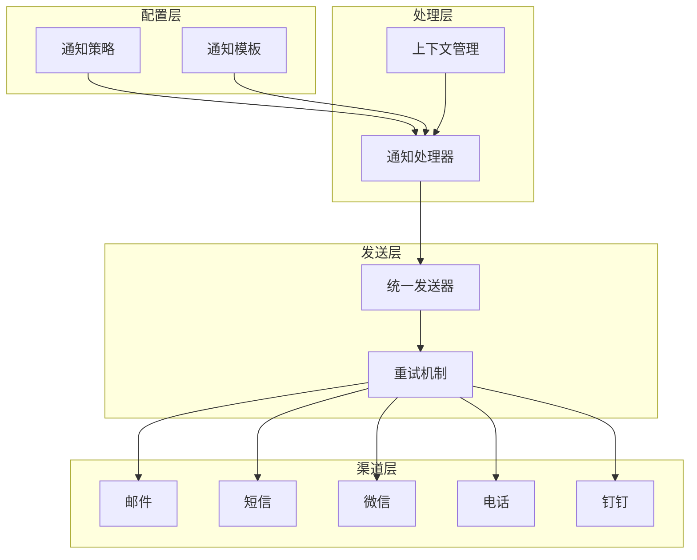
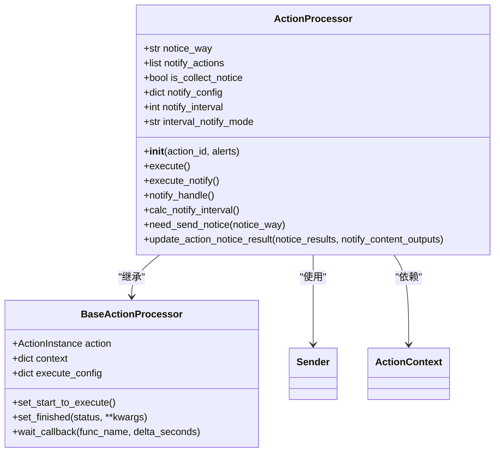
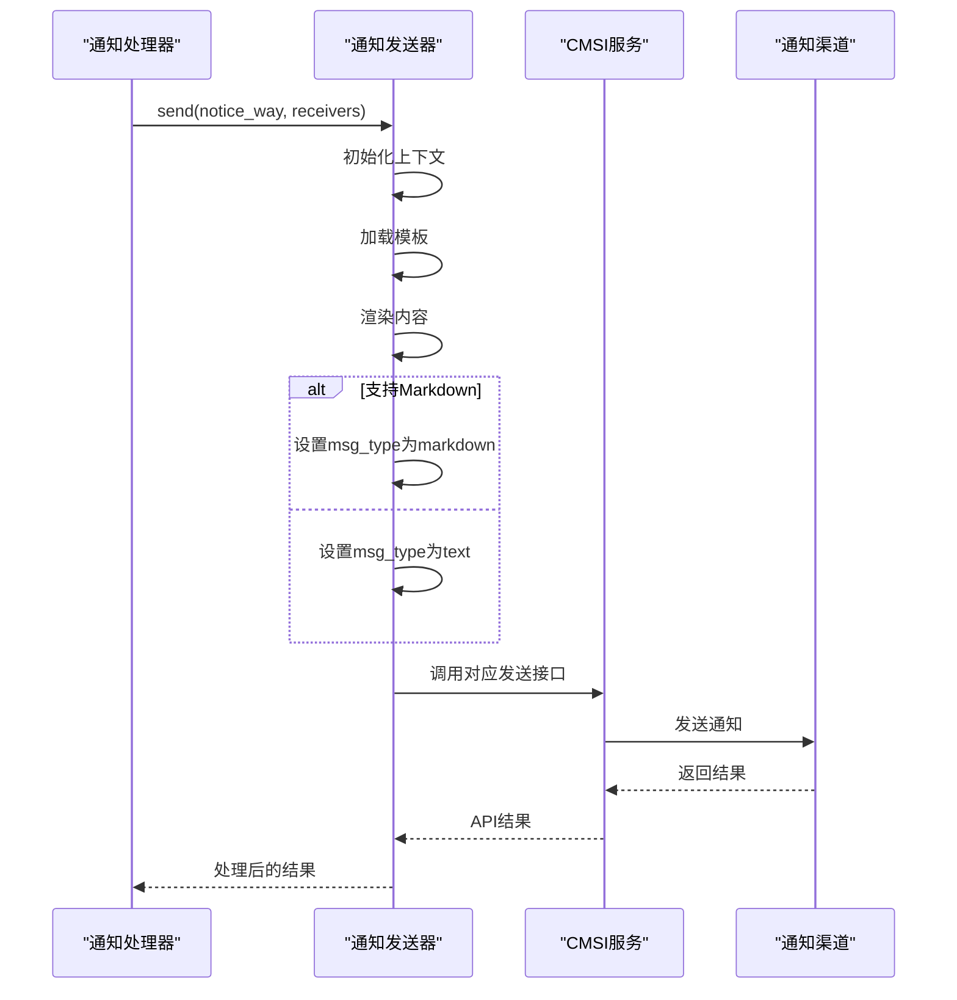
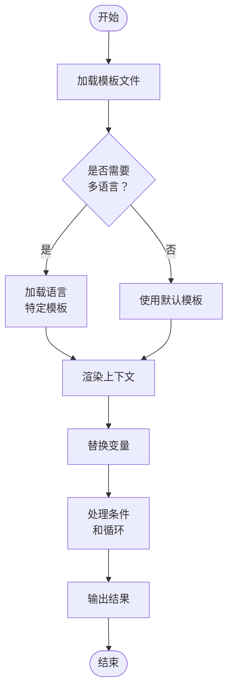
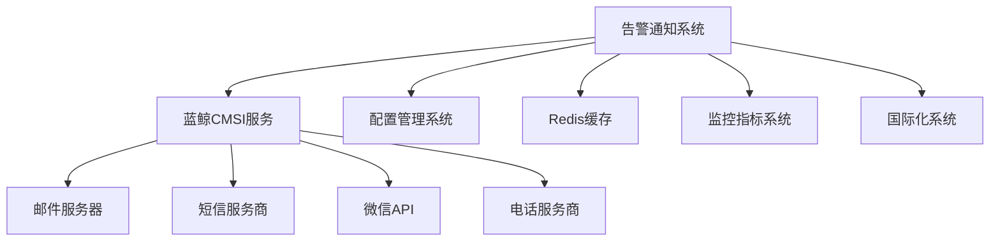

# 告警通知

<cite>
**本文档引用文件**   
- [processor.py](file://bkmonitor/alarm_backends/service/fta_action/notice/processor.py)
- [send.py](file://bkmonitor/bkmonitor/utils/send.py)
- [action.py](file://bkmonitor/constants/action.py)
- [notice.json](file://bkmonitor/bkmonitor/as_code/json_schema/notice.json)
- [event_notify_status.py](file://bkmonitor/bkmonitor/utils/event_notify_status.py)
</cite>

## 目录
1. [引言](#引言)
2. [项目结构](#项目结构)
3. [核心组件](#核心组件)
4. [架构概述](#架构概述)
5. [详细组件分析](#详细组件分析)
6. [依赖分析](#依赖分析)
7. [性能考虑](#性能考虑)
8. [故障排除指南](#故障排除指南)
9. [结论](#结论)

## 引言
本文档全面介绍了蓝鲸监控平台的告警通知机制，涵盖通知渠道、模板设计、发送流程、异步处理、重试策略和状态跟踪等核心功能。系统支持邮件、短信、微信、电话、钉钉等多种通知方式，并提供灵活的配置选项和强大的模板引擎。通过本系统，用户可以实现告警信息的高效分发和精准触达，确保关键问题能够及时被相关人员知晓和处理。

## 项目结构
告警通知功能主要分布在`bkmonitor/alarm_backends/service/fta_action/notice/`目录下，核心组件包括通知处理器、发送器和模板引擎。系统采用模块化设计，各组件职责分明，便于维护和扩展。

```mermaid
graph TD
subgraph "告警通知系统"
Processor[通知处理器<br/>processor.py]
Sender[通知发送器<br/>send.py]
Template[模板引擎<br/>template.py]
Config[配置管理<br/>notice.json]
Constants[常量定义<br/>action.py]
end
Processor --> Sender : "调用"
Processor --> Template : "使用"
Sender --> Constants : "引用"
Config --> Processor : "提供配置"
Template --> Config : "加载模板"
```

**图示来源**
- [processor.py](file://bkmonitor/alarm_backends/service/fta_action/notice/processor.py)
- [send.py](file://bkmonitor/bkmonitor/utils/send.py)
- [action.py](file://bkmonitor/constants/action.py)
- [notice.json](file://bkmonitor/bkmonitor/as_code/json_schema/notice.json)

## 核心组件
告警通知系统的核心组件包括通知处理器（ActionProcessor）、通知发送器（Sender）和上下文管理器（ActionContext）。这些组件协同工作，实现了从告警触发到通知发送的完整流程。系统采用异步处理机制，通过Celery任务队列实现高并发处理能力。

**组件来源**
- [processor.py](file://bkmonitor/alarm_backends/service/fta_action/notice/processor.py#L1-L50)
- [send.py](file://bkmonitor/bkmonitor/utils/send.py#L1-L50)

## 架构概述
告警通知系统采用分层架构设计，从上至下分为配置层、处理层、发送层和渠道层。配置层负责管理通知策略和模板；处理层负责解析告警上下文和执行通知逻辑；发送层负责统一接口调用；渠道层负责对接具体的通知服务。



**图示来源**
- [processor.py](file://bkmonitor/alarm_backends/service/fta_action/notice/processor.py#L1-L100)
- [send.py](file://bkmonitor/bkmonitor/utils/send.py#L1-L100)

## 详细组件分析

### 通知处理器分析
通知处理器是告警通知系统的核心，负责协调整个通知流程。它从告警上下文中提取必要信息，根据配置选择合适的发送方式，并处理发送结果。



**图示来源**
- [processor.py](file://bkmonitor/alarm_backends/service/fta_action/notice/processor.py#L1-L50)

### 通知发送器分析
通知发送器负责与各种通知渠道进行交互，提供统一的发送接口。它支持多种通知方式，并根据不同的渠道特性进行适配。



**图示来源**
- [send.py](file://bkmonitor/bkmonitor/utils/send.py#L1-L100)

### 通知模板分析
通知模板系统采用Jinja2模板引擎，支持变量替换、条件判断和循环等高级特性。模板支持多语言，可以根据用户的语言偏好自动选择合适的模板文件。



**图示来源**
- [send.py](file://bkmonitor/bkmonitor/utils/send.py#L1-L50)
- [action.py](file://bkmonitor/constants/action.py#L1-L50)

## 依赖分析
告警通知系统依赖多个核心模块和外部服务。系统通过清晰的接口定义，实现了组件间的松耦合。主要依赖包括CMSI服务（负责具体的通知发送）、配置管理系统（存储通知策略）和缓存系统（用于收敛控制）。



**图示来源**
- [send.py](file://bkmonitor/bkmonitor/utils/send.py#L1-L20)
- [processor.py](file://bkmonitor/alarm_backends/service/fta_action/notice/processor.py#L1-L20)

## 性能考虑
告警通知系统在设计时充分考虑了性能因素。系统采用异步处理机制，避免阻塞主流程；通过缓存减少数据库查询；使用连接池优化外部服务调用。对于高频率的告警，系统提供收敛功能，防止通知风暴。

## 故障排除指南
当告警通知出现问题时，可以从以下几个方面进行排查：检查通知配置是否正确、验证接收人账号是否存在、确认CMSI服务是否正常、查看系统日志中的错误信息。系统提供了详细的发送状态跟踪，可以帮助快速定位问题。

**故障排除来源**
- [event_notify_status.py](file://bkmonitor/bkmonitor/utils/event_notify_status.py#L1-L50)
- [processor.py](file://bkmonitor/alarm_backends/service/fta_action/notice/processor.py#L1-L50)

## 结论
蓝鲸监控平台的告警通知系统是一个功能强大、设计合理的通知引擎。它支持多种通知渠道，提供灵活的配置选项和丰富的模板功能。系统采用异步处理和重试机制，确保了通知的可靠性和及时性。通过完善的监控和日志系统，运维人员可以轻松管理和维护告警通知功能。