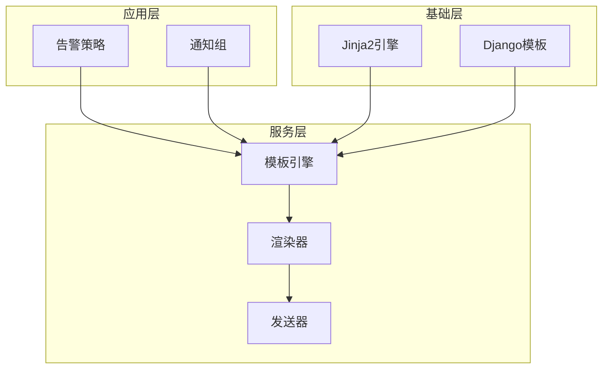
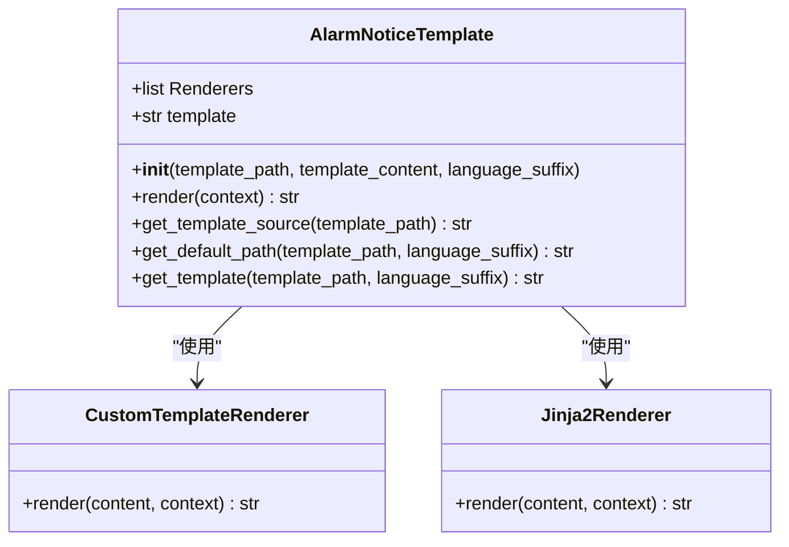
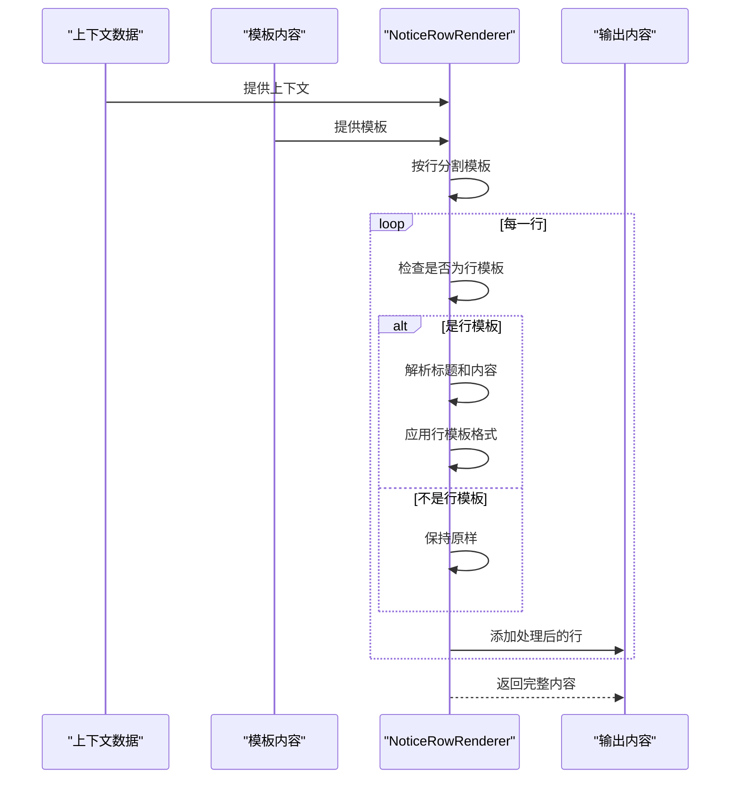
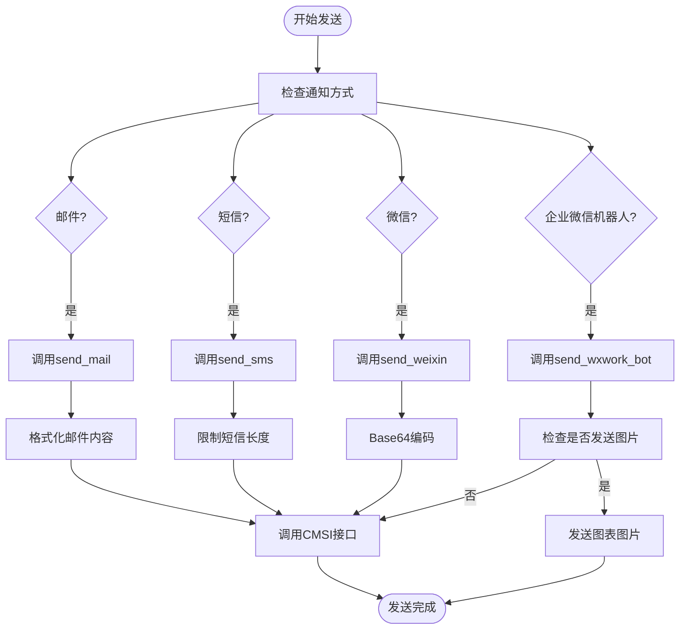
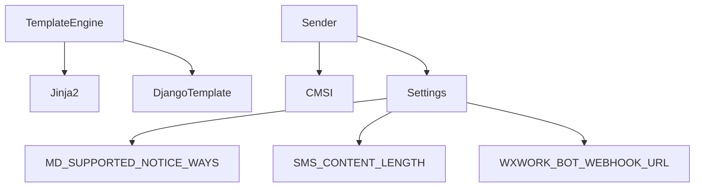

# 通知模板

<cite>
**本文档引用的文件**   
- [template.py](file://bkmonitor\bkmonitor\utils\template.py)
- [send.py](file://bkmonitor\bkmonitor\utils\send.py)
- [action.py](file://bkmonitor\constants\action.py)
</cite>

## 目录
1. [简介](#简介)
2. [核心组件](#核心组件)
3. [架构概述](#架构概述)
4. [详细组件分析](#详细组件分析)
5. [依赖分析](#依赖分析)
6. [性能考虑](#性能考虑)
7. [故障排除指南](#故障排除指南)
8. [结论](#结论)

## 简介
本文档全面介绍了蓝鲸监控系统中通知模板的设计与实现。通知模板系统是监控告警功能的核心组成部分，负责将告警信息以用户可读的格式发送给相关人员。系统采用多层渲染架构，结合Jinja2模板引擎和自定义渲染器，支持丰富的格式化功能和多语言特性。通过灵活的模板继承和条件渲染机制，用户可以创建高度定制化的通知内容。

## 核心组件

通知模板系统的核心组件包括模板引擎、渲染器和发送器。模板引擎负责管理模板的加载和解析，渲染器负责将模板与上下文数据结合生成最终内容，发送器负责将渲染后的内容通过不同渠道发送出去。系统支持多种通知方式，包括邮件、短信、微信、企业微信机器人等，并针对不同渠道提供了相应的格式化支持。

**Section sources**
- [template.py](file://bkmonitor\bkmonitor\utils\template.py#L191-L278)
- [send.py](file://bkmonitor\bkmonitor\utils\send.py#L285-L610)

## 架构概述

通知模板系统的架构采用分层设计，从上到下分为应用层、服务层和基础层。应用层负责处理用户请求和业务逻辑，服务层提供模板渲染和消息发送的核心功能，基础层提供Jinja2引擎和Django模板系统的支持。这种分层架构使得系统具有良好的可扩展性和可维护性。

**Diagram sources**
- [template.py](file://bkmonitor\bkmonitor\utils\template.py#L191-L278)
- [send.py](file://bkmonitor\bkmonitor\utils\send.py#L285-L610)

## 详细组件分析

### 模板引擎分析
模板引擎是通知系统的核心，负责加载和管理模板文件。系统通过`AlarmNoticeTemplate`类实现模板引擎功能，支持从文件路径或直接内容创建模板。引擎采用链式渲染模式，依次通过自定义渲染器和Jinja2渲染器处理模板内容。

**Diagram sources**
- [template.py](file://bkmonitor\bkmonitor\utils\template.py#L191-L278)

**Section sources**
- [template.py](file://bkmonitor\bkmonitor\utils\template.py#L191-L278)

### 渲染器分析
渲染器负责将模板内容与上下文数据结合生成最终的可读文本。系统实现了两种主要的渲染器：`NoticeRowRenderer`用于处理行级模板格式，`Jinja2Renderer`用于处理复杂的模板逻辑。`NoticeRowRenderer`支持特殊的行模板语法，以#开头和结尾的行会被特殊处理。

**Diagram sources**
- [template.py](file://bkmonitor\bkmonitor\utils\template.py#L38-L100)

**Section sources**
- [template.py](file://bkmonitor\bkmonitor\utils\template.py#L38-L100)

### 发送器分析
发送器负责将渲染后的内容通过各种渠道发送给接收者。`Sender`类实现了统一的发送接口，支持多种通知方式。系统根据通知方式自动选择合适的发送方法，并处理相应的格式化和编码问题。

**Diagram sources**
- [send.py](file://bkmonitor\bkmonitor\utils\send.py#L285-L610)

**Section sources**
- [send.py](file://bkmonitor\bkmonitor\utils\send.py#L285-L610)

## 依赖分析

通知模板系统依赖于多个外部组件和配置。系统通过settings模块获取各种配置参数，如支持Markdown的通知方式列表、内容长度限制等。同时，系统依赖于CMSI（蓝鲸消息管理服务）来实现实际的消息发送功能。

**Diagram sources**
- [template.py](file://bkmonitor\bkmonitor\utils\template.py#L166-L188)
- [send.py](file://bkmonitor\bkmonitor\utils\send.py#L285-L610)

**Section sources**
- [template.py](file://bkmonitor\bkmonitor\utils\template.py#L166-L188)
- [send.py](file://bkmonitor\bkmonitor\utils\send.py#L285-L610)

## 性能考虑

通知模板系统在设计时考虑了性能优化。系统采用缓存机制来提高模板加载效率，避免重复读取文件。同时，系统对渲染后的内容长度进行限制，防止过长的消息影响发送性能。对于企业微信机器人等支持图片的渠道，系统提供了配置选项来控制是否发送图表图片，以平衡信息丰富度和发送效率。

## 故障排除指南

当通知模板出现问题时，可以按照以下步骤进行排查：
1. 检查模板路径是否正确，确保模板文件存在
2. 验证模板语法是否正确，特别是Jinja2语法
3. 检查上下文数据是否完整，确保所有变量都有值
4. 查看日志文件，寻找渲染错误的具体信息
5. 确认CMSI服务是否正常运行，消息接口是否可用

**Section sources**
- [template.py](file://bkmonitor\bkmonitor\utils\template.py#L109-L134)
- [send.py](file://bkmonitor\bkmonitor\utils\send.py#L285-L610)

## 结论

通知模板系统通过灵活的架构设计和丰富的功能特性，为蓝鲸监控提供了强大的告警通知能力。系统支持多种渲染方式和通知渠道，能够满足不同场景下的需求。通过合理的性能优化和错误处理机制，系统保证了高可靠性和稳定性。未来可以进一步扩展模板功能，支持更多富文本格式和交互式元素。