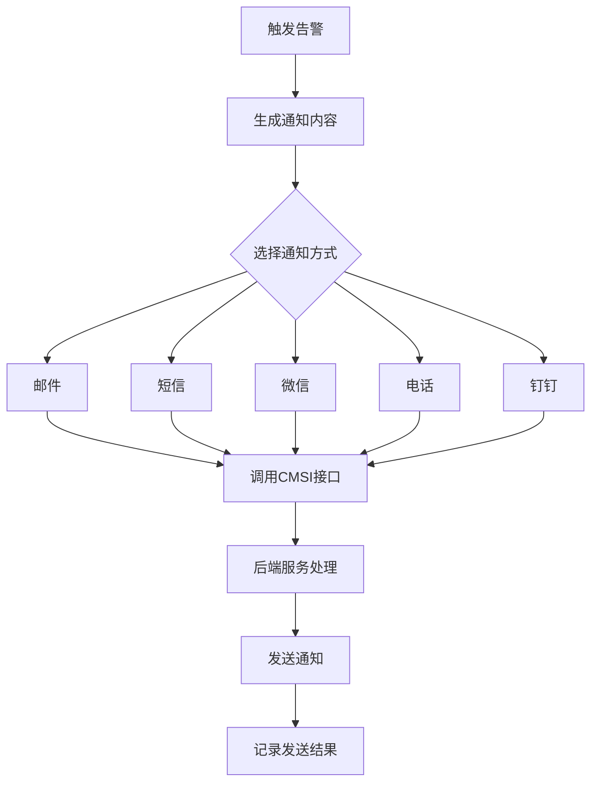
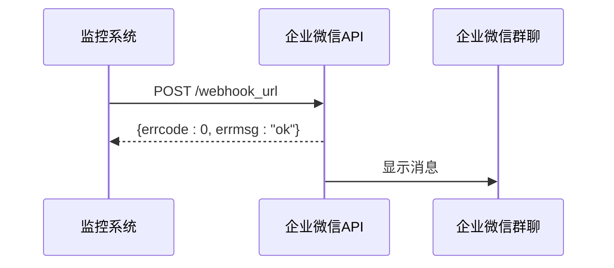
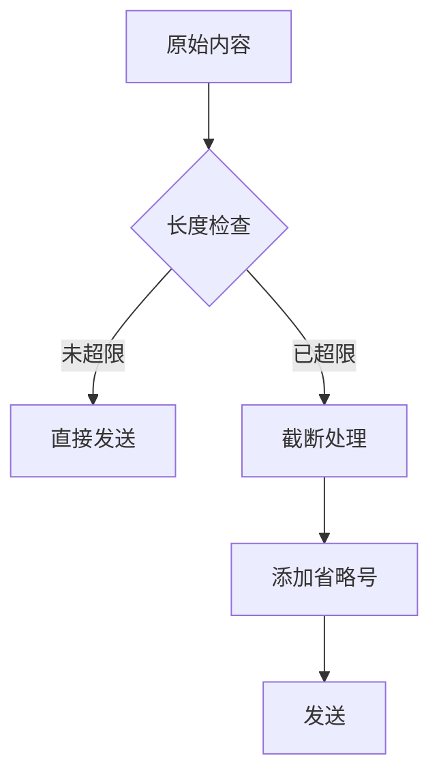
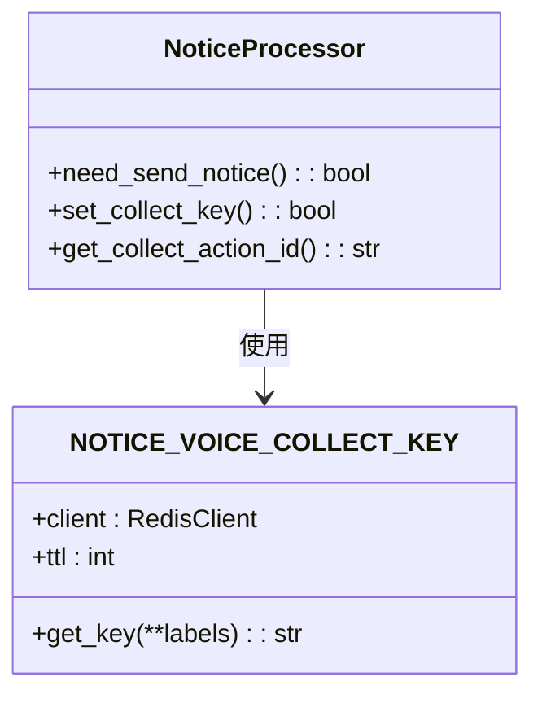

# 通知渠道

<cite>
**本文档引用的文件**
- [settings.py](file://bkmonitor/settings.py)
- [send.py](file://bkmonitor/utils/send.py)
- [default.py](file://bkmonitor/api/cmsi/default.py)
</cite>

## 目录
1. [简介](#简介)
2. [支持的通知方式](#支持的通知方式)
3. [技术实现原理](#技术实现原理)
4. [配置参数与认证方式](#配置参数与认证方式)
5. [使用限制](#使用限制)
6. [可用性检测与故障转移](#可用性检测与故障转移)
7. [性能指标](#性能指标)
8. [配置示例与最佳实践](#配置示例与最佳实践)

## 简介
本系统提供了一套完整的通知渠道解决方案，支持多种通知方式，包括邮件、短信、微信、电话、钉钉、企业微信等。系统通过统一的接口层与后端服务进行交互，实现了灵活的通知机制。通知渠道的设计考虑了高可用性、安全性以及性能优化，确保在各种场景下都能可靠地发送通知。

**Section sources**
- [settings.py](file://bkmonitor/settings.py#L0-L73)

## 支持的通知方式
系统支持以下主要通知方式：

- **邮件通知**：通过SMTP协议发送邮件，支持HTML和纯文本格式。
- **短信通知**：通过第三方短信网关发送短信，支持长短信分片。
- **微信通知**：包括企业微信应用消息、企业微信机器人消息和普通微信消息。
- **电话通知**：通过语音合成技术自动拨打电话并播放告警信息。
- **钉钉通知**：通过钉钉机器人Webhook发送消息。
- **RTX通知**：企业内部即时通讯工具通知。

这些通知方式覆盖了日常运维中的主要沟通渠道，确保告警信息能够及时触达相关人员。

## 技术实现原理

### 通知发送流程


**Diagram sources**
- [send.py](file://bkmonitor/utils/send.py#L359-L396)
- [default.py](file://bkmonitor/api/cmsi/default.py#L344-L383)

### 企业微信机器人实现
企业微信机器人通过Webhook URL与企业微信服务器进行通信。系统将消息内容以JSON格式POST到指定的Webhook地址，企业微信服务器接收到消息后将其推送到指定的群聊中。



**Diagram sources**
- [send.py](file://bkmonitor/utils/send.py#L427-L456)
- [default.py](file://bkmonitor/api/cmsi/default.py#L594-L624)

## 配置参数与认证方式

### 主要配置参数
系统通过settings.py文件中的配置项来控制各种通知渠道的行为：

- `SMS_CONTENT_LENGTH`：短信内容最大长度限制
- `NOTICE_MESSAGE_MAX_LENGTH`：各类通知消息的最大长度限制
- `WXWORK_BOT_WEBHOOK_URL`：企业微信机器人Webhook地址
- `IS_WECOM_ROBOT_ENABLED`：是否启用企业微信机器人
- `WECOM_ROBOT_BIZ_WHITE_LIST`：企业微信机器人业务白名单

**Section sources**
- [settings.py](file://bkmonitor/settings.py#L0-L73)

### 认证方式
不同通知渠道采用不同的认证方式：

- **邮件**：使用SMTP用户名和密码进行认证
- **短信**：通过API密钥进行认证
- **企业微信机器人**：使用预配置的Webhook URL，URL中包含访问令牌
- **电话**：通过企业内部认证系统进行身份验证
- **钉钉**：使用钉钉机器人Webhook URL中的token进行认证

## 使用限制

### 内容长度限制
系统对不同类型的通知设置了内容长度限制：

- **短信**：由`SMS_CONTENT_LENGTH`配置项控制，默认300字符
- **企业微信机器人**：最大4096字符
- **邮件**：无硬性限制，但建议不超过10KB
- **电话**：语音内容建议不超过30秒

当内容超过限制时，系统会自动截断并在末尾添加省略号。



**Diagram sources**
- [send.py](file://bkmonitor/utils/send.py#L177-L207)

### 发送频率限制
为防止通知泛滥，系统实施了发送频率控制：

- **电话通知**：同一接收人在2分钟内同维度告警只能接收一次电话通知
- **短信通知**：每小时最多发送10条
- **邮件通知**：每分钟最多发送50封

## 可用性检测与故障转移

### 电话通知收敛机制
系统通过Redis实现电话通知的收敛控制，防止短时间内重复拨打同一号码。



**Diagram sources**
- [send.py](file://bkmonitor/utils/send.py#L391-L431)
- [processor.py](file://alarm_backends/service/fta_action/notice/processor.py#L309-L336)

### 故障转移策略
当主要通知渠道失败时，系统会尝试使用备用渠道：

1. 优先尝试企业微信机器人
2. 如果企业微信机器人不可用，则尝试普通微信
3. 最后尝试短信或电话通知

这种分层的故障转移策略确保了通知的可靠性。

## 性能指标
系统通过Prometheus收集和监控通知渠道的性能指标：

- `MAIL_REPORT_SEND_LATENCY`：邮件发送延迟
- `MAIL_REPORT_SEND_COUNT`：邮件发送计数
- `NOTICE_SEND_DURATION`：通知发送耗时
- `NOTICE_SEND_FAILURES`：通知发送失败次数

这些指标帮助运维人员及时发现和解决通知系统的问题。

**Section sources**
- [tasks.py](file://alarm_backends/service/report/tasks.py#L228-L261)

## 配置示例与最佳实践

### 敏感信息加密存储
所有敏感信息如API密钥、Webhook URL等都应加密存储：

```python
# settings.py
WXWORK_BOT_WEBHOOK_URL = cipher.decrypt("encrypted_webhook_url")
SMS_API_KEY = cipher.decrypt("encrypted_api_key")
```

### 配额管理
合理设置各渠道的配额，避免超出服务商限制：

```python
# settings.py
NOTICE_QUOTAS = {
    "sms": {"daily_limit": 1000, "hourly_limit": 100},
    "email": {"daily_limit": 5000, "minute_limit": 50},
    "voice": {"daily_limit": 100, "hourly_limit": 10}
}
```

### 发送频率控制
实施精细化的发送频率控制策略：

```python
# settings.py
NOTICE_RATE_LIMITS = {
    "voice": {
        "window": 120,  # 2分钟窗口
        "limit": 1,     # 每窗口最多1次
        "dimensions": ["receiver", "dimension_hash"]
    },
    "sms": {
        "window": 3600,  # 1小时窗口
        "limit": 10,     # 每窗口最多10条
        "dimensions": ["receiver"]
    }
}
```

### 最佳实践建议
1. **多渠道冗余**：为关键告警配置多个通知渠道，确保消息可达
2. **分级通知**：根据告警级别选择不同的通知方式
3. **定期测试**：定期测试所有通知渠道的可用性
4. **监控通知系统**：将通知系统自身的健康状况纳入监控范围
5. **用户偏好管理**：允许用户自定义接收通知的方式和时间

通过遵循这些最佳实践，可以构建一个可靠、高效的通知系统，确保关键信息能够及时、准确地传达给相关人员。

**Section sources**
- [settings.py](file://bkmonitor/settings.py#L0-L73)
- [send.py](file://bkmonitor/utils/send.py#L177-L207)