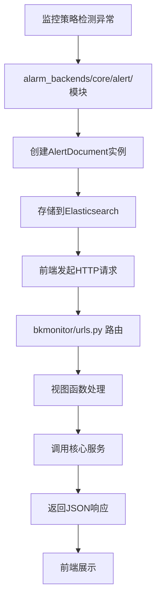
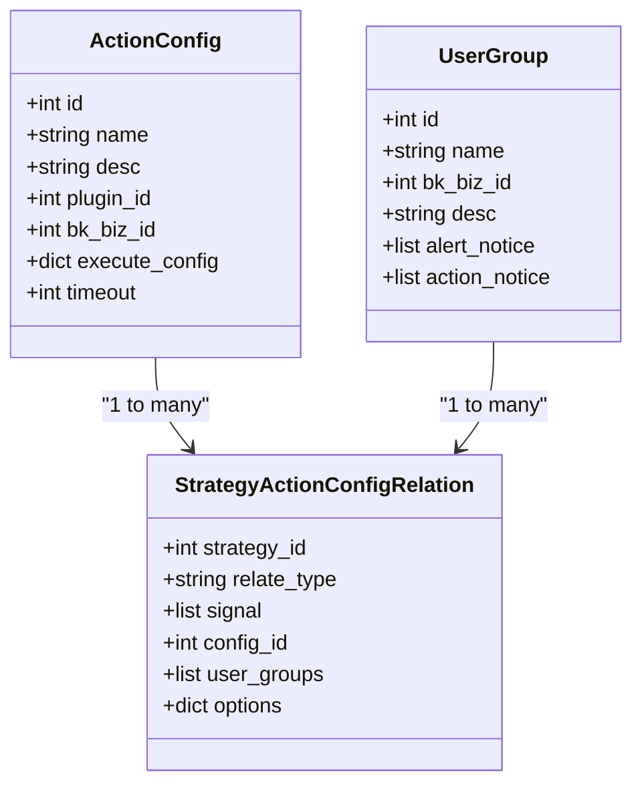

# 告警管理API

<cite>
**本文档引用的文件**  
- [alert.py](file://bkmonitor/bkmonitor/documents/alert.py)
- [alert.py](file://bkmonitor/constants/alert.py)
- [alert_assign.py](file://bkmonitor/bkmonitor/action/alert_assign.py)
- [converter.py](file://bkmonitor/bkmonitor/action/converter.py)
- [duty_manage.py](file://bkmonitor/bkmonitor/action/duty_manage.py)
- [utils.py](file://bkmonitor/bkmonitor/action/utils.py)
- [urls.py](file://bkmonitor/urls.py)
</cite>

## 目录
1. [简介](#简介)
2. [告警核心数据结构](#告警核心数据结构)
3. [告警生成与API暴露流程](#告警生成与api暴露流程)
4. [告警查询API](#告警查询api)
5. [告警处理操作API](#告警处理操作api)
6. [告警收敛状态获取](#告警收敛状态获取)
7. [告警动作配置](#告警动作配置)
8. [curl示例](#curl示例)

## 简介
本文档详细描述了蓝鲸监控平台的告警管理API，涵盖告警的查询、处理、收敛状态获取等功能。文档解释了告警事件的核心数据结构，包括告警级别、触发时间、关联策略ID和原始事件数据。同时，说明了告警从`alarm_backends/core/alert/`模块生成后如何通过API暴露给前端，并提供了告警动作（Action）的配置说明，包括通知组和执行脚本等。

## 告警核心数据结构
告警事件的核心数据结构定义在`bkmonitor/documents/alert.py`和`bkmonitor/constants/alert.py`中，主要包括以下关键字段：

- **告警ID (ID)**: 唯一标识一个告警实例。
- **告警级别 (Severity)**: 定义在`EventSeverity`类中，包含致命(FATAL=1)、预警(WARNING=2)、提醒(REMIND=3)三个级别。
- **触发时间 (Time)**: 告警首次被检测到的时间。
- **关联策略ID (Strategy ID)**: 生成该告警的监控策略ID，用于追溯告警来源。
- **原始事件数据 (Raw Event Data)**: 包含告警的详细信息，如指标值、维度标签等。
- **状态 (Status)**: 定义在`EventStatus`类中，包括未恢复(ABNORMAL)、已恢复(RECOVERED)、已失效(CLOSED)。
- **目标类型 (Target Type)**: 指明告警关联的资源类型，如主机(HOST)、服务实例(SERVICE)、拓扑(TOPO)等。

这些数据结构通过Elasticsearch文档模型`AlertDocument`进行存储和管理。

**Section sources**
- [alert.py](file://bkmonitor/bkmonitor/documents/alert.py#L1-L100)
- [alert.py](file://bkmonitor/constants/alert.py#L108-L127)

## 告警生成与API暴露流程
告警的生成和暴露遵循以下流程：

1.  **告警生成**: 告警由`alarm_backends/core/alert/`模块生成。当监控策略检测到异常时，会创建一个`AlertDocument`实例并保存到Elasticsearch中。
2.  **API路由**: 告警相关的API端点在`bkmonitor/urls.py`中定义，通过Django的URL路由系统将HTTP请求映射到相应的视图函数。
3.  **视图处理**: API请求由`bkmonitor`应用中的视图函数处理。这些视图函数负责解析请求、调用核心服务逻辑（如查询、处理告警），并将结果序列化为JSON响应。
4.  **数据暴露**: 前端通过调用这些API端点来获取告警列表、详情、执行处理操作等。



**Diagram sources**
- [alert.py](file://bkmonitor/bkmonitor/documents/alert.py)
- [urls.py](file://bkmonitor/urls.py)

## 告警查询API
告警查询API允许用户根据各种条件检索告警信息。主要功能包括：

- **分页查询**: 支持通过`page`和`pagesize`参数进行分页。
- **条件过滤**: 可根据告警级别、状态、策略ID、业务ID等字段进行过滤。
- **排序**: 支持按触发时间、严重级别等字段排序。

API端点通常为`/api/alert/`，使用HTTP GET方法。

**Section sources**
- [urls.py](file://bkmonitor/urls.py#L1-L20)

## 告警处理操作API
告警处理API支持对告警执行确认、关闭等操作：

- **确认 (Acknowledge)**: 将告警的处理阶段设置为"已确认"，表示已有人关注此告警。这通过更新告警的`handle_stage`字段实现。
- **关闭 (Close)**: 将告警状态设置为"已失效"，表示该告警已被解决或不再需要关注。
- **处理日志**: 每次处理操作都会生成一条`AlertLog`记录，用于审计和追踪。

这些操作通常通过`/api/alert/{alert_id}/action/`端点，使用HTTP POST方法，并在请求体中指定操作类型。

**Section sources**
- [alert_assign.py](file://bkmonitor/bkmonitor/action/alert_assign.py#L494-L535)

## 告警收敛状态获取
告警收敛（Converge）用于将多个相似的告警合并为一个，以减少告警风暴。系统通过`alarm_backends/service/converge/`模块管理收敛状态。

用户可以通过特定API端点查询某个告警或一组告警的收敛状态，了解它们是否已被合并以及合并后的主告警信息。收敛配置通常包含在告警的`converge_config`字段中。

**Section sources**
- [alert.py](file://bkmonitor/constants/alert.py#L163-L164)

## 告警动作配置
告警动作（Action）定义了在告警触发时需要执行的操作，如发送通知、执行脚本等。配置主要在`bkmonitor/action/`模块中实现。

- **通知组 (Notice Group)**: 配置通知的接收人，可以是用户组（如主备负责人、运维、开发等）或具体的用户。通知方式包括企业微信、邮件等。
- **执行脚本**: 通过集成Job API来执行自动化脚本。这在`converter.py`文件中通过`get_or_create_webhook`方法实现，可以将Webhook动作配置为调用Job API。
- **升级策略**: 支持配置升级通知，如果告警在一定时间内未被处理，会通知更高级别的负责人。



**Diagram sources**
- [converter.py](file://bkmonitor/bkmonitor/action/converter.py)
- [alert_assign.py](file://bkmonitor/bkmonitor/action/alert_assign.py)

## curl示例
以下是一个查询最近严重级别告警的curl示例：

```bash
curl -X GET "http://your-bk-monitor-api/api/alert/" \
  -H "Authorization: Bearer your-access-token" \
  -H "Content-Type: application/json" \
  -d '{
    "conditions": [
      {"key": "severity", "value": [1]}
    ],
    "order": "-begin_time",
    "page": 1,
    "pagesize": 10
  }'
```

此命令查询严重级别为"致命"的告警，并按触发时间倒序排列，返回最新的10条记录。

**Section sources**
- [urls.py](file://bkmonitor/urls.py)
- [alert.py](file://bkmonitor/constants/alert.py#L108-L117)