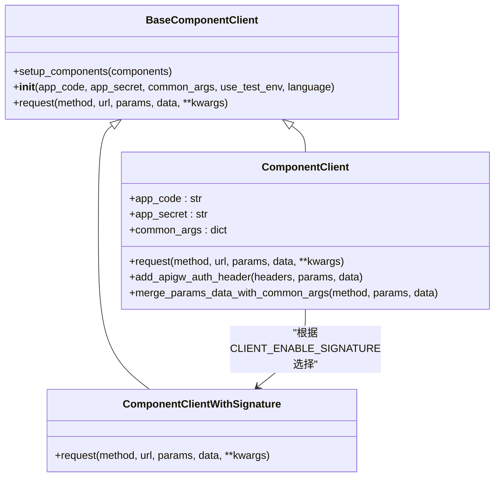
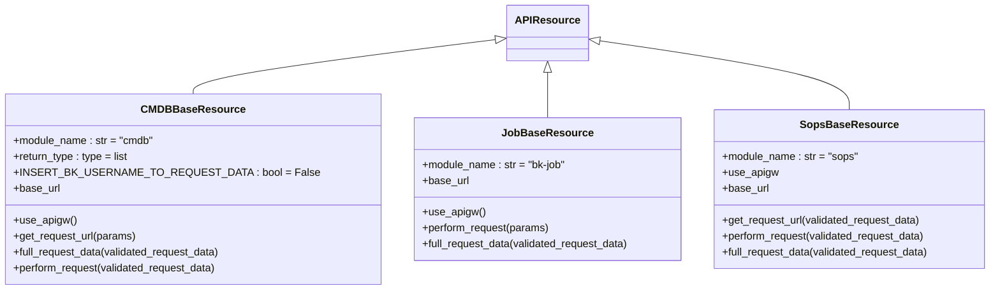
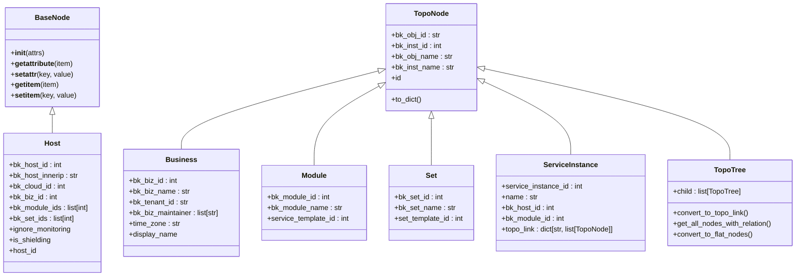
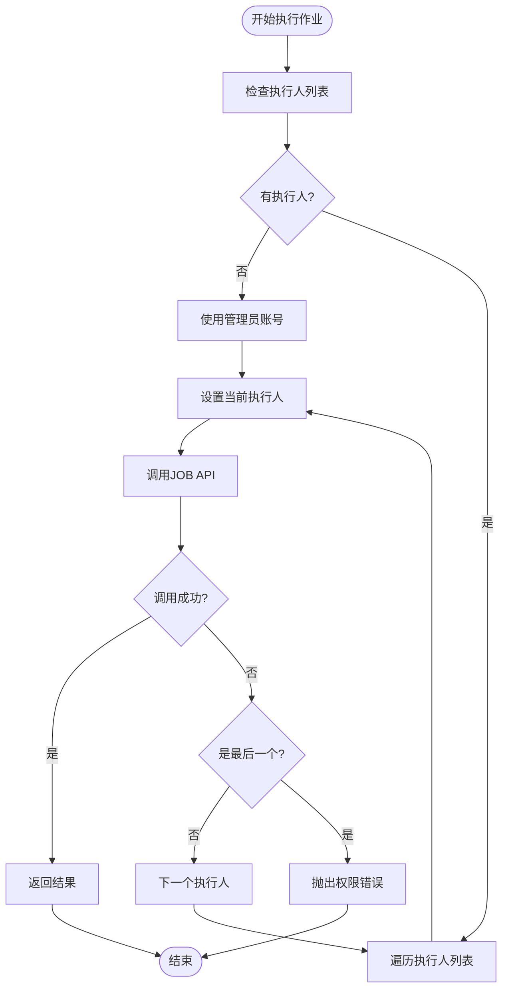
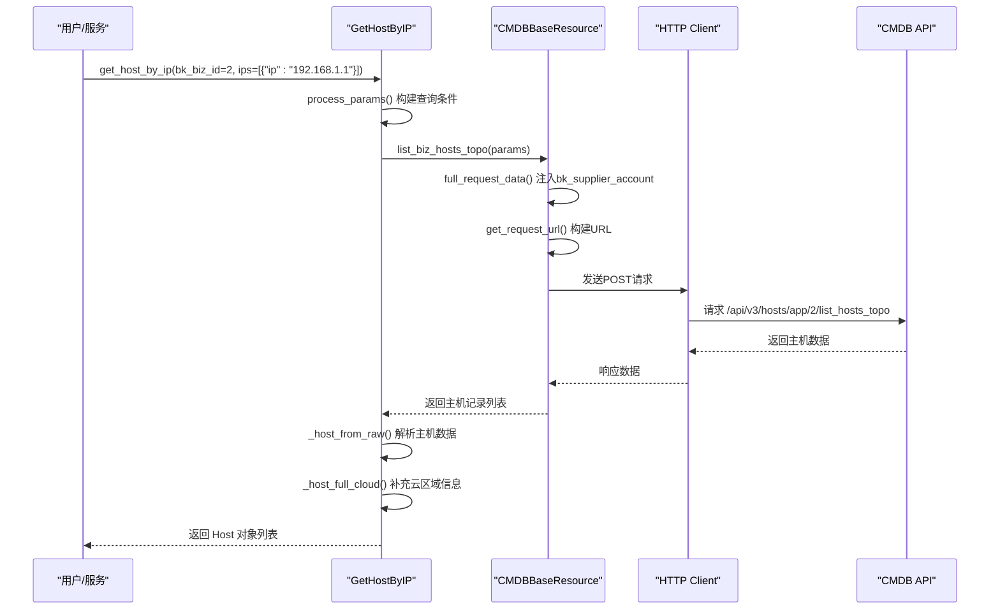
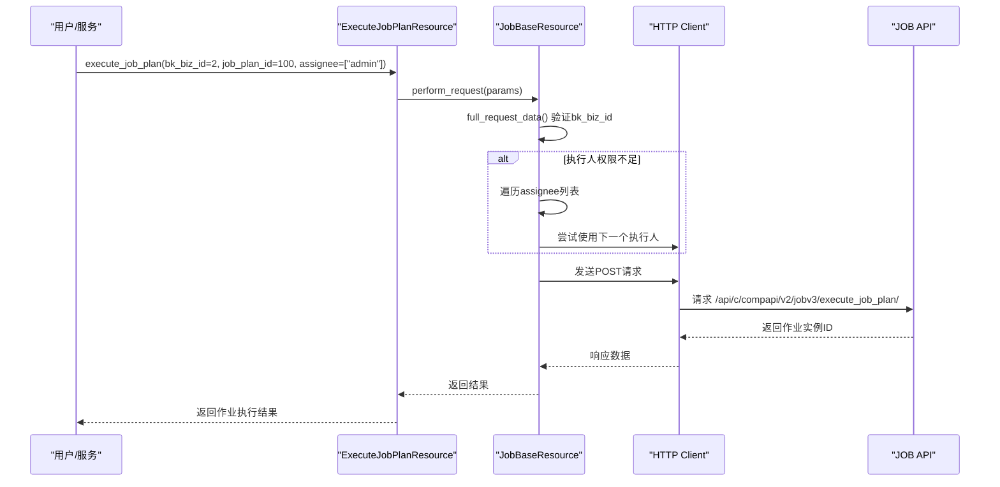

# 外部服务集成API

<cite>
**本文档引用的文件**   
- [cmdb/client.py](file://bkmonitor/api/cmdb/client.py)
- [cmdb/default.py](file://bkmonitor/api/cmdb/default.py)
- [cmdb/define.py](file://bkmonitor/api/cmdb/define.py)
- [job/default.py](file://bkmonitor/api/job/default.py)
- [sops/default.py](file://bkmonitor/api/sops/default.py)
- [blueking/component/client.py](file://bkmonitor/blueking/component/client.py)
</cite>

## 目录
1. [简介](#简介)
2. [通用集成模式](#通用集成模式)
3. [CMDB集成](#cmdb集成)
4. [作业平台(JOB)集成](#作业平台job集成)
5. [标准运维(SOPS)集成](#标准运维sops集成)
6. [典型用例](#典型用例)
7. [总结](#总结)

## 简介
本文档详细说明了`bkmonitor/api/`目录下各模块如何封装蓝鲸其他平台的RESTful API。这些封装器作为内部服务间调用的桥梁，为监控平台提供了对配置管理数据库(CMDB)、作业平台(JOB)和标准运维(SOPS)等核心蓝鲸组件的统一访问接口。通过`blueking/component/client.py`进行统一的HTTP请求、认证和错误处理，确保了API调用的一致性和可靠性。

## 通用集成模式

蓝鲸监控平台通过`api/`目录下的模块封装了对其他蓝鲸平台的RESTful API调用。这种封装遵循一个统一的模式，确保了代码的一致性、可维护性和安全性。

### 统一的HTTP请求与认证机制
所有外部服务的API调用都通过`blueking/component/client.py`中的`ComponentClient`类进行。该类提供了统一的HTTP请求处理、认证信息注入和错误处理机制。

**图源**
- [blueking/component/client.py](file://bkmonitor/blueking/component/client.py#L25-L179)

**核心特性：**
- **认证信息注入**：`add_apigw_auth_header`方法将`bk_app_code`、`bk_app_secret`和用户身份(`bk_username`)等认证信息注入到请求头的`x-bkapi-authorization`字段中。
- **环境支持**：支持测试环境(`use_test_env`)和多语言(`language`)配置。
- **签名机制**：根据`CLIENT_ENABLE_SIGNATURE`配置，可选择是否启用签名验证，增强安全性。

### API资源基类
每个集成模块都定义了继承自`APIResource`的基类，用于封装特定平台的API调用。以CMDB为例，`CMDBBaseResource`类定义了CMDB API的通用行为：

**图源**
- [cmdb/client.py](file://bkmonitor/api/cmdb/client.py#L38-L85)
- [job/default.py](file://bkmonitor/api/job/default.py#L26-L80)
- [sops/default.py](file://bkmonitor/api/sops/default.py#L27-L91)

**通用模式：**
1. **模块名称**：`module_name`属性标识了API所属的平台。
2. **URL构建**：`base_url`和`action`属性共同构建完整的API端点URL，支持API网关(`use_apigw`)模式。
3. **请求数据处理**：`full_request_data`方法在发送请求前对数据进行预处理，例如注入`bk_supplier_account`和验证`bk_biz_id`。
4. **错误处理**：`perform_request`方法封装了统一的错误处理逻辑，例如捕获`NoRelatedResourceError`并返回空数据，或处理权限不足的情况。

**通用集成模式**
- [cmdb/client.py](file://bkmonitor/api/cmdb/client.py#L38-L85)
- [job/default.py](file://bkmonitor/api/job/default.py#L26-L80)
- [sops/default.py](file://bkmonitor/api/sops/default.py#L27-L91)

## CMDB集成

`api/cmdb/`模块封装了对蓝鲸配置管理数据库(CMDB)的API调用，提供了对业务、主机、集群、模块等配置项的查询和管理功能。

### 核心功能
- **业务查询**：`get_business`用于获取业务详情。
- **拓扑查询**：`get_topo_tree`用于获取业务的完整拓扑树结构。
- **主机查询**：`get_host_by_ip`、`get_host_by_topo_node`等用于根据IP或拓扑节点查询主机。
- **服务实例查询**：`get_service_instance_by_topo_node`用于获取拓扑节点下的服务实例。

### 数据模型
该模块定义了清晰的数据模型来表示CMDB中的各种对象，如`Business`、`Host`、`Module`、`Set`和`ServiceInstance`。这些模型继承自`BaseNode`或`TopoNode`，提供了统一的属性访问和序列化接口。

**图源**
- [cmdb/define.py](file://bkmonitor/api/cmdb/define.py#L34-L768)

**CMDB集成**
- [cmdb/client.py](file://bkmonitor/api/cmdb/client.py)
- [cmdb/default.py](file://bkmonitor/api/cmdb/default.py)
- [cmdb/define.py](file://bkmonitor/api/cmdb/define.py)

## 作业平台(JOB)集成

`api/job/`模块封装了对蓝鲸作业平台(JOB)的API调用，主要用于执行脚本、作业方案和查询执行状态。

### 核心功能
- **作业方案管理**：`get_job_plan_list`和`get_job_plan_detail`用于查询作业方案列表和详情。
- **作业执行**：`execute_job_plan`和`fast_execute_script`用于执行作业方案和快速执行脚本。
- **状态查询**：`get_job_instance_status`和`get_job_instance_ip_log`用于获取作业执行状态和日志。

### 执行人(Executor)机制
与CMDB不同，JOB API的调用需要指定执行人(`assignee`)。`JobBaseResource.perform_request`方法实现了一个容错机制：如果第一个执行人没有权限，会依次尝试列表中的下一个执行人，直到成功或全部失败。

**图源**
- [job/default.py](file://bkmonitor/api/job/default.py#L42-L70)

**作业平台job集成**
- [job/default.py](file://bkmonitor/api/job/default.py)

## 标准运维(SOPS)集成

`api/sops/`模块封装了对蓝鲸标准运维(SOPS)的API调用，主要用于创建、启动和查询流程任务。

### 核心功能
- **流程管理**：`get_template_list`和`get_template_info`用于查询流程模板列表和详情。
- **任务管理**：`create_task`和`start_task`用于创建和启动流程任务。
- **状态查询**：`get_task_status`用于获取任务执行状态。

### 与JOB的异同
SOPS的集成模式与JOB非常相似，同样使用`assignee`机制来指定执行人，并在权限不足时进行重试。主要区别在于API的端点和参数结构。

**标准运维sops集成**
- [sops/default.py](file://bkmonitor/api/sops/default.py)

## 典型用例

以下是一些使用这些API封装器的典型用例。

### 用例1：根据IP获取主机信息
这是CMDB集成中最常见的用例之一。`api.cmdb.get_host_by_ip()`方法允许用户通过IP地址查询主机的详细信息。

**图源**
- [cmdb/default.py](file://bkmonitor/api/cmdb/default.py#L281-L367)
- [cmdb/client.py](file://bkmonitor/api/cmdb/client.py#L278-L287)

### 用例2：执行一个作业
`api.job.execute_job()`用于执行一个预定义的作业方案。它利用了JOB API的`execute_job_plan`接口。

**图源**
- [job/default.py](file://bkmonitor/api/job/default.py#L131-L145)

**典型用例**
- [cmdb/default.py](file://bkmonitor/api/cmdb/default.py#L281-L367)
- [job/default.py](file://bkmonitor/api/job/default.py#L131-L145)

## 总结
`api/`目录下的模块为蓝鲸监控平台提供了与CMDB、JOB、SOPS等核心平台集成的统一、可靠且易于使用的接口。通过`blueking/component/client.py`实现的统一HTTP客户端，确保了所有外部API调用在认证、错误处理和配置管理上的一致性。每个模块都遵循了相似的设计模式，定义了基类来处理平台特定的URL、认证和错误，然后通过具体的资源类暴露高层次的、面向业务的API。这些API是内部服务间通信的关键桥梁，使得监控平台能够无缝地获取和操作来自其他蓝鲸组件的数据。