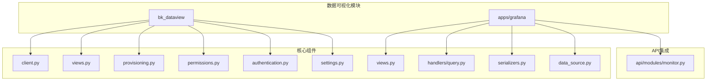
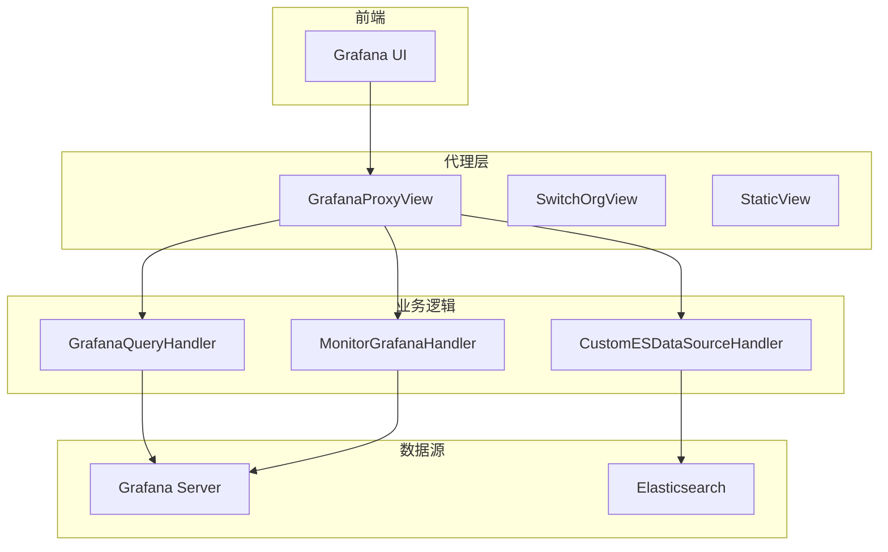
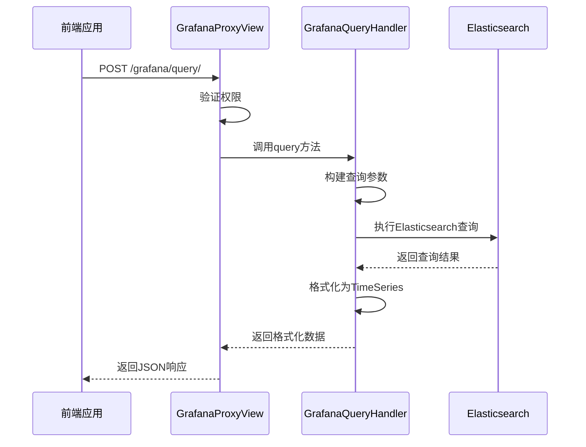
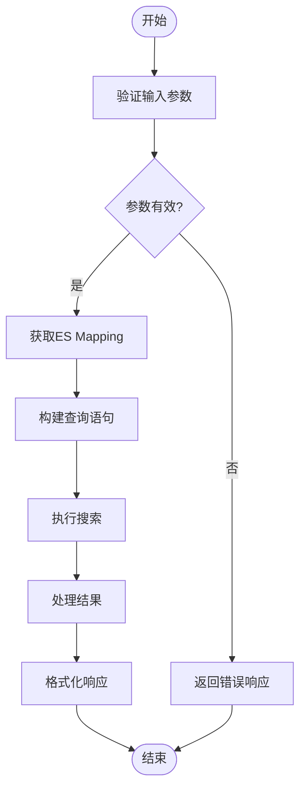
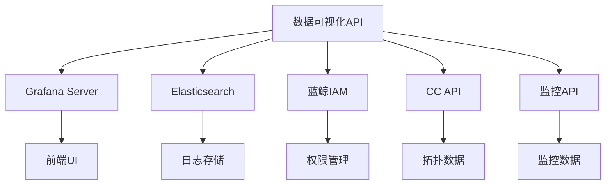

# 数据可视化API

<cite>
**本文档引用的文件**   
- [client.py](file://bklog/bk_dataview/grafana/client.py)
- [views.py](file://bklog/bk_dataview/grafana/views.py)
- [grafana.py](file://bklog/apps/grafana/views.py)
- [query.py](file://bklog/apps/grafana/handlers/query.py)
- [provisioning.py](file://bklog/bk_dataview/grafana/provisioning.py)
- [permissions.py](file://bklog/bk_dataview/grafana/permissions.py)
- [authentication.py](file://bklog/bk_dataview/grafana/authentication.py)
- [settings.py](file://bklog/bk_dataview/grafana/settings.py)
- [serializers.py](file://bklog/apps/grafana/serializers.py)
- [data_source.py](file://bklog/apps/grafana/data_source.py)
- [monitor.py](file://bklog/apps/api/modules/monitor.py)
- [log_search_handler.py](file://bklog/bkm_search_module/handlers/log_search_handler.py)
</cite>

## 目录
1. [引言](#引言)
2. [项目结构](#项目结构)
3. [核心组件](#核心组件)
4. [架构概述](#架构概述)
5. [详细组件分析](#详细组件分析)
6. [依赖分析](#依赖分析)
7. [性能考虑](#性能考虑)
8. [故障排除指南](#故障排除指南)
9. [结论](#结论)
10. [附录](#附录)（如有必要）

## 引言
本文档详细介绍了蓝鲸监控系统中的数据可视化API，重点涵盖Grafana集成的API机制、自定义数据源配置、图表查询功能以及仪表盘权限控制等高级特性。文档旨在为开发者提供完整的API参考，包括仪表盘管理、数据源配置、图表查询等接口的详细说明。

## 项目结构
数据可视化功能主要分布在`bklog`目录下的`bk_dataview`和`apps/grafana`子模块中。`bk_dataview`包含Grafana的核心集成组件，而`apps/grafana`则提供具体的API视图和处理逻辑。



**图表来源**
- [client.py](file://bklog/bk_dataview/grafana/client.py)
- [views.py](file://bklog/bk_dataview/grafana/views.py)
- [query.py](file://bklog/apps/grafana/handlers/query.py)

**章节来源**
- [client.py](file://bklog/bk_dataview/grafana/client.py#L1-L300)
- [views.py](file://bklog/bk_dataview/grafana/views.py#L1-L400)

## 核心组件
数据可视化API的核心组件包括Grafana客户端、代理视图、权限控制和数据源配置。这些组件共同实现了与Grafana的深度集成，提供了仪表盘管理、数据查询和权限控制等功能。

**章节来源**
- [client.py](file://bklog/bk_dataview/grafana/client.py#L171-L232)
- [views.py](file://bklog/bk_dataview/grafana/views.py#L1-L387)
- [permissions.py](file://bklog/bk_dataview/grafana/permissions.py#L1-L72)

## 架构概述
系统采用代理模式与Grafana进行集成，通过Django视图层作为中间代理，处理所有Grafana相关的API请求。这种架构既保证了安全性，又提供了灵活的权限控制和功能扩展能力。



**图表来源**
- [views.py](file://bklog/bk_dataview/grafana/views.py#L61-L387)
- [query.py](file://bklog/apps/grafana/handlers/query.py#L59-L825)
- [data_source.py](file://bklog/apps/grafana/data_source.py)

**章节来源**
- [views.py](file://bklog/bk_dataview/grafana/views.py#L1-L387)
- [query.py](file://bklog/apps/grafana/handlers/query.py#L1-L825)

## 详细组件分析

### Grafana客户端分析
Grafana客户端组件提供了与Grafana REST API的直接交互能力，包括仪表盘的创建、更新、删除和查询操作。

```mermaid
classDiagram
class GrafanaClient {
+get_folders(org_id, api_host)
+create_dashboard(org_id, dashboard_info, panels, folder_uid, api_host)
+update_dashboard(org_id, folder_id, dashboard)
+search_dashboard(org_id, dashboard_id)
+get_dashboard_by_uid(org_id, dashboard_uid)
}
GrafanaClient --> "HTTP Client" : 使用
"HTTP Client" --> "Grafana API" : 调用
```

**图表来源**
- [client.py](file://bklog/bk_dataview/grafana/client.py#L171-L232)

**章节来源**
- [client.py](file://bklog/bk_dataview/grafana/client.py#L171-L232)

### API视图分析
API视图组件处理所有来自前端的请求，包括仪表盘查询、数据源配置和权限验证等。

#### 对于API/服务组件：


**图表来源**
- [grafana.py](file://bklog/apps/grafana/views.py#L196-L233)
- [query.py](file://bklog/apps/grafana/handlers/query.py#L278-L349)

**章节来源**
- [grafana.py](file://bklog/apps/grafana/views.py#L196-L233)
- [query.py](file://bklog/apps/grafana/handlers/query.py#L278-L349)

### 自定义数据源分析
自定义ES数据源组件允许系统与Elasticsearch集群进行交互，提供mapping查询和批量搜索功能。

#### 对于复杂逻辑组件：


**图表来源**
- [data_source.py](file://bklog/apps/grafana/data_source.py)
- [query.py](file://bklog/apps/grafana/handlers/query.py#L736-L760)

**章节来源**
- [data_source.py](file://bklog/apps/grafana/data_source.py)
- [query.py](file://bklog/apps/grafana/handlers/query.py#L736-L760)

### 权限控制分析
权限控制系统基于蓝鲸的IAM框架，实现了细粒度的访问控制，确保用户只能访问其有权限的资源。

```mermaid
classDiagram
class BasePermission {
+has_permission(request, view, org_name)
}
class BizPermission {
+has_permission(request, view, org_name)
}
class ExplorePermission {
+has_permission(request, view, org_name)
}
BasePermission <|-- BizPermission
BasePermission <|-- ExplorePermission
BizPermission --> "IAM" : 集成
ExplorePermission --> "IAM" : 集成
```

**图表来源**
- [permissions.py](file://bklog/apps/grafana/permissions.py#L28-L53)
- [permissions.py](file://bklog/bk_dataview/grafana/permissions.py#L51-L72)

**章节来源**
- [permissions.py](file://bklog/apps/grafana/permissions.py#L28-L53)
- [permissions.py](file://bklog/bk_dataview/grafana/permissions.py#L51-L72)

## 依赖分析
数据可视化API依赖于多个核心组件和外部服务，形成了一个完整的生态系统。



**图表来源**
- [monitor.py](file://bklog/apps/api/modules/monitor.py)
- [query.py](file://bklog/apps/grafana/handlers/query.py#L32-L35)
- [permissions.py](file://bklog/apps/grafana/permissions.py#L24-L25)

**章节来源**
- [monitor.py](file://bklog/apps/api/modules/monitor.py)
- [query.py](file://bklog/apps/grafana/handlers/query.py#L32-L35)

## 性能考虑
系统在设计时充分考虑了性能优化，通过缓存机制、批量查询和异步处理等方式提高响应速度。

- **缓存策略**：使用`@cache_five_minute`装饰器对频繁访问的数据进行缓存
- **批量操作**：支持批量查询和批量更新，减少网络往返次数
- **连接池**：使用`requests.Session()`作为连接池，复用HTTP连接
- **异步处理**：对于耗时操作，建议使用异步任务队列处理

**章节来源**
- [client.py](file://bklog/bk_dataview/grafana/client.py#L161-L174)
- [utils.py](file://bklog/bk_dataview/grafana/utils.py#L61-L87)

## 故障排除指南
当遇到数据可视化API相关问题时，可以按照以下步骤进行排查：

1. **检查权限**：确认用户是否有访问特定业务和仪表盘的权限
2. **验证连接**：检查Grafana服务器和Elasticsearch集群的连接状态
3. **查看日志**：检查`bk_dataview`和`grafana`相关的日志文件
4. **测试API**：使用curl或Postman直接测试底层API接口
5. **检查配置**：确认`settings.py`中的Grafana配置是否正确

**章节来源**
- [permissions.py](file://bklog/apps/grafana/permissions.py#L33-L47)
- [client.py](file://bklog/bk_dataview/grafana/client.py#L144-L158)
- [utils.py](file://bklog/bk_dataview/grafana/utils.py#L61-L87)

## 结论
本文档详细介绍了蓝鲸监控系统中数据可视化API的设计和实现。通过Grafana的深度集成，系统提供了强大的仪表盘管理、数据查询和权限控制功能。API设计遵循RESTful原则，具有良好的可扩展性和安全性，能够满足企业级监控系统的复杂需求。

## 附录
### API端点列表
| 端点 | 方法 | 描述 | 参数 |
|------|------|------|------|
| /grafana/query/ | POST | 指标数据查询 | bk_biz_id, metric_field, result_table_id, where, group_by, method, interval, target, start_time, end_time |
| /grafana/query_log/ | POST | 日志数据查询 | bk_biz_id, result_table_id, where, query_string, target, size, start_time, end_time |
| /grafana/metric/ | POST | 获取指标列表 | bk_biz_id, result_table_label |
| /grafana/dimension/ | GET | 获取维度取值列表 | bk_biz_id, result_table_id, field, start_time, end_time, query_string |
| /grafana/target_tree/ | GET | 获取拓扑树 | bk_biz_id, instance_type, remove_empty_nodes |

**章节来源**
- [grafana.py](file://bklog/apps/grafana/views.py#L196-L475)
- [serializers.py](file://bklog/apps/grafana/serializers.py#L54-L95)