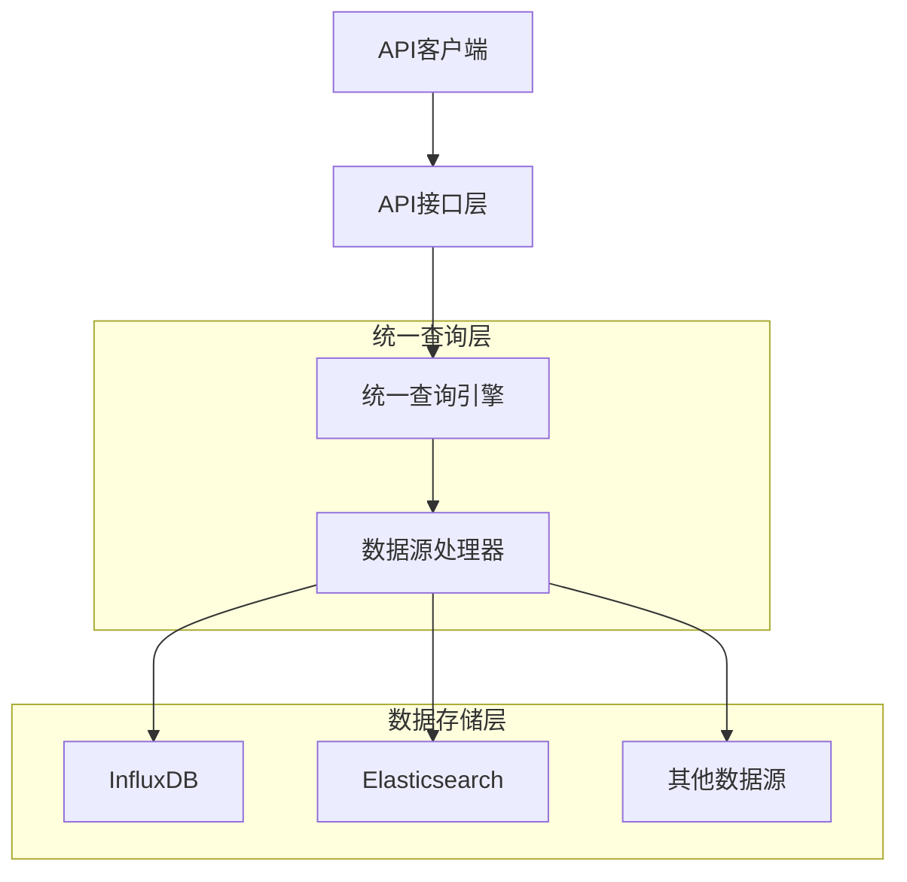
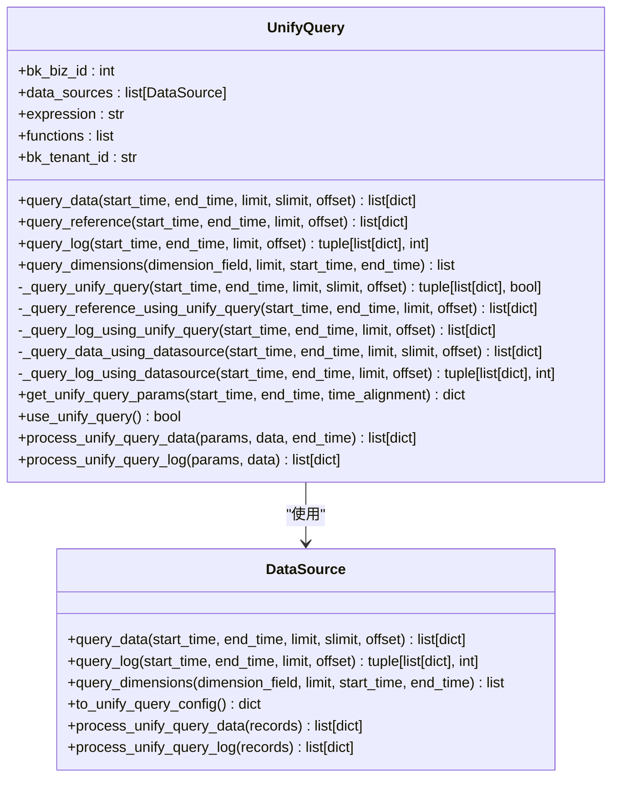
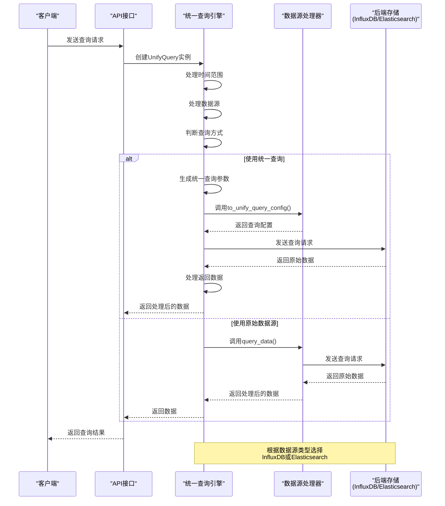
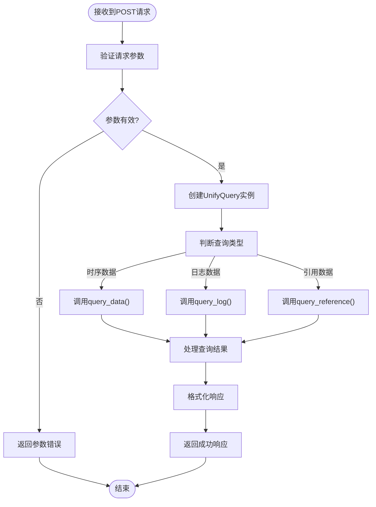
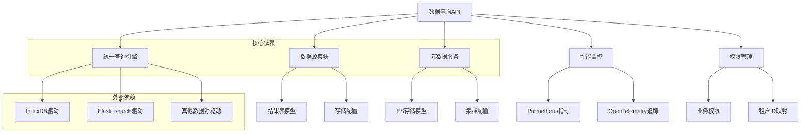

# 数据查询API

<cite>
**本文档引用的文件**
- [query.py](file://bkmonitor/bkmonitor/data_source/unify_query/query.py)
- [v3/query.py](file://bkmonitor/kernel_api/views/v3/query.py)
- [query.py](file://bkmonitor/kernel_api/resource/query.py)
- [resources.py](file://bkmonitor/query_api/resources.py)
</cite>

## 目录
1. [简介](#简介)
2. [核心组件](#核心组件)
3. [架构概述](#架构概述)
4. [详细组件分析](#详细组件分析)
5. [依赖分析](#依赖分析)
6. [性能考虑](#性能考虑)
7. [故障排除指南](#故障排除指南)
8. [结论](#结论)

## 简介
本文档旨在全面描述监控平台的数据查询API，重点介绍用于获取监控指标数据的端点。文档详细说明了请求参数、底层查询引擎的工作机制，以及如何通过统一查询引擎调用InfluxDB或Elasticsearch等后端存储。同时提供了一个查询特定主机CPU使用率的JSON请求体示例和预期响应格式，并给出了查询性能优化建议。

## 核心组件
数据查询API的核心组件包括统一查询引擎、数据源处理器和后端存储适配器。这些组件协同工作，实现了从用户请求到数据返回的完整流程。系统通过`UnifyQuery`类封装了复杂的查询逻辑，支持多种数据源和查询类型。

**Section sources**
- [query.py](file://bkmonitor/bkmonitor/data_source/unify_query/query.py#L48-L695)

## 架构概述
数据查询API采用分层架构设计，从上到下分为API接口层、统一查询层和数据源层。API接口层接收用户请求，统一查询层处理查询逻辑和优化，数据源层负责与具体的后端存储系统交互。



**Diagram sources**
- [query.py](file://bkmonitor/bkmonitor/data_source/unify_query/query.py#L48-L695)
- [v3/query.py](file://bkmonitor/kernel_api/views/v3/query.py#L1-L53)

## 详细组件分析

### 统一查询引擎分析
统一查询引擎是数据查询API的核心，负责处理复杂的查询请求并优化查询性能。

#### 类图


**Diagram sources**
- [query.py](file://bkmonitor/bkmonitor/data_source/unify_query/query.py#L48-L695)

#### 查询流程序列图


**Diagram sources**
- [query.py](file://bkmonitor/bkmonitor/data_source/unify_query/query.py#L513-L572)
- [resources.py](file://bkmonitor/query_api/resources.py#L22-L31)

### API接口分析
API接口层负责接收和验证用户请求，并将其转发给统一查询引擎处理。

#### 请求处理流程


**Diagram sources**
- [v3/query.py](file://bkmonitor/kernel_api/views/v3/query.py#L23-L32)
- [query.py](file://bkmonitor/bkmonitor/data_source/unify_query/query.py#L513-L674)

## 依赖分析
数据查询API依赖于多个核心模块和外部系统，形成了复杂的依赖关系网络。



**Diagram sources**
- [query.py](file://bkmonitor/bkmonitor/data_source/unify_query/query.py#L11-L45)
- [resources.py](file://bkmonitor/query_api/resources.py#L1-L20)

**Section sources**
- [query.py](file://bkmonitor/bkmonitor/data_source/unify_query/query.py#L11-L45)
- [resources.py](file://bkmonitor/query_api/resources.py#L1-L20)

## 性能考虑
为了确保数据查询API的高性能和可扩展性，系统实现了多项优化策略。

### 查询参数说明
数据查询API支持丰富的请求参数，允许用户精确控制查询行为：

- **query_configs**: 查询配置列表，包含以下子参数：
  - *metric_id*: 指标ID，标识要查询的具体监控指标
  - *where条件*: 过滤条件，用于筛选特定维度的数据
  - *时间范围*: 指定查询的时间区间，支持开始时间和结束时间
  - *聚合方法*: 指定数据聚合方式，如平均值、最大值等
  - *分组维度*: 指定数据分组的维度字段

### 性能优化建议
1. **合理使用时间范围**: 避免查询过长的时间范围，建议根据实际需求设置合理的时间窗口
2. **精确过滤条件**: 使用具体的where条件过滤数据，减少不必要的数据扫描
3. **适当限制返回结果**: 使用limit参数控制返回的数据量，避免一次性返回过多数据
4. **选择合适的聚合粒度**: 根据查询目的选择适当的聚合方法和时间间隔
5. **利用缓存机制**: 对于频繁查询的固定时间段数据，考虑使用缓存

**Section sources**
- [query.py](file://bkmonitor/bkmonitor/data_source/unify_query/query.py#L297-L349)
- [query.py](file://bkmonitor/bkmonitor/data_source/unify_query/query.py#L513-L572)

## 故障排除指南
本节提供常见问题的解决方案和调试建议。

### 示例请求和响应
以下是查询特定主机CPU使用率的JSON请求体示例：

```json
{
  "query_configs": [
    {
      "metric_id": "system.cpu.usage",
      "where": [
        {
          "key": "ip",
          "method": "eq",
          "value": ["192.168.1.100"]
        }
      ],
      "start_time": 1640995200000,
      "end_time": 1641081600000,
      "agg_method": "avg",
      "agg_interval": 60
    }
  ]
}
```

预期的响应格式：
```json
{
  "data": [
    {
      "ip": "192.168.1.100",
      "_time_": 1640995260000,
      "_result_": 0.45
    },
    {
      "ip": "192.168.1.100",
      "_time_": 1640995320000,
      "_result_": 0.48
    }
  ],
  "is_partial": false
}
```

**Section sources**
- [query.py](file://bkmonitor/bkmonitor/data_source/unify_query/query.py#L311-L313)
- [resources.py](file://bkmonitor/query_api/resources.py#L22-L31)

## 结论
数据查询API通过统一查询引擎的设计，实现了对多种数据源的透明访问和查询优化。系统架构清晰，组件职责分明，支持灵活的查询参数配置和高效的性能表现。通过合理的使用和优化，可以满足各种监控数据查询需求。