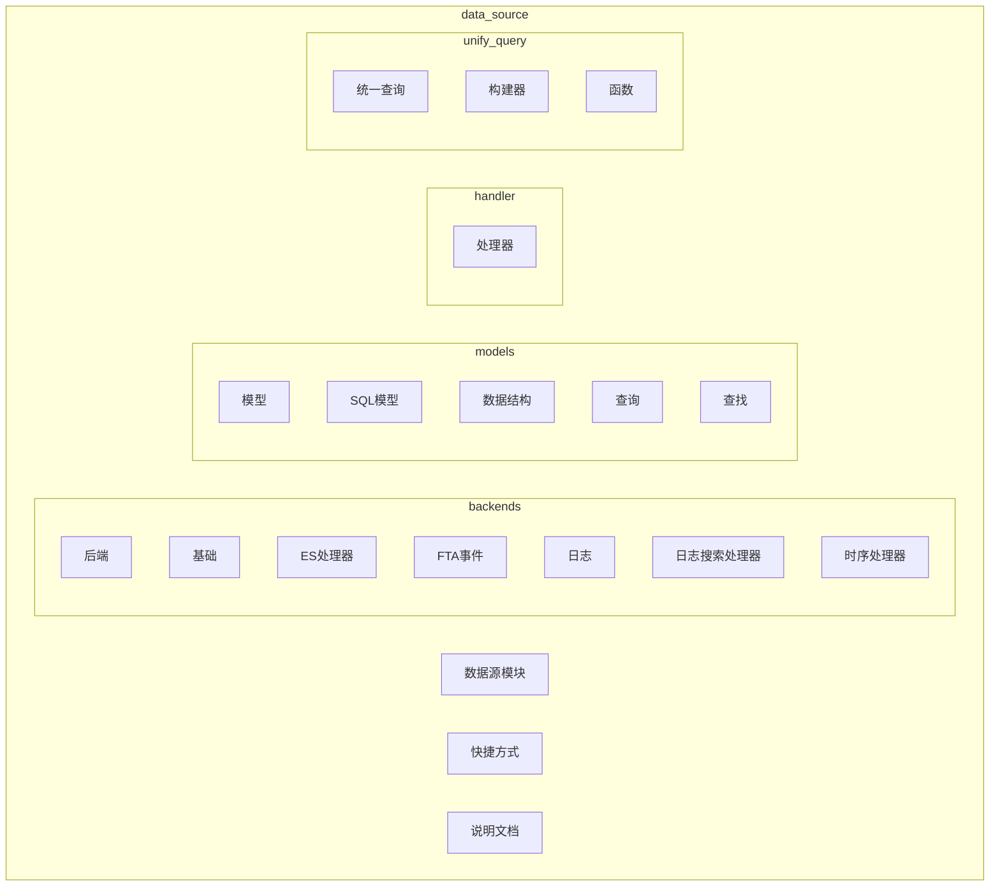
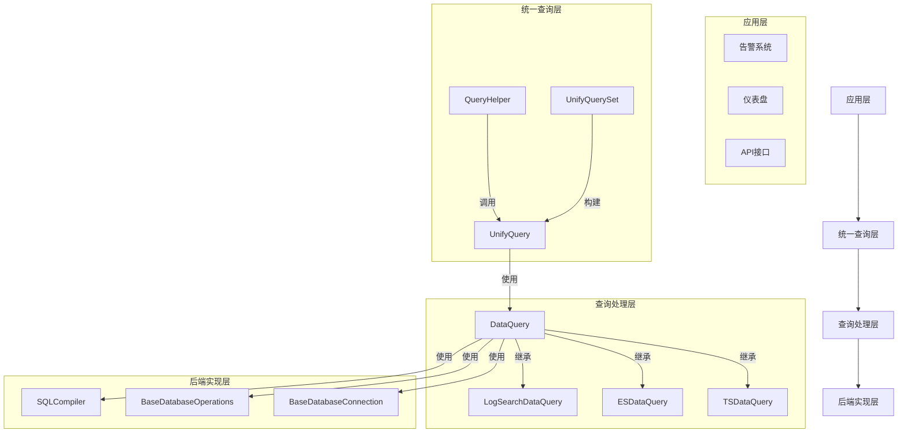
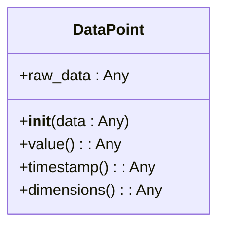
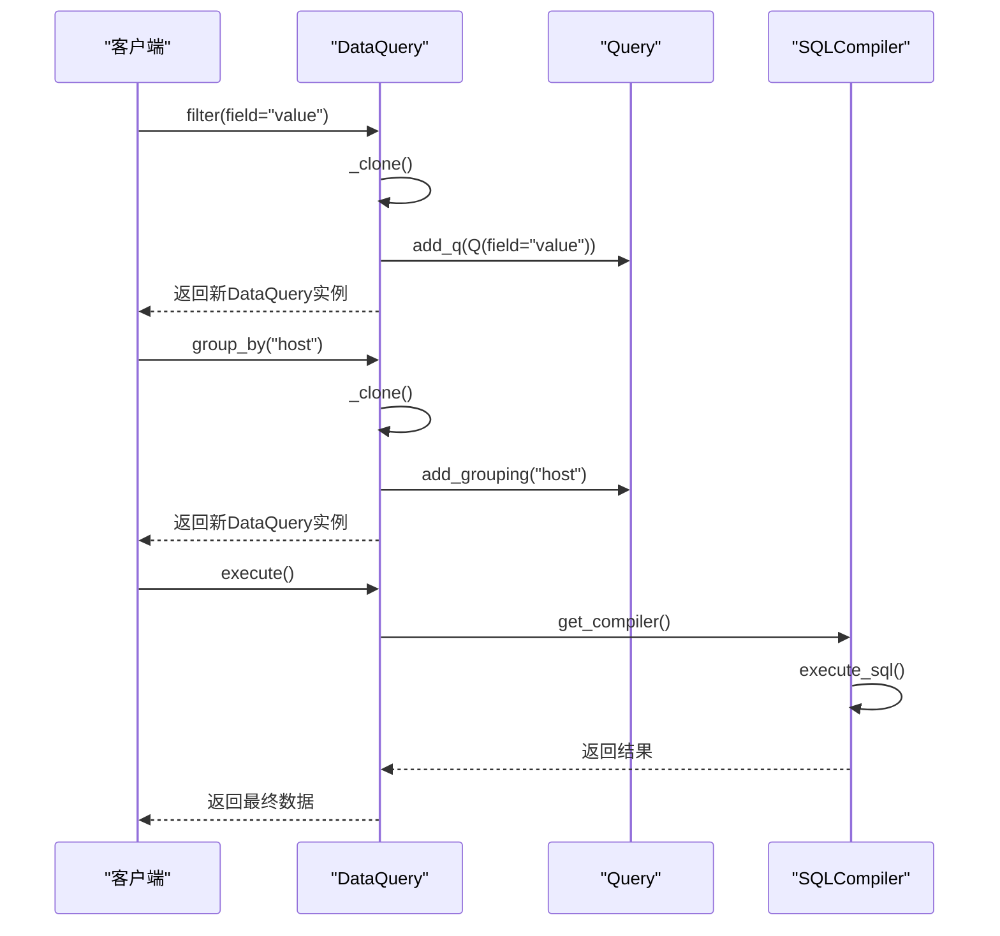
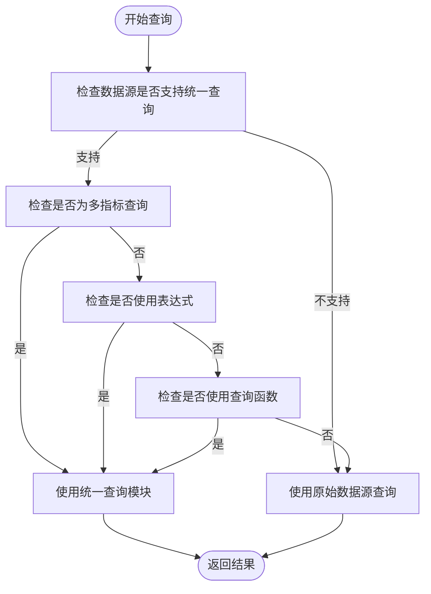
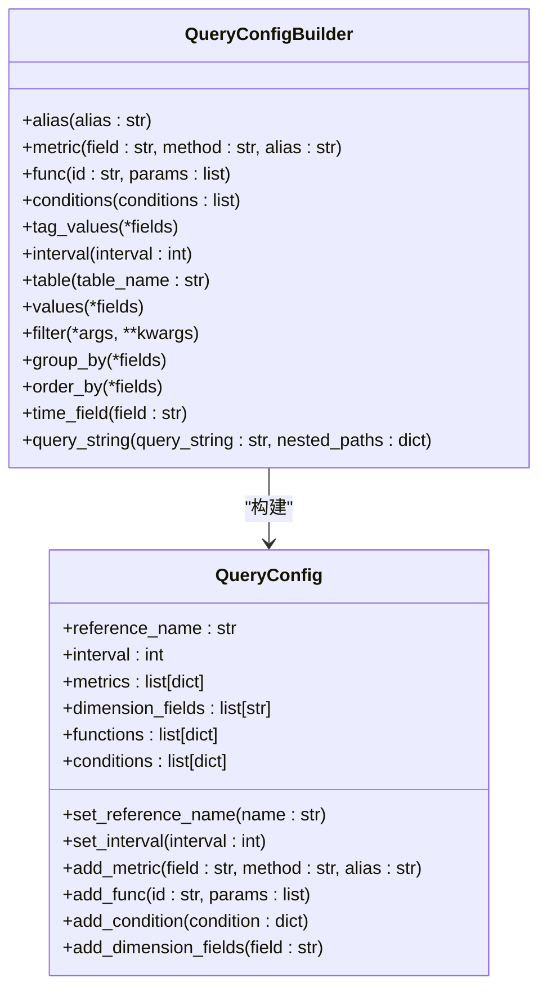
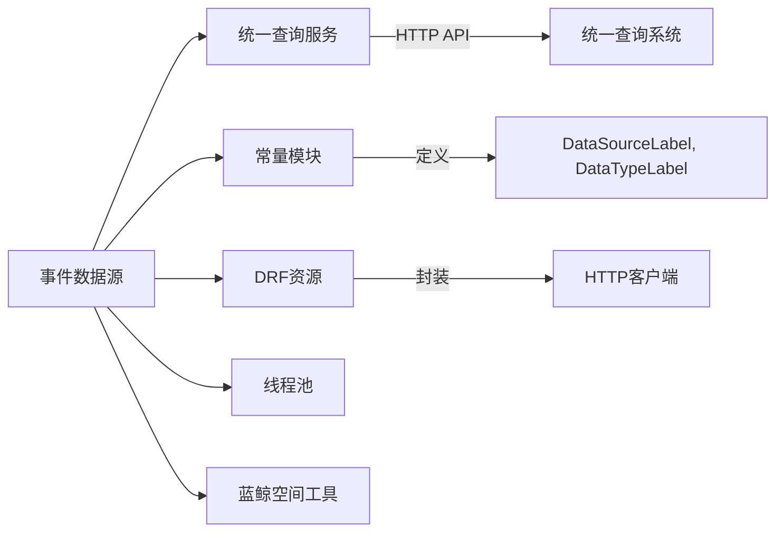

# 事件数据源

<cite>
**本文档引用的文件**
- [data_structure.py](file://bkmonitor/bkmonitor/data_source/models/data_structure.py)
- [query.py](file://bkmonitor/bkmonitor/data_source/models/query.py)
- [query.py](file://bkmonitor/bkmonitor/data_source/unify_query/query.py)
- [builder.py](file://bkmonitor/bkmonitor/data_source/unify_query/builder.py)
- [time_series.py](file://bkmonitor/bkmonitor/data_source/handler/time_series.py)
- [elastic_search.py](file://bkmonitor/bkmonitor/data_source/handler/elastic_search.py)
- [log_search.py](file://bkmonitor/bkmonitor/data_source/handler/log_search.py)
- [connection.py](file://bkmonitor/bkmonitor/data_source/backends/base/connection.py)
- [compiler.py](file://bkmonitor/bkmonitor/data_source/backends/base/compiler.py)
</cite>

## 目录
1. [简介](#简介)
2. [项目结构](#项目结构)
3. [核心组件](#核心组件)
4. [架构概述](#架构概述)
5. [详细组件分析](#详细组件分析)
6. [依赖分析](#依赖分析)
7. [性能考虑](#性能考虑)
8. [故障排除指南](#故障排除指南)
9. [结论](#结论)

## 简介
本文档旨在全面描述蓝鲸监控平台中事件数据源的技术实现。重点涵盖事件数据的接入方式、数据结构定义、查询接口设计、字段映射规则、数据类型转换、存储策略、索引配置、查询性能优化以及与其他系统（如告警系统）的集成方案。文档还提供了配置最佳实践和常见问题解决方案，为开发者和运维人员提供权威的技术参考。

## 项目结构
事件数据源功能主要位于 `bkmonitor/bkmonitor/data_source` 目录下，采用模块化设计，清晰地分离了数据源的后端实现、模型定义、处理器和统一查询接口。

**图示来源**
- [data_source](file://bkmonitor/bkmonitor/data_source)

**本节来源**
- [data_source](file://bkmonitor/bkmonitor/data_source)

## 核心组件
事件数据源的核心功能由以下几个关键组件构成：
1.  **`DataPoint` 类**：定义了事件数据的基本单元，封装了原始数据及其访问方法。
2.  **`BaseDataQuery` 类**：作为所有数据查询的基类，提供了数据库连接管理、查询对象生命周期和结果缓存等通用功能。
3.  **`DataQuery` 类**：继承自 `BaseDataQuery`，并混合了 `IterMixin`、`QueryMixin` 和 `DslMixin`，提供了完整的数据遍历、查询和ES DSL操作能力。
4.  **`UnifyQuery` 类**：统一查询模块的核心，负责协调多个数据源的查询，决定使用统一查询接口还是原始数据源，并处理结果。
5.  **`QueryConfigBuilder` 类**：提供类ORM的API，用于构建统一查询所需的配置。

**本节来源**
- [data_structure.py](file://bkmonitor/bkmonitor/data_source/models/data_structure.py#L1-L23)
- [query.py](file://bkmonitor/bkmonitor/data_source/models/query.py#L1-L279)
- [query.py](file://bkmonitor/bkmonitor/data_source/unify_query/query.py#L1-L755)
- [builder.py](file://bkmonitor/bkmonitor/data_source/unify_query/builder.py#L1-L534)

## 架构概述
事件数据源的整体架构遵循分层设计原则，从上至下分为应用层、统一查询层、查询处理层和后端实现层。

**图示来源**
- [query.py](file://bkmonitor/bkmonitor/data_source/unify_query/query.py#L1-L755)
- [builder.py](file://bkmonitor/bkmonitor/data_source/unify_query/builder.py#L1-L534)
- [time_series.py](file://bkmonitor/bkmonitor/data_source/handler/time_series.py#L1-L20)
- [elastic_search.py](file://bkmonitor/bkmonitor/data_source/handler/elastic_search.py#L1-L15)
- [log_search.py](file://bkmonitor/bkmonitor/data_source/handler/log_search.py#L1-L15)
- [connection.py](file://bkmonitor/bkmonitor/data_source/backends/base/connection.py#L1-L15)
- [compiler.py](file://bkmonitor/bkmonitor/data_source/backends/base/compiler.py#L1-L15)

## 详细组件分析

### 数据结构定义分析
`DataPoint` 类是事件数据的基本表示。它接收原始数据，并通过 `value()`、`timestamp()` 和 `dimensions()` 方法提供对数据值、时间戳和维度的访问。该设计将数据的内部表示与外部访问解耦，便于后续的数据处理和转换。

**图示来源**
- [data_structure.py](file://bkmonitor/bkmonitor/data_source/models/data_structure.py#L1-L23)

**本节来源**
- [data_structure.py](file://bkmonitor/bkmonitor/data_source/models/data_structure.py#L1-L23)

### 查询接口分析
`DataQuery` 类通过多重继承（`IterMixin`, `QueryMixin`, `DslMixin`）组合了丰富的查询功能。`QueryMixin` 提供了 `filter`, `group_by`, `order_by` 等链式调用方法，其核心是通过 `_clone()` 方法创建查询实例的副本，确保每次操作都返回一个独立的新查询对象，从而实现查询的不可变性和链式构建。

**图示来源**
- [query.py](file://bkmonitor/bkmonitor/data_source/models/query.py#L1-L279)

**本节来源**
- [query.py](file://bkmonitor/bkmonitor/data_source/models/query.py#L1-L279)

### 统一查询机制分析
`UnifyQuery` 类是整个查询系统的核心决策者。`use_unify_query()` 方法根据数据源类型、是否使用表达式、函数、多指标查询等多种条件，智能地决定是调用统一查询接口 (`_query_unify_query`) 还是直接使用原始数据源 (`_query_data_using_datasource`)。这保证了查询的灵活性和效率。

**图示来源**
- [query.py](file://bkmonitor/bkmonitor/data_source/unify_query/query.py#L1-L755)

**本节来源**
- [query.py](file://bkmonitor/bkmonitor/data_source/unify_query/query.py#L1-L755)

### 统一查询构建器分析
`QueryConfigBuilder` 类提供了类ORM的API，极大地简化了统一查询配置的构建过程。开发者可以通过 `metric()`, `alias()`, `filter()` 等方法链式地构建查询，而无需手动拼装复杂的字典结构。`UnifyQueryCompiler` 负责将这些高级API编译成统一查询接口所需的底层参数。

**图示来源**
- [builder.py](file://bkmonitor/bkmonitor/data_source/unify_query/builder.py#L1-L534)

**本节来源**
- [builder.py](file://bkmonitor/bkmonitor/data_source/unify_query/builder.py#L1-L534)

## 依赖分析
事件数据源模块内部依赖关系清晰，外部依赖主要通过 `api` 模块（如 `api.unify_query.query_data`）与统一查询服务进行交互。`constants` 模块定义了数据源标签和类型，`core.drf_resource` 提供了API调用的基础。

**图示来源**
- [query.py](file://bkmonitor/bkmonitor/data_source/unify_query/query.py#L1-L755)
- [constants.py](file://bkmonitor/constants/data_source.py)

**本节来源**
- [query.py](file://bkmonitor/bkmonitor/data_source/unify_query/query.py#L1-L755)
- [constants.py](file://bkmonitor/constants/data_source.py)

## 性能考虑
1.  **结果缓存**：`IterMixin` 中的 `_result_cache` 机制确保了查询结果只执行一次，后续的遍历、切片操作都基于缓存，避免了重复查询。
2.  **查询优化**：`use_unify_query()` 方法通过避免不必要的统一查询调用，直接使用更高效的原始数据源查询，提升了性能。
3.  **并行查询**：在 `_query_log_using_datasource` 中，对于多个数据源的日志查询，使用了 `ThreadPool().map_ignore_exception` 进行并行处理，显著提高了查询速度。
4.  **时间对齐**：`time_interval_align` 函数确保查询时间戳与数据采集间隔对齐，可以利用底层存储的聚合数据，提高查询效率。

## 故障排除指南
1.  **查询无结果**：
    *   检查 `start_time` 和 `end_time` 是否在数据的有效时间范围内。
    *   检查 `filter` 条件是否过于严格，导致没有数据匹配。
    *   查看日志中 `UNIFY_QUERY` 的输出，确认发送的查询参数是否正确。
2.  **查询性能慢**：
    *   检查是否返回了过多的数据，尝试增加 `limit` 或使用更精确的 `filter`。
    *   确认是否触发了统一查询，复杂的表达式和函数会增加处理时间。
    *   检查 `group_by` 的字段数量，过多的分组会导致结果集膨胀。
3.  **维度查询失败**：
    *   对于多指标查询，`query_dimensions` 方法会退化为先查询数据再提取维度，效率较低。应尽量避免在多指标场景下进行维度查询。
4.  **连接错误**：
    *   确认 `using` 参数中的数据库别名和表名是否正确。
    *   检查后端服务（如ES、InfluxDB）是否正常运行。

**本节来源**
- [query.py](file://bkmonitor/bkmonitor/data_source/models/query.py#L1-L279)
- [query.py](file://bkmonitor/bkmonitor/data_source/unify_query/query.py#L1-L755)

## 结论
事件数据源模块通过精心设计的分层架构和模块化组件，实现了对多种数据类型的统一接入和查询。其核心优势在于：
*   **灵活性**：通过 `DataQuery` 的链式API和 `UnifyQuery` 的智能路由，支持从简单到复杂的各种查询场景。
*   **可扩展性**：通过后端（backends）和处理器（handlers）的抽象，可以方便地接入新的数据存储类型。
*   **高性能**：通过结果缓存、并行处理和智能查询路由，保证了系统的响应速度。
*   **易用性**：`QueryConfigBuilder` 提供了类ORM的开发体验，降低了使用复杂查询的门槛。

该模块为蓝鲸监控平台的告警、可视化和数据分析功能提供了坚实可靠的数据基础。