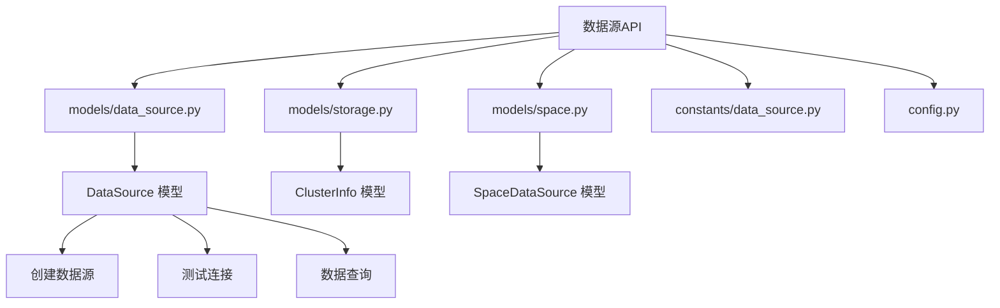
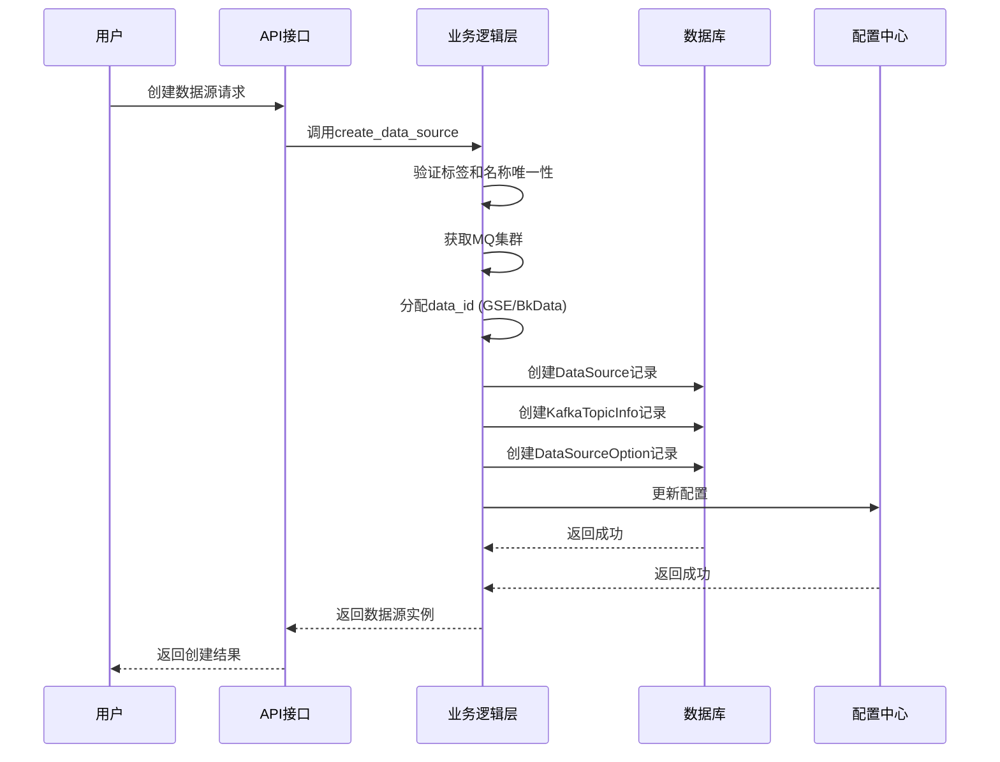
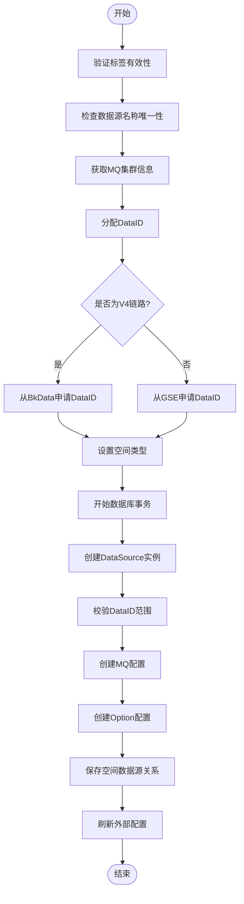
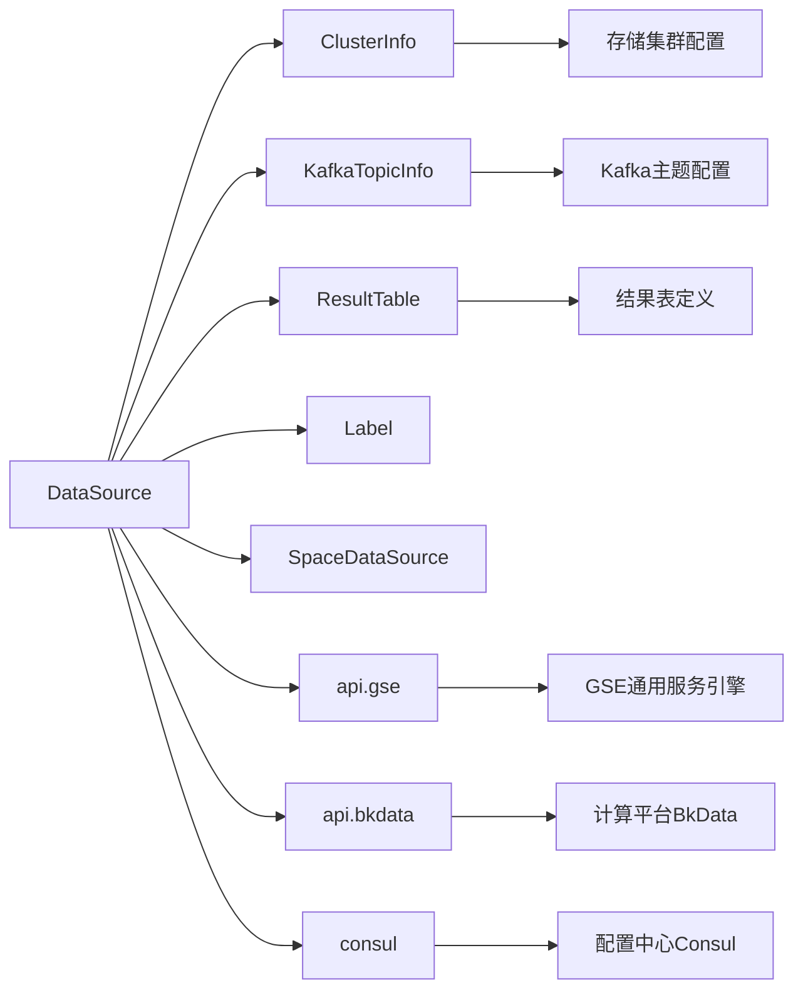

# 数据源API

<cite>
**本文档引用的文件**  
- [data_source.py](file://bkmonitor/metadata/models/data_source.py#L1-L1535)
- [constants.py](file://constants/data_source.py#L1-L50)
- [config.py](file://metadata/config.py#L1-L100)
- [ClusterInfo.py](file://metadata/models/storage.py#L1-L200)
- [SpaceDataSource.py](file://metadata/models/space.py#L1-L100)
</cite>

## 目录
1. [简介](#简介)
2. [项目结构](#项目结构)
3. [核心组件](#核心组件)
4. [架构概述](#架构概述)
5. [详细组件分析](#详细组件分析)
6. [依赖分析](#依赖分析)
7. [性能考虑](#性能考虑)
8. [故障排除指南](#故障排除指南)
9. [结论](#结论)

## 简介
本文档详细描述了蓝鲸监控平台中的数据源管理API，涵盖数据源的创建、查询、测试连接、数据查询等核心功能。重点说明了不同类型数据源（如InfluxDB、Elasticsearch、自定义数据源）的配置参数、认证机制和连接池管理策略。文档旨在为开发者和运维人员提供全面的技术参考，确保数据源配置的正确性和高效性。

## 项目结构
数据源管理功能主要位于`bkmonitor/metadata/models/`目录下，核心文件为`data_source.py`。该模块实现了数据源的模型定义、创建流程、ETL配置管理以及与消息队列（Kafka）和存储集群的集成。



**图示来源**
- [data_source.py](file://bkmonitor/metadata/models/data_source.py#L1-L1535)
- [storage.py](file://metadata/models/storage.py#L1-L200)
- [space.py](file://metadata/models/space.py#L1-L100)

**本节来源**
- [data_source.py](file://bkmonitor/metadata/models/data_source.py#L1-L50)

## 核心组件
数据源管理的核心是`DataSource`模型，它定义了数据源的所有属性和行为。关键组件包括：
- **数据源标识**：`bk_data_id`（主键）和`data_name`（名称）。
- **消息队列配置**：通过`mq_cluster_id`和`mq_config_id`关联Kafka集群和主题。
- **ETL配置**：`etl_config`字段定义了数据清洗和处理规则。
- **标签系统**：`type_label`和`source_label`用于分类数据源。
- **多租户支持**：`bk_tenant_id`字段实现租户隔离。

**本节来源**
- [data_source.py](file://bkmonitor/metadata/models/data_source.py#L100-L200)

## 架构概述
数据源管理模块采用分层架构，从上至下包括API层、业务逻辑层和数据持久层。其核心流程是：用户通过API请求创建数据源，系统验证参数后，分配`data_id`，配置消息队列，并将配置写入数据库和Consul。



**图示来源**
- [data_source.py](file://bkmonitor/metadata/models/data_source.py#L500-L1000)

## 详细组件分析

### 数据源创建流程分析
`create_data_source`类方法是创建数据源的核心，其流程复杂且严谨。

#### 创建流程图解


**图示来源**
- [data_source.py](file://bkmonitor/metadata/models/data_source.py#L700-L1000)

#### 关键步骤说明
1.  **标签验证**：确保`source_label`和`type_label`在`Label`模型中存在。
2.  **名称唯一性**：在`bk_tenant_id`下，`data_name`必须唯一。
3.  **MQ集群获取**：根据租户ID和集群类型获取`ClusterInfo`实例。
4.  **DataID分配**：
    - **V3链路**：调用`api.gse.add_route`从GSE获取。
    - **V4链路**：调用`apply_data_id_v2`从BkData申请，需指定`bk_biz_id`。
5.  **数据库事务**：所有数据库操作（创建数据源、MQ配置、选项）在同一个事务中完成，保证原子性。
6.  **Option配置**：创建`DataSourceOption`记录，存储额外配置，如`drop_metrics_etl_configs`。

**本节来源**
- [data_source.py](file://bkmonitor/metadata/models/data_source.py#L700-L1000)

### 数据源测试连接分析
虽然`DataSource`模型本身没有直接的测试连接方法，但其配置的正确性可以通过`to_json`方法生成的配置来验证。一个成功的`to_json`调用意味着数据源、MQ集群和结果表的关联是有效的。

```python
def test_connection(self):
    """
    测试数据源连接
    通过尝试生成完整的JSON配置来验证所有关联是否正常。
    """
    try:
        config = self.to_json()
        # 如果能成功生成配置，说明数据库关联正常
        return {"status": "success", "message": "连接正常", "config": config}
    except Exception as e:
        return {"status": "failed", "message": str(e)}
```

**本节来源**
- [data_source.py](file://bkmonitor/metadata/models/data_source.py#L300-L350)

## 依赖分析
数据源管理模块依赖于多个其他模块和外部系统。



**图示来源**
- [data_source.py](file://bkmonitor/metadata/models/data_source.py#L1-L1535)
- [storage.py](file://metadata/models/storage.py#L1-L200)

**本节来源**
- [data_source.py](file://bkmonitor/metadata/models/data_source.py#L1-L1535)

## 性能考虑
- **缓存**：`mq_cluster`和`mq_config`属性使用了简单的实例级缓存，避免重复查询数据库。
- **批量操作**：在`to_json`方法中，使用`batch_get_fields`和`batch_result_table_option`进行批量查询，减少数据库访问次数。
- **事务控制**：创建数据源时使用数据库事务，确保数据一致性，但需注意长事务可能带来的锁竞争。

## 故障排除指南
- **创建失败：标签不存在**：检查`source_label`和`type_label`是否在`Label`表中存在。
- **创建失败：名称已存在**：在相同租户下，数据源名称必须唯一。
- **创建失败：缺少MQ集群**：确保为租户配置了默认的Kafka集群。
- **创建失败：DataID申请超时**：检查与BkData平台的网络连接和API可用性。
- **连接测试失败**：检查`to_json`方法的调用栈，定位是数据源、结果表还是MQ配置的关联问题。

**本节来源**
- [data_source.py](file://bkmonitor/metadata/models/data_source.py#L1000-L1535)

## 结论
数据源API是蓝鲸监控平台数据接入的核心。它通过`DataSource`模型统一管理数据源的生命周期，支持V3和V4两种数据链路，并与消息队列、存储集群和配置中心深度集成。理解其创建流程和依赖关系对于平台的稳定运行至关重要。