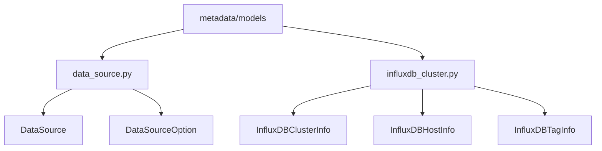
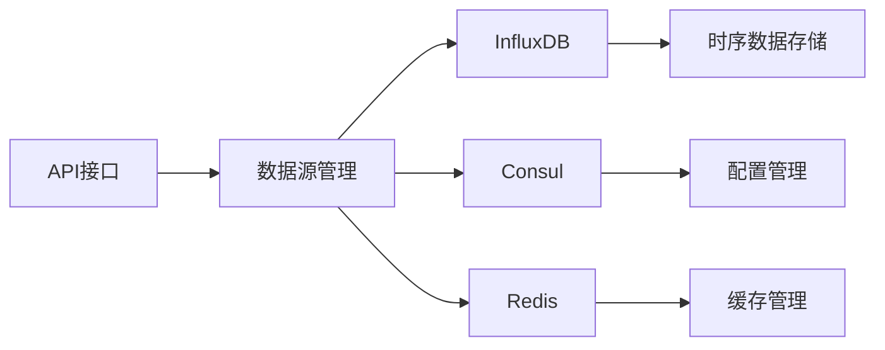
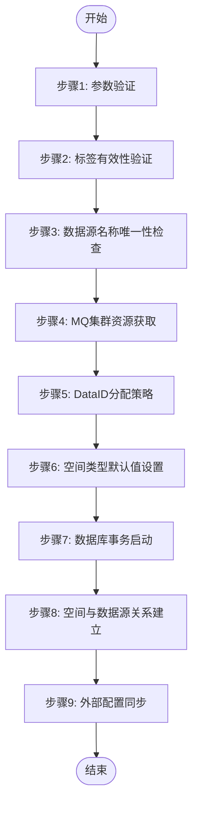
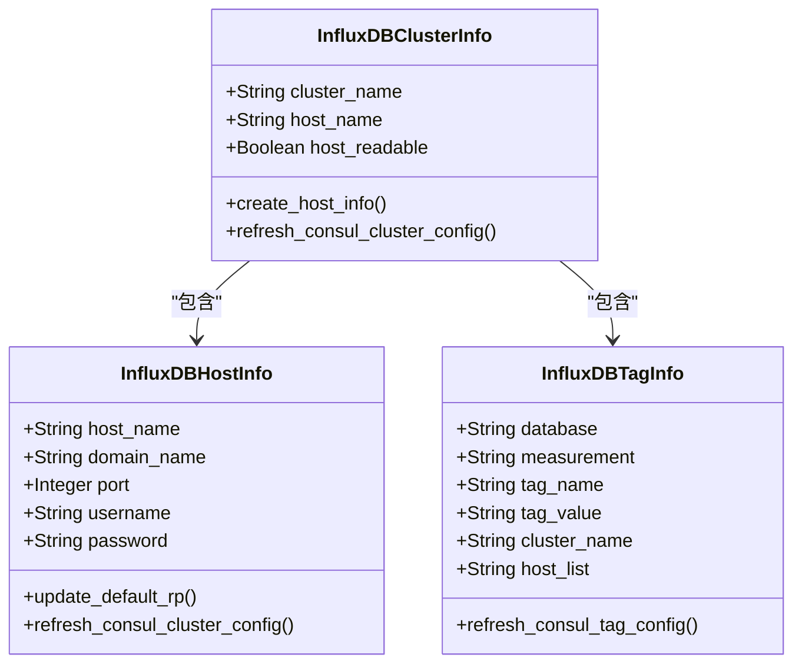
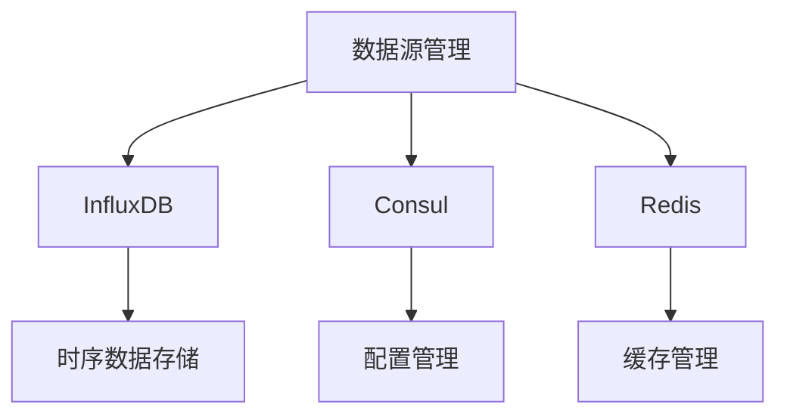

# 时序数据源

<cite>
**本文档引用的文件**   
- [data_source.py](file://bkmonitor\metadata\models\data_source.py)
- [influxdb_cluster.py](file://bkmonitor\metadata\models\influxdb_cluster.py)
</cite>

## 目录
1. [简介](#简介)
2. [项目结构](#项目结构)
3. [核心组件](#核心组件)
4. [架构概述](#架构概述)
5. [详细组件分析](#详细组件分析)
6. [依赖分析](#依赖分析)
7. [性能考虑](#性能考虑)
8. [故障排除指南](#故障排除指南)
9. [结论](#结论)

## 简介
本文档详细描述了时序数据源的配置与管理，重点涵盖InfluxDB和Prometheus等时序数据库的接入配置。文档详细说明了查询DSL语法结构、时间范围参数、聚合函数使用方法，并记录了数据采样率、降采样策略和数据保留策略的配置方式。同时，提供了时序数据查询性能优化建议，包括索引使用、查询条件优化等，并通过实际代码示例展示如何通过API创建和查询时序数据源。

## 项目结构
项目结构主要围绕时序数据源的管理展开，核心文件位于`bkmonitor/metadata/models/`目录下，包括`data_source.py`和`influxdb_cluster.py`。这些文件定义了数据源、InfluxDB集群、主机信息等核心模型及其管理逻辑。

**图示来源**
- [data_source.py](file://bkmonitor\metadata\models\data_source.py)
- [influxdb_cluster.py](file://bkmonitor\metadata\models\influxdb_cluster.py)

## 核心组件
核心组件包括数据源管理（`DataSource`）、数据源选项（`DataSourceOption`）、InfluxDB集群信息（`InfluxDBClusterInfo`）、InfluxDB主机信息（`InfluxDBHostInfo`）和InfluxDB标签分区（`InfluxDBTagInfo`）。这些组件共同实现了时序数据源的创建、配置、更新和删除功能。

**组件来源**
- [data_source.py](file://bkmonitor\metadata\models\data_source.py#L1-L1534)
- [influxdb_cluster.py](file://bkmonitor\metadata\models\influxdb_cluster.py#L1-L906)

## 架构概述
系统架构采用分层设计，底层为时序数据库（如InfluxDB），中间层为数据源管理模块，上层为API接口。数据源管理模块负责与外部系统（如Consul、Redis）同步配置，确保数据源的高可用性和一致性。

**图示来源**
- [data_source.py](file://bkmonitor\metadata\models\data_source.py)
- [influxdb_cluster.py](file://bkmonitor\metadata\models\influxdb_cluster.py)

## 详细组件分析

### 数据源创建流程分析
数据源创建流程包括标签验证、名称唯一性检查、MQ集群获取、DataID分配、数据库事务处理等步骤。流程确保了数据源创建的原子性和一致性。

**图示来源**
- [data_source.py](file://bkmonitor\metadata\models\data_source.py#L600-L800)

### InfluxDB集群管理分析
InfluxDB集群管理包括集群信息、主机信息和标签分区的管理。通过Consul和Redis实现配置的同步和缓存，确保集群配置的高可用性。

**图示来源**
- [influxdb_cluster.py](file://bkmonitor\metadata\models\influxdb_cluster.py#L1-L906)

## 依赖分析
系统依赖于InfluxDB、Consul、Redis等外部组件。通过Consul实现配置的分布式管理，通过Redis实现缓存和消息队列，确保系统的高可用性和性能。

**图示来源**
- [data_source.py](file://bkmonitor\metadata\models\data_source.py)
- [influxdb_cluster.py](file://bkmonitor\metadata\models\influxdb_cluster.py)

## 性能考虑
在性能方面，系统通过数据库事务确保数据一致性，通过Consul和Redis实现配置的快速同步和缓存。建议在高并发场景下优化数据库连接池和缓存策略，以提升系统性能。

## 故障排除指南
常见问题包括数据源创建失败、InfluxDB连接异常等。建议检查配置文件、网络连接和权限设置，确保各组件正常运行。

**组件来源**
- [data_source.py](file://bkmonitor\metadata\models\data_source.py#L1-L1534)
- [influxdb_cluster.py](file://bkmonitor\metadata\models\influxdb_cluster.py#L1-L906)

## 结论
本文档详细描述了时序数据源的配置与管理，涵盖了InfluxDB和Prometheus等时序数据库的接入配置。通过详细的代码示例和架构图，帮助用户理解和使用时序数据源管理功能。