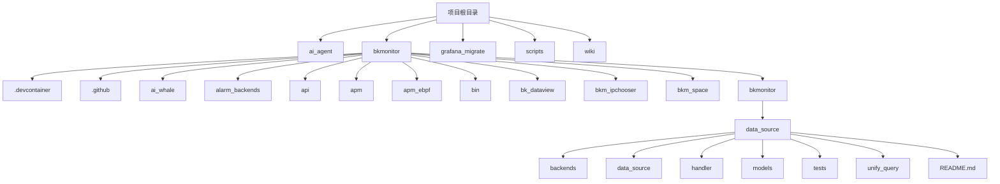
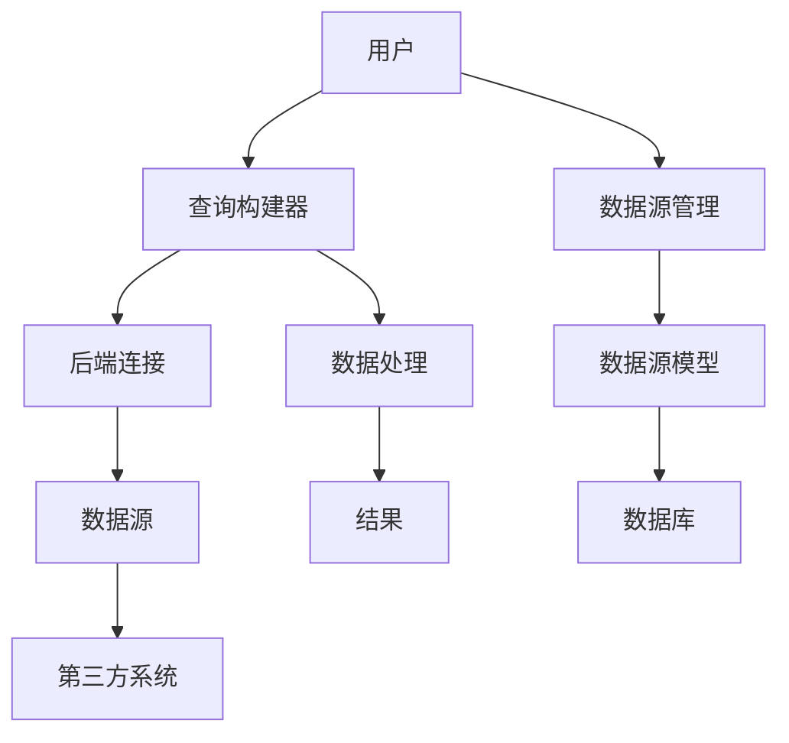
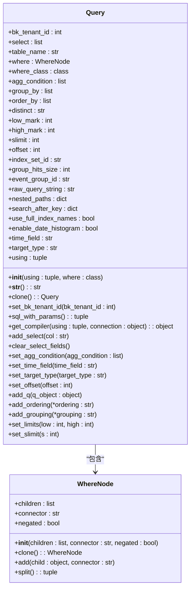
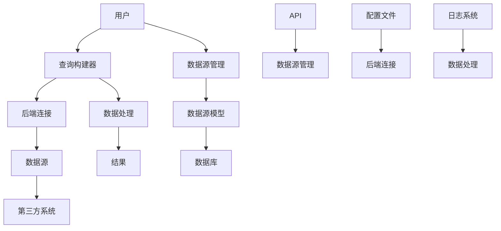

# 自定义数据源

<cite>
**本文档引用的文件**   
- [README.md](file://bkmonitor/bkmonitor/data_source/README.md)
- [query.py](file://bkmonitor/bkmonitor/data_source/models/sql/query.py)
- [connection.py](file://bkmonitor/bkmonitor/data_source/backends/time_series/connection.py)
- [connection.py](file://bkmonitor/bkmonitor/data_source/backends/log/connection.py)
- [connection.py](file://bkmonitor/bkmonitor/data_source/backends/elastic_search/connection.py)
- [connection.py](file://bkmonitor/bkmonitor/data_source/backends/fta_event/connection.py)
- [connection.py](file://bkmonitor/bkmonitor/data_source/backends/log_search/connection.py)
- [resources.py](file://bkmonitor/metadata/resources/resources.py)
- [data_source.py](file://bkmonitor/metadata/models/data_source.py)
- [query.py](file://bkmonitor/bkmonitor/data_source/models/sql/query.py)
</cite>

## 目录

1. [简介](#简介)
2. [项目结构](#项目结构)
3. [核心组件](#核心组件)
4. [架构概述](#架构概述)
5. [详细组件分析](#详细组件分析)
6. [依赖分析](#依赖分析)
7. [性能考虑](#性能考虑)
8. [故障排除指南](#故障排除指南)
9. [结论](#结论)

## 简介

本文档旨在为开发人员提供一个全面的指南，用于创建和管理自定义数据源。通过API接口接入第三方数据系统，文档详细说明了数据源插件的开发规范、接口契约和认证机制。此外，还涵盖了数据格式转换、数据清洗、字段映射的配置方法，以及自定义数据源的测试验证流程和性能监控指标。通过实际案例展示不同类型数据源的接入实现，帮助开发者更好地理解和应用这些技术。

## 项目结构

本项目的结构设计遵循模块化原则，确保各部分功能清晰且易于维护。以下是项目的主要目录结构：



**图示来源**
- [README.md](file://bkmonitor/bkmonitor/data_source/README.md)

**本节来源**
- [README.md](file://bkmonitor/bkmonitor/data_source/README.md)

## 核心组件

自定义数据源的核心组件主要包括数据源管理、查询构建器、后端连接和数据处理。这些组件协同工作，实现了从第三方系统接入数据并进行高效查询的功能。

### 数据源管理

数据源管理模块负责创建、更新和删除数据源实例。它通过`DataSource`模型来存储数据源的元数据，包括数据源名称、描述、类型标签等。数据源的创建过程包括参数验证、集群配置、数据源实例创建、MQ配置、选项配置等步骤。

### 查询构建器

查询构建器是自定义数据源的核心功能之一，它提供了类似Django ORM的查询方式，允许用户通过链式调用构建复杂的查询语句。`Query`类是查询构建器的核心，支持字段选择、条件过滤、排序分组、聚合操作等功能。

### 后端连接

后端连接模块负责与不同的数据存储系统进行通信。根据数据源的类型和数据类型，选择合适的后端连接模块。例如，时序数据使用`time_series`后端，日志数据使用`log`后端。

### 数据处理

数据处理模块负责数据格式转换、数据清洗和字段映射。它确保从第三方系统获取的数据能够被正确解析和使用。

**本节来源**
- [data_source.py](file://bkmonitor/metadata/models/data_source.py)
- [query.py](file://bkmonitor/bkmonitor/data_source/models/sql/query.py)
- [connection.py](file://bkmonitor/bkmonitor/data_source/backends/time_series/connection.py)
- [connection.py](file://bkmonitor/bkmonitor/data_source/backends/log/connection.py)

## 架构概述

自定义数据源的架构设计旨在提供一个灵活、可扩展的解决方案，支持多种数据源和数据类型的接入。以下是自定义数据源的整体架构图：



**图示来源**
- [README.md](file://bkmonitor/bkmonitor/data_source/README.md)
- [query.py](file://bkmonitor/bkmonitor/data_source/models/sql/query.py)
- [connection.py](file://bkmonitor/bkmonitor/data_source/backends/time_series/connection.py)

## 详细组件分析

### 查询构建器分析

查询构建器是自定义数据源的核心功能之一，它提供了类似Django ORM的查询方式，允许用户通过链式调用构建复杂的查询语句。`Query`类是查询构建器的核心，支持字段选择、条件过滤、排序分组、聚合操作等功能。

#### 类图



**图示来源**
- [query.py](file://bkmonitor/bkmonitor/data_source/models/sql/query.py)

**本节来源**
- [query.py](file://bkmonitor/bkmonitor/data_source/models/sql/query.py)

### 后端连接分析

后端连接模块负责与不同的数据存储系统进行通信。根据数据源的类型和数据类型，选择合适的后端连接模块。例如，时序数据使用`time_series`后端，日志数据使用`log`后端。

#### 时序数据后端连接

时序数据后端连接模块负责与时间序列数据库进行通信。它通过`DatabaseConnection`类实现，支持执行SQL查询和参数化查询。

```python
class DatabaseConnection(BaseDatabaseConnection):
    vendor = "time_series"
    prefer_storage = "tsdb"

    operators = {
        "exact": "= %s",
        "eq": "= %s",
        "neq": "!= %s",
        "!=": "!= %s",
        "gt": "> %s",
        "gte": ">= %s",
        "lt": "< %s",
        "lte": "<= %s",
        "contains": "LIKE %s",
        "reg": "=~ %s",
        "nreg": "!~ %s",
    }

    def __init__(self, query_func, charset=""):
        self.query_func = query_func
        self.charset = charset or DEFAULT_CHARSET
        self.ops = DatabaseOperations(self)

    def execute(self, sql, params: tuple):
        bk_tenant_id: str = params[-1]
        params = params[:-1]

        params = tuple(self.escape(arg) for arg in params)
        sql_str = sql % params
        logger.info(f"BKSQL QUERY: {sql_str}")
        with tracer.start_as_current_span("bksql") as span:
            span.set_attribute("bk.system", "bksql")
            span.set_attribute("bk.bksql.statement", sql_str)
            result = self.query_func(sql=sql_str, prefer_storage="", bk_tenant_id=bk_tenant_id)
            return result.get("list")

    def escape(self, obj, mapping=None):
        """Escape whatever value you pass to it"""
        if isinstance(obj, str):
            fill_char = "'"
            if getattr(obj, "is_regex", False):
                # regex ignore escape
                fill_char = ""
            else:
                obj = escape_string(obj)
            return fill_char + obj + fill_char
        return escape_item(obj, self.charset, mapping=mapping)
```

**本节来源**
- [connection.py](file://bkmonitor/bkmonitor/data_source/backends/time_series/connection.py)

#### 日志数据后端连接

日志数据后端连接模块负责与Elasticsearch进行通信。它通过`DatabaseConnection`类实现，支持执行DSL查询和参数化查询。

```python
class DatabaseConnection(BaseDatabaseConnection):
    vendor = "es"
    prefer_storage = "es"

    operators = {
        "is": "is",
        "is one of": "is one of",
        "is not": "is not",
        "is not one of": "is not one of",
    }

    def __init__(self, query_func, charset=""):
        self.query_func = query_func
        self.charset = charset or DEFAULT_CHARSET
        self.ops = DatabaseOperations(self)

    def execute(self, rt_id, params):
        extra: dict[str, Any] = {
            "use_full_index_names": params.pop("use_full_index_names", False),
            "bk_tenant_id": params.pop("bk_tenant_id", DEFAULT_TENANT_ID),
        }

        query_body: str = json.dumps(params)
        logger.info(f"ES QUERY: rt_id is {rt_id}, query body is {query_body}")
        with tracer.start_as_current_span("es_query") as span:
            span.set_attribute("bk.system", "es_query")
            span.set_attribute("bk.es_query.statement", query_body)
            return self.query_func(table_id=rt_id, query_body=params, **extra)
```

**本节来源**
- [connection.py](file://bkmonitor/bkmonitor/data_source/backends/elastic_search/connection.py)

### 数据处理分析

数据处理模块负责数据格式转换、数据清洗和字段映射。它确保从第三方系统获取的数据能够被正确解析和使用。

#### 数据格式转换

数据格式转换模块负责将不同格式的数据转换为统一的内部格式。例如，将JSON格式的日志数据转换为内部的`LogEntry`对象。

#### 数据清洗

数据清洗模块负责去除无效或错误的数据，确保数据的质量。例如，去除重复的日志条目，修正时间戳等。

#### 字段映射

字段映射模块负责将外部数据源的字段映射到内部数据模型的字段。例如，将外部日志数据的`timestamp`字段映射到内部模型的`time`字段。

**本节来源**
- [data_structure.py](file://bkmonitor/bkmonitor/data_source/data_structure.py)

## 依赖分析

自定义数据源的依赖关系较为复杂，涉及多个模块和外部系统。以下是主要的依赖关系图：



**图示来源**
- [README.md](file://bkmonitor/bkmonitor/data_source/README.md)
- [query.py](file://bkmonitor/bkmonitor/data_source/models/sql/query.py)
- [connection.py](file://bkmonitor/bkmonitor/data_source/backends/time_series/connection.py)
- [data_structure.py](file://bkmonitor/bkmonitor/data_source/data_structure.py)

**本节来源**
- [README.md](file://bkmonitor/bkmonitor/data_source/README.md)
- [query.py](file://bkmonitor/bkmonitor/data_source/models/sql/query.py)
- [connection.py](file://bkmonitor/bkmonitor/data_source/backends/time_series/connection.py)
- [data_structure.py](file://bkmonitor/bkmonitor/data_source/data_structure.py)

## 性能考虑

在设计和实现自定义数据源时，性能是一个重要的考虑因素。以下是一些关键的性能优化建议：

1. **缓存机制**：对于频繁查询的数据，可以使用缓存机制减少对后端系统的请求次数，提高响应速度。
2. **批量处理**：对于大量数据的处理，尽量采用批量处理的方式，减少I/O操作的开销。
3. **索引优化**：确保数据源中的关键字段有适当的索引，以加快查询速度。
4. **异步处理**：对于耗时较长的操作，可以采用异步处理的方式，避免阻塞主线程。
5. **资源管理**：合理管理数据库连接和其他资源，避免资源泄露。

**本节来源**
- [query.py](file://bkmonitor/bkmonitor/data_source/models/sql/query.py)
- [connection.py](file://bkmonitor/bkmonitor/data_source/backends/time_series/connection.py)

## 故障排除指南

在使用自定义数据源时，可能会遇到各种问题。以下是一些常见的故障排除方法：

1. **查询失败**：检查查询语句是否正确，确保所有字段和条件都符合数据源的要求。
2. **连接超时**：检查网络连接是否稳定，确保后端系统正常运行。
3. **数据格式错误**：检查数据源返回的数据格式是否符合预期，必要时进行数据清洗。
4. **权限问题**：确保用户具有访问数据源的必要权限，检查认证机制是否正确配置。
5. **性能问题**：使用性能监控工具分析查询性能，找出瓶颈并进行优化。

**本节来源**
- [query.py](file://bkmonitor/bkmonitor/data_source/models/sql/query.py)
- [connection.py](file://bkmonitor/bkmonitor/data_source/backends/time_series/connection.py)
- [data_structure.py](file://bkmonitor/bkmonitor/data_source/data_structure.py)

## 结论

本文档详细介绍了自定义数据源的开发指南，涵盖了数据源插件的开发规范、接口契约和认证机制。通过具体的代码示例和架构图，帮助开发者理解如何通过API接口接入第三方数据系统，并实现数据格式转换、数据清洗、字段映射等功能。希望本文档能为开发人员提供有价值的参考，促进自定义数据源的广泛应用和发展。